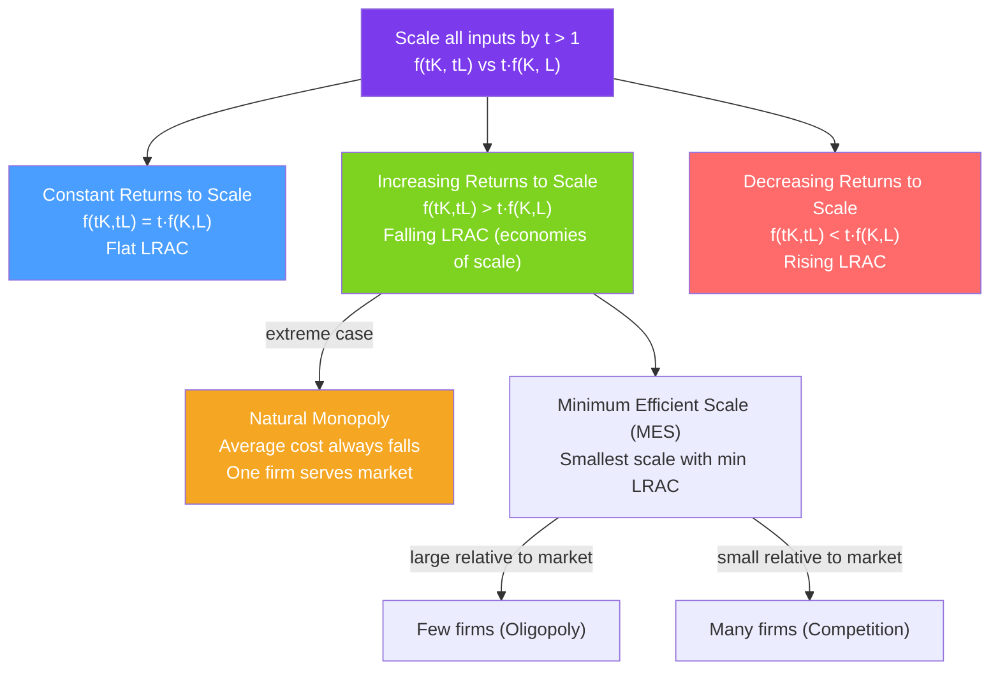

# 📊 Returns to Scale

> [!abstract] TL;DR
> **Returns to scale** describe what happens to output when all inputs are scaled by the same factor $t > 1$. **Constant returns (CRS)**: output scales proportionally — $f(tK, tL) = tf(K,L)$. **Increasing returns (IRS)**: output more than proportionally — $f(tK, tL) > tf(K,L)$. **Decreasing returns (DRS)**: output less than proportionally. IRS leads to **economies of scale** (falling LRAC), which can support natural monopoly; DRS leads to rising LRAC.

## Intuition — analogy FIRST

Imagine a bakery. Double the flour, ovens, and bakers — do you get exactly double the bread? Not necessarily:

- **CRS**: A second bakery running identically produces exactly double. Perfectly replicate the process and you get proportional output.
- **IRS**: A larger bakery can use industrial mixers and conveyors that a small bakery can't justify — output more than doubles. This is the economic rationale for large-scale manufacturing.
- **DRS**: A bakery with too many bakers bumping into each other, with management overload, produces less than double. Diseconomies of management are a real force at the top.

The same logic explains why some industries are dominated by a few large firms (steel, semiconductors) while others have many small ones (restaurants, haircuts).

---

## How It Works

## Key Concepts / Details

### Formal Definition

For a production function $q = f(K, L)$ and scalar $t > 1$:

$$f(tK, tL) = t^\gamma q$$

| $\gamma$ | Returns | LRAC shape |
|----------|---------|-----------|
| $\gamma = 1$ | CRS | Flat (constant) |
| $\gamma > 1$ | IRS | Falling (economies of scale) |
| $\gamma < 1$ | DRS | Rising (diseconomies of scale) |

**Cobb-Douglas**: $f(K,L) = K^\alpha L^\beta$:
$$f(tK, tL) = (tK)^\alpha (tL)^\beta = t^{\alpha+\beta} K^\alpha L^\beta = t^{\alpha+\beta} q$$
- $\alpha + \beta = 1$: CRS
- $\alpha + \beta > 1$: IRS
- $\alpha + \beta < 1$: DRS

### Returns to Scale vs Marginal Returns

These are **different concepts**:
- **Diminishing marginal returns** (DMR): Holding *one* input fixed, successive units of the variable input add less output. A short-run, one-input concept.
- **Returns to scale**: *All* inputs scale simultaneously. A long-run, all-inputs concept.

> A production function can exhibit diminishing marginal returns to labor (in the short run) and yet display increasing returns to scale (in the long run). These are not contradictory.

### Economies and Diseconomies of Scale

**Economies of scale** (IRS → falling LRAC) arise from:
- **Specialization**: Larger scale allows division of labor (Adam Smith's pin factory).
- **Indivisibilities**: Expensive fixed inputs (blast furnace, chip fab) become cheaper per unit at higher output.
- **Geometric relationships**: A pipe of radius $r$ has cost $\propto r$ but capacity $\propto r^2$ (the "two-thirds rule" for engineering projects).
- **Learning by doing**: Unit costs fall as cumulative production rises.

**Diseconomies of scale** (DRS → rising LRAC) arise from:
- **Management complexity**: Coordination, communication, and bureaucracy costs rise more than proportionally.
- **Input scarcity**: As the firm grows, it bids up its own input prices.
- **Principal-agent problems**: Monitoring employees becomes harder at scale.

### Minimum Efficient Scale (MES)

**MES** = the smallest output level at which the LRAC reaches its minimum. It determines market structure:

$$MES = \arg\min_q LRAC(q)$$

| MES relative to market demand | Market structure implication |
|------------------------------|----------------------------|
| Small | Room for many firms → competitive market |
| Moderate | Room for several firms → oligopoly |
| Equals or exceeds market demand | Natural monopoly |

### Natural Monopoly

A **natural monopoly** exists when the LRAC is falling over the entire relevant range of demand. One large firm can serve the market more cheaply than two smaller ones:
$$C(q_1 + q_2) < C(q_1) + C(q_2) \quad \text{(subadditivity of costs)}$$

**Examples**: Electricity grid, water distribution, railroad tracks, broadband infrastructure.

**Policy response**: Regulation (rate-of-return or price-cap) rather than competition, since competition would lead to wasteful duplication of infrastructure.

### Scale and Scope Economies

**Economies of scope**: Cost savings from producing *multiple* products together rather than separately:
$$C(q_1, q_2) < C(q_1, 0) + C(0, q_2)$$

Scope economies drive diversification and multi-product firms. Example: Amazon uses the same logistics infrastructure for retail, fulfillment by Amazon, and Prime deliveries — costs spread across products.

---

## Real-World Notes

- **Semiconductor fabrication**: Chip fabs cost $5–20 billion to build. This enormous fixed cost creates massive economies of scale — only a handful of firms (TSMC, Intel, Samsung) can operate at efficient scale. The MES is so large relative to global demand that the industry is naturally oligopolistic.
- **Airline hub-and-spoke**: Hubs create economies of scale in routes — connecting more city-pairs through one hub is cheaper than direct routes for all pairs. The larger the hub, the more connections, the lower per-unit network cost.
- **Amazon and e-commerce**: Amazon's fulfillment centers, logistics network, and recommendation algorithms all have high fixed costs and near-zero marginal costs for additional units — extreme IRS leading to massive scale advantages.
- **Craft beer**: Brewing exhibits diseconomies of scale at some point — quality, customer connection, and craft identity erode at industrial scale. Many craft breweries are stable at small-to-medium scale, earning normal profits.
- **Learning curves**: Aircraft manufacturing (Boeing, Airbus), solar panels, and lithium batteries all show "experience curves" — cost falls 10–25% for every doubling of cumulative output. This is a dynamic analog of static economies of scale.

---

## Common Pitfalls

- **Confusing DMR with DRS.** Students conflate the short-run phenomenon (DMR) with the long-run one (DRS). They measure different things and can co-exist or diverge.
- **Assuming all industries have IRS.** Many industries exhibit CRS or DRS (agriculture, professional services). IRS doesn't dominate everywhere, and assuming it leads to incorrect market structure predictions.
- **Treating "minimum efficient scale" as fixed.** MES shifts with technology. The industrial revolution shifted MES up; digital technology has pushed it down in software and down for some physical goods.
- **Forgetting that natural monopoly doesn't imply a single monopoly price.** A natural monopoly requires regulation; an unregulated natural monopoly charges monopoly prices. The natural monopoly is a structural condition, not a pricing outcome.

---

## Related Concepts

- [[_MOC_Producer_Theory|↑ Section MOC]]
- [[Production_Functions]] — Returns to scale is a property of the production function.
- [[Cost_Functions]] — Economies of scale translate directly to the shape of the LRAC curve.
- [[Monopoly]] — IRS and natural monopoly connect returns to scale to market structure.
- [[Perfect_Competition]] — CRS (and eventually DRS) support competitive markets with many firms.
- [[Market_Failures]] — Natural monopoly is a market failure requiring regulation.

---

## Review Questions

1. A firm has $q = K^{0.4} L^{0.7}$. What are the returns to scale? If the firm doubles all inputs from $(K, L) = (10, 20)$, by what factor does output increase?
2. Explain why a natural monopoly is not the same as a monopolist that happened to win a competitive market. What condition on the cost function makes a natural monopoly natural?
3. A steel mill's minimum efficient scale is 10 million tons/year. Total world demand is 1.5 billion tons/year. How many steel mills would you expect to see? What market structure would you predict?

---

## Sources

- Varian, *Intermediate Microeconomics*, Ch. 18
- Baumol, Panzar & Willig, *Contestable Markets and the Theory of Industry Structure*
- Arrow (1962), "The Economic Implications of Learning by Doing," *Review of Economic Studies*

#microeconomics #economics #producer-theory #returnstoscale #economiesofscale #naturalmonopoly #MES
