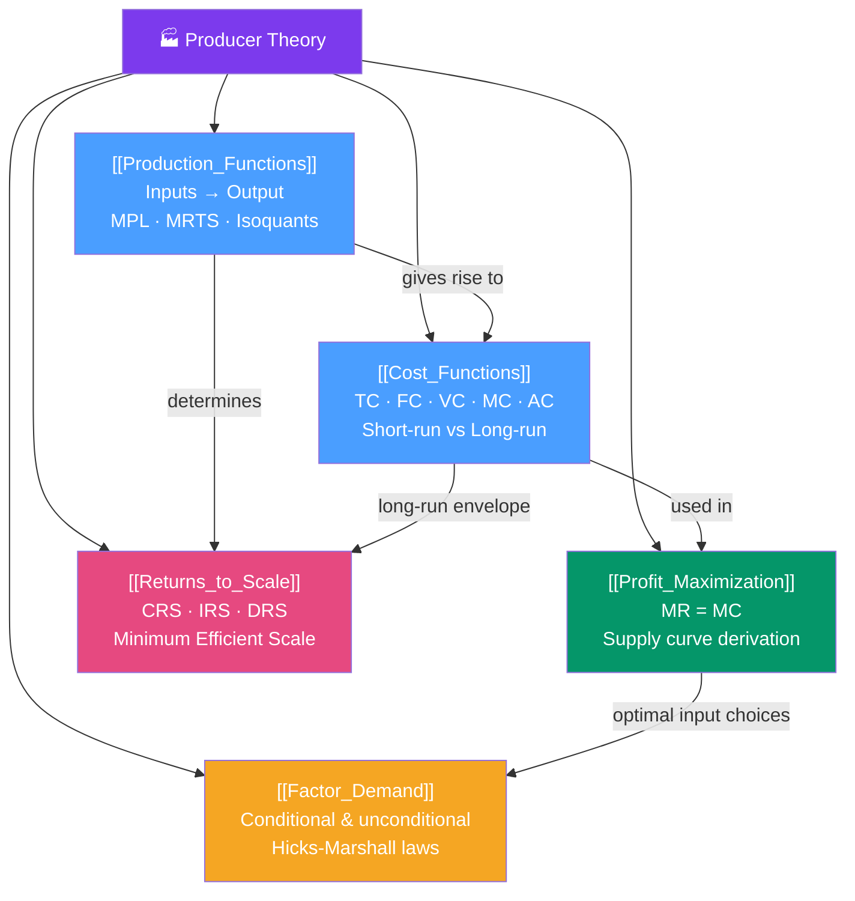

# 🏭 Producer Theory — Map of Content

> [!abstract] What This Section Covers
> Producer theory is the mirror of consumer theory, applied to firms. A firm combines **inputs** (labor, capital) through a **production function** to produce output. It chooses inputs to **minimize costs** at any given output level, and then chooses the profit-maximizing output. This section derives supply curves from first principles, characterizes short-run vs long-run cost behavior, explains returns to scale, and derives factor demand — how much labor and capital a firm wants as a function of wages, rental rates, and output prices.

## Concept Map

## Learning Path

1. [[Production_Functions]] — How inputs convert to outputs; marginal product; isoquants; MRTS.
2. [[Cost_Functions]] — How the production function translates into costs; short-run vs long-run; MC, AC, AVC.
3. [[Profit_Maximization]] — The rule $MR = MC$ and the supply curve; short-run shutdown; long-run exit.
4. [[Returns_to_Scale]] — What happens to output when all inputs scale; implications for market structure.
5. [[Factor_Demand]] — Derived demand for inputs; substitution and output effects; Hicks-Marshall laws.

## All Notes at a Glance

| Note | Difficulty | What You'll Learn |
|------|------------|-------------------|
| [[Production_Functions]] | Intermediate | Production function properties, MPL/MPK, isoquants, MRTS, Cobb-Douglas production |
| [[Cost_Functions]] | Intermediate | TC/FC/VC, MC/AC/AVC, short-run vs long-run, cost curves, envelope theorem for costs |
| [[Profit_Maximization]] | Intermediate | Profit = TR − TC, MR = MC rule, supply curve, shutdown condition, producer surplus |
| [[Returns_to_Scale]] | Intermediate | CRS/IRS/DRS, MES, natural monopoly conditions, learning by doing |
| [[Factor_Demand]] | Advanced | Conditional vs unconditional factor demand, Shephard's lemma, Hicks-Marshall laws |

## Key Questions This Section Answers

- What is the difference between the short run and the long run in production?
- When should a firm shut down in the short run? When should it exit in the long run?
- How does the shape of the MC curve determine the shape of the supply curve?
- What is the minimum efficient scale and why does it matter for market structure?
- How does a wage increase affect a firm's demand for labor and capital?

## Related Sections

- [[_MOC_Microeconomics_Master|↑ Microeconomics Master MOC]]
- [[_MOC_Consumer_Theory|← Consumer Theory]] (exact duality between consumer and producer theory)
- [[_MOC_Market_Structures|→ Market Structures]] (firm behavior under different competition)
- [[_MOC_Welfare_Externalities|→ Welfare & Externalities]]

#MOC #microeconomics #producer-theory
