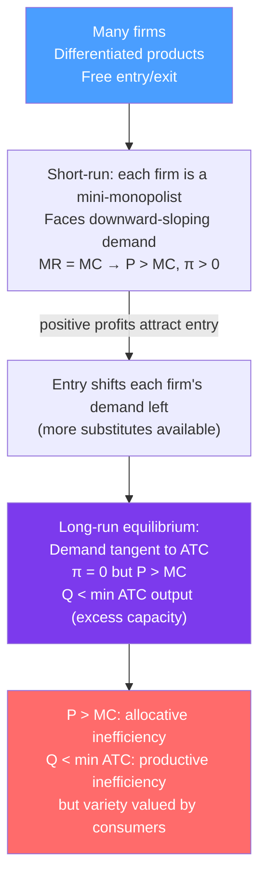

# 🛍️ Monopolistic Competition

> [!abstract] TL;DR
> **Monopolistic competition** combines many competing firms (like perfect competition) with **product differentiation** (giving each seller some monopoly power over its variant). Each firm faces a downward-sloping demand curve for its differentiated product. Short-run profits attract entry until the demand curve tangentially just touches the average total cost curve: **zero economic profit in the long run, but production is not at minimum ATC** — there is **excess capacity** and $P > MC$ (allocatively inefficient).

## Intuition — analogy FIRST

Walk down any high street — dozens of coffee shops. Each is slightly different: ambiance, location, loyalty cards, specialty drinks. The local coffee shop has *some* pricing power (its regulars won't immediately flee to a competitor on a small price rise), but not much (a $1 premium over rivals will lose most price-sensitive customers).

This is monopolistic competition: the shop is a mini-monopolist over its own differentiated product, but free entry means competitors can offer similar products. In equilibrium, all the shops are full enough to cover costs, but none earns above-normal profit. The market features variety and choice — but each shop runs below full capacity.

---

## How It Works

## Key Concepts / Details

### Chamberlinian Model (Chamberlin 1933)

Edward Chamberlin formalized the model of monopolistic competition, combining:
1. **Monopoly element**: Differentiated products → downward-sloping individual demand.
2. **Competitive element**: Free entry → long-run zero profit.

**Short run**: Firm acts as a monopolist for its product:
$$MR = MC \implies Q^{SR}, \quad P^{SR} > MC, \quad \pi^{SR} > 0 \text{ if } P > ATC$$

**Long run**: Entry of new firms with similar products:
- Increases the number of substitutes.
- Shifts each incumbent's demand curve **inward** (fewer customers).
- Makes demand more **elastic** (better substitutes available).
- Entry continues until $\pi = 0$ — i.e., demand curve is **tangent to ATC**.

### Long-Run Equilibrium Conditions

At the tangency equilibrium:
$$P^{LR} = ATC(Q^{LR}), \quad MR = MC, \quad \text{and} \quad P > MC$$

This is simultaneously:
- **Zero profit**: $\pi = (P - ATC) \cdot Q = 0$ (like perfect competition).
- **Allocative inefficiency**: $P > MC$ (unlike perfect competition).
- **Productive inefficiency**: $Q^{LR} < Q^*_{minATC}$ — excess capacity.

### Excess Capacity and the Welfare Debate

**Excess capacity theorem**: In monopolistic competition, each firm operates to the left of its minimum ATC — it has unused productive capacity. The tangency condition ensures this geometrically.

**Size of inefficiency**: The excess capacity = $Q^*_{minATC} - Q^{LR}$.

**The welfare trade-off**:
| Cost | Benefit |
|------|--------|
| $P > MC$ (allocative DWL) | Product variety |
| Each firm below minimum scale | Consumer heterogeneity served |
| Higher prices than perfect competition | Different goods for different tastes |

Whether the welfare loss exceeds the variety gain depends on how much consumers value differentiation (beyond what they'd get from a standardized competitive market).

### Advertising

In monopolistic competition, firms invest in **advertising** to:
1. Shift demand rightward (attract new customers).
2. Steepen demand (make it less elastic — more brand loyal).
3. Create perceived differentiation even if actual differentiation is minor.

**Dorfman-Steiner condition** for optimal advertising:
$$\frac{A}{TR} = \frac{|\varepsilon_A|}{|\varepsilon_D|}$$
where $A$ = advertising expenditure, $\varepsilon_A$ = advertising elasticity of demand, $\varepsilon_D$ = price elasticity.

A higher advertising-to-revenue ratio is optimal when advertising is effective (high $\varepsilon_A$) or demand is inelastic (low $|\varepsilon_D|$).

### Comparison Across Market Structures

| Feature | Perfect Competition | Monopolistic Competition | Monopoly |
|---------|-------------------|--------------------------|---------|
| $P$ vs $MC$ | $P = MC$ | $P > MC$ | $P > MC$ |
| Long-run profit | Zero | Zero | Positive |
| Output vs min ATC | At min ATC | Below min ATC | Below min ATC |
| Product differentiation | None | Yes | Single product |
| Number of firms | Many | Many | One |
| DWL | None | Small | Large |

---

## Real-World Notes

- **Restaurant industry**: Classic monopolistic competition. Many restaurants, each differentiated by cuisine, atmosphere, location. Free entry keeps long-run profits near zero (most restaurants fail within years), but each has some pricing power. Excess capacity is visible — tables are often half-empty.
- **Mobile apps**: Thousands of similar apps in each category (weather, fitness, photo editing). Slight differentiation through UI, features, branding. Zero pricing in many cases (ad-supported) but positive revenue; entry erodes profits quickly.
- **Fashion clothing**: H&M, Zara, and fast fashion brands compete in monopolistic competition — differentiated by design, brand, and season. Excess capacity is visible in clearance sales and unsold inventory.
- **Craft beer**: Many breweries with differentiated products (styles, branding, local identity). Long-run zero profit visible in the many small breweries that are marginally profitable; entry continues until markets are saturated.
- **Advertising wars**: Consumer goods (detergents, cereals, snack foods) exhibit the Dorfman-Steiner condition. P&G and Unilever spend 10–15% of revenue on advertising — the ratio is highest in categories where brand loyalty is strong (high advertising elasticity, relatively inelastic demand).

---

## Common Pitfalls

- **Confusing monopolistic competition with monopoly.** Despite the name, monopolistically competitive firms have *limited* pricing power (many substitutes) and earn *zero* long-run profit. Monopolies have unique products and positive long-run profit.
- **Assuming the tangency equilibrium means zero waste.** The tangency only ensures zero profit — it does NOT imply efficiency. $P > MC$ and excess capacity are genuine inefficiencies.
- **Ignoring the variety benefit.** Excess capacity and $P > MC$ are welfare costs, but product diversity is a welfare benefit. Policy prescriptions that eliminate monopolistic competition to achieve efficiency may reduce consumer welfare if variety is valued.
- **Applying the competitive zero-profit result to long-run price.** In perfect competition, long-run $P = \min ATC$. In monopolistic competition, $P^{LR} = ATC(Q^{LR}) > \min ATC$ — profit is zero but price is above the minimum average cost.

---

## Related Concepts

- [[_MOC_Market_Structures|↑ Section MOC]]
- [[Perfect_Competition]] — The limiting case with zero product differentiation.
- [[Monopoly]] — Each differentiated firm behaves as a short-run mini-monopolist.
- [[Price_Discrimination]] — Differentiated firms may also price discriminate across consumer segments.
- [[Consumer_and_Producer_Surplus]] — DWL from $P > MC$ reduces total surplus even at zero profit.
- [[Market_Failures]] — Monopolistic competition is a mild market failure (excess capacity, $P > MC$).

---

## Review Questions

1. In the short run, a monopolistically competitive firm maximizes profit at $Q = 50$, $P = \$20$, $ATC = \$15$, $MC = \$12$. Is this firm earning positive profit? Will entry or exit occur in the long run?
2. In the long run, entry occurs until each firm is at the tangency of its demand and ATC curve. Explain geometrically why the tangency implies: (a) zero profit, and (b) excess capacity.
3. A city has 200 coffee shops, each slightly differentiated. The government considers a "coffee shop rationalization" policy that would reduce the number to 50 (at minimum efficient scale), lowering average prices by 15%. What does microeconomics say about whether this policy increases welfare? What is the key consideration?

---

## Sources

- Chamberlin, *The Theory of Monopolistic Competition* (1933)
- Varian, *Intermediate Microeconomics*, Ch. 27
- Dixit & Stiglitz (1977), "Monopolistic Competition and Optimum Product Diversity," *American Economic Review*

#microeconomics #economics #market-structures #monopolisticcompetition #productdifferentiation #excesscapacity
