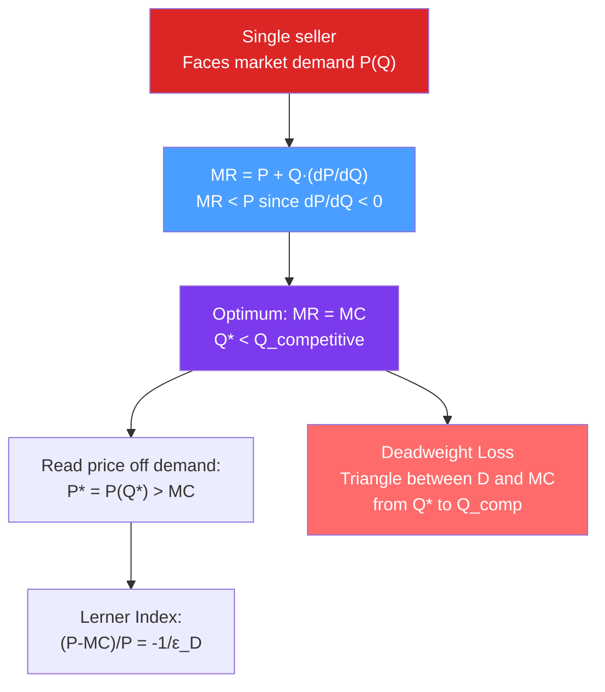

# 👑 Monopoly

> [!abstract] TL;DR
> A **monopolist** is the sole seller — it faces the downward-sloping market demand curve directly. It sets $MR = MC$, where $MR < P$ because increasing sales requires cutting price on all units. The result: $Q^{mon} < Q^{comp}$ and $P^{mon} > MC$, creating **deadweight loss**. Market power is measured by the **Lerner Index**: $(P - MC)/P = -1/\varepsilon_D$. Higher price elasticity → less market power → smaller markup.

## Intuition — analogy FIRST

You own the only well in a desert town. You can charge whatever you want — but there's a catch. Raise your price too high and people use less water (demand slopes down). Set price at $10/gallon and sell 100 gallons; drop to $8 and sell 120 gallons. The extra 20 gallons generate $160 more revenue, but you earn $2 less on the original 100 gallons — costing $200. Net: the extra gallons *cost* you $40 in revenue. This "revenue lost on existing units" is why your MR is below your price, and why you restrict output below the competitive level.

---

## How It Works

## Key Concepts / Details

### Marginal Revenue for a Monopolist

The monopolist faces inverse demand $P = P(Q)$ where $P'(Q) < 0$:
$$TR = P(Q) \cdot Q$$
$$MR = \frac{d(TR)}{dQ} = P + Q \cdot P'(Q) = P\left(1 + \frac{1}{\varepsilon_D}\right)$$

Since $\varepsilon_D < 0$: $MR < P$. The wedge between $P$ and $MR$ is larger when demand is *inelastic*.

**For linear demand** $P = a - bQ$:
$$MR = a - 2bQ$$
MR has the same intercept as demand but **twice the slope** — a key geometric fact.

### Optimal Quantity and Price

Setting $MR = MC$:
$$P\left(1 + \frac{1}{\varepsilon_D}\right) = MC \implies P = \frac{MC}{1 + 1/\varepsilon_D} = \frac{MC \cdot \varepsilon_D}{\varepsilon_D + 1}$$

**Monopolist never operates where $|\varepsilon_D| < 1$** (inelastic demand): there, $MR < 0$, so producing any output reduces total revenue. The monopolist restricts output until demand is elastic.

### The Lerner Index

$$L = \frac{P - MC}{P} = -\frac{1}{\varepsilon_D}$$

| $|\varepsilon_D|$ | Lerner Index | Market power |
|------------------|-------------|-------------|
| 1 (unit elastic) | 1 | Maximum theoretical markup |
| 2 | 0.5 | 50% markup over MC |
| 5 | 0.2 | 20% markup |
| $\infty$ | 0 | Perfect competition |

The Lerner Index ranges from 0 (no market power) to 1 (extreme monopoly). It is the key measure of market power.

### Deadweight Loss

The monopoly output $Q^*$ is below the competitive output $Q^c$ (where $P = MC$). The wedge creates **deadweight loss**:
$$DWL = \frac{1}{2}(P^* - MC)(Q^c - Q^*)$$

This is the welfare loss from the mutually beneficial trades that don't happen because the monopolist restricts output.

**Distribution of surplus**:
- Consumers lose some surplus to the monopolist (transferred to monopoly profit) and some is pure DWL.
- Monopoly profit = $(P^* - ATC) \cdot Q^*$ — rectangle in the standard diagram.

### Regulation of Natural Monopoly

For a **natural monopoly** (falling LRAC), two regulatory approaches:

**Marginal cost pricing**: Set $P = MC$ → Pareto efficient but may cause losses if $MC < ATC$ (likely with IRS). Requires government subsidy.

**Average cost pricing (breakeven pricing)**: Set $P = ATC$ → Firm breaks even; some DWL remains but less than unregulated monopoly. Most common real-world approach.

**Ramsey pricing** (multi-product): Set prices to minimize DWL while covering total costs:
$$\frac{P_i - MC_i}{P_i} = \frac{\lambda}{1 + \lambda} \cdot \frac{1}{|\varepsilon_i|}$$
Less elastic goods get higher markups — the Ramsey-Boiteux inverse elasticity rule.

### Sources of Monopoly Power

| Source | Example | Duration |
|--------|---------|---------|
| **Legal barriers** | Patents, copyrights | 20 years (patents); 70+ years (copyright) |
| **Natural monopoly** | Water utilities, power grids | Structural |
| **Control of key input** | De Beers (diamonds, historically) | Until supply diversifies |
| **Network effects** | Windows OS, social networks | Until platforms tip |
| **High switching costs** | SAP ERP systems | Until competitor offers superior migration |

---

## Real-World Notes

- **Pharmaceutical patents**: A patent grants 20 years of monopoly to incentivize R&D investment. The DWL (unaffordable drugs) is the price of innovation incentive. Policy debates around generic entry, compulsory licensing, and patent buyouts are all about this trade-off.
- **Microsoft antitrust (US v. Microsoft, 2000)**: The DOJ found Microsoft used its OS monopoly to leverage into browser markets (bundling IE) — foreclosing competition. The Lerner index for Windows was extremely high; Microsoft's markup was several thousand percent over marginal cost.
- **OPEC as a cartel acting like a monopoly**: OPEC restricts oil output to keep prices above competitive levels — exactly the $MR = MC$ logic, but coordinated among countries. Members face incentive to cheat (individual incentive to produce more at high price), which limits cartel effectiveness.
- **Generic drug entry**: After patent expiration, generics enter → market shifts toward competitive structure → price falls dramatically (often 90%+). This is the long-run competitive equilibrium prediction playing out precisely.

---

## Common Pitfalls

- **Thinking monopolists can charge any price they want.** The monopolist maximizes profit — an arbitrarily high price would reduce quantity so much that profit falls. The demand curve constrains the monopolist.
- **Assuming monopoly profit is always huge.** If demand is elastic, the Lerner Index is low, and the monopolist's margin is small. Monopoly profit depends on both market power and demand conditions.
- **Forgetting that DWL is distinct from redistributed surplus.** Some consumer surplus goes to the monopolist (redistribution, not waste). DWL is only the lost surplus from trades that don't happen.
- **Applying the "MR = twice slope of demand" rule to non-linear demand.** The rule ($MR = a - 2bQ$ when $P = a - bQ$) only holds for linear demand. For general demand curves, derive MR from $d(PQ)/dQ$.

---

## Related Concepts

- [[_MOC_Market_Structures|↑ Section MOC]]
- [[Perfect_Competition]] — The efficient benchmark that monopoly departs from.
- [[Price_Discrimination]] — A monopolist with market power can increase profit by differentiating prices.
- [[Returns_to_Scale]] — IRS (falling LRAC) creates natural monopoly conditions.
- [[Consumer_and_Producer_Surplus]] — DWL is measured in surplus terms.
- [[Elasticity]] — Lerner Index = $-1/\varepsilon_D$; elasticity governs monopoly power.

---

## Review Questions

1. A monopolist faces demand $P = 100 - 2Q$ and has $TC = 10 + 4Q$. Find the profit-maximizing quantity, price, profit, consumer surplus, and deadweight loss. Compare to the competitive outcome.
2. A monopolist has market power index (Lerner Index) of 0.4. If $MC = \$30$, what is the monopoly price? What is the price elasticity of demand at this price?
3. Should a natural monopoly be regulated at marginal cost or average cost? Describe the trade-offs, and explain what Ramsey pricing achieves that average cost pricing doesn't.

---

## Sources

- Varian, *Intermediate Microeconomics*, Ch. 24–25
- Tirole, *The Theory of Industrial Organization*, Ch. 1
- Ramsey (1927), "A Contribution to the Theory of Taxation," *Economic Journal*

#microeconomics #economics #market-structures #monopoly #lernerindex #deadweightloss #naturalmonopoly
