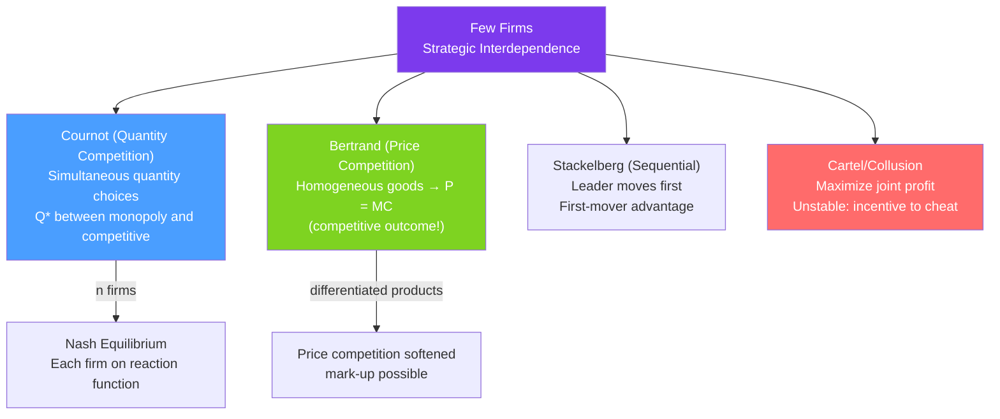

# ⚔️ Oligopoly

> [!abstract] TL;DR
> **Oligopoly** is a market with few sellers whose decisions are **strategically interdependent** — each firm's optimal choice depends on what rivals do. The two canonical models differ by what firms compete on: **Cournot** (quantities, simultaneously) yields output between monopoly and competition; **Bertrand** (prices, homogeneous goods) yields the competitive price. The **Herfindahl-Hirschman Index (HHI)** = $\sum s_i^2$ measures market concentration. Real examples: OPEC, Big Tech, airline routes.

## Intuition — analogy FIRST

Three gas stations at an intersection. Each sets its price knowing the others will respond. If one drops to $3.99, the others must match or lose customers. If one raises to $4.49, customers flee unless the others follow. This mutual awareness — "if I do X, they'll do Y" — is **strategic interaction**, the defining feature of oligopoly.

Unlike a competitive firm (ignores rivals) or a monopolist (has no rivals), an oligopolist must model the reaction of competitors. This is why game theory is central to oligopoly analysis.

---

## How It Works

## Key Concepts / Details

### Cournot (Quantity) Competition

Two firms simultaneously choose quantities $q_1, q_2$. Market price is determined by:
$$P = P(q_1 + q_2) = a - b(q_1 + q_2)$$

Firm 1 maximizes profit:
$$\pi_1 = [a - b(q_1 + q_2)]q_1 - c q_1$$

FOC:
$$a - 2bq_1 - bq_2 - c = 0 \implies q_1^*(q_2) = \frac{a - c - bq_2}{2b} = \frac{a-c}{2b} - \frac{q_2}{2}$$

**Reaction function** (best response): $q_1^* = f(q_2)$ — each firm's optimal quantity as a function of the rival's quantity. Downward sloping: if rival produces more, I produce less.

**Nash equilibrium** (both on reaction functions):
$$q_1^* = q_2^* = \frac{a-c}{3b}, \quad Q^C = \frac{2(a-c)}{3b}, \quad P^C = \frac{a+2c}{3}$$

**Comparison**:
| Outcome | Quantity | Price |
|---------|---------|-------|
| Monopoly | $(a-c)/(2b)$ | $(a+c)/2$ |
| Cournot duopoly | $2(a-c)/(3b)$ | $(a+2c)/3$ |
| Perfect competition | $(a-c)/b$ | $c$ |

Cournot lies between monopoly and competition; more firms → closer to competition.

**n-firm Cournot**: Each firm produces $q^* = (a-c)/[(n+1)b]$ and the industry output is $Q^* = n(a-c)/[(n+1)b]$. As $n \to \infty$, $Q^* \to (a-c)/b$ (competitive). The industry markup equals $1/n$ times the monopoly markup.

### Bertrand (Price) Competition

Two firms simultaneously choose prices for a **homogeneous** good.

**Logic**: If firms have equal costs, the Nash equilibrium is $P_1 = P_2 = MC$ — the competitive price! Firm 1 can undercut any $P_2 > MC$ and capture the whole market; firm 2 does the same. The race to the bottom stops at $P = MC$.

**Bertrand paradox**: Even two firms are enough to replicate perfect competition — at odds with the concentration-profits relationship observed empirically.

**Resolutions**:
- **Capacity constraints** (Edgeworth): Firms can't serve the whole market, so undercutting is limited.
- **Differentiated products**: With differentiation, cutting price doesn't capture all rivals' customers — price competition is softened.
- **Repeated games**: Collusive pricing can be sustained when firms interact repeatedly (trigger strategies).

### Stackelberg (Sequential) Competition

Firm 1 (leader) chooses $q_1$ first; Firm 2 (follower) observes and then chooses $q_2$.

**Backwards induction**:
- Firm 2's reaction function: $q_2^*(q_1) = (a - c - bq_1)/(2b)$
- Firm 1 maximizes profit anticipating Firm 2's response:
$$q_1^{Stack} = \frac{a-c}{2b}, \quad q_2^{Stack} = \frac{a-c}{4b}$$

**First-mover advantage**: Leader produces more, earns higher profit than in Cournot. Follower is worse off. Total output is higher than Cournot.

### Cartels and the Stability Problem

A **cartel** agrees to behave like a joint monopolist: all firms restrict output to $Q^{mon}$ and share profits.

**Problem — incentive to cheat**: Taking the cartel price as given, each member faces a high price and can increase its own profit by producing slightly more. Every member has this incentive → cartel is unstable.

**OPEC example**: OPEC quotas are repeatedly violated by member countries. Saudi Arabia (the dominant player) must act as swing producer, cutting its own output to maintain prices — essentially subsidizing cheaters.

**Prisoner's dilemma** structure: If both cooperate (respect quotas), both earn moderate profits. If one defects, the defector earns more. If both defect, both earn less than the cooperative outcome. Nash equilibrium is both defect — the cartel collapses (see [[Nash_Equilibrium_Applications]]).

### Measuring Concentration: HHI

**Herfindahl-Hirschman Index**:
$$HHI = \sum_{i=1}^{n} s_i^2$$
where $s_i$ = firm $i$'s market share (as a fraction, 0–1; some use percentages then HHI ranges 0–10000).

| HHI | Market structure | Antitrust concern |
|-----|-----------------|-------------------|
| < 0.15 | Unconcentrated | Low |
| 0.15–0.25 | Moderately concentrated | Medium |
| > 0.25 | Highly concentrated | High (mergers likely challenged) |

**US merger guidelines**: A merger that raises HHI by more than 0.02 in a highly concentrated market is typically scrutinized.

---

## Real-World Notes

- **OPEC and Cournot**: OPEC member countries producing simultaneously approximate a Cournot game. Saudi Arabia's dominance of swing production gives it a Stackelberg leader role. Non-OPEC production (US shale) is the competitive fringe that limits OPEC's market power.
- **Airline duopolies on routes**: Many city-pair routes have only 2–3 carriers — a Cournot oligopoly. Route profitability data shows clear markups over cost, especially when one carrier dominates. Code-sharing agreements raise antitrust questions about tacit collusion.
- **Smartphone duopoly (Apple/Android)**: Apple and Google face Bertrand competition with differentiated products — they don't match prices because their products are not substitutes for all users. Differentiation enables markup despite only two major platforms.
- **Supermarket price wars**: UK grocery retailers (Tesco, Asda, Sainsbury's) engage in repeated price competition that sometimes looks like Bertrand — especially on "price match" guarantees, which are actually commitment devices that reduce competitive undercutting incentives.

---

## Common Pitfalls

- **Confusing Cournot and Bertrand competition.** The key difference is what firms choose: quantities (Cournot) or prices (Bertrand). With homogeneous goods and price competition, Bertrand gives competitive outcome despite only 2 firms.
- **Assuming the Bertrand paradox is universal.** With differentiated products, capacity constraints, or repeated interaction, Bertrand competition does not yield the competitive outcome.
- **Treating cartel agreements as stable.** Every cartel member faces an incentive to cheat. Stability requires monitoring, punishment mechanisms, or external enforcement (legal cartels).
- **Using HHI as the only measure of market power.** HHI measures concentration but not necessarily market power — contestable markets can be highly concentrated yet competitive (zero profits).

---

## Related Concepts

- [[_MOC_Market_Structures|↑ Section MOC]]
- [[Nash_Equilibrium_Applications]] — Oligopoly equilibria are Nash equilibria in quantity or price games.
- [[Monopoly]] — Collusive oligopoly approaches the monopoly outcome; single-firm dominance is monopoly.
- [[Perfect_Competition]] — The Cournot limit as $n \to \infty$.
- [[Price_Discrimination]] — Oligopolists with differentiated products often practice 3rd degree PD.
- [[Asymmetric_Information]] — With private cost information, oligopoly games become Bayesian.

---

## Review Questions

1. Two firms compete à la Cournot in a market with demand $P = 120 - Q$ and both have $MC = 20$. Find the reaction functions, Nash equilibrium quantities, price, and profits. Compare to the monopoly and competitive outcomes.
2. In the same market, suppose Firm 1 moves first (Stackelberg leader). Find the equilibrium outputs. Which firm benefits from moving first?
3. Why does Bertrand competition with a homogeneous product lead to $P = MC$ even with only two firms? What realistic features of markets prevent this outcome?

---

## Sources

- Varian, *Intermediate Microeconomics*, Ch. 28
- Tirole, *The Theory of Industrial Organization*, Ch. 5–6
- Cournot (1838), *Researches into the Mathematical Principles of the Theory of Wealth*

#microeconomics #economics #market-structures #oligopoly #cournot #bertrand #HHI #OPEC
