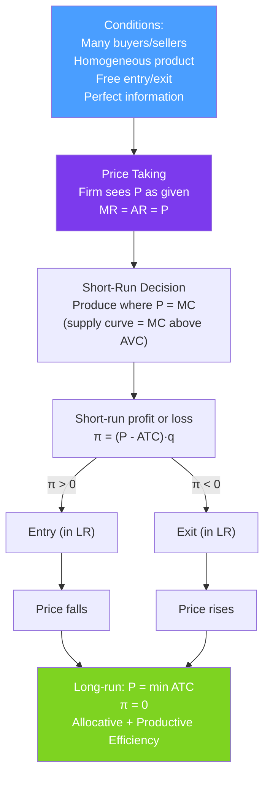

# 🏆 Perfect Competition

> [!abstract] TL;DR
> In a **perfectly competitive market**, many price-taking firms sell an identical product with free entry and exit. Each firm sets $P = MC$ (supply curve = MC above min AVC). In the **long run**, entry and exit drive economic profit to zero: $P = \min ATC$. This outcome is **allocatively efficient** (no deadweight loss) and **productively efficient** (production at minimum cost). Perfect competition is the welfare benchmark against which all other market structures are compared.

## Intuition — analogy FIRST

Imagine a wheat farmer. She grows the same wheat as 10,000 other farmers. The wheat price is set by the global market — she has absolutely no ability to raise her price above it (buyers will just buy from someone else). She is a **price taker**.

Her only decision is how much wheat to grow. She grows more if the price covers her costs, less if it doesn't. Multiply her response by 10,000 identical farms, and you get the market supply curve. When the wheat price rises (say, due to a drought elsewhere), it attracts new farmers into the market, ultimately driving the price back down until no one earns above-normal profits. This is the relentless logic of competition.

---

## How It Works

## Key Concepts / Details

### Conditions for Perfect Competition

1. **Many buyers and sellers**: Each is small relative to the market — no individual can affect price.
2. **Homogeneous product**: All units are identical; buyers are indifferent between sellers.
3. **Free entry and exit**: No barriers to entering or leaving the market in the long run.
4. **Perfect information**: All buyers and sellers know prices and product characteristics.

These four conditions make the firm a **price taker**: it faces a perfectly elastic (horizontal) demand curve at the market price $P$.

### The Firm's Short-Run Decision

Since $MR = P$ (constant), the first-order condition for profit maximization:
$$P = MC(q^*)$$

**Short-run supply curve** = MC curve for $P \geq \min AVC$; zero for $P < \min AVC$.

**Short-run economic profit**:
$$\pi = (P - ATC) \cdot q^*$$
- Positive if $P > ATC$: firm earns above-normal returns.
- Negative if $AVC < P < ATC$: firm operates but loses money (covers variable costs, partially offsets fixed costs).
- Zero if $P = ATC$: breakeven.

### Industry (Market) Supply

The **industry supply curve** sums up all individual firms' supply curves. For $n$ identical firms each with $MC(q) = a + bq$:
$$Q_S = n \cdot q^* = n \cdot \frac{P - a}{b}$$

In the short run, $n$ is fixed. In the long run, $n$ adjusts via entry and exit.

### Long-Run Equilibrium

Free entry and exit drives economic profit to zero:
$$P^{LR} = \min ATC \implies \pi = 0$$

**Why?** If $\pi > 0$, new firms enter → market supply shifts right → price falls → $\pi$ converges to zero. If $\pi < 0$, firms exit → market supply shifts left → price rises → $\pi$ converges to zero.

**Long-run equilibrium conditions**:
$$P = MC = \min ATC$$

This means:
- $P = MC$: **allocative efficiency** (price equals marginal cost — the right amount is produced from society's perspective).
- $P = \min ATC$: **productive efficiency** (production at minimum cost — no waste).

### Welfare Analysis

In competitive equilibrium, **total surplus is maximized**:
$$\text{Total Surplus} = CS + PS = \int_0^{Q^*} [D(Q) - S(Q)] dQ$$

There is **no deadweight loss** — every mutually beneficial trade occurs. This is the **first welfare theorem**: any competitive equilibrium is Pareto efficient (subject to caveats for externalities and public goods — see [[Market_Failures]]).

### Long-Run Industry Supply Curve

The long-run supply curve depends on input markets:

| Input market type | LRIS shape | Explanation |
|------------------|-----------|-------------|
| **Constant cost** | Perfectly elastic (horizontal) | Industry expansion doesn't raise input prices |
| **Increasing cost** | Upward sloping | Industry expansion bids up input prices |
| **Decreasing cost** | Downward sloping | Industry expansion lowers input costs (e.g., specialized suppliers develop) |

Most real industries are **increasing cost** — the LRIS is upward sloping.

---

## Real-World Notes

- **Agricultural commodity markets**: Wheat, corn, soybeans, and crude oil approach perfect competition — many producers, standardized products, publicly known prices. Farm subsidies are largely justified as responses to the zero-profit squeeze that farmers face.
- **Financial markets**: Stock markets approximate perfect competition in some dimensions (many traders, homogeneous securities, near-perfect information). High-frequency trading has reduced information asymmetry substantially.
- **Taxi deregulation and Uber**: Traditional taxi markets had barriers to entry (medallion system). Uber effectively reduced entry barriers, shifting toward more competitive conditions — prices fell, consumer surplus increased.
- **International trade**: Countries trading in competitive markets follow comparative advantage (from [[Scarcity_and_Opportunity_Cost]]). Gains from trade = consumer surplus gains from lower prices minus producer surplus loss.

---

## Common Pitfalls

- **Thinking zero economic profit means the firm is unhappy.** Zero *economic* profit means the firm is earning a normal return on investment — exactly what is needed to keep it in the market. It is not "just breaking even" in a poor sense.
- **Applying perfect competition to oligopolistic industries.** Most real industries don't meet all four conditions. The perfect competition model is a benchmark, not a description of most markets.
- **Confusing industry supply curve with a single firm's supply.** The industry supply is the horizontal sum of individual supply curves. In the long run, the number of firms adjusts.
- **Forgetting that the long-run competitive equilibrium requires both $P = MC$ and $P = \min ATC$.** The MR = MC condition only ensures optimality; the long-run equilibrium requires both conditions simultaneously, pinning down $P^{LR}$.

---

## Related Concepts

- [[_MOC_Market_Structures|↑ Section MOC]]
- [[Profit_Maximization]] — The $P = MC$ rule applies directly in perfect competition.
- [[Supply_and_Demand]] — The competitive supply curve comes from firm-level $P = MC$ decisions.
- [[Consumer_and_Producer_Surplus]] — Total surplus is maximized under perfect competition.
- [[Monopoly]] — Deviation from $P = MC$ creates deadweight loss.
- [[Market_Equilibrium]] — Competitive equilibrium is the canonical example.

---

## Review Questions

1. A competitive market has 100 identical firms, each with $MC(q) = 2 + 4q$ and $ATC(q) = 10/q + 2 + 2q$. If the market price is $P = 14$, what quantity does each firm produce? What is the industry supply? Is this a long-run equilibrium? If not, what will happen?
2. In a constant-cost competitive industry, market demand is $Q_D = 1000 - 50P$. Each firm has $\min ATC = \$8$ at $q^* = 20$. Find the long-run equilibrium price, total quantity, and number of firms.
3. The first welfare theorem says competitive equilibria are Pareto efficient. Name two conditions under which this fails and explain which market failure is at work in each case.

---

## Sources

- Varian, *Intermediate Microeconomics*, Ch. 23–24
- Mas-Colell, Whinston & Green, *Microeconomic Theory*, Ch. 10
- Stigler, *The Theory of Price*, Ch. 10

#microeconomics #economics #market-structures #perfectcompetition #pricetaker #allocativeefficiency
