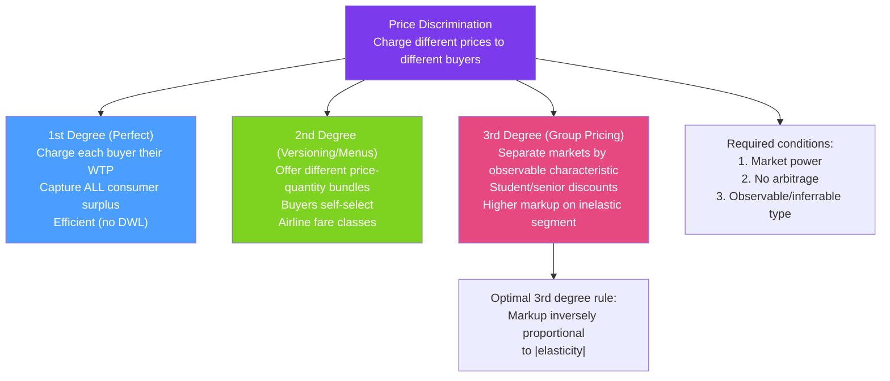

# 🎫 Price Discrimination

> [!abstract] TL;DR
> **Price discrimination** means charging different prices to different consumers (or for different units) in ways not justified by cost differences. It requires **market power**, the ability to **prevent arbitrage**, and **information** about consumer types. Three degrees: 1st (perfect — capture all surplus), 2nd (self-selection menus), 3rd (separate markets by observable group). Uber surge pricing, airline fare classes, student discounts, and software versioning are all price discrimination.

## Intuition — analogy FIRST

A movie theater wants to extract as much revenue as possible from its audience. Business travelers in suits might pay $30; students might pay $10; seniors on fixed incomes $12. If the theater charges a single price of $30, it sells only to the high-value customers. If it could somehow charge each person exactly what they're willing to pay, it would sell to everyone and capture all the gains from trade.

That's the goal of price discrimination — extract the consumer surplus that a single price leaves on the table. The challenge is figuring out who values the product more, and preventing high-value customers from posing as low-value ones.

---

## How It Works

## Key Concepts / Details

### Conditions for Price Discrimination

Three necessary conditions:
1. **Market power**: The firm must face a downward-sloping demand — it must be able to set price above MC.
2. **Ability to segment**: Identify different consumer groups or types by willingness to pay.
3. **Prevention of arbitrage**: Low-price buyers cannot resell to high-price buyers (if they could, all would demand the low price).

Arbitrage prevention methods: geography, timing (can't re-book an airline seat), individual binding (software licenses), legal restrictions (drug reimportation laws).

### First-Degree (Perfect) Price Discrimination

The seller knows each buyer's **exact willingness to pay (WTP)** and charges exactly that.

**Result**:
- Zero consumer surplus — seller captures all gains from trade.
- **Efficient allocation**: All buyers with WTP ≥ MC are served (no DWL).
- Total seller revenue = Total willingness to pay across all buyers.

**Example**: A perfectly informed used car dealer who knows exactly how much each buyer is willing to pay and extracts it through negotiation.

**Why rare**: Requires perfect information about each individual buyer's WTP — practically difficult. Approximated by:
- Auctions (buyers reveal WTP through bidding)
- Personalized pricing via data analytics (Amazon, airlines)
- Negotiations (B2B sales)

### Second-Degree Price Discrimination (Versioning / Nonlinear Pricing)

The seller offers a **menu of price-quantity bundles** and lets buyers self-select.

**Two-part tariff**: Charge a fixed access fee $T$ plus a per-unit price $p$:
$$\text{Consumer pays: } T + p \cdot q$$

Optimal two-part tariff (for a uniform consumer): Set $p = MC$ (efficient per-unit price) and extract all consumer surplus as the fixed fee $T = CS(p = MC)$.

**Bundling**: Selling multiple products together. Bundle pricing can extract more surplus when consumer valuations are negatively correlated across products.

**Versioning**: Offer "good," "better," "best" versions. 
- High-WTP consumers self-select into premium versions.
- Requires "damaged" versions — deliberately inferior base tier to separate types.
- Examples: Microsoft Office (Personal/Business/Enterprise), streaming services (Standard/Premium), airline classes.

**Block pricing / quantity discounts**: 
- First 10 units at $10 each; next 10 at $8 each.
- High-quantity buyers (higher total WTP) effectively face a lower average price.

### Third-Degree Price Discrimination

The seller charges **different uniform prices to identifiably different groups**. Each group has a different price elasticity.

**Optimal pricing rule**: Apply the Lerner Index to each group:
$$\frac{P_i - MC}{P_i} = -\frac{1}{\varepsilon_i} \implies P_i = \frac{MC \cdot \varepsilon_i}{\varepsilon_i + 1}$$

**Higher markup → less elastic group**:
$$\frac{P_1}{P_2} = \frac{\varepsilon_1(\varepsilon_2 + 1)}{\varepsilon_2(\varepsilon_1 + 1)}$$

**Group with $|\varepsilon_1| < |\varepsilon_2|$**: Group 1 is less elastic → $P_1 > P_2$.

| Discrimination type | Example | Key mechanism |
|--------------------|---------|-----------| 
| Student discounts | Software, museums | Age/enrollment verifiable; students have higher elasticity |
| Senior discounts | Movies, transit | Age verifiable; retirees have lower opportunity cost of time |
| Geographic pricing | Drug pricing (US vs EU) | Arbitrage prevented by regulation/logistics |
| Airline pricing | Business vs economy | Time sensitivity → inelastic for last-minute business travel |
| Peak/off-peak pricing | Uber surge, electricity | Demand varies by time; price by time period |

### Uber Surge Pricing: A Modern Example

Uber's surge pricing is dynamic 3rd-degree price discrimination (or market segmentation):
1. **High-demand periods** (concerts, rain, rush hour): Consumers have higher WTP — they need a ride now.
2. **Surge multiplier**: Effective price rises automatically.
3. **Result**: (a) Reduces quantity demanded (price-sensitive consumers wait or use alternatives), (b) Attracts more drivers (supply-side response), (c) Raises Uber's revenue per ride.

Surge pricing is efficient in the sense that it clears the market and brings more supply — the alternative (no surge) leads to a shortage (no cars available at the capped price).

### Welfare Effects of Price Discrimination

| Degree | Producer Surplus | Consumer Surplus | Total Surplus | DWL |
|--------|-----------------|-----------------|--------------|-----|
| 1st degree | Maximum | Zero | Maximum | None |
| 2nd degree | Increases | Decreases | Usually increases | Decreases |
| 3rd degree | Increases | Decreases | Ambiguous | Can increase or decrease |

Third-degree PD can **increase total welfare** if it allows the firm to serve new markets (low-elasticity groups that couldn't afford the non-discriminating price) — even though it harms existing consumers. It unambiguously reduces welfare if it doesn't expand output.

**Necessary condition for 3rd-degree PD to increase welfare**: Total output must increase.

---

## Real-World Notes

- **Pharmaceutical pricing**: Drugs are priced far higher in the US than in Canada or EU. Same molecule, different markets with different regulatory regimes preventing arbitrage. The US's inelastic consumers (covered by insurance) face higher prices; price-controlled markets face lower prices. This is geographic 3rd-degree PD.
- **Airline fare classes**: Business class ($2,000) and economy ($300) on the same flight have nearly identical marginal costs. Business travelers have inelastic demand (expense accounts, last-minute booking); leisure travelers are elastic (plan months ahead, flexible). The fare class structure is 2nd-degree PD (self-selection via fare rules).
- **Software versioning (Adobe)**: Adobe Photoshop Elements ($100) vs full Photoshop ($600/year). The feature set is deliberately capped to separate professional from amateur users — classic 2nd-degree PD.
- **Costco/Sam's Club membership**: Two-part tariff — fixed membership fee + near-cost per-unit prices. Members with high quantities pay less per item (quantity discount). Membership fee captures the surplus of high-volume buyers.

---

## Common Pitfalls

- **Assuming all price differences are price discrimination.** Price differences reflecting cost differences (e.g., shipping to remote areas) are not PD. True PD requires charging different prices *for identical costs*.
- **Thinking 1st-degree PD always requires knowledge of individual WTP.** Auctions, negotiation, and algorithmic pricing all approximate 1st-degree PD without perfect prior knowledge — WTP is revealed through the process.
- **Claiming PD always hurts consumers.** 1st-degree PD eliminates DWL (efficient). 3rd-degree PD can increase output, expanding access to previously unserved groups. Not all PD is welfare-reducing for society, though it transfers surplus from consumers to the firm.
- **Ignoring arbitrage constraints.** Recommending PD without ensuring arbitrage is prevented is a design error. Allowing arbitrage collapses the price difference.

---

## Related Concepts

- [[_MOC_Market_Structures|↑ Section MOC]]
- [[Monopoly]] — Market power is a prerequisite; PD is how a monopolist can extract more than uniform pricing allows.
- [[Consumer_and_Producer_Surplus]] — PD redistributes CS to the firm; degree 1 eliminates all CS.
- [[Elasticity]] — The rule $P_i \propto 1/(1 + 1/|\varepsilon_i|)$ makes elasticity central to PD pricing.
- [[Asymmetric_Information]] — Firms observe proxies (age, purchase history, browsing behavior) to infer WTP.
- [[Oligopoly]] — Oligopolists also price discriminate when they can identify segments.

---

## Review Questions

1. A monopolist sells to two markets with demands $Q_1 = 30 - P_1$ and $Q_2 = 20 - 0.5P_2$ and has $MC = 10$. Find the optimal prices under 3rd-degree price discrimination. What is total profit? Compare to uniform monopoly pricing.
2. A movie theater practices 2nd-degree price discrimination via matinee vs. evening pricing ($8 vs $14). Explain how this is self-selection (menu) PD and identify the mechanism that prevents arbitrage.
3. Show that 1st-degree price discrimination results in no deadweight loss. Why is it considered efficient despite consumers losing all their surplus?

---

## Sources

- Varian, *Intermediate Microeconomics*, Ch. 25
- Tirole, *The Theory of Industrial Organization*, Ch. 3
- Pigou, *The Economics of Welfare* (original three-degree classification)

#microeconomics #economics #market-structures #pricediscrimination #versioning #twoparttariff #ubersurge
