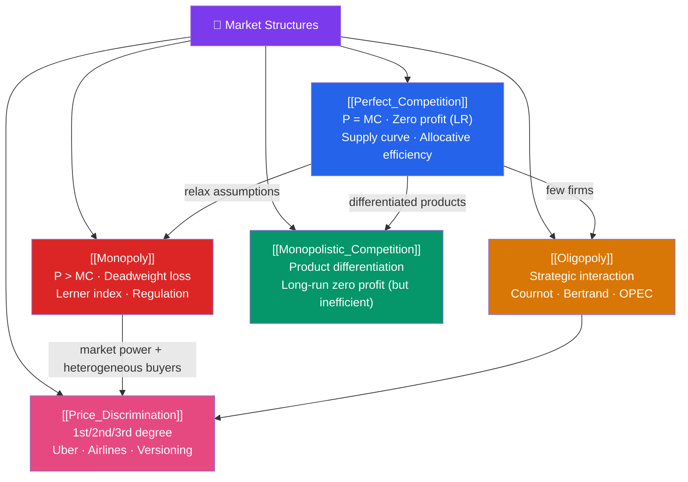

# 🏪 Market Structures — Map of Content

> [!abstract] What This Section Covers
> Market structures describe how much market power firms have — the spectrum from price-taking (perfect competition) to complete price-setting (monopoly), with oligopoly and monopolistic competition in between. This section analyzes pricing behavior, welfare effects, and strategic interaction under each structure. It also covers price discrimination — how a firm with market power extracts more surplus by charging different prices to different customers. Real-world examples include OPEC (oligopoly), Uber surge pricing (price discrimination), and pharmaceutical patents (monopoly).

## Concept Map

## Learning Path

1. [[Perfect_Competition]] — The benchmark: $P = MC$, zero long-run profit, efficient allocation.
2. [[Monopoly]] — Single seller: $MR = MC < P$, deadweight loss, regulation rationale.
3. [[Oligopoly]] — Few sellers with strategic interdependence; Cournot and Bertrand models.
4. [[Monopolistic_Competition]] — Many sellers with differentiated products; excess capacity.
5. [[Price_Discrimination]] — Extracting consumer surplus through differential pricing.

## All Notes at a Glance

| Note | Difficulty | What You'll Learn |
|------|------------|-------------------|
| [[Perfect_Competition]] | Intermediate | Supply curve, short/long-run equilibrium, efficiency, industry supply |
| [[Monopoly]] | Intermediate | MR < P, Lerner index, DWL, natural monopoly, regulation |
| [[Oligopoly]] | Advanced | Cournot (quantity), Bertrand (price), reaction functions, Nash equilibrium, OPEC |
| [[Monopolistic_Competition]] | Intermediate | Chamberlinian model, zero profit with excess capacity, advertising |
| [[Price_Discrimination]] | Advanced | 1st/2nd/3rd degree PD, Versioning, bundling, multi-part tariffs |

## Spectrum of Market Power

| Structure | # Sellers | Product | Price control | LR profit | Efficiency |
|-----------|-----------|---------|--------------|-----------|-----------|
| Perfect competition | Many | Homogeneous | None | Zero | Allocatively efficient |
| Monopolistic competition | Many | Differentiated | Some | Zero | Excess capacity |
| Oligopoly | Few | Homo/Diff | Significant | Positive | Varies |
| Monopoly | One | Unique | Full | Positive | Deadweight loss |

## Related Sections

- [[_MOC_Microeconomics_Master|↑ Microeconomics Master MOC]]
- [[_MOC_Producer_Theory|← Producer Theory]] (firm behavior foundations)
- [[_MOC_Information_Games|→ Information & Games]] (strategic behavior under imperfect info)
- [[_MOC_Welfare_Externalities|→ Welfare & Externalities]]

#MOC #microeconomics #market-structures
