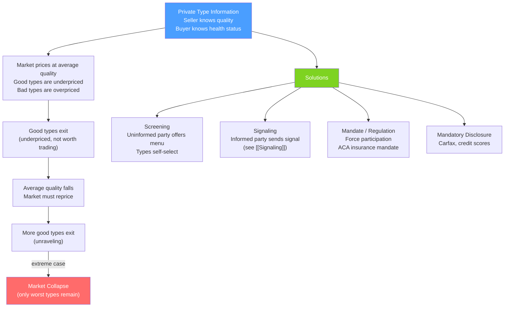

# 🍋 Adverse Selection

> [!abstract] TL;DR
> **Adverse selection** occurs when a party with **hidden type** (pre-contract private information) self-selects into a contract in a way that harms the uninformed party. Akerlof's **market for lemons**: sellers know car quality, buyers don't → only bad cars are offered → good cars exit the market → average quality falls → price falls → more good cars exit (the death spiral). Solutions: **screening** (uninformed party offers menus that reveal type) and **signaling** (informed party credibly reveals type).

## Intuition — analogy FIRST

Imagine a pool of swimmers trying to buy disability insurance. Healthy swimmers know they're healthy; sick swimmers know they're sick — but the insurer can't tell them apart. If the insurer charges one average price, it's a great deal for sick swimmers (who will likely claim) and a bad deal for healthy ones. Healthy swimmers drop out. The pool gets sicker. The insurer must raise premiums. More people drop out. The process continues until the market collapses — only the sickest insured, at sky-high premiums.

This is the **adverse selection death spiral** — a market failure caused entirely by information asymmetry, not by any external shock.

---

## How It Works

## Key Concepts / Details

### Akerlof's Market for Lemons (1970)

George Akerlof's Nobel Prize-winning paper modeled used car markets where:
- Quality of each car is known to seller but not buyer.
- Let cars range in quality from 0 to 1.
- Buyers are willing to pay up to the expected quality; sellers want at least their car's true quality.

**Sequential unraveling**:
1. Buyers form expectations about average quality → set price $P_1$.
2. Only sellers with quality ≤ $P_1$ accept → average offered quality falls below initial expectation.
3. Rational buyers lower their price to $P_2 < P_1$ → more good cars exit → further unraveling.
4. Market equilibrium: only the lowest-quality cars are traded; market may completely unravel.

**Formal condition for market to exist**: When buyers and sellers have the same reservation prices, the market exists if and only if the distribution of quality has sufficient mass at low values.

### Insurance Death Spiral

In health insurance without mandates:
- Average premium = average expected cost across the pool.
- Healthy people (low expected cost) find the premium unattractively high → exit.
- Pool becomes sicker → insurer raises premiums.
- More healthy people exit → spiral continues.

**ACA mandate rationale**: Require everyone to buy insurance (or pay a penalty), preventing the healthy from opting out. This maintains the cross-subsidy from healthy to sick, allowing a viable pooled market.

**Alternative approaches**:
- Community rating: prohibit pricing by health status → can't price-discriminate, maintains cross-subsidy.
- Risk adjustment: insurers with sicker pools receive transfers from those with healthier pools.

### Pooling vs Separating Equilibria

In a market with two types (high and low quality), equilibria can be:

**Pooling equilibrium**: Both types participate at the same price. No type-revelation occurs. Average price reflects average quality. Sustainable only if high types find the average price acceptable (not too low).

**Separating equilibrium**: Different types participate at different prices. Types are revealed. High types get (near) their true value; low types get their true value. No pooling: each type trades separately.

For insurance:
- **Pooling**: One policy at average risk level. Adverse selection may still be manageable.
- **Separating (screening)**: Insurer offers a menu. High-risk customers prefer comprehensive coverage (expensive); low-risk prefer high deductibles (cheap). The deductible structure separates types.

### Screening Menus (Rothschild-Stiglitz 1976)

The insurer offers a menu of contracts $\{(P_1, D_1), (P_2, D_2)\}$ where $P$ = premium and $D$ = deductible:
- High-risk types choose the low-deductible, high-premium contract (they expect to claim frequently).
- Low-risk types choose the high-deductible, low-premium contract (they don't expect to claim).

**Self-selection / incentive compatibility**: Each type prefers its own contract. The deductible acts as a **screening device** — high-risk types are "screened out" from the low-risk contract by the threat of high out-of-pocket costs.

**Distortions**:
- Low-risk type gets a less-than-first-best contract (too much risk, insufficient coverage) as the cost of the IC constraint.
- High-risk type gets the first-best contract (IC constraint binds on low-risk type, not high-risk).

### Credit Markets and Adverse Selection

In lending:
- **Higher interest rates** attract riskier borrowers (who expect a higher probability of default and thus don't care much about the rate).
- At some rate, safe borrowers exit → pool becomes riskier → default rates rise.
- **Stiglitz-Weiss (1981)**: Banks may not raise rates above a threshold even with excess demand for loans — they prefer to **ration credit** rather than raise rates that would attract only bad borrowers.

This is adverse selection causing credit rationing — a powerful market failure with major policy implications (justifying government credit guarantees, community reinvestment requirements).

---

## Real-World Notes

- **ACA and mandate**: The Affordable Care Act's individual mandate (2010) was explicitly designed to prevent adverse selection death spirals in insurance markets. When the mandate penalty was reduced to $0 in 2019, premiums rose in some markets — consistent with adverse selection theory.
- **Carfax and used cars**: Carfax, vehicle history reports, and lemon laws are market solutions to Akerlof's lemons problem. They reduce information asymmetry, allowing good cars to command higher prices and preventing full market unraveling.
- **Subprime mortgage securitization**: Mortgage originators had private information about loan quality; investors who bought mortgage-backed securities did not. Classic adverse selection — the worst loans (unverified income, high LTV) were securitized and sold, contributing to the 2008 crisis.
- **Life insurance and genetic testing**: With genetic testing becoming cheap, life insurers fear adverse selection — only people who know they're sick will buy life insurance. Some countries ban insurers from using genetic test results; others allow it (separating equilibrium).
- **Job market for graduates**: Employers cannot observe applicant quality. High-quality candidates have incentive to signal quality (through education, internships, grades) — adverse selection is mitigated by signaling (see [[Signaling]]).

---

## Common Pitfalls

- **Confusing adverse selection with moral hazard.** Adverse selection is pre-contract (type is private before the agreement). Moral hazard is post-contract (action is private after the agreement). The timing distinction matters for solutions.
- **Assuming adverse selection always destroys markets.** Many markets with information asymmetry survive through reputation, screening, signaling, or regulation. Akerlof's unraveling is the extreme; partial markets with reduced quality/variety are more common.
- **Treating mandates as paternalistic without understanding the market failure.** Insurance mandates exist because of the adverse selection death spiral — without them, the pooling equilibrium collapses, leaving even high-risk consumers unable to get insurance.
- **Confusing the screening solution with a fully efficient outcome.** The separating equilibrium from screening is second-best, not first-best. Low-risk types are under-insured (not fully covered) as the price of having their type revealed.

---

## Related Concepts

- [[_MOC_Information_Games|↑ Section MOC]]
- [[Asymmetric_Information]] — The general framework; adverse selection is one case.
- [[Moral_Hazard]] — The post-contract information problem; different causes and solutions.
- [[Signaling]] — The informed party's solution to adverse selection.
- [[Market_Failures]] — Adverse selection is a market failure requiring regulation or institutional design.
- [[Consumer_and_Producer_Surplus]] — Market unraveling destroys surplus that could have been created.

---

## Review Questions

1. In the market for used laptops, sellers know whether their laptop is high-quality (worth $800) or low-quality (worth $200). Half the laptops are high-quality. Buyers can't distinguish. If sellers require at least their laptop's true value and buyers offer the expected value, will a market exist? If not, what fraction of laptops can be sold?
2. An insurer offers two contracts: (A) premium $\$100$, no deductible; (B) premium $\$50$, $\$500$ deductible. High-risk people have expected claims of $\$400$; low-risk have expected claims of $\$100$. Show which type prefers which contract and explain how this screening menu separates types.
3. Explain why an individual mandate is the economic solution to the health insurance death spiral, rather than a simple subsidy for premiums. What specific market failure does the mandate address that a subsidy does not?

---

## Sources

- Akerlof (1970), "The Market for 'Lemons'," *Quarterly Journal of Economics*
- Rothschild & Stiglitz (1976), "Equilibrium in Competitive Insurance Markets," *Quarterly Journal of Economics*
- Stiglitz & Weiss (1981), "Credit Rationing in Markets with Imperfect Information," *American Economic Review*

#microeconomics #economics #information-games #adverseselection #lemons #screening #insurancemandates
