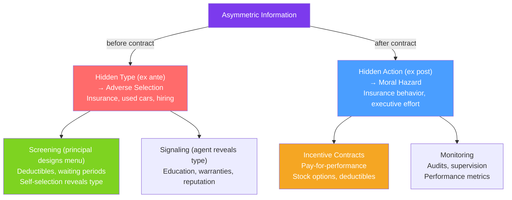

# 🔍 Asymmetric Information

> [!abstract] TL;DR
> **Asymmetric information** exists when one party in a transaction knows something the other doesn't. The two canonical cases: **hidden type** (one party has private characteristics unknown to the other — leads to [[Adverse_Selection]]) and **hidden action** (one party's behavior is unobservable — leads to [[Moral_Hazard]]). The **principal-agent framework** models the contract design problem: how does the uninformed principal get the informed agent to behave in the principal's interest?

## Intuition — analogy FIRST

You hire a plumber. Before hiring: you don't know if he's a skilled professional or a charlatan who'll cause water damage. After hiring: you can't see whether he's working diligently or browsing his phone in the crawlspace.

The first problem (unknown quality before the contract) is **hidden type** — you can't observe his skill level. The second problem (unobservable effort after the contract) is **hidden action** — you can't see what he's actually doing. Both problems arise because information is **asymmetrically distributed**: the plumber knows things you don't.

The entire field of mechanism design is about constructing contracts, prices, and institutions that work despite this information gap.

---

## How It Works

## Key Concepts / Details

### The Principal-Agent Framework

The **principal** (uninformed, hires) designs a contract to motivate the **agent** (informed, performs). The principal cannot observe type (before) or action (after).

**Standard setup**:
- Agent has type $\theta$ (high/low skill) or takes action $a$ (high/low effort).
- Principal observes only output $y = f(a, \theta, \varepsilon)$ where $\varepsilon$ is noise.
- Contract: $w(y)$ — wage as a function of observable output.

**First-best (no information problem)**: If action and type were observable, the principal would specify exactly: $\{a^{FB}, w^{FB}\}$ — action is contracted directly, agent gets a flat wage (full insurance).

**Second-best (information asymmetry)**: The principal must infer action/type from noisy output and provide incentives through the wage contract — at the cost of imposing risk on the agent.

### The Incentive-Insurance Trade-off

Agents are typically **risk-averse**: they prefer a certain wage to a risky wage with the same expected value. Principals are typically risk-neutral (can diversify).

**Optimal risk-sharing** (no incentive problem): principal bears all risk → flat wage for agent.
**Incentive alignment**: to motivate effort → wage must vary with output → agent bears risk.

These two goals **conflict**. The second-best contract balances:
$$\text{Incentive power} \propto \frac{Benefit of higher effort}{Cost of risk imposed on agent}$$

**Informativeness principle** (Holmström 1979): Include any signal $x$ in the contract if and only if $x$ is **informative about the agent's action** (relative performance evaluation is a corollary — compare to peers to filter common shocks).

### Incentive Compatibility and Participation Constraints

**Participation constraint (PC)**: The agent must be willing to accept the contract:
$$E[u(w(y))] \geq \bar{u} \quad \text{(reservation utility)}$$

**Incentive compatibility constraint (IC)**: The agent must prefer to take the desired action:
$$E[u(w(y)) | a^*] \geq E[u(w(y)) | a'] \text{ for all } a' \neq a^*$$

The principal maximizes expected profit subject to both constraints. The IC constraint binds when the action is not directly observable — the cost of IC (over the FB) is the **agency cost**.

### Types of Information Problems

| Problem | Information gap | Timing | Solution |
|---------|----------------|--------|---------|
| **Adverse selection** | Hidden type ($\theta$) | Pre-contract | Screening menus, signaling |
| **Moral hazard** | Hidden action ($a$) | Post-contract | Incentive contracts, monitoring |
| **Hold-up** | Hidden future action | Post-investment | Vertical integration, long-term contracts |
| **Cheap talk** | Message may be costless lie | Any | Credibility, commitment |

### Classic Information Asymmetry Contexts

| Context | Informed Party | Uninformed Party | Problem Type |
|---------|---------------|-----------------|-------------|
| Used car market | Seller (knows car quality) | Buyer | Hidden type (AS) |
| Health insurance | Buyer (knows health status) | Insurer | Hidden type (AS) |
| Employee-employer | Employee (knows effort) | Employer | Hidden action (MH) |
| Borrower-lender | Borrower (knows project risk) | Lender | Hidden type + action |
| Doctor-patient | Doctor (knows diagnosis quality) | Patient | Hidden action |

---

## Real-World Notes

- **Executive compensation**: CEOs are agents for shareholders (principals). Stock options and performance bonuses are the incentive contract solution to the moral hazard problem. But they also create risk (stock price volatility) that risk-averse executives may not like — the incentive-insurance trade-off is central to compensation design.
- **Healthcare information**: Patients face a severe information asymmetry with doctors — they can't evaluate the quality of medical advice. Licensing, malpractice law, and reputation serve as partial solutions. Fee-for-service payment creates a moral hazard (overtreatment); capitation creates the opposite (undertreatment).
- **Venture capital and startups**: VCs face hidden type (which founders are truly capable?) and hidden action (are founders working hard?). VC contracts respond: staged funding (reveals type over time), convertible notes, founder vesting schedules (incentive alignment), and board seats (monitoring).
- **Financial crisis 2008**: Mortgage securitization created a classic principal-agent problem. Originate-to-distribute (banks originating mortgages and selling them) destroyed the bank's incentive to screen borrowers — they were agents of investors who couldn't observe loan quality. Skin-in-the-game regulations (requiring banks to retain 5% of securitized loans) address this.

---

## Common Pitfalls

- **Treating adverse selection and moral hazard as the same thing.** They have different structures and require different solutions. AS is about pre-contract type revelation; MH is about post-contract action monitoring.
- **Assuming information problems always lead to market failure.** With the right contract design, markets can function well despite asymmetric information — the second-best outcome, though costly, is still viable.
- **Ignoring the agent's risk aversion in incentive design.** High-powered incentives (large performance bonuses) are costly for risk-averse agents and may require higher expected wages to satisfy the participation constraint.
- **Confusing the screening and signaling solutions.** Screening is initiated by the uninformed party (principal offers a menu and agent self-selects). Signaling is initiated by the informed party (agent takes costly action to reveal type). The same separating equilibrium can be reached by either path.

---

## Related Concepts

- [[_MOC_Information_Games|↑ Section MOC]]
- [[Adverse_Selection]] — The hidden type problem in detail.
- [[Moral_Hazard]] — The hidden action problem in detail.
- [[Signaling]] — How the informed party can credibly reveal type.
- [[Market_Failures]] — Asymmetric information is one of the four canonical market failures.
- [[Nash_Equilibrium_Applications]] — Equilibrium contracts under private information are often Nash equilibria in Bayesian games.

---

## Review Questions

1. Distinguish between adverse selection and moral hazard using the health insurance market as your context. For each problem: (a) identify who is informed and who is uninformed, (b) what information is private, (c) what market failure results.
2. A principal offers a contract $w(y) = \alpha + \beta y$ (linear contract). Describe what $\alpha$ (base wage) and $\beta$ (piece rate) do. What value of $\beta$ is optimal in the first-best (observable effort)? Why does optimal $\beta$ fall below this value with unobservable effort?
3. Why does the informativeness principle say that relative performance evaluation (comparing an agent to peers) improves contract efficiency? What exactly is being "informed" about?

---

## Sources

- Varian, *Intermediate Microeconomics*, Ch. 37
- Mas-Colell, Whinston & Green, *Microeconomic Theory*, Ch. 14
- Holmström (1979), "Moral Hazard and Observability," *Bell Journal of Economics*
- Arrow, "Uncertainty and the Welfare Economics of Medical Care" (1963)

#microeconomics #economics #information-games #asymmetricinformation #principalagent #hiddenttype #hiddenaction
