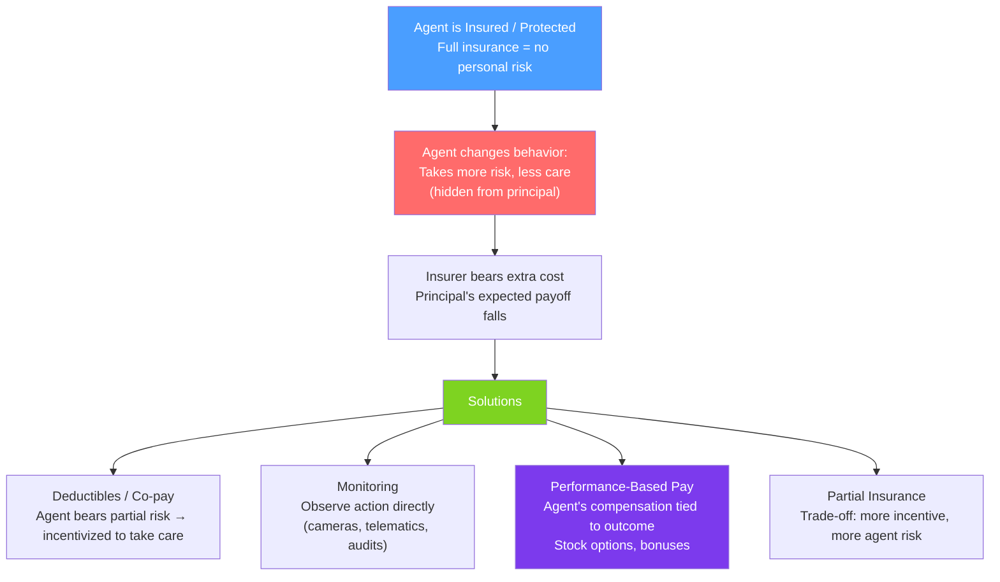

# ⚠️ Moral Hazard

> [!abstract] TL;DR
> **Moral hazard** occurs when an agent who is protected from risk takes **greater risk or less care** than they would if they bore the full consequences. It is a **hidden action** problem — the insurer/principal cannot observe the agent's behavior. Solutions include **deductibles** (make agent bear some risk), **monitoring**, **co-insurance**, and **performance-based pay**. The key tension: optimal risk-sharing (agent fully insured) vs optimal incentives (agent bears some risk).

## Intuition — analogy FIRST

You rent a car and buy the full collision waiver. Before, you parked carefully in well-lit spots; now you park in tight alleys and don't stress about the paint. You're fully insured — consequences don't fall on you. The rental company has just experienced **moral hazard**: your behavior changed after the contract, and they can't watch what you do with the car.

The same logic applies everywhere: people with health insurance may skip preventive care visits (why prevent what's covered?); homeowners with flood insurance build in flood plains; executives with golden parachutes take excessive corporate risks. Insurance and protection that eliminates the downside also eliminates the incentive to avoid it.

---

## How It Works

## Key Concepts / Details

### The Formal Model

**Agent takes action** $a \in \{a_L, a_H\}$ (low/high effort). Output:
$$y = \begin{cases} y_H & \text{with probability } p(a) \\ y_L & \text{with probability } 1 - p(a) \end{cases}$$
where $p(a_H) > p(a_L)$ (high effort raises probability of high output).

**Agent's utility**: $u(w) - c(a)$ where $c(a_H) > c(a_L)$ (effort is costly).

**First-best (observable action)**:
1. Principal specifies $a = a_H$ (if optimal).
2. Agent gets a flat wage $w^{FB}$ (optimal risk-sharing: risk-neutral principal bears all risk).
3. $w^{FB}$ satisfies the participation constraint $u(w^{FB}) - c(a_H) = \bar{u}$.

**Second-best (hidden action)**:
1. Principal can only contract on $y$ (observable).
2. Must provide $w(y)$ that gives the agent incentive to choose $a_H$ (IC constraint) while still attracting participation (PC constraint).
3. Agent must bear some risk (wage varies with output) → second-best expected profit for principal.

### Incentive-Insurance Trade-off

$$\underbrace{\text{Optimal insurance}}_{\text{flat wage}} \iff \underbrace{\text{Zero incentive}}_{\text{no effort}}$$

The second-best solution is a **partial compromise**:
- Wage varies with performance (provides incentive).
- Variance in wage is costly for risk-averse agent (they require a risk premium).
- Principal pays the risk premium to induce effort → agency cost.

**Key insight** (Holmström, 1979): Agent's wage should depend on all signals that are **informative** about the agent's action. Adding any informative signal improves efficiency (reduces the cost of inducing effort).

### Linear Contract ($\alpha, \beta$)

$$w(y) = \alpha + \beta y$$

- $\alpha$ = base salary (fixed component).
- $\beta$ = piece rate / incentive intensity (ties pay to performance).

**Trade-off as $\beta$ varies**:
- $\beta = 0$: Pure salary — no incentive (moral hazard at maximum).
- $\beta = 1$: Agent is residual claimant (franchise / sole proprietor) — full incentives but all risk on agent.
- Optimal $\beta$ balances: higher incentive vs higher risk premium.

$$\beta^* = \frac{1}{1 + r \sigma^2 / b}$$
where $r$ = agent's risk aversion, $\sigma^2$ = variance of output noise, $b$ = marginal productivity of effort.

More risk (higher $\sigma^2$) → lower optimal piece rate. More risk-averse agent → lower optimal piece rate. More productive effort (higher $b$) → higher optimal piece rate.

### Insurance Market Moral Hazard

**Health insurance**:
- With insurance: patients may demand more tests, procedures (overutilization).
- **Moral hazard solution**: deductibles (first $X paid by patient), co-pays (patient pays fraction), co-insurance.
- **Empirical evidence** (RAND Health Insurance Experiment): People with more comprehensive insurance use 30–40% more healthcare with no measurable improvement in health outcomes — a direct measurement of moral hazard.

**Auto insurance**:
- Drive more recklessly if fully covered → insurer introduces deductibles, safe driver discounts (telematics).

**Flood/fire insurance**:
- Over-build in risky areas; under-invest in mitigation → FEMA moral hazard in flood plains.

### Ex-ante vs Ex-post Moral Hazard

| Type | Timing | Example |
|------|--------|---------|
| **Ex-ante moral hazard** | Before loss occurs | Driving more recklessly after buying insurance |
| **Ex-post moral hazard** | After loss occurs | Filing a claim for a pre-existing condition |

Both types are **hidden action** problems; they differ in when the behavior changes.

---

## Real-World Notes

- **Executive compensation**: CEOs are agents for shareholders. Pure salary creates moral hazard — executives have no incentive to maximize shareholder value. Stock grants and options align pay with stock price performance. But this creates risk for the executive and may encourage short-term thinking (stock price focus).
- **Banking and too-big-to-fail**: Banks that are too large to be allowed to fail have an implicit government guarantee. This creates moral hazard — banks take excessive risks knowing they'll be bailed out. The 2008 financial crisis was partly driven by this logic. Basel III capital requirements are a regulatory response.
- **Performance metrics gaming**: If agents are paid based on specific metrics, they optimize for the metric at the expense of unmeasured outcomes (Goodhart's Law). School teachers "teaching to the test," executives managing quarterly earnings at the expense of long-run value. Multi-dimensional performance metrics and delayed vesting address this.
- **Gig economy workers**: Uber and Lyft drivers are contractors, not employees. They bear their own car maintenance and insurance costs (reducing moral hazard) but also bear more income volatility — a second-best contract that trades off incentive alignment against insurance.

---

## Common Pitfalls

- **Confusing moral hazard with bad character.** The term "moral" is misleading — moral hazard is not about ethics. It's about rational behavior responding to incentives. A fully insured person driving slightly less carefully is not immoral; they're responding to the changed incentive structure.
- **Thinking monitoring fully solves moral hazard.** Monitoring is costly and often imperfect. Even with monitoring, some hidden actions remain; the optimal response is usually a combination of monitoring + incentive pay.
- **Ignoring the risk cost to the agent.** High-powered incentives (large $\beta$) are costly because they impose risk. If the agent is very risk-averse or outcomes are very noisy, the cost of risk may exceed the incentive benefit — optimal incentive intensity may be low.
- **Applying the second-best trade-off to risk-neutral agents.** If the agent is risk-neutral, there is no insurance value from a flat wage. The optimal contract makes the agent the full residual claimant ($\beta = 1$) — no moral hazard at all, because the agent internalizes all outcomes.

---

## Related Concepts

- [[_MOC_Information_Games|↑ Section MOC]]
- [[Asymmetric_Information]] — The general framework; moral hazard is the hidden action case.
- [[Adverse_Selection]] — The hidden type case; both arise from information asymmetry.
- [[Nash_Equilibrium_Applications]] — The principal-agent game has a Nash equilibrium (contract, effort) structure.
- [[Market_Failures]] — Moral hazard causes inefficient risk-taking and resource allocation.

---

## Review Questions

1. An insurance company observes that insured drivers have 25% more accidents than uninsured drivers (after controlling for demographics). Is this evidence of adverse selection, moral hazard, or both? How would you design a study to separate the two?
2. A firm wants to hire a manager and offers a contract $w = \$50,000 + 0.3\pi$ where $\pi$ is annual profit. The manager is risk-averse with coefficient of absolute risk aversion $r = 0.00002$ and faces outcome variance $\sigma^2 = 400,000,000$. What is the risk premium the firm must pay? Should the firm raise or lower $\beta$?
3. Explain why "teaching to the test" is a moral hazard problem. What contract feature (incentive design) created it? What alternative incentive structure would reduce it, and what trade-off does that alternative involve?

---

## Sources

- Varian, *Intermediate Microeconomics*, Ch. 37
- Holmström (1979), "Moral Hazard and Observability," *Bell Journal of Economics*
- Manning et al. (1987), "Health Insurance and the Demand for Medical Care," *American Economic Review* (RAND experiment)
- Shavell (1979), "On Moral Hazard and Insurance," *Quarterly Journal of Economics*

#microeconomics #economics #information-games #moralhazard #hiddenaction #incentives #principalagent
