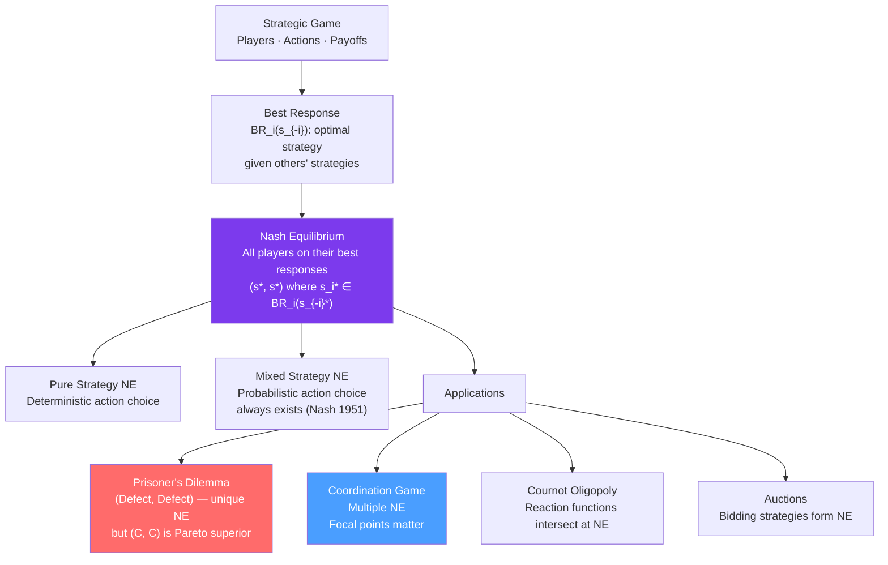

# 🎲 Nash Equilibrium Applications

> [!abstract] TL;DR
> A **Nash equilibrium (NE)** is a strategy profile where no player can profitably deviate given what others are doing. It is the central solution concept of game theory and underpins oligopoly, signaling, auctions, and policy analysis. Key games: **Prisoner's Dilemma** (mutual defection despite mutual cooperation being better — free-rider logic), **coordination games** (multiple equilibria), **battle of the sexes** (mixed motives). Nash's theorem: every finite game has a Nash equilibrium in mixed strategies.

## Intuition — analogy FIRST

Two chess players at a tournament. A Nash equilibrium is a pair of strategies where neither player wants to change their strategy given what the other is doing. It's a stable "resting point" of strategic reasoning — if I'm best-responding to you and you're best-responding to me, neither of us has a reason to move.

Unlike a cooperative agreement ("let's both do X"), a NE is self-enforcing — it doesn't require a contract or trust. Each player is already doing the best they can given what the other player is doing. This makes NE a powerful concept: outcomes that are stable don't require external enforcement.

---

## How It Works

## Key Concepts / Details

### Formal Definition

A Nash equilibrium is a strategy profile $s^* = (s_1^*, s_2^*, \ldots, s_n^*)$ such that:
$$u_i(s_i^*, s_{-i}^*) \geq u_i(s_i', s_{-i}^*) \quad \forall s_i', \forall i$$

No player $i$ can improve their payoff by unilaterally deviating from $s_i^*$.

**Nash's Theorem**: Every finite game (finite players, finite strategies) has at least one Nash equilibrium (possibly in mixed strategies).

### Dominant Strategies

A strategy $s_i$ **strictly dominates** $s_i'$ if:
$$u_i(s_i, s_{-i}) > u_i(s_i', s_{-i}) \quad \forall s_{-i}$$

A dominant strategy is best regardless of what others do. Rational players always play dominant strategies. If all players have dominant strategies, the game has a unique NE (the dominant strategy equilibrium).

**Iterated elimination of dominated strategies (IESDS)**: Eliminate strategies that are dominated, then repeat with the reduced game. Survives IESDS are called rationalizable strategies.

### The Prisoner's Dilemma

|  | Cooperate (C) | Defect (D) |
|--|-------------|-----------|
| **Cooperate (C)** | (3, 3) | (0, 4) |
| **Defect (D)** | (4, 0) | (1, 1) |

**Analysis**:
- For each player, D dominates C (D yields more regardless of the other's choice).
- Unique NE: **(D, D)** with payoffs (1,1).
- Pareto superior outcome **(C, C)** with payoffs (3,3) is not an NE — each player would deviate.

**Prisoner's dilemma structure** appears everywhere:
- OPEC cartels: each member wants to overproduce (defect) given high cartel price.
- Arms races: each country prefers to build weapons if the other does.
- Environmental agreements: each country prefers to free-ride on others' emission cuts.
- Tax competition: each jurisdiction prefers to cut taxes to attract business (race to the bottom).

**Repeated prisoner's dilemma**: With repeated interaction, cooperation can be sustained. **Tit-for-Tat** (cooperate first; then copy opponent's last move) achieves cooperative equilibrium when the discount factor (how much future payoffs are valued) is high enough — the **Folk Theorem**.

### Coordination Games

|  | Left | Right |
|--|------|-------|
| **Left** | (1, 1) | (0, 0) |
| **Right** | (0, 0) | (1, 1) |

**Two Nash equilibria**: (Left, Left) and (Right, Right). No dominant strategy.

The problem: how do players coordinate? **Focal points** (Schelling, 1960) — salient strategies that players naturally gravitate to (e.g., "meet at noon at Grand Central" when you can't communicate). Cultural, historical, and contextual cues create coordination.

**Standard-setting**: Driving on the right, USB-C, Wi-Fi protocols — all are coordination games where a single standard is the equilibrium, but which standard is reached depends on history and adoption dynamics.

### Battle of the Sexes

|  | Opera | Football |
|--|-------|---------|
| **Opera** | (2, 1) | (0, 0) |
| **Football** | (0, 0) | (1, 2) |

**Two pure strategy NE**: (Opera, Opera) and (Football, Football). Conflicting preferences over which NE.

**Mixed strategy NE**: Player 1 mixes: $P(\text{Opera}) = 1/3$; Player 2 mixes: $P(\text{Opera}) = 2/3$. Each player is indifferent between their pure strategies at the opponent's mixing probabilities.

### Mixed Strategy Nash Equilibrium

A player is willing to mix if and only if they are **indifferent** between the strategies they mix over. This indifference condition determines the mixing probabilities:

$$u_i(s_i, \sigma_{-i}^*) = u_i(s_i', \sigma_{-i}^*) \quad \text{for all } s_i, s_i' \text{ in the support}$$

**Existence theorem**: Every finite game has a NE in (possibly mixed) strategies.

**Interpretation of mixed strategies**: In a one-shot game, mixing is "making yourself unpredictable." In a large population context, mixed strategies represent the fraction of different types in the population playing each pure strategy (evolutionary game theory).

### Best Response Functions and Cournot NE

In Cournot duopoly (see [[Oligopoly]]):
$$BR_1(q_2) = \frac{a - c - q_2}{2} = \frac{a-c}{2} - \frac{q_2}{2}$$

Nash equilibrium is where both best-response functions intersect:
$$(q_1^*, q_2^*)$$ satisfies $q_1^* = BR_1(q_2^*)$ and $q_2^* = BR_2(q_1^*)$ simultaneously.

---

## Real-World Notes

- **COVID-19 vaccination**: Vaccination is a prisoner's dilemma. Individual cost of vaccination is real; individual benefit from others' vaccination (herd immunity) is a public good. Without coordination, under-vaccination is the NE. Mandates, subsidies, and nudges shift the payoffs to change the equilibrium.
- **Nuclear deterrence**: Mutually assured destruction (MAD) is a Nash equilibrium — neither side has incentive to launch first, given that the other will retaliate. The stability of deterrence rests on the NE logic.
- **Platform competition (iOS vs Android)**: A coordination game — developers write for the dominant platform, which attracts more users, which attracts more developers. Both "all iOS" and "all Android" are Nash equilibria; history (Apple's early apps, Android's openness) determined which coordination equilibrium was reached.
- **Auction bidding**: In a first-price sealed-bid auction, bidders strategically shade their bids below their true value (otherwise they always break even). The Nash equilibrium bid = $v \cdot (n-1)/n$ for $n$ symmetric bidders with valuations $v$ — a classic NE calculation.
- **Cartel stability (OPEC)**: OPEC quota agreements are prisoner's dilemmas. Each member's dominant strategy is to produce more. The equilibrium (all defect) is the competitive outcome. Saudi Arabia's dominant position means it acts as repeated-game enforcer — threatening to flood the market if others cheat, sustaining cooperation through credible punishment.

---

## Common Pitfalls

- **Confusing Nash equilibrium with Pareto optimality.** A NE need not be Pareto efficient (Prisoner's Dilemma). And a Pareto-efficient outcome need not be a NE (it may require binding commitment).
- **Thinking every game has a unique NE.** Coordination games and others have multiple NE. Selecting among them requires additional reasoning (focal points, equilibrium refinements).
- **Ignoring mixed strategy equilibria.** Many games have no pure strategy NE but do have mixed strategy NE. Ignoring mixed strategies means missing valid solutions.
- **Applying NE to situations without rationality.** NE requires that each player correctly anticipates others' strategies. In experimental settings with bounded rationality, level-k thinking or quantal response equilibria often better explain behavior.

---

## Related Concepts

- [[_MOC_Information_Games|↑ Section MOC]]
- [[Oligopoly]] — Cournot and Bertrand equilibria are Nash equilibria in quantity/price games.
- [[Adverse_Selection]] — Bayesian NE in games of incomplete information.
- [[Signaling]] — Signaling equilibria are perfect Bayesian equilibria.
- [[Moral_Hazard]] — The principal-agent game has NE structure.
- [[Externalities_and_Pigouvian_Tax]] — Environmental policy often addresses prisoner's dilemma structures.

---

## Review Questions

1. Construct a 2x2 game where both players have a dominant strategy. Find the Nash equilibrium. Then construct a game where no player has a dominant strategy but a unique pure-strategy NE exists.
2. Show that in the Prisoner's Dilemma, (D, D) is the unique Nash equilibrium even though (C, C) is Pareto superior. How does the Folk Theorem resolve this tension in repeated games?
3. In a 2x2 game with payoff matrix shown as Battle of Sexes above, find the mixed strategy Nash equilibrium. Verify that each player is indeed indifferent between their two strategies given the other's mixing probabilities.

---

## Sources

- Nash (1951), "Non-Cooperative Games," *Annals of Mathematics*
- Osborne & Rubinstein, *A Course in Game Theory* (free online)
- Schelling, *The Strategy of Conflict* (1960) — focal points
- Varian, *Intermediate Microeconomics*, Ch. 29

#microeconomics #economics #information-games #nashequilibrium #prisonersdilemma #gametheory #dominantstrategy
