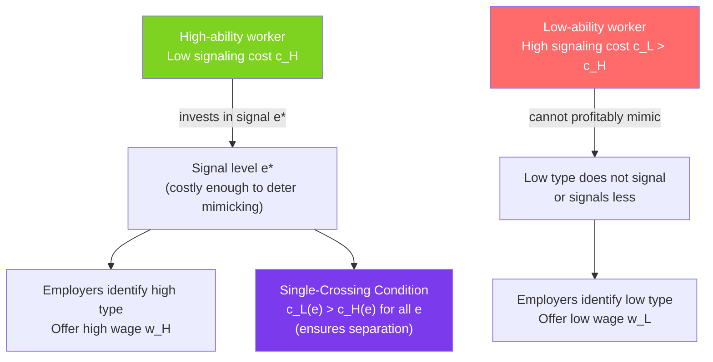

# 📡 Signaling

> [!abstract] TL;DR
> **Signaling** is how an informed party credibly communicates its type to an uninformed party by taking a **costly action that is cheaper for high types** than low types. Spence's **job market signaling model**: a college degree may signal worker quality even if education teaches nothing useful, because the cost of getting a degree is lower for high-ability workers (they find it less painful). For signaling to work, the **single-crossing condition** must hold: the signal must cost high types less than low types.

## Intuition — analogy FIRST

Two plumbers of different quality want to find clients. A low-quality plumber could claim to be high-quality — words are cheap. What can the high-quality plumber do to *prove* his quality? He could offer a guarantee: "If anything goes wrong in 5 years, I fix it for free." This guarantee is **costly**: a high-quality plumber rarely has to pay for it (his work rarely fails), so the expected cost is low. A low-quality plumber would face massive expected costs from such a guarantee — it would bankrupt him. Therefore, **only** high-quality plumbers offer the guarantee.

The guarantee is a **credible signal** precisely because it is costly to fake. Low types cannot profitably mimic the high type's signal. This is the logic of all signaling.

---

## How It Works

## Key Concepts / Details

### Spence Job Market Signaling Model

Michael Spence (Nobel 2001) modeled education as a signal of worker quality:

**Setup**:
- Two worker types: high ability ($\theta_H$) and low ability ($\theta_L$), with $\theta_H > \theta_L$.
- Workers' productivity is private — employers cannot observe ability directly.
- Workers can invest in education $e$ (years or credentials).
- Education costs: $c_H(e) = e/\theta_H$ and $c_L(e) = e/\theta_L$ where $c_L > c_H$ for any $e$ (lower ability workers find education more costly).

**Key assumption**: Education does not actually increase productivity in this model. It is a pure signal.

**Employer beliefs**: "If $e \geq e^*$, offer wage $w_H = \theta_H$; if $e < e^*$, offer wage $w_L = \theta_L$."

### Separating Equilibrium

For a **separating equilibrium** (high types signal, low types don't), two conditions must hold:

**High type's incentive compatibility** (benefits from signaling):
$$w_H - c_H(e^*) \geq w_L \implies \theta_H - e^*/\theta_H \geq \theta_L$$
$$e^* \leq \theta_H(\theta_H - \theta_L)$$

**Low type's incentive compatibility** (does NOT benefit from mimicking):
$$w_L \geq w_H - c_L(e^*) \implies \theta_L \geq \theta_H - e^*/\theta_L$$
$$e^* \geq \theta_L(\theta_H - \theta_L)$$

Combined: $e^* \in [\theta_L(\theta_H - \theta_L), \theta_H(\theta_H - \theta_L)]$

Any $e^*$ in this range supports a separating equilibrium. The minimum $e^* = \theta_L(\theta_H - \theta_L)$ is the **least-costly separating equilibrium**.

### The Single-Crossing Condition

The key mathematical requirement for signaling:
$$\frac{\partial}{\partial \theta}\left[-\frac{\partial c}{\partial e}\right] > 0$$

Indifference curves for different types "single-cross" in the $(e, w)$ space — the high-type's curve is steeper (they are less willing to sacrifice wage for a reduction in education because education is cheap for them).

Visually: if you draw indifference curves for high and low types in (education, wage) space, they cross exactly once. This ensures that if the high type is willing to invest in $e^*$, the low type will not.

### Pooling Equilibrium

In a **pooling equilibrium**, both types choose the same education level $e_P$ and receive the average wage $\bar{w} = \lambda w_H + (1-\lambda) w_L$ where $\lambda$ is the fraction of high types.

Pooling can unravel: if a high type could distinguish itself by getting slightly more education and earning $w_H > \bar{w}$, and the cost is low for high types, they will deviate. Pooling equilibria are often unstable.

### Warranties, Advertising, and Other Signals

The signaling logic applies far beyond education:

| Signal | Who sends it | Why only high types can afford it |
|--------|-------------|----------------------------------|
| **Warranties** | High-quality sellers | Low-quality products would generate costly warranty claims |
| **Advertising** | High-quality products | High-quality products recoup ad costs through repeat purchases; low-quality can't |
| **Conspicuous consumption** | High-income individuals | Expensive goods are affordable only to the wealthy |
| **Voluntary disclosure** | High-quality firms | Firms with bad news wouldn't voluntarily disclose |
| **Dividends** | Profitable firms | Only firms with genuine cash flow can sustain dividends |
| **Collateral in lending** | Low-risk borrowers | High-risk borrowers can't afford to post collateral (they expect to lose it) |

### Signaling vs Screening

Both achieve separation (reveal types), but the **initiator differs**:

| | Signaling | Screening |
|--|-----------|----------|
| **Who acts** | Informed party (agent) | Uninformed party (principal) |
| **Who designs mechanism** | Informed party (chooses signal level) | Uninformed party (offers menu) |
| **Example** | Worker gets degree, then applies for jobs | Insurer offers contracts with different deductibles |
| **Solution concept** | Signaling equilibrium | Screening/revelation mechanism |

Both can result in separating equilibria, but the welfare properties differ.

---

## Real-World Notes

- **Higher education**: The signaling theory of education (Spence) competes with the human capital theory (Becker) — education genuinely raises productivity. Evidence: "sheepskin effect" (wage jump at exactly the graduation year, not smoothly over years of study) supports signaling. Bryan Caplan (2018) argues most education is signaling.
- **MBA and consulting**: MBAs from top schools are primarily signals (they show intelligence and persistence) rather than training vehicles. Firms like McKinsey use them as efficient screening devices for cognitive ability.
- **IPO underpricing as signal**: New firms going public underprice their IPO deliberately — leaving money on the table. This is a credible signal of quality: only truly high-value firms can afford to underprice, because they'll recoup through secondary offerings at the market price.
- **Corporate social responsibility (CSR)**: Profitable firms signal their stability and values through costly CSR spending. Struggling firms can't afford it. This is a costly signal to employees, customers, and investors about firm fundamentals.
- **Luxury brands**: A Rolex doesn't just tell time better — it signals income and status. The signal is credible because only high-income individuals can afford it. The value of the signal depends on the cost difference between income classes.

---

## Common Pitfalls

- **Assuming signaling is always socially wasteful.** It's wasteful if education teaches nothing. But if signaling also has productive value (education does teach skills), the equilibrium involves both productivity and signaling effects, and the net welfare assessment is less clear.
- **Forgetting the multiplicity of equilibria.** There is an infinite range of separating equilibria in the Spence model. Refinements (like the Intuitive Criterion) select the least-costly separating equilibrium, but the multiplicity is a feature of signaling models.
- **Treating the pooling equilibrium as stable.** Pooling equilibria are typically unstable in signaling games — high types have incentive to deviate and separate. The Intuitive Criterion (Cho-Kreps) eliminates pooling equilibria in many settings.
- **Confusing the single-crossing condition with convexity.** The SCC is about how cost *varies with type*, not the shape of individual cost functions. It says the high-type indifference curve is flatter in (e, w) space — they trade education for wages at a more favorable rate.

---

## Related Concepts

- [[_MOC_Information_Games|↑ Section MOC]]
- [[Adverse_Selection]] — Signaling is one solution to the adverse selection problem.
- [[Asymmetric_Information]] — Signaling is the informed party's response to information asymmetry.
- [[Nash_Equilibrium_Applications]] — Signaling equilibria are perfect Bayesian equilibria.
- [[Moral_Hazard]] — Hidden action (after contract); signaling is about hidden type (before contract).

---

## Review Questions

1. In Spence's model, suppose $\theta_H = 3$ and $\theta_L = 1$ and wages offered are $w_H = 3, w_L = 1$. Find the range of education levels $e^*$ that support a separating equilibrium. What is the least-costly separating equilibrium?
2. A high-quality restaurant installs an open kitchen where diners can watch food preparation. Explain this as a signaling strategy. What is the signal? Why can't low-quality restaurants copy it?
3. Compare the welfare properties of the least-costly separating equilibrium in Spence's model to the social optimum (where employer knows each worker's type without any signal). What is the "deadweight loss" of signaling?

---

## Sources

- Spence (1973), "Job Market Signaling," *Quarterly Journal of Economics*
- Cho & Kreps (1987), "Signaling Games and Stable Equilibria," *Quarterly Journal of Economics*
- Caplan, *The Case Against Education* (2018) (signaling theory applied to higher education)
- Riley (2001), "Silver Signals: Twenty-Five Years of Screening and Signaling," *Journal of Economic Literature*

#microeconomics #economics #information-games #signaling #spence #separatingequilibrium #singlecrossing
