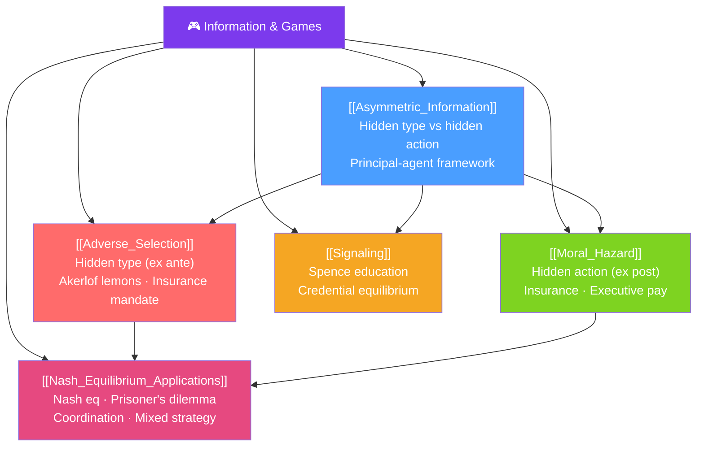

# 🎮 Information & Games — Map of Content

> [!abstract] What This Section Covers
> When parties in a transaction have different information, markets can fail in predictable ways. **Adverse selection** (hidden type) causes bad types to crowd out good types — Akerlof's market for lemons. **Moral hazard** (hidden action) causes agents to take excessive risk when insured. **Signaling** restores efficiency by allowing informed parties to credibly communicate quality. **Nash equilibrium** is the solution concept tying all strategic interactions together. These topics explain health insurance mandates, executive compensation design, educational credentials, and financial regulation.

## Concept Map

## Learning Path

1. [[Asymmetric_Information]] — The framework: hidden type vs hidden action; principal-agent problem.
2. [[Adverse_Selection]] — Hidden type markets; lemons problem; solutions (screening, mandates).
3. [[Moral_Hazard]] — Hidden action; contract design to align incentives.
4. [[Signaling]] — How informed parties credibly communicate through costly actions.
5. [[Nash_Equilibrium_Applications]] — Nash equilibrium in pure and mixed strategies; classic games.

## All Notes at a Glance

| Note | Difficulty | What You'll Learn |
|------|------------|-------------------|
| [[Asymmetric_Information]] | Intermediate | Hidden type/action, principal-agent setup, first-best vs second-best contracts |
| [[Adverse_Selection]] | Advanced | Akerlof lemons, insurance death spiral, screening, pooling vs separating equilibria |
| [[Moral_Hazard]] | Advanced | Incentive compatibility, effort monitoring, efficient risk-sharing vs incentive trade-off |
| [[Signaling]] | Advanced | Spence education model, separating equilibrium, costly signaling condition |
| [[Nash_Equilibrium_Applications]] | Advanced | Nash equilibrium, dominant strategies, prisoner's dilemma, coordination games, mixed strategy |

## Key Questions This Section Answers

- Why do used car markets suffer from "lemons" problems?
- Why does health insurance require mandates or community rating?
- Why do executives get paid partly in stock options?
- Why does getting a college degree signal ability even if it teaches nothing useful?
- How do we predict behavior when players choose simultaneously in a game?

## Related Sections

- [[_MOC_Microeconomics_Master|↑ Microeconomics Master MOC]]
- [[_MOC_Market_Structures|← Market Structures]] (strategic behavior under market power)
- [[_MOC_Welfare_Externalities|→ Welfare & Externalities]]

#MOC #microeconomics #information-games #asymmetric-information
