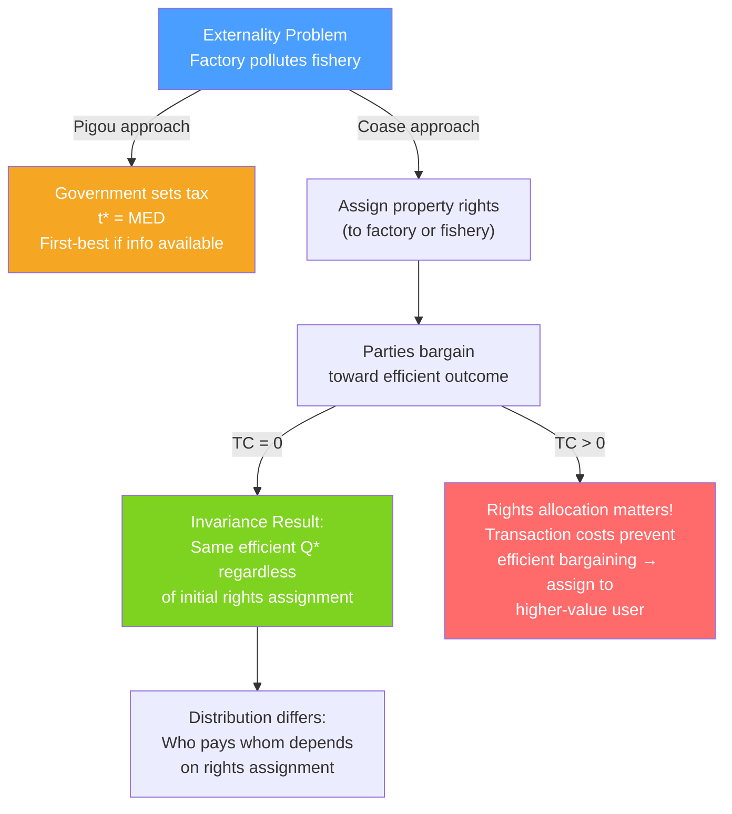

# 🤝 Coase Theorem

> [!abstract] TL;DR
> The **Coase theorem** (Coase, 1960) states that if property rights are well-defined, tradeable, and transaction costs are zero, private bargaining will lead to an efficient outcome **regardless of who holds the property rights** — the initial allocation only affects distribution, not efficiency. The theorem reframes externalities as a **bargaining problem**, not a government intervention problem. Its practical importance lies in its limit cases: when transaction costs are high (which is usually), government intervention can improve efficiency.

## Intuition — analogy FIRST

A factory and a fishery sit on the same river. The factory discharges waste that kills fish. Two scenarios:

**Case 1**: The fishery has the right to clean water. The factory can only pollute if it compensates the fishery. They negotiate: if the value of factory output exceeds the harm to the fishery, they agree — factory pays the fishery and pollutes at the efficient level.

**Case 2**: The factory has the right to pollute. The fishery can pay the factory to reduce pollution. They negotiate: if the harm exceeds the cost of abatement, the fishery pays the factory to clean up.

Coase's insight: **both cases lead to the same quantity of pollution** (the efficient level) because voluntary trade moves rights to whoever values them most. The allocation of rights determines who gets paid — but not the efficient outcome.

---

## How It Works

## Key Concepts / Details

### The Formal Statement

**Coase Theorem**: If property rights are well-defined and fully tradeable, and transaction costs are zero, then regardless of the initial allocation of property rights, bargaining between affected parties will result in the efficient allocation of resources.

**Two components**:
1. **Efficiency result**: Bargaining leads to the social optimum ($Q^*$) regardless of rights allocation.
2. **Invariance result**: The efficient outcome (quantity, technology) is the same regardless of who holds rights. Rights allocation only affects *distribution*.

### The Theorem in Action

**Example**: Factory produces pollution with cost $MPC = 20$ and benefit (to factory) $B = 100 - Q$. Pollution harms the fishery with marginal damage $MED = 2Q$.

**Social optimum**: $B - MPC - MED = 0 \implies 100 - Q - 20 - 2Q = 0 \implies Q^* = 26.7$

**Case 1: Fishery has the right to clean water**
- Factory must pay fishery for the right to pollute each unit.
- Fishery will accept payment $\geq MED$ per unit.
- Factory will pay if $B - MPC \geq MED$ per unit.
- They bargain to $Q^*$ where $B - MPC = MED$.

**Case 2: Factory has the right to pollute**
- Fishery can pay factory to reduce pollution.
- Factory will abate if payment $\geq (B - MPC)$ per unit foregone.
- Fishery will pay if payment $\leq MED$ per unit.
- They bargain to $Q^*$ where $B - MPC = MED$.

**Same $Q^*$ in both cases. Different distributions**: In Case 1, the fishery is compensated; in Case 2, it pays.

### When the Coase Theorem Holds vs Fails

| Condition | Required | Typical reality |
|-----------|---------|----------------|
| **Well-defined property rights** | Yes | Often missing (who "owns" the atmosphere?) |
| **Tradeable rights** | Yes | Legal and administrative restrictions often exist |
| **Zero transaction costs** | Yes | Rarely zero; often prohibitive |
| **No wealth effects** | Technically needed | Rights affect WTP through income effects |
| **Small number of parties** | Helps, not required | Many-party externalities prevent bilateral bargaining |

**Transaction costs** include:
- Search costs (finding the other party)
- Information costs (determining damage, willingness to pay)
- Negotiation costs (time, legal fees)
- Monitoring costs (verifying compliance with the agreement)
- Enforcement costs (suing for breach of contract)

With high transaction costs, the initial allocation of rights matters — efficiency is not achieved by bargaining. **Assign rights to the party that values them most** (or to the party that can best monitor and enforce).

### Coase vs Pigou

| | **Pigouvian Tax** | **Coasian Bargaining** |
|--|-----------------|---------------------|
| **Mechanism** | Government tax on externality | Private bargaining between parties |
| **Information required** | Government needs to know MSC | Parties need to know their own values |
| **Transaction costs** | Pays government's administrative cost | Pays parties' bargaining/negotiation cost |
| **Distributional effect** | Polluters pay tax (polluter-pays) | Depends on rights allocation |
| **Works best when** | Many parties, well-measured externality | Few parties, clear rights, low TC |

### Implications for Law and Economics

Coase's paper ("The Problem of Social Cost," 1960) founded the field of **law and economics**:

- **Tort law**: If courts correctly assign liability to minimize total social costs (considering transaction costs), efficient outcomes follow.
- **Contract law**: Default rules should minimize contracting costs — assign rights to the party that values them most, reducing the need for expensive explicit contracting.
- **Property law**: Clear, tradeable property rights reduce transaction costs → more Coasian bargaining is possible.
- **Regulatory design**: When can we rely on private bargaining (Coasian) vs government regulation (Pigouvian)? The transaction cost comparison determines this.

---

## Real-World Notes

- **Tradeable emission permits**: The US SO₂ cap-and-trade system (1990 Clean Air Act) is a Coasian mechanism: define property rights in "pollution allowances," make them tradeable, and bargaining (market trading) finds the efficient allocation. The theory says the same total emissions occur regardless of initial allocation (to polluters vs auctioned). In practice, free initial allocation to incumbents vs. auctioning affects distribution but not long-run efficiency.
- **Spectrum auctions**: The electromagnetic spectrum was originally given away to broadcasters (inefficient allocation). Coasian logic suggests that if spectrum were tradeable, rights would migrate to highest-value users. The FCC spectrum auctions (starting 1994) are a direct implementation of Coase's insight.
- **Property rights and deforestation**: Amazon deforestation is partly a Coase failure — property rights to forest land are unclear, and transaction costs of negotiating with affected parties (global climate) are prohibitive. Pigouvian solutions (carbon credits for forest preservation — REDD+) are the practical alternative.
- **Noise pollution lawsuits**: Neighboring property owners often negotiate quiet hours rather than litigating. This is Coasian bargaining working: the transaction costs are low (neighbors know each other), and they efficiently allocate the "right to make noise" through private agreement.

---

## Common Pitfalls

- **Applying the Coase theorem to real-world large-scale externalities.** The theorem's assumptions — zero transaction costs, well-defined rights — rarely hold for large externalities like climate change (billions of affected parties). The theorem explains *when* markets can solve externalities, not that they generally do.
- **Misunderstanding the invariance result.** Coase says the *efficient outcome* is invariant, not that *welfare* is invariant. Who holds rights determines who receives the surplus. This matters for distributional justice even when efficiency is achieved.
- **Treating the Coase theorem as an argument against regulation.** Coase himself was not a libertarian. His insight was that externalities are bilateral problems (the factory and the fishery *both* cause the problem by being near each other). The policy lesson is: minimize transaction costs and assign rights clearly, not "do nothing."
- **Confusing transaction costs with zero.** Students sometimes apply the efficiency invariance result to cases where transaction costs are clearly positive and important. The theorem's relevance depends critically on whether TC are low enough for bargaining to succeed.

---

## Related Concepts

- [[_MOC_Welfare_Externalities|↑ Section MOC]]
- [[Externalities_and_Pigouvian_Tax]] — The Pigouvian tax is the government alternative to Coasian bargaining.
- [[Market_Failures]] — Coase theorem addresses when market failures can be resolved privately.
- [[Nash_Equilibrium_Applications]] — Coasian bargaining is a cooperative game; Nash bargaining solution is the standard equilibrium concept.
- [[Asymmetric_Information]] — Information asymmetry raises transaction costs, limiting Coasian solutions.
- [[Consumer_and_Producer_Surplus]] — The gains from Coasian bargaining are the surplus created by moving to the efficient allocation.

---

## Review Questions

1. A factory discharges effluent into a river, costing a downstream farmer $\$100/day. The factory's profit from the effluent-generating process is $\$150/day$. Without government intervention: (a) If the farmer has the right to clean water, what outcome does Coase predict? (b) If the factory has the right to discharge, what outcome does Coase predict? (c) Are these outcomes the same? Who pays whom in each case?
2. Why is the Coase theorem not a solution to climate change externalities? Identify at least three specific ways the theorem's assumptions are violated in the climate context.
3. The US government auctioned off radio spectrum rather than giving it to broadcasters. Use the Coase theorem to explain why this decision has no effect on *long-run efficiency* (assuming tradeable rights), but does have distributional consequences. Do you agree with the efficiency prediction?

---

## Sources

- Coase (1960), "The Problem of Social Cost," *Journal of Law and Economics*
- Coase (1988), *The Firm, the Market and the Law* (accessible discussion of the theorem and its limits)
- Stigler, *The Theory of Price* (who coined "Coase theorem")
- Varian, *Intermediate Microeconomics*, Ch. 34

#microeconomics #economics #welfare #coasetheorem #propertyrights #transactioncosts #bargaining
