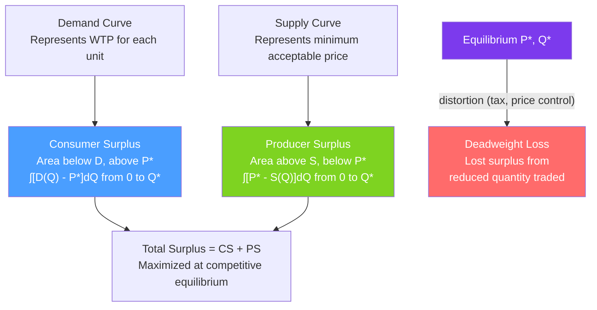

# 💹 Consumer and Producer Surplus

> [!abstract] TL;DR
> **Consumer surplus (CS)** is the area below the demand curve and above the price — the difference between what buyers are willing to pay and what they actually pay. **Producer surplus (PS)** is the area above the supply curve and below the price. **Total surplus (TS) = CS + PS** measures aggregate welfare. Any deviation from competitive equilibrium (taxes, price controls, monopoly) creates **deadweight loss (DWL)** — surplus that is simply destroyed.

## Intuition — analogy FIRST

You'd have paid $40 for a concert ticket but got it for $25. Your consumer surplus is $15 — free money, from your perspective. The scalper who bought the ticket for $15 and sold it for $25 earned $10 in producer surplus.

The concert market's "social value" is $40 (your WTP) − $15 (seller's cost) = $25 of total value created. The market price determines how this value is split between you and the seller, but not how much is created in total. Total surplus measures the size of the economic pie. Policy analysis asks: does this policy grow the pie or just redistribute its slices?

---

## How It Works

## Key Concepts / Details

### Consumer Surplus

$$CS = \int_0^{Q^*} [P^D(Q) - P^*] dQ$$

where $P^D(Q)$ is the inverse demand curve (willingness to pay for the $Q$-th unit).

**For linear demand** $P = a - bQ$:
$$CS = \frac{1}{2}(a - P^*) \cdot Q^* = \frac{(a-P^*)^2}{2b}$$

Consumer surplus is the **area of the triangle** between the demand curve and the horizontal price line.

**Interpretation**: CS is the aggregate net benefit to consumers — the total value received minus the total amount paid. It is an approximation of actual consumer welfare (ignoring income effects on utility).

### Producer Surplus

$$PS = \int_0^{Q^*} [P^* - S(Q)] dQ$$

where $S(Q)$ is the inverse supply curve (minimum acceptable price for the $Q$-th unit).

$$PS = \text{TR} - \text{VC} = \pi + FC$$

Producer surplus exceeds profit by the fixed costs (which are sunk in the short run). In the long run (when fixed costs are zero for new entrants), $PS = \pi$.

### Total Surplus and the First Welfare Theorem

$$TS = CS + PS$$

**Competitive equilibrium maximizes total surplus**. Any reduction in quantity below $Q^*$ reduces TS — there exists a unit with $WTP > MC$ that isn't traded (DWL). Any quantity above $Q^*$ would require trading a unit where $WTP < MC$ — also a loss.

**First Welfare Theorem**: Every competitive equilibrium is Pareto efficient (no one can be made better off without making someone worse off).

**Caveats**: This requires no externalities, no public goods, no market power, and no information asymmetries. When any of these fail → [[Market_Failures]].

### Deadweight Loss

**DWL** is the reduction in total surplus caused by any factor that moves the market away from the competitive equilibrium quantity $Q^*$:

$$DWL = \frac{1}{2}(P_B - P_S) \cdot (Q^* - Q_{actual})$$

**Sources of DWL**:

| Source | Mechanism | DWL shape |
|--------|-----------|-----------|
| **Tax** | Wedge $t = P_B - P_S$ reduces quantity | Triangle |
| **Monopoly** | Restricts quantity to $Q^{mon} < Q^*$ | Triangle |
| **Price ceiling** | Reduces quantity supplied | Triangle |
| **Price floor** | Reduces quantity demanded | Triangle |
| **Tariff** | Reduces imports below free-trade level | Triangles (two) |

**DWL from a per-unit tax $t$**:
$$DWL = \frac{1}{2} t^2 \cdot \frac{\varepsilon_D \cdot \varepsilon_S}{\varepsilon_S - \varepsilon_D} \cdot \frac{Q^*}{P^*}$$

DWL is proportional to $t^2$ — doubling the tax rate **quadruples** the DWL. This is the fundamental argument for avoiding distortionary taxes when possible.

### Tax Incidence and Surplus Distribution

Under a per-unit tax $t$:
- Buyers pay $P_B = P^* + \Delta P_B$ (price rises by buyer's share).
- Sellers receive $P_S = P^* - \Delta P_S$ (effective price falls by seller's share).
- Tax revenue = $t \cdot Q_t$ (rectangle between $P_B$ and $P_S$ over $Q_t$).
- DWL = triangle lost beyond $Q_t$.

**CS lost** = (rectangle transferred to government) + (CS triangle lost to DWL)
**PS lost** = (rectangle transferred to government) + (PS triangle lost to DWL)

### Equivalent Variation and Compensating Variation

For exact welfare measurement (avoiding CS approximation):
- **Compensating variation (CV)**: How much money would the consumer give/take to be just as well off before the price change? (Hicks, using base utility)
- **Equivalent variation (EV)**: How much money is equivalent to the price change from the consumer's perspective? (Using new utility)

CS is between CV and EV for normal goods. For policy analysis, EV is generally preferred.

---

## Real-World Notes

- **Free trade and tariff analysis**: A tariff raises domestic price, increasing domestic PS (domestic producers) but reducing CS (consumers pay more). Net effect: CS loss > PS gain + tariff revenue → DWL from trade restriction. Trade economists use this framework to compute the welfare cost of protectionist tariffs.
- **Airline ticket pricing**: When airlines price tickets efficiently (surplus extraction via price discrimination), they convert more CS to PS. The question for welfare is whether price discrimination reduces total DWL (by allowing more consumers to fly) or just redistributes surplus.
- **Minimum wage welfare analysis**: A minimum wage above equilibrium: workers who keep jobs gain surplus; workers who lose jobs lose surplus; firms lose producer surplus. Empirical work is needed to determine which effect dominates.
- **Congestion pricing (London, Stockholm)**: Charging drivers to use congested roads reduces congestion (negative externality), raises government revenue (use for CS), and creates a small DWL from drivers who don't make their trips. Net welfare positive if congestion relief > DWL + enforcement cost.

---

## Common Pitfalls

- **Treating DWL as equivalent to tax revenue.** The government collects revenue from the tax (not a welfare loss — transferred from consumers/producers to government). DWL is the additional welfare lost beyond the revenue — the transactions that don't happen.
- **Ignoring income distribution in total surplus.** Total surplus = CS + PS ignores whose surplus it is. A $1 of CS to a poor consumer and $1 of PS to a billionaire are counted equally. Distributional concerns require a social welfare function beyond TS.
- **Confusing CS with the area under the demand curve.** CS is the area under the demand curve and above the price. The area under the demand curve alone is total WTP (including what was actually paid).
- **Applying welfare analysis without accounting for externalities.** If a good generates pollution, the competitive TS overstates social welfare. Correcting for negative externalities (as in [[Externalities_and_Pigouvian_Tax]]) reduces true social surplus.

---

## Related Concepts

- [[_MOC_Welfare_Externalities|↑ Section MOC]]
- [[Supply_and_Demand]] — CS and PS are defined by the supply and demand curves.
- [[Market_Equilibrium]] — Competitive equilibrium maximizes total surplus.
- [[Perfect_Competition]] — The benchmark where TS is maximized and DWL is zero.
- [[Monopoly]] — Creates DWL equal to the triangle between competitive and monopoly quantities.
- [[Elasticity]] — Determines how the DWL is split between buyers and sellers under a tax.
- [[Market_Failures]] — Conditions under which competitive TS is not the social optimum.

---

## Review Questions

1. A competitive market has demand $Q_D = 100 - P$ and supply $Q_S = P - 20$. Find the equilibrium, then calculate CS, PS, and TS. If the government imposes a $10 per-unit tax, find the new CS, PS, tax revenue, and DWL.
2. A monopolist with $MC = 20$ faces demand $P = 100 - Q$. Compute the CS, PS, and DWL compared to the competitive equilibrium. What fraction of the total welfare loss is pure DWL vs transferred surplus?
3. The elasticity of demand is $-0.5$ and elasticity of supply is $+1.5$. If a tax of $\$4$ is imposed, who pays more of the tax — buyers or sellers? Use the tax incidence formula from [[Elasticity]].

---

## Sources

- Varian, *Intermediate Microeconomics*, Ch. 14
- Mas-Colell, Whinston & Green, *Microeconomic Theory*, Ch. 10
- Harberger (1964), "The Measurement of Waste," *American Economic Review* (Harberger triangles)

#microeconomics #economics #welfare #consumersurplus #producersurplus #deadweightloss #totalwelfare
