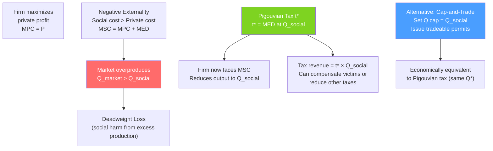

# 🌿 Externalities and Pigouvian Tax

> [!abstract] TL;DR
> An **externality** occurs when a transaction imposes costs or benefits on parties outside the transaction. **Negative externalities** (pollution, noise) cause markets to overproduce relative to the social optimum — the **marginal social cost (MSC)** exceeds the **marginal private cost (MPC)**. A **Pigouvian tax** set equal to the per-unit externality ($t = MSC - MPC$ at social optimum) internalizes the externality. **Cap-and-trade** achieves the same result through quantity limits and tradeable permits.

## Intuition — analogy FIRST

A steel mill pumps smoke into a neighborhood's air. The mill's accountants track labor, materials, and energy costs (private costs). They don't pay for the asthma treatments of nearby residents, the cleaning of windows, or the shortened lives from air pollution. These **external costs** are real — they fall on third parties — but they're invisible to the mill's profit calculation.

Arthur Pigou's insight (1920): the mill produces too much steel because it doesn't see the full social cost. The fix is a **tax** that equals the harm per ton — now the mill's accountant has to include the external cost, and the mill voluntarily restricts output to the socially optimal level.

---

## How It Works

## Key Concepts / Details

### Negative Externalities and Overproduction

**Marginal External Damage (MED)**: the harm imposed on third parties per unit of output.

$$MSC = MPC + MED$$

At market equilibrium (firms set $P = MPC$), the market produces $Q^{mkt}$ where:
$$P = MPC(Q^{mkt}) < MSC(Q^{mkt})$$

The socially optimal output $Q^*$ satisfies:
$$P = MSC(Q^*) = MPC(Q^*) + MED(Q^*)$$

Since $MSC > MPC$, we have $Q^{mkt} > Q^*$ — the market overproduces.

**Deadweight Loss**:
$$DWL = \int_{Q^*}^{Q^{mkt}} [MSC(Q) - P] dQ$$

This is the sum of external damages on production units from $Q^*$ to $Q^{mkt}$ — the excess social harm from overproduction.

### The Pigouvian Tax

**Optimal Pigouvian tax**: Set $t^* = MED(Q^*)$ — the marginal external damage evaluated at the social optimum.

After the tax:
- Firm's effective private cost: $MPC + t^* = MSC$ at $Q^*$.
- Firm optimizes: $P = MPC + t^* = MSC(Q^*)$.
- Market produces $Q^*$: socially optimal.

**Properties of Pigouvian taxes**:
- They achieve the social optimum **without knowing which firms should reduce output** — the price mechanism handles allocation.
- Revenue can reduce other distortionary taxes (the "double dividend" hypothesis: reduce DWL from pollution and from labor/income taxes simultaneously).
- Information requirement: need to know the marginal external damage at the social optimum.

### Positive Externalities and Underproduction

For positive externalities (education, R&D, vaccination):
$$MSB = MPB + MEB$$

Market produces where $P = MPB < MSB$ → too little is produced.

**Pigouvian subsidy** of $s^* = MEB(Q^*)$ raises the effective benefit to the marginal buyer, expanding output to $Q^*$.

**Examples**:
- R&D subsidies (knowledge spillovers — inventing firm can't capture all social value).
- Education subsidies (educated citizens benefit society: taxes, lower crime, better democracy).
- Vaccine subsidies (herd immunity is a public good benefit beyond private benefit).

### Cap-and-Trade vs Pigouvian Tax

Both achieve the social optimum (same $Q^*$) under certainty; they differ under uncertainty:

| Feature | Pigouvian Tax | Cap-and-Trade |
|---------|-------------|--------------|
| **What is fixed** | Price of pollution | Quantity of pollution |
| **Outcome certainty** | Certain price, uncertain quantity | Certain quantity, uncertain price |
| **Cost uncertainty** | Allows quantity to vary with costs | Price varies with costs |
| **Revenue** | Government tax revenue | Revenue from permit auction (if auctioned) |
| **Distributional** | Burden on polluters and consumers | Depends on permit allocation |
| **Best when...** | MC of abatement uncertain | Damage function has a "tipping point" |

**Weitzman's insight** (1974): Use a price instrument (tax) when the marginal cost of abatement is uncertain; use a quantity instrument (cap-and-trade) when the marginal damage from pollution has a critical threshold. For carbon (smooth damage function), taxes are favored; for some pollutants with thresholds, caps may be better.

### Carbon Tax: A Comprehensive Example

**The problem**: CO₂ emissions are a global negative externality — each ton of carbon dioxide imposes damage on the entire world's climate.

**Social cost of carbon (SCC)**: Estimated at $51 per ton (EPA 2022) to $200+ per ton (high-damage scenarios). This is $t^*$.

**Carbon tax design**:
1. Set $t = SCC$ per ton of CO₂ emitted.
2. Firms face higher costs → reduce emissions to socially optimal level.
3. Revenue: $\approx \$2$ trillion/year globally at $SCC = 100/ton$.
4. Revenue use: dividend to citizens (British Columbia model), reduce income taxes, climate investment.

**Why carbon taxes are favored by economists**: Economically efficient (firms with lowest abatement costs reduce the most), technologically neutral (doesn't pick winners), revenue-generating, scalable globally.

**Why carbon taxes face political resistance**: Visible cost (gas price rises), disproportionate burden on lower-income households (need dividend to offset), free-rider problem across countries.

---

## Real-World Notes

- **British Columbia carbon tax (2008)**: First comprehensive North American carbon tax. Started at C$10/ton, now C$65+/ton. Revenue-neutral: tax cuts offset carbon tax revenue. Emissions fell 10–15% relative to trend; GDP unaffected. The global reference case for Pigouvian carbon pricing.
- **EU Emissions Trading System (EU ETS)**: Cap-and-trade for European industry. Carbon price hit €100/ton in 2023. Airlines, steel, cement, and energy sectors covered. Evidence suggests meaningful emission reductions without severe competitiveness effects.
- **NYC congestion pricing (2024)**: Charging drivers to enter Manhattan below 60th St — a Pigouvian tax on traffic congestion. Revenue funds MTA public transit. Expected to reduce vehicles by 17%, improve bus speeds, and fund $15B in capital improvements.
- **Sulfur dioxide cap-and-trade (US, 1990 Clean Air Act)**: The textbook success case for cap-and-trade. Reduced SO₂ emissions by 40% at one-quarter the cost predicted by command-and-control regulation. Widely credited with demonstrating the practical superiority of market-based environmental policy.

---

## Common Pitfalls

- **Setting the Pigouvian tax at MED evaluated at the market quantity, not the social optimum.** The correct rate is $t^* = MED(Q^*)$, not $MED(Q^{mkt})$. This matters when MED varies with quantity.
- **Assuming the Pigouvian tax fully solves the problem without political economy.** The tax is economically optimal but may be set incorrectly due to lobbying, information problems, or distributional concerns. A poorly calibrated tax can be worse than no tax.
- **Confusing emission taxes with revenue-raising taxes.** The primary goal of a Pigouvian tax is to correct the externality; revenue is a by-product. Designing it primarily as a revenue-raiser may cause it to be set at the wrong level.
- **Ignoring international dimensions for global externalities.** A carbon tax in one country reduces global emissions only slightly — unilateral action has limited effect. The global prisoner's dilemma (each country free-rides on others' efforts) requires international coordination.

---

## Related Concepts

- [[_MOC_Welfare_Externalities|↑ Section MOC]]
- [[Market_Failures]] — Externalities are one of the four canonical market failures.
- [[Consumer_and_Producer_Surplus]] — DWL from externalities is measured in surplus terms.
- [[Coase_Theorem]] — The alternative (property rights / bargaining) solution to externalities.
- [[Public_Goods]] — Strong positive externalities can make goods public goods.
- [[Nash_Equilibrium_Applications]] — International emissions agreements are prisoner's dilemmas.

---

## Review Questions

1. A factory produces widgets and emits pollution. Demand: $P = 100 - Q$. MPC: $MC = 20$. Marginal external damage: $MED = 2Q$. Find the market equilibrium, social optimum, and optimal Pigouvian tax. Calculate the DWL without the tax.
2. Compare Pigouvian taxes and cap-and-trade for controlling carbon emissions. Under what conditions do both instruments achieve the same social optimum? When might one be preferable to the other?
3. The British Columbia carbon tax raised gas prices by C$0.25/liter. Estimate the reduction in kilometers driven using the assumption that gasoline demand elasticity is $-0.3$. How does this compare to the social optimum reduction if the SCC = C$65/ton CO₂?

---

## Sources

- Pigou, *The Economics of Welfare* (1920) — original Pigouvian tax argument
- Weitzman (1974), "Prices vs. Quantities," *Review of Economic Studies*
- Nordhaus (2017), "Revisiting the Social Cost of Carbon," *Proceedings of the National Academy of Sciences* (Nobel Prize work)
- Varian, *Intermediate Microeconomics*, Ch. 34

#microeconomics #economics #welfare #externalities #pigouviantax #carbontax #capandtrade
