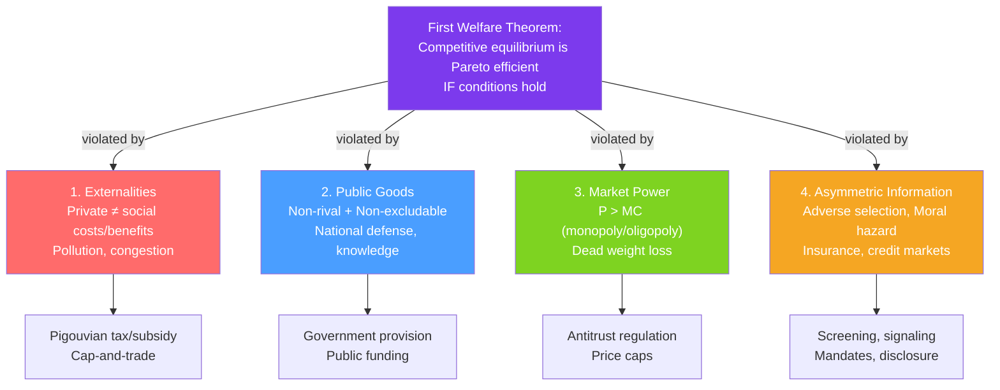

# ⚡ Market Failures

> [!abstract] TL;DR
> A **market failure** occurs when the competitive equilibrium is not Pareto efficient — the market produces too much or too little of some good relative to the social optimum. The **four canonical causes**: (1) externalities, (2) public goods, (3) market power, and (4) asymmetric information. Each cause has its own corrective policy. The **first welfare theorem** guarantees efficiency only when all four conditions are absent.

## Intuition — analogy FIRST

A highway is efficient when traffic flows smoothly. But when everyone decides individually whether to drive — ignoring how their car adds to congestion for everyone else — the highway clogs. This is an externality: each driver makes a privately rational choice that is collectively irrational.

Market failures are the traffic jams of the economy. Each individual makes a privately optimal decision, but the aggregate outcome falls short of what's collectively possible. The question is always: what is the minimal intervention needed to restore efficiency?

---

## How It Works

## Key Concepts / Details

### The First Welfare Theorem

**Statement**: Every competitive equilibrium is Pareto efficient — there is no reallocation that makes someone better off without making someone worse off.

**Conditions required**:
1. **No externalities**: Private costs/benefits = social costs/benefits.
2. **No public goods**: All goods are rival and excludable.
3. **No market power**: All agents are price-takers.
4. **Complete and symmetric information**: No adverse selection or moral hazard.

**When these conditions fail**: Competitive markets allocate resources in a way that doesn't maximize total social surplus. This is the economic justification for government intervention.

### Market Failure 1: Externalities

An **externality** exists when a transaction imposes costs or benefits on third parties not involved in the trade.

| Type | Example | Market result | Social optimum |
|------|---------|--------------|---------------|
| **Negative externality** | Factory pollution | Too much output (MSC > MPC) | Tax (Pigouvian) |
| **Positive externality** | Education, R&D | Too little output (MSB > MPB) | Subsidy |

The market fails because the externality-causing party doesn't pay for (or receive) the full social cost (benefit). Corrective policies are covered in [[Externalities_and_Pigouvian_Tax]].

**Size of market failure**: $Q^{market} - Q^{social}$ = wedge between private and social optima; $MSC - MC$ = externality per unit.

### Market Failure 2: Public Goods

A **public good** is simultaneously:
- **Non-rival**: One person's consumption doesn't reduce availability to others.
- **Non-excludable**: People cannot be prevented from consuming it.

| | Excludable | Non-excludable |
|--|-----------|---------------|
| **Rival** | Private goods (food) | Common resources (fish stock) |
| **Non-rival** | Club goods (cable TV) | **Public goods** (national defense) |

Markets **underprovide** public goods because of the **free-rider problem**: rational individuals expect others to pay for the public good and want to enjoy it for free. If everyone reasons this way, the good is not provided at all. Government provision and taxation are the standard solution. Full treatment in [[Public_Goods]].

### Market Failure 3: Market Power

When firms have **market power** ($P > MC$), they restrict output below the socially efficient level, creating DWL.

**Sources**: Patents, network effects, economies of scale (natural monopoly), barriers to entry.

**Corrective policies**: Antitrust enforcement (break up monopolies, prevent mergers), regulation of natural monopolies (price caps at average or marginal cost), patent reform.

**Magnitude**: DWL = $\frac{1}{2}(P - MC)(Q^{comp} - Q^{mon})$ — the Harberger triangle. As a share of GDP, estimates suggest US monopoly distortions cost 0.1–1% of GDP annually.

### Market Failure 4: Asymmetric Information

When one party has information the other doesn't:
- **Adverse selection** (hidden type): Market may unravel; only low-quality traded.
- **Moral hazard** (hidden action): Agent takes excessive risk; shirking.

These are analyzed fully in [[Asymmetric_Information]], [[Adverse_Selection]], and [[Moral_Hazard]].

**Corrective policies**: Mandatory disclosure (financial reporting), licensing (professional certification), insurance mandates, warranties, audits, incentive contracts.

### Government Failure

Government intervention is not automatically welfare-improving:
- **Regulatory capture**: Regulated industries influence regulators in their favor.
- **Public choice problems**: Politicians maximize votes, not welfare; bureaucrats maximize budgets.
- **Information problems**: Government may not know the social optimum any better than markets.
- **Implementation costs**: Taxes, enforcement, and compliance cost real resources.

**The second theorem of welfare economics**: Any Pareto-efficient allocation can be achieved through competitive markets with appropriate lump-sum redistribution. In practice, lump-sum redistribution is rarely feasible — this limits the theorem's practical relevance.

### Measuring Market Failure

| Metric | What it measures |
|--------|----------------|
| **DWL** | Loss of TS from quantity distortion |
| **Externality per unit** | MSC − MPC or MSB − MPB |
| **Information rent** | Extra payment to informed agent in second-best contract |
| **Free-rider underprovision** | Q provided by market vs socially optimal Q |

---

## Real-World Notes

- **Carbon emissions**: Negative externality from fossil fuels — the largest market failure by dollar magnitude. Global social cost of carbon is estimated at $51–$200+ per ton (EPA 2022, Nobel Prize work by Nordhaus). Market equilibrium produces far more carbon than the social optimum.
- **COVID-19 vaccines**: Positive externality (vaccinated individuals reduce spread to others). Market under-provides vaccination relative to social optimum. Government subsidies, mandates, and free distribution correct the market failure.
- **Facebook/social media**: Asymmetric information (users don't know how their data is used), negative externality (misinformation, mental health effects), and market power (network effects create winner-take-all markets). Three market failures simultaneously.
- **Antibiotic resistance**: Each antibiotic use reduces effectiveness for future users (negative externality). Market over-prescribes antibiotics. Corrective policy: taxes on non-critical antibiotic use, restricting over-the-counter sale.

---

## Common Pitfalls

- **Calling every bad outcome a "market failure."** Markets failing to serve the poor is a distributional problem, not a market failure in the technical sense. Market failures are about efficiency (the size of the pie), not distribution (who gets which slice).
- **Assuming government can always improve on the market.** The existence of a market failure is necessary but not sufficient for government intervention to be welfare-improving. Government failure, implementation costs, and unintended consequences must be considered.
- **Ignoring mixed cases.** Many real-world problems involve multiple simultaneous market failures (e.g., healthcare: externalities from infectious disease, public goods in medical research, market power in insurance, information asymmetry everywhere). Single-failure remedies may be insufficient.
- **Treating Pareto efficiency as the only welfare criterion.** A Pareto-efficient outcome can be wildly unequal. Distributional objectives require going beyond efficiency analysis to social welfare functions.

---

## Related Concepts

- [[_MOC_Welfare_Externalities|↑ Section MOC]]
- [[Consumer_and_Producer_Surplus]] — The welfare measuring tool for quantifying market failures.
- [[Externalities_and_Pigouvian_Tax]] — The externality failure in detail.
- [[Public_Goods]] — The public goods failure in detail.
- [[Asymmetric_Information]] — The information failure framework.
- [[Monopoly]] — Market power failure and regulation.

---

## Review Questions

1. List the four conditions for the First Welfare Theorem. For each condition, give a real-world example of an industry where it fails, and identify the type of market failure.
2. Explain why a government that correctly identifies a market failure but imposes a poorly calibrated policy (e.g., a Pigouvian tax set too high) could reduce welfare below even the market outcome. Under what conditions is government intervention definitely welfare-improving?
3. A new technology creates both positive externalities (knowledge spillovers to other firms) and is produced by a natural monopoly (high fixed costs). Should the government: subsidize it, break up the monopoly, or do both? What are the trade-offs?

---

## Sources

- Varian, *Intermediate Microeconomics*, Ch. 31–34
- Mas-Colell, Whinston & Green, *Microeconomic Theory*, Ch. 16
- Stiglitz, *Economics of the Public Sector*, Ch. 4–6

#microeconomics #economics #welfare #marketfailures #firstwelfaretheorem #externalities #publicgoods
