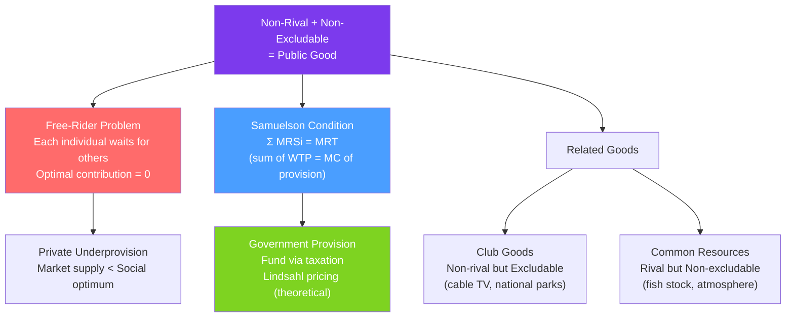

# 🏛️ Public Goods

> [!abstract] TL;DR
> A **public good** is both **non-rival** (one person's use doesn't diminish others') and **non-excludable** (no one can be prevented from using it). These properties create the **free-rider problem**: rational individuals wait for others to pay, so the good is privately underprovided. The socially optimal provision level satisfies the **Samuelson condition**: $\sum_i MRS_i = MRT$ (the sum of individuals' marginal rates of substitution equals the marginal rate of transformation).

## Intuition — analogy FIRST

National defense is the textbook public good. Once the military protects the country, it protects *all* citizens simultaneously (non-rival — your protection doesn't reduce mine). And you can't exclude any citizen from being protected just because they didn't pay taxes (non-excludable).

If national defense were left to private markets, each citizen would think: "Why should I pay? The defense will be provided whether I contribute or not. I'll free-ride on others' contributions." If everyone reasons this way, no one contributes — the defense isn't provided, even though every citizen values it. This is the **free-rider problem**: individually rational behavior leads to collective disaster.

---

## How It Works

## Key Concepts / Details

### The Four-Cell Taxonomy

| | **Excludable** | **Non-excludable** |
|--|-------------|-----------------|
| **Rival** | Private goods (food, clothing, cars) | Common-pool resources (fish, clean air, congested roads) |
| **Non-rival** | Club goods (streaming, toll roads with no congestion) | **Pure public goods** (national defense, knowledge, fireworks) |

**Pure public goods** occupy the bottom-right cell. Note that many goods are on a spectrum:
- A small fireworks show (non-rival up to a crowd size).
- Open-source software (non-rival, barely excludable).
- Broadcast television (non-rival, potentially excludable with encryption).

### The Free-Rider Problem

In a voluntary contribution game:
- Each individual $i$ has value $v_i$ for the public good.
- Public good is provided if total contributions $\geq C$ (some cost).
- Nash equilibrium: each player contributes $0$ (if others provide it, free ride; if others don't, my contribution alone doesn't cover $C$ → don't contribute).

**Result**: Nash equilibrium of the voluntary contribution game provides zero or far less than the optimum. The free-rider problem is a **prisoner's dilemma** scaled to $n$ players.

**Experimental evidence** (public goods games): People contribute 40–60% of their endowment in early rounds of voluntary contribution experiments, but contributions decline with repetition as free-riding becomes apparent. Punishment mechanisms dramatically increase cooperation.

### The Samuelson Condition

Paul Samuelson (1954) derived the optimal provision of a public good:

**For a private good**, each person's optimum: $MRS_i = MRT$ (individual's trade-off = market trade-off).

**For a public good**, the social optimum:
$$\sum_{i=1}^{n} MRS_{iG} = MRT$$

Each unit of the public good is enjoyed by *all* $n$ consumers simultaneously — so the social willingness to pay is the *sum* of individual WTPs, not just one person's.

**In demand terms**: Market demand for a public good is the **vertical sum** of individual demand curves (add up WTP for each unit), not the horizontal sum (as for private goods where each unit goes to one consumer).

$$P^{public} = \sum_i P_i^D(Q)$$

The socially optimal quantity is where this aggregate inverse demand equals the marginal cost.

### Lindahl Pricing

**Lindahl's theoretical solution**: Charge each individual a "personalized price" equal to their MRS — their share of the public good's marginal cost.

Individual $i$ pays $P_i = MRS_i \cdot MC / \sum_j MRS_j$.

**Properties**: 
- Lindahl prices achieve the Samuelson condition.
- Each individual voluntarily demands the socially optimal quantity at their personal price.
- Efficient and voluntary!

**Why it fails in practice**: Individuals have incentive to understate their WTP (pretend they value the public good less) to reduce their Lindahl price — the same free-rider problem in disguise. The mechanism is informationally demanding.

### Alternatives to Government Provision

| Solution | Mechanism | Example |
|----------|----------|---------|
| **Government provision** | Tax revenue funds public good | National defense, public parks |
| **Assurance contracts** | Provision only if threshold reached | Kickstarter (threshold-based crowdfunding) |
| **Dominant assurance contracts** | Refund + bonus if threshold not met | Entrepreneurial provision incentive |
| **Compulsory contribution** | Make everyone pay (like a tax) | HOA fees, mandatory union dues |
| **Property rights** | Make the good excludable | Software encryption, paywalls (converts PG to club good) |
| **Voluntary provision** | Altruism, social norms, warm glow | Wikipedia, open-source software, public radio |

### Tragedy of the Commons

**Common-pool resources** are rival but non-excludable — technically not public goods, but suffer from related problems:

Each user ignores the depletion cost imposed on others → overuse → resource exhausted.

$$MSC = MPC + \text{marginal depletion cost to others}$$

Solutions: Property rights (make excludable), quotas, taxation. Elinor Ostrom (Nobel 2009) showed that communities can often self-govern common-pool resources through social norms without government intervention.

---

## Real-World Notes

- **Open-source software**: Linux, Python, Firefox — contributed voluntarily, non-rival (infinite copies at zero cost), hard to exclude (GPL license). The "tragedy" doesn't fully materialize because of reputation effects, employer contributions, and intrinsic motivation. The economic puzzle of open source is why contribution exceeds the free-rider prediction.
- **COVID-19 vaccine development**: Vaccine R&D is a public good (knowledge of how to make vaccines). Governments funded it via Operation Warp Speed and similar programs — classic public goods provision to correct market underprovision. Patent protection converts some of the knowledge into a club good, creating a tension.
- **Wikipedia**: Voluntary contribution, non-rival, non-excludable. Thrives despite free-rider logic through social identity and contributing as consumption (writing an article is intrinsically rewarding). The "warm glow" utility of contributing bypasses the pure free-rider prediction.
- **Climate action as a global public good**: Greenhouse gas reduction is a global public good — benefits all countries, excludability is impossible. Each country free-rides on others' emission cuts. International climate agreements are attempts to escape this multi-player prisoner's dilemma. The Paris Agreement is a voluntary contribution mechanism; carbon taxes with border adjustments attempt to enforce participation.

---

## Common Pitfalls

- **Treating "provided by the government" as equivalent to "public good."** Many government-provided goods (highways, hospitals) are not pure public goods — they become congested (rival) and can be priced (excludable). Government provision is a response to market failure, not the definition.
- **Confusing non-rivalness with zero marginal cost.** Non-rivalry means one person's consumption doesn't reduce others', but there may still be positive costs (building and maintaining the public good). Software has near-zero marginal cost; a lighthouse has maintenance costs.
- **Ignoring excludability improvements.** Technological advances can make previously non-excludable goods excludable (encryption, digital rights management). This can solve the free-rider problem but raises access and equity concerns.
- **Applying the Samuelson condition directly to policy.** The condition requires knowing all individuals' MRS values — informationally demanding. Real policy relies on cost-benefit analysis with estimated aggregate WTP (e.g., contingent valuation surveys).

---

## Related Concepts

- [[_MOC_Welfare_Externalities|↑ Section MOC]]
- [[Market_Failures]] — Public goods are one of the four canonical market failures.
- [[Externalities_and_Pigouvian_Tax]] — Positive externalities are related to public goods; both involve social benefits exceeding private benefits.
- [[Coase_Theorem]] — Coase argued property rights can solve public goods problems (making goods excludable).
- [[Nash_Equilibrium_Applications]] — The free-rider game is a many-player prisoner's dilemma.
- [[Adverse_Selection]] — Voluntary revelation of WTP for public goods faces adverse selection.

---

## Review Questions

1. Two people value a fireworks show. Person 1 has inverse demand $P_1 = 20 - Q$; Person 2 has $P_2 = 15 - Q$. The MC of each additional firework burst is $5$. Find the socially optimal quantity using the Samuelson condition. What would private provision yield?
2. Explain why open-source software exists despite the free-rider prediction. What features of the situation allow cooperative provision without a government mandate?
3. A fishing ground is a common-pool resource. Use the externality framework from [[Externalities_and_Pigouvian_Tax]] to explain why fishing is overexploited and derive the optimal fishing tax (per-unit externality). Compare to an ITQ (individual transferable quota) system.

---

## Sources

- Samuelson (1954), "The Pure Theory of Public Expenditure," *Review of Economics and Statistics*
- Ostrom (1990), *Governing the Commons* (Nobel Prize work on common-pool resources)
- Lindahl (1919), "Just Taxation — A Positive Solution"
- Varian, *Intermediate Microeconomics*, Ch. 36

#microeconomics #economics #welfare #publicgoods #freerider #samuelson #commontragedy
