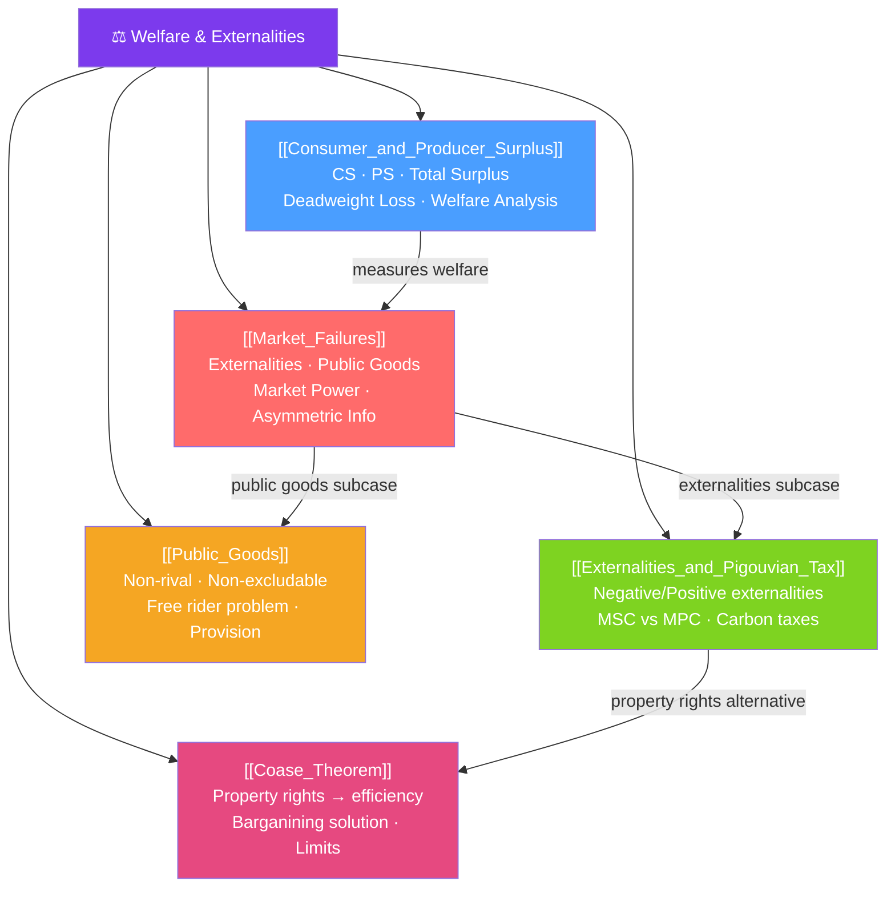

# ⚖️ Welfare & Externalities — Map of Content

> [!abstract] What This Section Covers
> This section asks: when do markets produce the socially optimal outcome, and when do they fail? **Consumer and producer surplus** are the welfare measuring tools. The **first welfare theorem** says competitive markets are efficient; **market failures** are the exceptions — externalities, public goods, market power, and information problems. **Externalities** and **Pigouvian taxes** describe when private and social costs diverge. **Public goods** explain why markets underprovide national defense and clean air. The **Coase theorem** offers a property-rights perspective on externalities.

## Concept Map

## Learning Path

1. [[Consumer_and_Producer_Surplus]] — The welfare measuring tools: CS, PS, total surplus, DWL.
2. [[Market_Failures]] — The four causes of market failure and when competitive efficiency fails.
3. [[Externalities_and_Pigouvian_Tax]] — When social and private costs diverge; Pigou's tax solution.
4. [[Public_Goods]] — Non-rival, non-excludable goods; the free-rider problem; government provision.
5. [[Coase_Theorem]] — Property rights and voluntary bargaining as an alternative to regulation.

## All Notes at a Glance

| Note | Difficulty | What You'll Learn |
|------|------------|-------------------|
| [[Consumer_and_Producer_Surplus]] | Intermediate | CS/PS areas, total welfare, DWL from taxes/price controls/monopoly |
| [[Market_Failures]] | Intermediate | Four failure types, first welfare theorem and its violations, efficiency concepts |
| [[Externalities_and_Pigouvian_Tax]] | Intermediate | Negative/positive externalities, MSC/MSB, Pigou tax, cap-and-trade, carbon tax |
| [[Public_Goods]] | Intermediate | Non-rivalry/non-excludability, free rider, Samuelson condition, public provision |
| [[Coase_Theorem]] | Advanced | Invariance result, efficiency, transaction costs, Coase vs Pigou policy debate |

## Key Questions This Section Answers

- How do we measure the benefit consumers get from a market, and the benefit producers get?
- When does the competitive equilibrium maximize total welfare?
- What causes externalities, and why can't markets handle them on their own?
- What is a Pigouvian tax and why is it considered the first-best solution to negative externalities?
- Why do markets underprovide public goods even when everyone wants them?
- When can private bargaining solve externality problems without government intervention?

## Related Sections

- [[_MOC_Microeconomics_Master|↑ Microeconomics Master MOC]]
- [[_MOC_Market_Structures|← Market Structures]] (monopoly DWL)
- [[_MOC_Information_Games|← Information & Games]] (information failure)

#MOC #microeconomics #welfare #externalities
