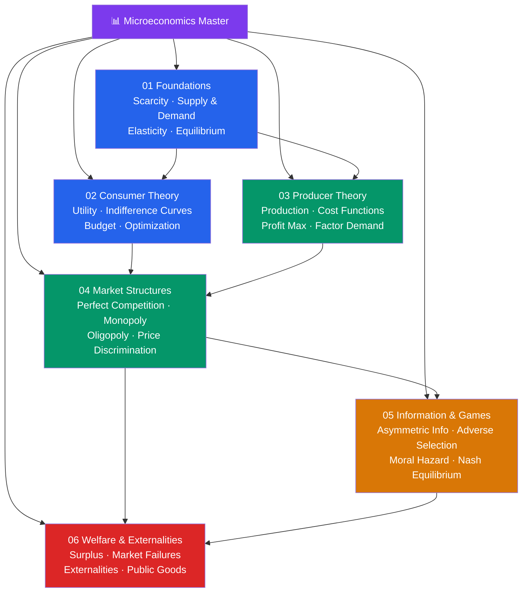

# 📊 Microeconomics — Master Map of Content

> [!abstract] About This Vault
> A complete microeconomics reference: **37 notes across 6 sections**, covering the full arc from basic supply-and-demand through consumer and producer theory, market structures, strategic interaction under information asymmetry, and welfare analysis. Every note pairs an intuition-first analogy with key formulas, Mermaid diagrams, and real-world examples drawn from Uber surge pricing, OPEC, carbon taxes, insurance markets, and more. Cross-linked to the System Design and AI/ML vaults where economic reasoning applies directly. Start at the section that matches your goal, or follow one of the four learning paths below.

## Vault Architecture

## Sections at a Glance

| # | Section | Notes | Entry Point | Difficulty |
|---|---------|-------|-------------|------------|
| 01 | Foundations | 5 | [[_MOC_Foundations]] | Beginner |
| 02 | Consumer Theory | 5 | [[_MOC_Consumer_Theory]] | Beginner → Intermediate |
| 03 | Producer Theory | 5 | [[_MOC_Producer_Theory]] | Intermediate |
| 04 | Market Structures | 5 | [[_MOC_Market_Structures]] | Intermediate → Advanced |
| 05 | Information & Games | 5 | [[_MOC_Information_Games]] | Advanced |
| 06 | Welfare & Externalities | 5 | [[_MOC_Welfare_Externalities]] | Intermediate → Advanced |

---

## Learning Paths

### Path 1 — Economics Student

> Best for: undergrad or grad students working through a micro course (Varian, Mas-Colell).

**Foundations → Consumer Theory → Producer Theory → Market Structures → Welfare**

[[_MOC_Foundations]] → [[Scarcity_and_Opportunity_Cost]] → [[Supply_and_Demand]] → [[Elasticity]] → [[Market_Equilibrium]] → [[_MOC_Consumer_Theory]] → [[Utility_Theory]] → [[Indifference_Curves]] → [[Budget_Constraint]] → [[Consumer_Optimization]] → [[Income_and_Substitution_Effects]] → [[_MOC_Producer_Theory]] → [[Production_Functions]] → [[Cost_Functions]] → [[Profit_Maximization]] → [[_MOC_Market_Structures]] → [[Perfect_Competition]] → [[Monopoly]] → [[_MOC_Welfare_Externalities]] → [[Consumer_and_Producer_Surplus]]

---

### Path 2 — Policy Analyst

> Best for: analysts evaluating regulation, taxation, and market interventions.

**Foundations → Market Structures → Welfare → Externalities → Information**

[[Supply_and_Demand]] → [[Elasticity]] → [[Market_Equilibrium]] → [[Perfect_Competition]] → [[Monopoly]] → [[Consumer_and_Producer_Surplus]] → [[Market_Failures]] → [[Externalities_and_Pigouvian_Tax]] → [[Public_Goods]] → [[Coase_Theorem]] → [[Asymmetric_Information]] → [[Adverse_Selection]] → [[Moral_Hazard]]

---

### Path 3 — Business Strategist

> Best for: product managers, consultants, and founders applying micro to pricing and competition.

**Foundations → Market Structures → Information → Producer Theory**

[[Supply_and_Demand]] → [[Market_Equilibrium]] → [[Comparative_Statics]] → [[Perfect_Competition]] → [[Monopoly]] → [[Price_Discrimination]] → [[Oligopoly]] → [[Nash_Equilibrium_Applications]] → [[Profit_Maximization]] → [[Cost_Functions]] → [[Signaling]] → [[Moral_Hazard]]

---

### Path 4 — Researcher

> Best for: PhD students and researchers needing the full formal treatment.

**All sections in order, emphasizing formal derivations**

[[Consumer_Optimization]] → [[Income_and_Substitution_Effects]] → [[Comparative_Statics]] → [[Factor_Demand]] → [[Returns_to_Scale]] → [[Profit_Maximization]] → [[Price_Discrimination]] → [[Nash_Equilibrium_Applications]] → [[Adverse_Selection]] → [[Signaling]] → [[Coase_Theorem]] → [[Externalities_and_Pigouvian_Tax]]

---

## Cross-Vault Links

- **[[Game_Theory]]** — Nash equilibrium, dominant strategies, and extensive-form games underpin [[Nash_Equilibrium_Applications]], [[Oligopoly]], and [[Signaling]]. The micro vault treats applications; the game theory vault covers the full formalism.
- **[[Quantitative_Finance]]** — Option pricing (risk-neutral valuation) echoes consumer optimization under uncertainty. [[Adverse_Selection]] and [[Moral_Hazard]] explain why financial contracts look the way they do.
- **System Design vault** — [[Pricing_Strategies]] in platform design draws on [[Price_Discrimination]] and [[Market_Equilibrium]]. Network effects are analyzed using externalities framing from [[Market_Failures]].
- **AI/ML vault** — Mechanism design and auction theory connect to [[Nash_Equilibrium_Applications]] and [[Asymmetric_Information]]; recommendation systems implicitly solve [[Consumer_Optimization]] problems.

---

## Section MOC Index

- [[_MOC_Foundations]] — The bedrock: scarcity, opportunity cost, supply and demand, elasticity, market equilibrium, and comparative statics.
- [[_MOC_Consumer_Theory]] — How rational agents maximize utility subject to budget constraints; indifference curves, MRS, Slutsky decomposition.
- [[_MOC_Producer_Theory]] — Production functions, cost minimization, profit maximization, returns to scale, and derived factor demand.
- [[_MOC_Market_Structures]] — Perfect competition, monopoly, oligopoly, monopolistic competition, and price discrimination — the spectrum from price-taking to price-setting.
- [[_MOC_Information_Games]] — What happens when parties know different things: adverse selection, moral hazard, signaling, and Nash equilibrium applications.
- [[_MOC_Welfare_Externalities]] — Measuring and maximizing social welfare; when markets fail and what to do about it — externalities, public goods, and the Coase theorem.

#MOC #microeconomics #economics #MasterMOC
