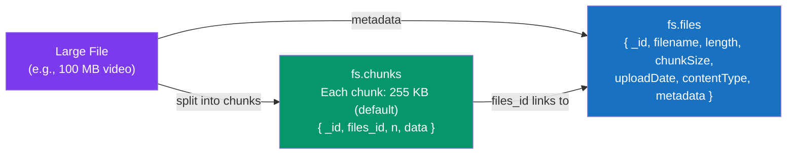
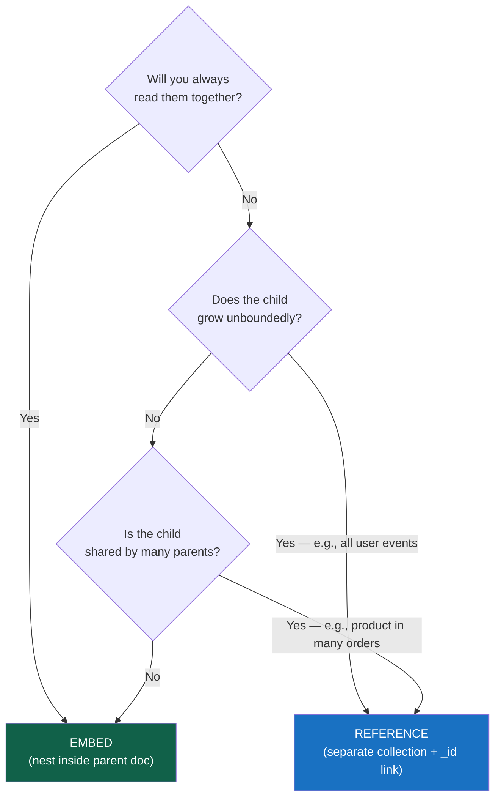

# Documents and Collections

> [!abstract] TL;DR
> MongoDB stores data as **BSON documents** — binary-encoded JSON with a richer type system — in **collections**. Every document has a mandatory `_id` field (auto-generated 12-byte ObjectId by default). Documents are capped at **16 MB**; larger files use **GridFS**. The flexible schema means documents in the same collection can differ in shape, enabling polymorphic patterns — but use **schema validation** to prevent field drift in production.

## BSON: What It Is and Why It Exists

**BSON** (Binary JSON) is MongoDB's binary wire and storage format. JSON is human-readable but slow to parse (no type information, no length prefixes). BSON adds:
- **Type tags** before every value — no ambiguity between `"42"` and `42`
- **Length prefixes** on documents and arrays — the engine can skip a field without parsing it
- **Types not in JSON**: `ObjectId`, `Date`, `Decimal128`, `BinData`, `Timestamp`, `Int32`, `Int64`, `Regex`, `MinKey`, `MaxKey`

```
BSON Document on disk:
┌──────────────────────────────────────────────────────┐
│ int32 (doc length) | element* | 0x00 (terminator)    │
│ element = type (1 byte) | cstring (key) | value      │
└──────────────────────────────────────────────────────┘
```

---

## BSON Data Types Reference

| BSON Type | Shell / Driver Syntax | Notes |
|---|---|---|
| **Double** | `3.14` | 64-bit IEEE 754 float |
| **String** | `"hello"` | UTF-8 |
| **Object** | `{ key: value }` | Embedded document |
| **Array** | `[1, 2, 3]` | Ordered list, same type not required |
| **Binary Data** | `BinData(0, "base64")` | Arbitrary bytes (images, files) |
| **ObjectId** | `ObjectId("...")` | 12-byte unique ID (see below) |
| **Boolean** | `true` / `false` | |
| **Date** | `ISODate("2026-07-29")` | 64-bit ms since Unix epoch |
| **Null** | `null` | |
| **Regular Expression** | `/pattern/flags` | PCRE regex stored in BSON |
| **JavaScript** | `Code("function(){}")` | Avoid: security risk with `$where` |
| **32-bit Int** | `NumberInt(42)` | Explicit 32-bit; default JS numbers are Double |
| **64-bit Int (Long)** | `NumberLong(9007199254740993)` | For values > 2^53 |
| **Decimal128** | `NumberDecimal("9.99")` | IEEE 754 128-bit — use for money/finance |
| **Timestamp** | `Timestamp(...)` | Internal replication use; prefer `Date` for app data |
| **MinKey / MaxKey** | `MinKey()` / `MaxKey()` | Sentinel values for range comparisons |

> [!warning] Money: Always Use Decimal128
> JavaScript's `Number` is a 64-bit double. `0.1 + 0.2 === 0.30000000000000004`. For currency, always use `NumberDecimal("0.10")` (Decimal128) or store as integer cents.

---

## The `_id` Field and ObjectId

Every document **must** have an `_id` field. It is the primary key — unique within a collection, automatically indexed (the default index you cannot drop).

**Auto-generated ObjectId** is the default when you don't supply `_id`:

```
ObjectId: 12 bytes total
┌───────────────┬──────────────────┬────────────────────┐
│  4 bytes      │  5 bytes         │  3 bytes           │
│  Unix epoch   │  Random value    │  Incrementing      │
│  timestamp    │  (per process)   │  counter           │
│  (seconds)    │                  │  (per second)      │
└───────────────┴──────────────────┴────────────────────┘
```

```javascript
const id = ObjectId("64f0a1b2c3d4e5f6a7b8c9d0")
id.getTimestamp()  // ISODate("2023-08-31T...") — creation time embedded in the ID!
```

**Custom `_id`**: You can use any unique value — string, number, compound object:
```javascript
// String _id
db.countries.insertOne({ _id: "US", name: "United States" })

// Compound _id (like a composite PK)
db.sensorReadings.insertOne({ _id: { deviceId: "d-001", ts: ISODate("2026-07-29T12:00:00Z") }, value: 23.5 })
```

> [!caution] ObjectId and Sharding
> ObjectId's timestamp prefix makes it **monotonically increasing** — all new inserts go to the newest chunk. For sharded collections with ObjectId as shard key, use **hashed sharding** to distribute writes evenly. See [[Sharding]].

---

## Collections

A **collection** is a namespace grouping documents (analogous to a table). Collections are created **implicitly** when you first insert into them, or **explicitly** with options:

```javascript
// Implicit creation — insert creates the collection
db.users.insertOne({ name: "Alice" })

// Explicit creation — needed for capped collections or schema validation
db.createCollection("auditLog", {
  capped: true,          // fixed-size circular buffer
  size: 1048576,         // 1 MB max
  max: 10000             // max 10,000 documents
})

// With JSON Schema validation
db.createCollection("users", {
  validator: {
    $jsonSchema: {
      bsonType: "object",
      required: ["name", "email", "createdAt"],
      properties: {
        name:      { bsonType: "string" },
        email:     { bsonType: "string", pattern: "^.+@.+$" },
        age:       { bsonType: "int", minimum: 0, maximum: 150 },
        createdAt: { bsonType: "date" }
      }
    }
  },
  validationLevel: "strict",   // "strict" (default) or "moderate" (only new/updated docs)
  validationAction: "error"    // "error" (reject) or "warn" (log)
})
```

---

## Document Size Limit and GridFS

MongoDB enforces a **16 MB per-document** limit. This is intentional — it prevents pathological documents (and the network overhead of fetching them) while nudging you toward proper schema design.

**GridFS** is the convention for files larger than 16 MB:



```javascript
// Using the official GridFS driver (Node.js example)
const bucket = new mongodb.GridFSBucket(db, { bucketName: 'uploads' })

// Upload
const uploadStream = bucket.openUploadStream('video.mp4', { metadata: { userId: 'u-001' } })
fs.createReadStream('/tmp/video.mp4').pipe(uploadStream)

// Download
const downloadStream = bucket.openDownloadStreamByName('video.mp4')
downloadStream.pipe(res)  // stream to HTTP response
```

> [!tip] GridFS vs Object Storage
> GridFS is fine for files up to a few hundred MB queried with MQL. For large-scale binary storage (images, videos, logs), **S3-compatible object storage** (AWS S3, GCS, MinIO) is more cost-effective. Store the object URL in MongoDB, the file in S3.

---

## Schema Design: Embedding vs Referencing

The fundamental MongoDB schema question. Deep patterns are in [[Schema_Design_Patterns]]; here are the basics:



**Embedding** (one-to-few, read together):
```javascript
// Blog post with comments embedded
{
  "_id": ObjectId("..."),
  "title": "MongoDB Schema Design",
  "body": "...",
  "comments": [
    { "author": "bob", "text": "Great post!", "at": ISODate("2026-07-01") },
    { "author": "carol", "text": "Thanks!", "at": ISODate("2026-07-02") }
  ]
}
```

**Referencing** (one-to-many, separate lifecycle):
```javascript
// Order references customer (customer data changes independently)
// orders collection
{ "_id": ObjectId("..."), "customerId": ObjectId("cust-001"), "total": 99.99 }

// customers collection
{ "_id": ObjectId("cust-001"), "name": "Alice", "email": "alice@example.com" }

// Join with $lookup (aggregation pipeline)
db.orders.aggregate([
  { $lookup: { from: "customers", localField: "customerId", foreignField: "_id", as: "customer" } }
])
```

---

## Polymorphic Documents

MongoDB's flexible schema enables **polymorphic collections** — different document shapes in the same collection, distinguished by a `type` or `category` field:

```javascript
// Single "products" collection — electronics and clothing have different fields
{ "_id": "p1", "type": "electronics", "brand": "Sony", "specs": { "ram": "16GB", "cpu": "M3" }, "price": 1299 }
{ "_id": "p2", "type": "clothing",    "brand": "Patagonia", "size": "M", "color": "blue", "price": 89 }
{ "_id": "p3", "type": "electronics", "brand": "Apple", "specs": { "storage": "1TB" }, "price": 999 }

// Query all products of type electronics under $1000
db.products.find({ type: "electronics", price: { $lt: 1000 } })

// Use $exists to query type-specific fields
db.products.find({ "specs.ram": { $exists: true } })
```

**Index on discriminator field is critical** — without `{ type: 1 }` indexed, every polymorphic query becomes a collection scan.

---

## Time-Series Collections (MongoDB 5.0+)

Purpose-built for time-series workloads with automatic column-oriented storage:

```javascript
db.createCollection("sensorData", {
  timeseries: {
    timeField: "timestamp",    // required: the time field
    metaField: "metadata",     // optional: grouping field (sensor ID, device)
    granularity: "seconds"     // "seconds" | "minutes" | "hours"
  },
  expireAfterSeconds: 86400 * 30  // TTL: auto-delete after 30 days
})

db.sensorData.insertMany([
  { timestamp: ISODate("2026-07-29T12:00:00Z"), metadata: { deviceId: "d-001", location: "NYC" }, temperature: 23.5, humidity: 65 },
  { timestamp: ISODate("2026-07-29T12:00:01Z"), metadata: { deviceId: "d-001", location: "NYC" }, temperature: 23.6, humidity: 64 }
])
```

Time-series collections use **internal bucketing** automatically — MongoDB groups readings by time window per series, storing them column-oriented for better compression and range query performance.

---

## Common Pitfalls

1. **Mixing Double and Decimal128 for money.** `NumberDecimal` is verbose to type but essential. Train your team and enforce via schema validation.
2. **Forgetting that `_id` must be unique but not necessarily ObjectId.** If you import data with natural unique keys (ISO country code, UUID), use them as `_id` — you save the secondary unique index.
3. **Creating collections with no thought for capped vs regular.** Use capped collections for fixed-size circular buffers (audit logs, rate-limit windows); use time-series collections for sensor/event data; use regular collections for everything else.
4. **Ignoring the 16 MB limit until you hit it.** If a field is an array that grows (user activity, chat messages, log lines), it will eventually hit the limit. Design for growth — reference or bucket from the start.
5. **Not adding schema validation in production.** "Schemaless" is powerful but dangerous. At minimum, validate required fields and types on write.

---

## Review Questions

1. Explain why MongoDB uses BSON instead of JSON for storage. What specific problems does BSON's type system solve for numeric data?
2. Decode the structure of an ObjectId: what information is encoded in each section, and what property does this give you "for free" at query time?
3. A document has an `events` array that currently holds 50 items but will grow unboundedly. The document is at 8 MB today. What will happen, and what two schema patterns could you use to solve it?

#MongoDB #NoSQL #BSON #ObjectId #GridFS #Schema
