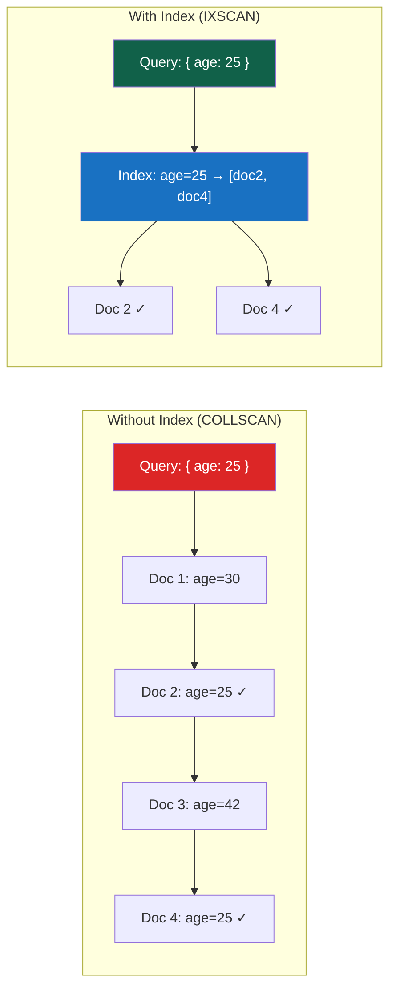

# Indexes

> [!abstract] TL;DR
> MongoDB indexes are **B-tree structures** (WiredTiger) that allow the engine to find documents without scanning the entire collection. A missing index on a frequently-queried field is the #1 MongoDB performance problem. Master the index types (single, compound, multikey, text, partial, TTL, wildcard, geospatial), the **ESR rule** for compound index field order, covered queries, and how to read `explain("executionStats")` to verify index use.

## How MongoDB Indexes Work



- Without an index: MongoDB does a **collection scan** (COLLSCAN) — reads every document
- With an index: MongoDB does an **index scan** (IXSCAN) — walks the B-tree to matching pointers, then fetches only matching documents
- Each collection automatically has an index on `_id`

---

## Creating and Managing Indexes

```javascript
// Create a single-field index (1 = ascending, -1 = descending)
db.users.createIndex({ email: 1 })
db.users.createIndex({ createdAt: -1 })  // descending for "most recent first" queries

// Compound index
db.orders.createIndex({ customerId: 1, status: 1, createdAt: -1 })

// List all indexes on a collection
db.users.getIndexes()

// Drop an index by name
db.users.dropIndex("email_1")

// Drop by spec
db.users.dropIndex({ email: 1 })

// Drop all indexes (except _id)
db.users.dropIndexes()
```

---

## Index Types

### 1. Unique Index

```javascript
// Enforce uniqueness — insert/update throws duplicate key error if violated
db.users.createIndex({ email: 1 }, { unique: true })

// Unique compound — combination must be unique (individual fields can repeat)
db.sessions.createIndex({ userId: 1, deviceId: 1 }, { unique: true })
```

### 2. Sparse Index

```javascript
// Only indexes documents WHERE the field exists (skips documents without the field)
// Perfect for optional fields present in a minority of documents
db.users.createIndex({ phoneNumber: 1 }, { sparse: true })

// Without sparse: a unique index on an optional field would reject multiple null-field docs
// With sparse: null/missing docs are not indexed at all
db.users.createIndex({ premiumExpiry: 1 }, { sparse: true, unique: true })
```

### 3. Partial Index

More powerful than sparse — indexes only documents matching a filter condition:

```javascript
// Index only active users — queries that don't filter on status won't use this index
db.users.createIndex(
  { email: 1 },
  { partialFilterExpression: { status: "active" } }
)

// Only index orders over $100 — great for "show high-value orders" dashboards
db.orders.createIndex(
  { customerId: 1, createdAt: -1 },
  { partialFilterExpression: { total: { $gt: 100 } } }
)

// Partial unique: email unique only among active users
db.users.createIndex(
  { email: 1 },
  { unique: true, partialFilterExpression: { status: "active" } }
)
```

> [!tip] Partial vs Sparse
> Prefer **partial indexes** over sparse. Sparse is a special case (partialFilterExpression: `{ field: { $exists: true } }`). Partial indexes give you more control, better documentation of intent, and smaller, faster indexes.

### 4. TTL Index (Time-To-Live)

Automatically deletes documents after a specified time — runs a background thread every 60 seconds:

```javascript
// Delete sessions 24 hours after their createdAt timestamp
db.sessions.createIndex({ createdAt: 1 }, { expireAfterSeconds: 86400 })

// Delete documents at a specific expiry field value (must be a Date field)
// expireAfterSeconds: 0 means "delete at exactly the date stored in the field"
db.scheduledJobs.createIndex({ runAt: 1 }, { expireAfterSeconds: 0 })
// This deletes documents when runAt < now

// NOTES:
// - TTL only works on Date fields (or arrays of Date)
// - TTL only works on single-field indexes (not compound)
// - Deletion happens every ~60 seconds — not instant
// - On sharded collections, the balancer must run on each shard's primary
```

### 5. Text Index

```javascript
// Single text index per collection
db.articles.createIndex({ title: "text", body: "text" })

// With field weights (title matches count more than body)
db.articles.createIndex(
  { title: "text", body: "text", tags: "text" },
  { weights: { title: 10, tags: 5, body: 1 }, default_language: "english" }
)

// Wildcard text index — index all string fields
db.articles.createIndex({ "$**": "text" })

// Query with $text
db.articles.find({ $text: { $search: "mongodb performance" } })
```

### 6. Wildcard Index

Useful for polymorphic collections or unknown field names:

```javascript
// Index ALL fields in the document
db.products.createIndex({ "$**": 1 })

// Index all fields under a specific subdocument
db.products.createIndex({ "specs.$**": 1 })

// Index specific fields using wildcardProjection
db.events.createIndex(
  { "$**": 1 },
  { wildcardProjection: { "payload.timestamp": 1, "payload.userId": 1 } }
)
```

### 7. Geospatial Indexes

```javascript
// 2dsphere — for GeoJSON (longitude, latitude) — recommended for earth-surface queries
db.places.createIndex({ location: "2dsphere" })

// GeoJSON point format: [longitude, latitude] (NOT latitude, longitude!)
db.places.insertOne({
  name: "Central Park",
  location: { type: "Point", coordinates: [-73.9654, 40.7829] }  // [lng, lat]
})

// Find places within 1km of a point
db.places.find({
  location: {
    $near: {
      $geometry: { type: "Point", coordinates: [-73.9654, 40.7829] },
      $maxDistance: 1000  // meters
    }
  }
})

// Find places within a polygon
db.places.find({
  location: {
    $geoWithin: {
      $geometry: {
        type: "Polygon",
        coordinates: [[[-74, 40.7], [-73.9, 40.7], [-73.9, 40.8], [-74, 40.8], [-74, 40.7]]]
      }
    }
  }
})

// 2d — for flat plane coordinates (legacy, not earth-surface)
db.gameMap.createIndex({ position: "2d" })
```

### 8. Hashed Index

```javascript
// Used as shard key for even distribution of monotonically increasing fields
db.events.createIndex({ _id: "hashed" })
sh.shardCollection("mydb.events", { _id: "hashed" })

// NOTE: Hashed indexes only support equality queries — no range queries on hashed field
```

---

## Compound Index Design: The ESR Rule

For compound indexes, field order matters enormously. Follow the **ESR rule**:

```
E → Equality fields FIRST
S → Sort fields SECOND
R → Range fields LAST
```

```javascript
// Query: find active users named "Alice", sorted by createdAt, where age > 25
db.users.find({ status: "active", name: "Alice", age: { $gt: 25 } })
         .sort({ createdAt: -1 })

// ESR compound index:
db.users.createIndex({
  status: 1,      // E — equality (exact match)
  name: 1,        // E — equality
  createdAt: -1,  // S — sort
  age: 1          // R — range ($gt)
})

// Why this order?
// 1. Equality fields narrow the result set most efficiently (high selectivity first)
// 2. Sort field second means the B-tree already has results in sorted order — no in-memory sort
// 3. Range field last — range can still use the index but doesn't help subsequent fields
```

**Prefix rule for compound indexes:**

A compound index on `{ a: 1, b: 1, c: 1 }` can answer queries on:
- `{ a: 1 }` ✓ (prefix)
- `{ a: 1, b: 1 }` ✓ (prefix)
- `{ a: 1, b: 1, c: 1 }` ✓ (full index)
- `{ b: 1 }` ✗ (not a prefix — won't use the index)
- `{ a: 1, c: 1 }` — partial (can use `a` but not `c` in the B-tree scan)

---

## Covered Queries

A **covered query** is satisfied entirely from the index — MongoDB never reads the actual documents. This is the fastest possible query.

```javascript
// Index: { email: 1, name: 1, role: 1 }
db.users.createIndex({ email: 1, name: 1, role: 1 })

// Covered query — filter and projection BOTH within the index
db.users.find(
  { email: "alice@example.com" },       // filter on indexed field
  { _id: 0, email: 1, name: 1, role: 1 }  // project only indexed fields + exclude _id
)
// EXPLAIN shows: totalDocsExamined: 0 — never touched the documents!
```

Requirements for a covered query:
1. All fields in the filter are in the index
2. All fields in the projection are in the index  
3. `_id: 0` must be explicitly excluded (or `_id` must be in the index) if `_id` is not needed

---

## Reading EXPLAIN Output

```javascript
// Three verbosity levels
db.orders.find({ status: "shipped" }).explain()                // queryPlanner
db.orders.find({ status: "shipped" }).explain("executionStats") // actual execution metrics
db.orders.find({ status: "shipped" }).explain("allPlansExecution") // all considered plans
```

**Key fields in `executionStats`:**

```json
{
  "executionStats": {
    "nReturned": 42,              // documents actually returned
    "totalKeysExamined": 42,      // index entries scanned — should ≈ nReturned
    "totalDocsExamined": 42,      // documents fetched — 0 = covered query
    "executionTimeMillis": 2
  },
  "queryPlanner": {
    "winningPlan": {
      "stage": "FETCH",           // FETCH = read doc from collection
      "inputStage": {
        "stage": "IXSCAN",        // IXSCAN = index scan (good!)
        "indexName": "status_1"
      }
    }
  }
}
```

**Diagnosis table:**

| Stage Seen | Meaning | Action |
|---|---|---|
| `COLLSCAN` | Full collection scan | Add an index on the filter field |
| `IXSCAN` | Index scan | Good — check ratio |
| `FETCH` after `IXSCAN` | Index used, then doc fetched | OK unless totalDocsExamined >> nReturned |
| `SORT` | In-memory sort | Add sort field to index (ESR rule) |
| `SORT_MERGE` | Multiple indexes merged | Usually suboptimal; prefer one compound index |

**Efficiency ratio:**
- `totalKeysExamined / nReturned` — ideally 1.0; high ratio means low index selectivity
- `totalDocsExamined / nReturned` — ideally 1.0; 0 means covered query

---

## Index Intersection

MongoDB can combine two indexes to answer a query, but this is usually less efficient than a well-designed compound index:

```javascript
// Two separate indexes
db.orders.createIndex({ status: 1 })
db.orders.createIndex({ createdAt: -1 })

// MongoDB MAY intersect these indexes for:
db.orders.find({ status: "shipped", createdAt: { $gt: ISODate("2026-01-01") } })
// But a compound index { status: 1, createdAt: -1 } is almost always faster
```

---

## Hidden Indexes (Safe Drop Testing)

Before dropping an index in production, **hide it** — queries won't use it but the index is maintained:

```javascript
// Hide an index (queries ignore it, but it's still updated on writes)
db.users.hideIndex("email_1")

// Check if performance degrades without the index (monitor for a period)
// If no degradation, drop it safely
db.users.dropIndex("email_1")

// If performance degrades, unhide it immediately
db.users.unhideIndex("email_1")
```

---

## Index Build Operations

```javascript
// Background index build (MongoDB 4.2+: all builds are non-blocking by default in newer versions)
db.orders.createIndex({ customerId: 1 }, { background: true })  // deprecated in 4.2+

// In MongoDB 4.2+: index builds use a hybrid approach — non-blocking by default
// Monitor index build progress
db.adminCommand({ currentOp: true, $or: [{ op: "command" }] })

// Create index with a name
db.users.createIndex({ email: 1 }, { name: "email_unique_idx", unique: true })
```

---

## Common Pitfalls

1. **COLLSCAN on a large collection.** If `COLLSCAN` appears in explain for any query on a multi-million document collection, it's urgent. Add an index.
2. **ESR rule violated.** Putting a range field before a sort field in a compound index means MongoDB needs an in-memory sort — you see `SORT` stage in explain.
3. **Too many indexes.** Every index slows down writes and uses RAM. Index the queries you actually run, not "all the fields."
4. **Using a text index for prefix searches.** Text indexes use stemming/tokenization — they're for full-text relevance, not `LIKE 'foo%'` prefix queries. For prefix searches, use a regular index with a `/^prefix/i` regex.
5. **Not using sparse/partial indexes for optional fields.** A regular unique index on an optional field will fail when two documents lack that field (`null` counts as a key).
6. **TTL not deleting fast enough.** TTL runs every ~60 seconds. For high-frequency inserts, deletes may lag behind inserts. TTL is not a real-time mechanism.

---

## Review Questions

1. Explain the ESR rule for compound index design. Given a query `find({ country: "US", age: { $gt: 18 } }).sort({ createdAt: -1 })`, design the optimal compound index and explain why each field is in that position.
2. What is a covered query? Write a compound index definition and a query + projection that would produce a covered query (verify with explain output).
3. When should you use a partial index instead of a regular index? Give a concrete example where a partial index is both correct and significantly smaller than a full index.

#MongoDB #NoSQL #Indexes #EXPLAIN #CompoundIndex #TTL #Performance
