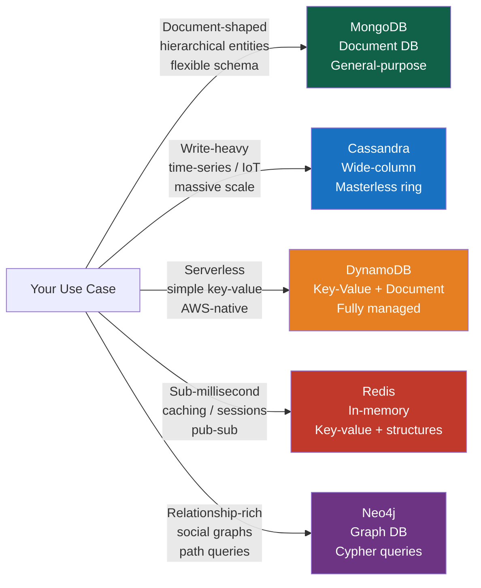
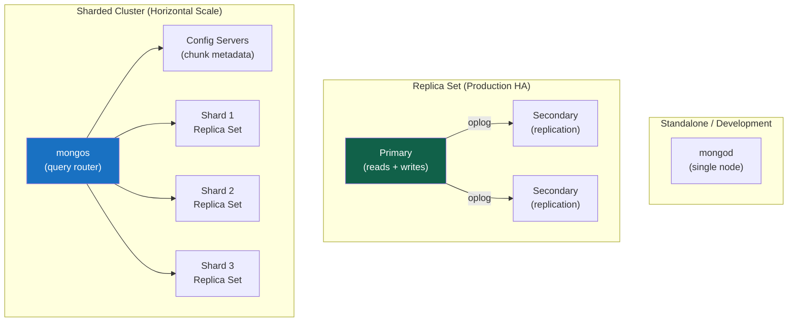

# MongoDB Overview

> [!abstract] TL;DR
> MongoDB is a general-purpose **document database** that stores data as flexible JSON/BSON documents rather than rigid rows and columns. The core value proposition: your application's objects map directly to documents — no ORM impedance mismatch, no joins for typical access patterns, and horizontal scale-out baked in via sharding. Understand when its document model is a genuine fit versus when you actually need PostgreSQL.

## What Is a Document Database?

A relational database stores a single entity (an e-commerce order) **shredded** across multiple tables: `orders`, `order_items`, `customers`, `products`. To reconstruct one order you join four tables. Every single read.

MongoDB stores the same entity as **one self-contained document**:

```json
{
  "_id": ObjectId("64f0a1b2c3d4e5f6a7b8c9d0"),
  "customer": { "id": "u-001", "name": "Ada Lovelace", "tier": "gold" },
  "items": [
    { "sku": "W-100", "name": "Widget Pro", "qty": 2, "price": 19.99 },
    { "sku": "G-250", "name": "Gadget Plus", "qty": 1, "price": 42.00 }
  ],
  "shippingAddress": { "street": "123 Babbage Ln", "city": "London", "zip": "EC1A 1BB" },
  "status": "shipped",
  "placedAt": ISODate("2026-07-10T09:15:00Z"),
  "total": 81.98
}
```

One document fetch. No joins.

---

## MongoDB vs Relational Database

| Dimension | MongoDB (Document) | PostgreSQL / MySQL (Relational) |
|---|---|---|
| Storage unit | Document (JSON/BSON) | Row (fixed columns) |
| Schema | Flexible (optional validation) | Enforced at DDL |
| Relationships | Embedding or `$lookup` (optional join) | Mandatory joins via FK |
| Horizontal scale | Built-in sharding | Add-on / complex |
| ACID transactions | Single-doc always; multi-doc since 4.0 | Full multi-row, multi-table |
| Ad-hoc queries | Aggregation pipeline | SQL — mature, expressive |
| Full-text search | Text indexes + Atlas Search | `tsvector` + pg_search / Elasticsearch |
| JSON support | Native BSON | JSONB column (PostgreSQL) |
| Best fit | Document-shaped hierarchical data | Relational, normalized, join-heavy data |

> [!tip] The JSONB Question
> Before adopting MongoDB "for flexibility," ask: does PostgreSQL's **JSONB** column ([[Advanced_SQL_and_JSON]]) meet your needs? You keep joins, FK constraints, and full ACID for the structured majority, with a flexible JSON column for the variable minority. Many "we need MongoDB" cases are really "we need one flexible column."

---

## MongoDB vs Other NoSQL Databases



| Database | Model | Write Scale | Consistency | Best For |
|---|---|---|---|---|
| **MongoDB** | Document | Sharded | Tunable (RC/WC) | Hierarchical data, flexible schema, rich queries |
| **Cassandra** | Wide-column | Masterless ring | Eventual (tunable) | Write-heavy time-series, IoT, huge scale |
| **DynamoDB** | Key-value + doc | Auto-scaled | Eventually / strongly | Serverless, single-table access patterns, AWS |
| **Redis** | In-memory KV | Single node / cluster | Strong (AOF/RDB) | Sub-ms cache, sessions, pub-sub, leaderboards |
| **Elasticsearch** | Inverted index | Sharded | Near-real-time | Full-text search, log analytics, APM |

---

## MongoDB Use Cases

**Strong fit:**
- **Content management systems** — articles, blog posts, products with varying attributes
- **User profiles** — semi-structured, per-user fields, preference objects
- **Product catalogs** — electronics have different fields than clothing; polymorphic schema
- **IoT event streams** — high-volume inserts, document per event, TTL indexes for auto-expiry
- **Real-time analytics dashboards** — aggregation pipeline + materialized views via `$merge`
- **Mobile app backends** — Atlas App Services for offline sync
- **Gaming leaderboards and player state** — document per player, embedded inventory

**Weak fit (consider alternatives):**
- **Financial ledgers** — strong relational integrity, multi-table ACID preferred (PostgreSQL)
- **Complex reporting with ad-hoc joins** — analytical SQL over columnar store
- **Graph traversals** — friend-of-friend queries (Neo4j / Amazon Neptune)
- **Simple key-lookup caching** — Redis is orders of magnitude faster

---

## MongoDB Architecture Overview



---

## MongoDB Atlas (Cloud-Managed)

**MongoDB Atlas** is the official fully-managed cloud database service. It runs on AWS, GCP, and Azure.

Key Atlas capabilities beyond vanilla MongoDB:
- **Atlas Search** — full-text search powered by Apache Lucene, queried via `$search` aggregation stage
- **Atlas Vector Search** — ANN (approximate nearest neighbor) search for AI embeddings (`$vectorSearch`)
- **Atlas Stream Processing** — real-time event processing with Atlas source/sink connectors
- **Atlas Data Federation** — query across Atlas clusters, S3, and Atlas Data Lake with standard MQL
- **Atlas Charts** — built-in dashboards and visualizations on your data
- **Atlas App Services** — serverless functions, database triggers, device sync (mobile/offline)
- **Performance Advisor** — automatic slow-query detection and index recommendations
- **Continuous Cloud Backup** — point-in-time restore with per-second granularity

**Cluster tiers:**
- `M0` — Free tier (512 MB, shared, dev/testing only)
- `M2/M5` — Shared clusters (~2–5 GB)
- `M10+` — Dedicated clusters (production, starting at M10)

---

## MongoDB 7.x Features (2023–2026)

| Feature | Version | What It Does |
|---|---|---|
| Compound wildcard indexes | 7.0 | Index multiple fields with wildcard in one index definition |
| `$percentile` / `$median` | 7.0 | Native percentile accumulator in aggregation |
| Atlas Vector Search GA | 7.0+ | Production-grade ANN search for embeddings |
| Multi-document transactions (sharded) | 4.2+ (mature in 7.x) | Full ACID across shards, improved performance |
| `$search` improvements | 7.x | Hybrid search (vector + keyword) in one pipeline |
| Queryable Encryption GA | 6.0 | Encrypt individual fields; query on encrypted data |
| Time-series collections native | 5.0+ | Optimized storage and querying for time-series workloads |
| Clustered collections | 5.3+ | Store documents sorted by `_id` — eliminates index for ordered _id queries |

---

## Self-Hosted vs Atlas Decision

| Factor | Self-Hosted | Atlas |
|---|---|---|
| Cost at small scale | Lower (infra cost only) | M0 free tier available |
| Ops burden | You manage upgrades, backups, scaling | Fully managed |
| Compliance / data sovereignty | Full control | Atlas Private Endpoints + VPC peering |
| Feature availability | GA features only | Previews + Atlas-only features (Search, Vector Search, Stream Processing) |
| Kubernetes | MongoDB Kubernetes Operator | Atlas Operator for Kubernetes |

---

## Common Pitfalls

1. **Using MongoDB because "JSON is easy," not because the data model fits.** If your data is inherently relational with many-to-many joins and cross-entity constraints, you're fighting the document model. Evaluate PostgreSQL first.
2. **Ignoring schema design.** "Schemaless" means MongoDB won't reject bad data — it does not mean you skip design. A poorly designed schema is harder to fix in production than in a relational DB with strict DDL.
3. **Defaulting to MongoDB Atlas M0 for production.** M0 is shared-tenant, resource-limited, and has no SLA. Use M10+ for production.
4. **Assuming Atlas = slower MongoDB.** Atlas runs the same mongod; Atlas Search runs a Lucene process alongside. Performance is infrastructure-equivalent to self-hosted.

---

## Review Questions

1. Name three types of applications where MongoDB's document model provides a genuine advantage over a relational database, and explain *why* for each.
2. A team is deciding between MongoDB and Cassandra for an IoT sensor data platform expecting 500K writes/second. What questions would you ask to guide the decision?
3. What is the difference between MongoDB Atlas and a self-hosted MongoDB deployment? List two Atlas features unavailable in vanilla MongoDB.

#MongoDB #NoSQL #Database #DocumentDatabase #Atlas
