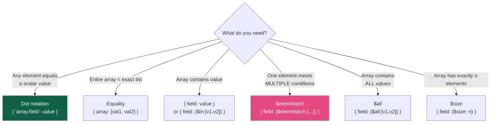

# Query Operators

> [!abstract] TL;DR
> MongoDB Query Language (MQL) provides a rich set of operators for filtering documents. They divide into: **comparison** (`$eq`/`$ne`/`$gt`/`$lt`/`$in`/`$nin`), **logical** (`$and`/`$or`/`$nor`/`$not`), **element** (`$exists`/`$type`), **array** (`$all`/`$elemMatch`/`$size`), **evaluation** (`$regex`/`$expr`/`$where`), and **projection** (`$`/`$elemMatch`/`$slice`). Master `$elemMatch` for array-of-objects queries and `$expr` for cross-field comparisons.

## Query Structure

Every MongoDB query takes a **filter document** — a BSON object where each key is a field name and each value is either a literal (equality) or an operator expression:

```javascript
// Implicit equality
db.collection.find({ status: "active" })

// Explicit equality with $eq
db.collection.find({ status: { $eq: "active" } })

// Multiple conditions — implicit AND at the same level
db.collection.find({ status: "active", age: { $gte: 18 } })
```

---

## Comparison Operators

| Operator | Meaning | Example |
|---|---|---|
| `$eq` | Equal | `{ price: { $eq: 29.99 } }` |
| `$ne` | Not equal | `{ status: { $ne: "deleted" } }` |
| `$gt` | Greater than | `{ age: { $gt: 18 } }` |
| `$gte` | Greater than or equal | `{ score: { $gte: 90 } }` |
| `$lt` | Less than | `{ price: { $lt: 100 } }` |
| `$lte` | Less than or equal | `{ createdAt: { $lte: ISODate("2026-01-01") } }` |
| `$in` | In array of values | `{ status: { $in: ["active", "pending"] } }` |
| `$nin` | Not in array of values | `{ role: { $nin: ["banned", "deleted"] } }` |

```javascript
// $in with range — equivalent to SQL: status IN ('active', 'trial')
db.users.find({ plan: { $in: ["free", "trial", "basic"] } })

// Range query: 18 <= age < 65
db.users.find({ age: { $gte: 18, $lt: 65 } })

// Date range
db.orders.find({
  createdAt: {
    $gte: ISODate("2026-07-01T00:00:00Z"),
    $lt:  ISODate("2026-08-01T00:00:00Z")
  }
})
```

---

## Logical Operators

| Operator | Meaning | Notes |
|---|---|---|
| `$and` | All conditions must match | Implicit at same level; explicit needed when reusing same field |
| `$or` | At least one condition must match | Cannot use index on both branches unless both fields are indexed |
| `$nor` | No condition must match | NOT (A OR B) |
| `$not` | Negates an operator expression | Applied to a single field operator |

```javascript
// Implicit AND — most common form
db.products.find({ category: "electronics", price: { $lt: 500 } })

// Explicit $and — needed when specifying two conditions on the same field
db.products.find({
  $and: [
    { price: { $gt: 10 } },
    { price: { $lt: 100 } }   // can't write { price: { $gt: 10, $lt: 100 } } with two separate conditions
  ]
})
// Actually the above CAN be combined: { price: { $gt: 10, $lt: 100 } }
// Explicit $and is needed when using $or twice on different paths, e.g.:
db.collection.find({
  $and: [
    { $or: [{ status: "A" }, { status: "B" }] },
    { $or: [{ qty: { $lt: 30 } }, { qty: { $gt: 100 } }] }
  ]
})

// $or — either condition
db.users.find({
  $or: [
    { role: "admin" },
    { permissions: { $in: ["write", "publish"] } }
  ]
})

// $nor — documents matching neither condition
db.users.find({
  $nor: [
    { status: "banned" },
    { role: "guest" }
  ]
})

// $not — negate an operator expression (cannot negate literal equality)
db.products.find({ price: { $not: { $gt: 100 } } })   // price <= 100 OR price doesn't exist
// Note: $not does NOT use indexes as efficiently as $lt — prefer { price: { $lte: 100 } }
```

---

## Element Operators

```javascript
// $exists — check if a field exists (true) or doesn't exist (false)
db.users.find({ premiumExpiry: { $exists: true } })   // has the field (even if null)
db.users.find({ phoneNumber: { $exists: false } })    // field is completely absent

// $exists: true with $ne: null — field exists AND is not null
db.users.find({ premiumExpiry: { $exists: true, $ne: null } })

// $type — match by BSON type
db.collection.find({ price: { $type: "number" } })       // any numeric type
db.collection.find({ createdAt: { $type: "date" } })     // Date type
db.collection.find({ value: { $type: ["int", "long"] } }) // int OR long (multiple types)
db.collection.find({ _id: { $type: "objectId" } })

// $type with numeric BSON type codes (alternative)
// 1=double, 2=string, 3=object, 4=array, 5=bindata, 7=objectid,
// 8=bool, 9=date, 10=null, 11=regex, 16=int, 18=long, 19=decimal
db.collection.find({ price: { $type: 1 } })  // type 1 = double
```

---

## Array Operators

MongoDB can query **inside arrays** — this is one of its key superpowers over relational DBs.

```javascript
// Simple array equality — matches if array is EXACTLY this (same elements, same order)
db.products.find({ tags: ["mongodb", "nosql"] })   // rarely what you want

// Check if array CONTAINS a value (element match)
db.products.find({ tags: "mongodb" })   // contains "mongodb" anywhere in tags array
db.products.find({ tags: { $in: ["mongodb", "nosql"] } })   // contains any of these

// $all — array must contain ALL specified values (regardless of order/other elements)
db.products.find({ tags: { $all: ["mongodb", "nosql"] } })

// $size — array has exactly n elements
db.products.find({ tags: { $size: 3 } })   // NOTE: cannot use $gt/$lt with $size
// For "more than n elements" use:
db.products.find({ "tags.3": { $exists: true } })  // element at index 3 exists → size > 3

// $elemMatch — match documents where AT LEAST ONE array element matches ALL conditions
// Critical for arrays of objects
db.students.find({
  grades: { $elemMatch: { subject: "Math", score: { $gte: 90 } } }
})
// Without $elemMatch — this would match if ANY element has subject:"Math" AND ANY element has score>=90
// They don't have to be the same element!
db.students.find({ "grades.subject": "Math", "grades.score": { $gte: 90 } })  // WRONG for cross-element
```

**The `$elemMatch` trap:**

```javascript
// Sample data
{ scores: [{ subject: "Math", score: 85 }, { subject: "English", score: 92 }] }

// This INCORRECTLY matches the above — Math is present AND some score is >= 90 (English's 92)
db.students.find({ "grades.subject": "Math", "grades.score": { $gte: 90 } })  // matches!

// This CORRECTLY requires SAME element to have both conditions
db.students.find({ grades: { $elemMatch: { subject: "Math", score: { $gte: 90 } } } })  // doesn't match
```

---

## Evaluation Operators

### `$regex` — Pattern Matching

```javascript
// Case-insensitive search for "mongo" anywhere in name
db.products.find({ name: { $regex: /mongo/i } })
db.products.find({ name: { $regex: "mongo", $options: "i" } })

// Options: i=case-insensitive, m=multiline, x=extended, s=dotall
db.articles.find({ title: { $regex: "^MongoDB", $options: "i" } })  // starts with MongoDB

// For full-text search, prefer text indexes or Atlas Search — $regex doesn't use indexes well
// (only uses index for anchored prefix patterns: /^prefix/)
```

### `$expr` — Cross-Field Comparisons

`$expr` lets you use aggregation expressions within a query filter, including comparing two fields in the same document:

```javascript
// Find documents where the discount is more than 30% of the original price
db.products.find({
  $expr: { $gt: ["$discount", { $multiply: ["$price", 0.3] }] }
})

// Find orders where actual delivery was later than estimated
db.orders.find({
  $expr: { $gt: ["$deliveredAt", "$estimatedDelivery"] }
})

// Combine $expr with other operators
db.orders.find({
  status: "delivered",
  $expr: { $gte: ["$total", 100] }   // same as { total: { $gte: 100 } } but useful in complex expressions
})

// $expr with $cond for computed field comparison
db.inventory.find({
  $expr: {
    $lt: [
      "$currentStock",
      { $multiply: ["$reorderThreshold", 1.5] }   // reorder when below 1.5x threshold
    ]
  }
})
```

### `$where` — JavaScript Evaluation (Avoid)

```javascript
// $where executes JavaScript on the server — AVOID in production
// Security risk, very slow (no index use), runs in a separate JS engine
db.orders.find({ $where: "this.total > this.budget" })  // DO NOT USE

// Always prefer $expr for cross-field comparisons
db.orders.find({ $expr: { $gt: ["$total", "$budget"] } })  // BETTER
```

### `$text` — Full-Text Search

```javascript
// Requires a text index: db.articles.createIndex({ title: "text", body: "text" })
db.articles.find({
  $text: { $search: "mongodb performance", $caseSensitive: false }
})

// Score-based relevance sorting
db.articles.find(
  { $text: { $search: "mongodb" } },
  { score: { $meta: "textScore" } }          // project the score
).sort({ score: { $meta: "textScore" } })    // sort by relevance

// Exact phrase with quotes, exclude with minus
db.articles.find({ $text: { $search: "\"replica set\" -sharding" } })
```

---

## Querying Embedded Documents

```javascript
// Exact match on embedded document (entire sub-doc must match, including field order)
db.users.find({ address: { city: "London", zip: "EC1A" } })  // must be EXACT object

// Dot notation — match on a specific nested field (preferred)
db.users.find({ "address.city": "London" })
db.users.find({ "address.city": "London", "address.country": "UK" })

// Multiple levels of nesting
db.orders.find({ "shipping.address.city": "New York" })

// Dot notation in projection
db.users.find({}, { "address.city": 1, name: 1 })
```

---

## Projection Operators

```javascript
// $ positional — project only the FIRST matching array element
// Requires the field to appear in the filter
db.students.find(
  { grades: { $elemMatch: { subject: "Math" } } },
  { "grades.$": 1 }   // returns only the first matching grade
)

// $elemMatch in projection — project only elements matching condition
// Does NOT require the field in the filter
db.students.find(
  { name: "Alice" },
  { grades: { $elemMatch: { score: { $gte: 90 } } } }   // only high-scoring grades
)

// $slice — return subset of array elements
db.articles.find({}, { comments: { $slice: 5 } })          // first 5 comments
db.articles.find({}, { comments: { $slice: -3 } })         // last 3 comments
db.articles.find({}, { comments: { $slice: [10, 5] } })    // skip 10, take 5
```

---

## Querying Arrays of Objects — The Full Picture



---

## Common Pitfalls

1. **Forgetting `$elemMatch` for array-of-objects.** Using dot notation for multiple conditions on array objects checks conditions across different elements, not the same one. This is the #1 MongoDB query bug.
2. **Using `$not` on literal values.** `$not` negates an operator expression, not a value. `{ status: { $not: "active" } }` is INVALID — use `{ status: { $ne: "active" } }` instead.
3. **`$regex` on large collections without an index.** Regex queries (except anchored `/^prefix/`) do full collection scans. For full-text search, use a text index or Atlas Search.
4. **`$where` in production.** It executes JavaScript server-side: security vulnerability (code injection risk), no index use, high CPU. Always use `$expr` for cross-field comparisons.
5. **Exact embedded document matching.** `{ address: { city: "London" } }` requires the `address` sub-document to be EXACTLY `{ city: "London" }` — no other fields. Use dot notation `{ "address.city": "London" }` to match on just that field.
6. **`$size` with comparisons.** `{ array: { $size: { $gt: 3 } } }` is INVALID. Use `{ "array.3": { $exists: true } }` as a workaround for "size greater than 3."

---

## Review Questions

1. Given a `students` collection where each document has a `grades` array of `{ subject, score }` objects, write a query that finds all students who have a Math score of 90 or above. Explain why dot notation alone would give incorrect results.
2. What is the difference between `$in` and `$all` when applied to an array field? Give an example where each is the correct choice.
3. When should you use `$expr` instead of a standard comparison operator? Give two examples of queries that require `$expr`.

#MongoDB #NoSQL #QueryOperators #MQL #elemMatch #expr
