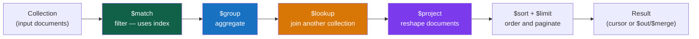

# Aggregation Pipeline

> [!abstract] TL;DR
> The MongoDB **aggregation pipeline** is a sequence of stages that transforms a stream of documents — the NoSQL equivalent of `SELECT … WHERE … GROUP BY … JOIN … ORDER BY`. Each stage receives documents from the previous and passes results to the next. Key stages: `$match` (filter early!), `$group` (aggregate), `$lookup` (join), `$unwind` (flatten arrays), `$project` (reshape), `$facet` (parallel sub-pipelines). The pipeline can be materialized to a collection with `$out`/`$merge`.

## Pipeline Concept



```javascript
// Basic pipeline structure
db.collection.aggregate([
  { $stage1: { /* options */ } },
  { $stage2: { /* options */ } },
  // ...
], {
  allowDiskUse: true,     // allow stages that exceed 100 MB memory limit to spill to disk
  maxTimeMS: 30000,       // timeout
  hint: { field: 1 }     // force index for $match stage
})
```

---

## `$match` — Filter (Put It First!)

`$match` filters the document stream. **Put it as early as possible** — it can use indexes (the only stage that can) and reduces the work for all subsequent stages.

```javascript
// $match uses the same syntax as find() filters
db.orders.aggregate([
  {
    $match: {
      status: { $in: ["shipped", "delivered"] },
      createdAt: { $gte: ISODate("2026-01-01") },
      total: { $gt: 50 }
    }
  }
])

// Multiple $match stages are valid — MongoDB may merge them automatically
db.orders.aggregate([
  { $match: { status: "active" } },           // uses index
  // ... other stages ...
  { $match: { "computed.field": { $gt: 5 } } } // after computed stage
])
```

---

## `$group` — Aggregate

`$group` groups documents by `_id` and applies accumulator operators:

```javascript
db.orders.aggregate([
  { $match: { status: "delivered" } },
  {
    $group: {
      _id: "$customer.tier",           // group key — null groups ALL docs together
      totalRevenue: { $sum: "$total" },
      orderCount:   { $sum: 1 },       // count documents
      avgOrder:     { $avg: "$total" },
      maxOrder:     { $max: "$total" },
      minOrder:     { $min: "$total" },
      firstOrder:   { $first: "$createdAt" },  // first doc in group (depends on sort)
      lastOrder:    { $last: "$createdAt" },
      allStatuses:  { $push: "$status" },      // array of all values
      uniqueSkus:   { $addToSet: "$sku" }      // array of unique values
    }
  },
  { $sort: { totalRevenue: -1 } }
])

// Count total documents: _id: null groups everything
db.orders.aggregate([
  { $group: { _id: null, total: { $sum: 1 } } }
])

// $count stage (shorthand for $group + project)
db.orders.aggregate([
  { $match: { status: "pending" } },
  { $count: "pendingOrders" }            // output: { pendingOrders: 42 }
])
```

**Accumulator Reference:**

| Accumulator | Description |
|---|---|
| `$sum` | Sum of numeric values; `$sum: 1` counts documents |
| `$avg` | Average of numeric values |
| `$min` / `$max` | Min/max value |
| `$first` / `$last` | First/last document value (respect sort if any) |
| `$push` | Array of all values (may contain duplicates) |
| `$addToSet` | Array of unique values |
| `$count` | Count of documents in group (MongoDB 5.0+) |
| `$mergeObjects` | Merge multiple objects into one |
| `$percentile` | Array of percentile values (MongoDB 7.0+) |
| `$median` | Median value (MongoDB 7.0+) |

---

## `$project` — Reshape Documents

`$project` selects, renames, and computes new fields. Like `SELECT` in SQL.

```javascript
db.orders.aggregate([
  {
    $project: {
      // Include fields
      customerId: 1,
      status: 1,

      // Rename field
      orderDate: "$createdAt",

      // Computed field: discount percent
      discountPct: {
        $round: [
          { $multiply: [{ $divide: ["$discount", "$total"] }, 100] },
          2  // decimal places
        ]
      },

      // Conditional
      tier: {
        $cond: {
          if:   { $gte: ["$total", 1000] },
          then: "platinum",
          else: { $cond: { if: { $gte: ["$total", 100] }, then: "gold", else: "standard" } }
        }
      },

      // $switch for multiple branches
      statusLabel: {
        $switch: {
          branches: [
            { case: { $eq: ["$status", "pending"] },   then: "Awaiting Payment" },
            { case: { $eq: ["$status", "shipped"] },   then: "On the Way" },
            { case: { $eq: ["$status", "delivered"] }, then: "Completed" }
          ],
          default: "Unknown"
        }
      },

      // $ifNull — default value if field is null/missing
      region: { $ifNull: ["$region", "UNKNOWN"] },

      // String operations
      fullName: { $concat: ["$firstName", " ", "$lastName"] },
      upperName: { $toUpper: "$name" },

      // Array slice
      recentItems: { $slice: ["$items", -3] },  // last 3 items

      // Exclude _id
      _id: 0
    }
  }
])
```

### `$addFields` / `$set`

`$addFields` (alias: `$set`) adds fields to documents without removing existing ones — cleaner than a `$project` that must list every field to keep:

```javascript
db.orders.aggregate([
  {
    $addFields: {
      totalWithTax: { $multiply: ["$total", 1.1] },
      itemCount:    { $size: "$items" }
    }
  }
])
```

---

## `$lookup` — Join Another Collection

`$lookup` performs a **left outer join** — returns all documents from the left (source) collection, with matched documents from the right (foreign) collection embedded as an array.

```javascript
// Simple equality join (like SQL LEFT JOIN)
db.orders.aggregate([
  {
    $lookup: {
      from: "customers",           // foreign collection
      localField: "customerId",    // field in orders
      foreignField: "_id",         // field in customers
      as: "customer"               // output array field name
    }
  },
  // customer is an array — unwind if you expect exactly one match
  { $unwind: { path: "$customer", preserveNullAndEmpty: false } }
])

// Correlated sub-query with let + pipeline (more powerful)
db.orders.aggregate([
  {
    $lookup: {
      from: "inventory",
      let: { orderItems: "$items" },    // pass local fields to pipeline
      pipeline: [
        {
          $match: {
            $expr: {
              $in: ["$sku", "$$orderItems.sku"]  // $$var refers to let variable
            }
          }
        },
        { $project: { sku: 1, stock: 1, _id: 0 } }
      ],
      as: "inventoryStatus"
    }
  }
])
```

> [!warning] $lookup Performance
> `$lookup` is a server-side join — it's more expensive than an embedded document. The foreign field should be **indexed**. For high-traffic paths, denormalize with the Extended Reference pattern ([[Schema_Design_Patterns]]) instead of relying on `$lookup` at query time.

---

## `$unwind` — Flatten Arrays

`$unwind` deconstructs an array field into separate documents — one per array element:

```javascript
// Input: { _id: 1, items: ["a", "b", "c"] }
// After $unwind: three documents: { _id: 1, items: "a" }, { _id: 1, items: "b" }, { _id: 1, items: "c" }

db.orders.aggregate([
  { $unwind: "$items" },   // simple form
  {
    $group: {
      _id: "$items.sku",
      totalQty: { $sum: "$items.qty" }
    }
  }
])

// With options
db.orders.aggregate([
  {
    $unwind: {
      path: "$items",
      includeArrayIndex: "itemIndex",    // adds the 0-based array position
      preserveNullAndEmpty: true         // keep docs with null/missing/empty array (otherwise filtered out)
    }
  }
])
```

---

## `$facet` — Parallel Sub-Pipelines

`$facet` runs multiple independent pipeline branches on the same input, returning a single document with all results. Perfect for faceted search (category counts + price ranges + total count in one query):

```javascript
db.products.aggregate([
  { $match: { available: true } },
  {
    $facet: {
      // Branch 1: Count by category
      categoryBreakdown: [
        { $group: { _id: "$category", count: { $sum: 1 } } },
        { $sort: { count: -1 } }
      ],

      // Branch 2: Price distribution
      priceRanges: [
        {
          $bucket: {
            groupBy: "$price",
            boundaries: [0, 25, 50, 100, 500, Infinity],
            default: "Other",
            output: { count: { $sum: 1 }, avgPrice: { $avg: "$price" } }
          }
        }
      ],

      // Branch 3: Total count
      total: [
        { $count: "count" }
      ]
    }
  }
])
// Result: one document with { categoryBreakdown: [...], priceRanges: [...], total: [...] }
```

---

## `$bucket` and `$bucketAuto`

```javascript
// $bucket — explicit boundaries
db.products.aggregate([
  {
    $bucket: {
      groupBy: "$price",
      boundaries: [0, 10, 50, 100, 500],  // each bucket = [lower, upper)
      default: "Other",                    // bucket for values outside boundaries
      output: {
        count:    { $sum: 1 },
        products: { $push: "$name" }
      }
    }
  }
])

// $bucketAuto — automatically creates n evenly-distributed buckets
db.products.aggregate([
  {
    $bucketAuto: {
      groupBy: "$price",
      buckets: 5,             // number of buckets
      output: { count: { $sum: 1 }, avgPrice: { $avg: "$price" } },
      granularity: "R5"       // optional: Renard series for "nice" boundaries
    }
  }
])
```

---

## `$out` and `$merge` — Materialize Results

```javascript
// $out — write pipeline results to a collection (replaces entire collection)
db.orders.aggregate([
  { $match: { status: "delivered" } },
  { $group: { _id: "$customerId", totalSpent: { $sum: "$total" } } },
  { $out: "customerLifetimeValue" }   // overwrites the entire collection atomically
])

// $merge — more flexible: merge into existing collection
db.orders.aggregate([
  { $group: { _id: { year: { $year: "$createdAt" }, month: { $month: "$createdAt" } },
              revenue: { $sum: "$total" } } },
  {
    $merge: {
      into: "monthlyRevenue",
      on: "_id",
      whenMatched: "merge",     // update existing doc
      whenNotMatched: "insert"  // insert new doc
    }
  }
])
```

---

## System Variables

| Variable | Description |
|---|---|
| `$$ROOT` | The entire current document |
| `$$CURRENT` | The current field being processed |
| `$$NOW` | Current datetime (consistent within a pipeline) |
| `$$CLUSTER_TIME` | Cluster-wide timestamp (for replica sets) |
| `$$REMOVE` | Use in `$project` to conditionally exclude a field |
| `$$DESCEND` | Used in `$redact` for recursive descent |
| `$$KEEP` / `$$PRUNE` | Used in `$redact` for access control |

```javascript
// $$ROOT — embed the original document inside a group
db.orders.aggregate([
  { $sort: { total: -1 } },
  { $group: { _id: "$customerId", topOrder: { $first: "$$ROOT" } } }
])

// $$REMOVE — conditionally exclude a field
db.users.aggregate([
  {
    $project: {
      name: 1,
      // Only include ssn if user is requesting their own data
      ssn: { $cond: { if: "$isSelf", then: "$ssn", else: "$$REMOVE" } }
    }
  }
])
```

---

## Pipeline Optimization Tips

```javascript
// 1. Put $match first — it uses indexes and reduces document count
// BAD: { $group }, { $match }
// GOOD: { $match }, { $group }

// 2. Put $project early to reduce document size before expensive stages
db.orders.aggregate([
  { $match: { status: "active" } },
  { $project: { customerId: 1, total: 1 } },  // drop large fields early
  { $lookup: { from: "customers", ... } }
])

// 3. Use $limit before $lookup to reduce join input
db.orders.aggregate([
  { $match: { status: "pending" } },
  { $sort: { createdAt: -1 } },
  { $limit: 100 },          // only join the 100 most recent
  { $lookup: { from: "customers", ... } }
])

// 4. allowDiskUse for large pipelines (>100 MB in memory)
db.bigCollection.aggregate([...], { allowDiskUse: true })

// 5. Use indexes for $sort — index on the sort field prevents in-memory sort
db.orders.createIndex({ createdAt: -1 })  // then $sort: { createdAt: -1 } uses it
```

---

## Common Pitfalls

1. **`$match` after `$group`.** Post-group filtering can't use indexes. Put `$match` before `$group` to filter the raw collection with indexes, and add a second `$match` after `$group` only for post-aggregation filtering.
2. **`$unwind` on missing/null arrays.** By default, `$unwind` removes documents where the array field is null or absent. Use `preserveNullAndEmpty: true` if you need to keep them.
3. **`$lookup` without an index on the foreign field.** Each `$lookup` does a lookup per input document. Without an index on `foreignField`, it's a nested collection scan.
4. **`$out` accidentally deletes production data.** `$out` replaces the target collection atomically — if your pipeline has a bug (e.g., empty `$match`), it will overwrite the entire collection. Use `$merge` with `whenMatched: "merge"` for safer incremental updates.
5. **Not using `allowDiskUse` for large aggregations.** Pipelines exceeding 100 MB will fail without `allowDiskUse: true`.

---

## Review Questions

1. You need to compute total revenue by region, by month, for only "delivered" orders. Write the complete aggregation pipeline with appropriate stages in the correct order.
2. Explain why `$match` should always come before `$group`. What is the performance impact of reversing them?
3. What is `$facet` and when would you use it instead of multiple separate aggregation queries?

#MongoDB #NoSQL #Aggregation #Pipeline #match #group #lookup #unwind
