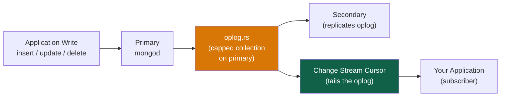

# Change Streams

> [!abstract] TL;DR
> **Change streams** let applications subscribe to real-time change events from a collection, database, or entire MongoDB deployment. They are built on the **oplog** (operations log) and require a **replica set** or sharded cluster. Change events carry the operation type, the affected document (full or delta), and a **resume token** — allowing your application to restart exactly where it left off after a crash. Change streams are MongoDB's native **CDC (Change Data Capture)** mechanism, used to feed downstream services, caches, search indexes, and event streams.

## How Change Streams Work



Change streams:
1. Tail the **oplog** on any member (primary or secondary)
2. Filter by collection, database, or deployment
3. Apply an aggregation pipeline for server-side filtering
4. Deliver change events to the subscriber

**Requirements:**
- Replica set or sharded cluster (standalone `mongod` does NOT support change streams)
- Read preference must allow reading from a member with a complete oplog
- The oplog must be large enough to not roll over during a subscriber restart

---

## Basic Usage

```javascript
// Watch a single collection
const collection = client.db("shop").collection("orders")
const changeStream = collection.watch()

// Process events
changeStream.on("change", (change) => {
  console.log("Change event:", JSON.stringify(change, null, 2))
})

// Or with async iteration
for await (const change of changeStream) {
  await processChange(change)
}

// Watch an entire database
const db = client.db("shop")
const dbChangeStream = db.watch()

// Watch entire deployment (all databases)
const deploymentChangeStream = client.watch()
```

---

## Change Event Document Structure

```json
{
  "_id": {
    "_data": "8264F2A1B2..."  // resume token — opaque identifier of this event's position
  },
  "operationType": "update",                    // insert | update | replace | delete | drop | rename | dropDatabase | invalidate
  "clusterTime": Timestamp(1690000000, 1),      // cluster-wide time
  "ns": {
    "db": "shop",
    "coll": "orders"
  },
  "documentKey": {
    "_id": ObjectId("64f0a1b2c3d4e5f6a7b8c9d0")  // _id of the affected document
  },
  "fullDocument": {                               // the full document AFTER the change (with fullDocument option)
    "_id": ObjectId("64f0a1b2c3d4e5f6a7b8c9d0"),
    "status": "shipped",
    "total": 99.99
  },
  "updateDescription": {                          // only for update events
    "updatedFields": { "status": "shipped", "shippedAt": ISODate("2026-07-29") },
    "removedFields": [],
    "truncatedArrays": []
  }
}
```

**Operation types:**

| `operationType` | Trigger |
|---|---|
| `insert` | New document inserted |
| `update` | Document updated with update operators (`$set`, etc.) |
| `replace` | Document replaced with `replaceOne` |
| `delete` | Document deleted |
| `drop` | Collection dropped |
| `rename` | Collection renamed |
| `dropDatabase` | Database dropped |
| `invalidate` | Change stream is no longer valid (after `drop`/`dropDatabase`) — must restart |

---

## `fullDocument` and `fullDocumentBeforeChange`

By default:
- For `insert` and `replace`: `fullDocument` contains the complete document
- For `update`: `fullDocument` is **not included** by default (only `updateDescription` delta)
- For `delete`: no `fullDocument` (document is gone)

```javascript
// Request the full document for ALL event types (additional lookup after each change)
const changeStream = collection.watch([], {
  fullDocument: "updateLookup"   // fetches the full post-update document
  // "default" — only insert/replace get fullDocument
  // "updateLookup" — all events get fullDocument (via lookup — may be slightly stale)
  // "whenAvailable" — return fullDocument when available, don't fail if not (MongoDB 6.0+)
  // "required" — fail if fullDocument is not available (MongoDB 6.0+)
})

// MongoDB 6.0+: fullDocumentBeforeChange — requires pre-image feature enabled on collection
db.createCollection("orders", {
  changeStreamPreAndPostImages: { enabled: true }
})

const changeStream = collection.watch([], {
  fullDocumentBeforeChange: "whenAvailable"  // the document BEFORE the change
})
// Now change events include both:
// change.fullDocument           → post-change state
// change.fullDocumentBeforeChange → pre-change state
```

---

## Resume Tokens — Surviving Restarts

Every change event carries a **resume token** (`_id._data`). Store the last-processed token persistently (MongoDB, Redis, etc.) so your application can restart exactly where it left off:

```javascript
let lastResumeToken = await loadResumeTokenFromDB()  // load from persistence

const changeStream = collection.watch(
  [],                                         // pipeline (empty = all changes)
  {
    resumeAfter: lastResumeToken,             // resume from a specific token
    // OR:
    // startAfter: lastResumeToken            // same as resumeAfter for non-invalidate tokens
    // startAtOperationTime: Timestamp(...)   // resume from a cluster time
  }
)

for await (const change of changeStream) {
  // Process the change
  await processChange(change)

  // Persist the resume token AFTER successful processing
  await saveResumeTokenToDB(change._id)
  lastResumeToken = change._id
}
```

> [!warning] Oplog Window
> Resume tokens only work if the token's position is still in the oplog. If your application is down longer than the oplog window (configured by `oplogSizeMB`), you'll miss events and need to resync from a full collection scan. Default oplog is typically 5% of disk — increase it for change stream-dependent systems.

---

## Filtering Change Streams

Pass an aggregation pipeline to filter events **server-side** — only matching events are sent to the client:

```javascript
// Only watch insert and update events (ignore deletes)
const changeStream = collection.watch([
  {
    $match: {
      operationType: { $in: ["insert", "update"] }
    }
  }
])

// Only watch updates to the "status" field
const changeStream = collection.watch([
  {
    $match: {
      operationType: "update",
      "updateDescription.updatedFields.status": { $exists: true }
    }
  }
])

// Watch only high-value orders
const changeStream = collection.watch([
  {
    $match: {
      operationType: "insert",
      "fullDocument.total": { $gte: 1000 }
    }
  }
])

// Project only the fields you need (reduces network payload)
const changeStream = collection.watch([
  { $match: { operationType: { $in: ["insert", "update"] } } },
  {
    $project: {
      operationType: 1,
      "documentKey._id": 1,
      "fullDocument.status": 1,
      "fullDocument.total": 1,
      "updateDescription.updatedFields": 1
    }
  }
])
```

**Allowed aggregation stages in change stream pipelines:**
`$match`, `$project`, `$addFields`, `$replaceRoot`, `$redact`, `$set`, `$unset`

Not allowed: `$group`, `$lookup`, `$unwind`, `$facet`, `$out`

---

## Change Streams as CDC — Real-World Patterns

### Pattern 1: Cache Invalidation

```javascript
// When a product is updated, invalidate the Redis cache entry
const changeStream = db.collection("products").watch([
  { $match: { operationType: { $in: ["update", "replace", "delete"] } } }
])

for await (const change of changeStream) {
  const productId = change.documentKey._id.toString()
  await redisClient.del(`product:${productId}`)
  console.log(`Cache invalidated for product ${productId}`)
}
```

### Pattern 2: Search Index Sync (Elasticsearch/Atlas Search)

```javascript
// Sync MongoDB changes to Elasticsearch
const changeStream = db.collection("articles").watch([], {
  fullDocument: "updateLookup"
})

for await (const change of changeStream) {
  const { operationType, documentKey, fullDocument } = change
  const id = documentKey._id.toString()

  if (operationType === "delete") {
    await esClient.delete({ index: "articles", id })
  } else {
    await esClient.index({ index: "articles", id, document: fullDocument })
  }

  await saveResumeToken(change._id)
}
```

### Pattern 3: Event-Driven Microservices (Kafka)

```javascript
// Publish MongoDB changes to Kafka (manual implementation)
// In production, use Kafka Connect MongoDB Source Connector instead
const changeStream = db.collection("orders").watch([], {
  fullDocument: "updateLookup"
})

for await (const change of changeStream) {
  await kafkaProducer.send({
    topic: "order-events",
    messages: [{
      key: change.documentKey._id.toString(),
      value: JSON.stringify({
        type: change.operationType,
        orderId: change.documentKey._id,
        data: change.fullDocument,
        timestamp: change.clusterTime
      })
    }]
  })
}
```

### Pattern 4: Atlas Triggers (Serverless)

In MongoDB Atlas, you can attach a **Database Trigger** to a collection without writing polling code:

```javascript
// Atlas Trigger function — runs on every insert/update/delete
exports = async function(changeEvent) {
  const { operationType, fullDocument, documentKey } = changeEvent

  if (operationType === "insert" && fullDocument.total > 1000) {
    // Send notification for high-value orders
    await context.http.post({
      url: "https://notifications.example.com/high-value-order",
      body: JSON.stringify({ orderId: documentKey._id, total: fullDocument.total }),
      headers: { "Content-Type": ["application/json"] }
    })
  }
}
```

---

## Change Streams on Sharded Clusters

Change streams work transparently on sharded clusters — MongoDB internally merges change streams from all shards:

```javascript
// Change stream on a sharded collection — works the same as replica set
const changeStream = client.db("shop").collection("orders").watch()
// MongoDB automatically aggregates events from all shards
// Events are ordered by clusterTime, not strictly by wall-clock time on each shard
```

> [!tip] Performance on Sharded Clusters
> On sharded clusters, the `mongos` aggregates change events from all shards. This adds overhead proportional to the number of shards. For high-throughput change streams, consider running separate change streams per shard directly against each shard's replica set.

---

## Common Pitfalls

1. **Not persisting resume tokens.** If your application crashes without saving the resume token, you don't know where to restart — you either miss events or must rescan the entire collection.
2. **Oplog rollover during downtime.** If your service is down and the oplog wraps around, the resume token becomes invalid. Size your oplog appropriately and implement a full-resync fallback.
3. **Using change streams on a standalone mongod.** They require a replica set. Even a single-node replica set (`rs.initiate()`) is sufficient for development.
4. **Not filtering server-side.** Receiving all change events and filtering client-side wastes network bandwidth and processing. Use pipeline `$match` to filter on the server.
5. **Not handling `invalidate` events.** After a collection drop or rename, the change stream receives an `invalidate` event and then closes. Restart the change stream or fail loudly.
6. **Slow change stream processors blocking the cursor.** If your processing loop is slow, the cursor will fall behind. The oplog continues growing — if processing falls far enough behind, the cursor may hit the end of the oplog. Use async processing or separate the fetching from processing.

---

## Review Questions

1. What is a **resume token** and why is persisting it critical for production change stream consumers? What happens if your service restarts without a resume token?
2. Describe how change streams are used as a **CDC mechanism** to keep an Elasticsearch index synchronized with a MongoDB collection. What event types must you handle?
3. A developer wants to use change streams on a standalone `mongod` in development. What must they do to make this work, and why does MongoDB require it?

#MongoDB #NoSQL #ChangeStreams #CDC #Oplog #ResumeToken #RealTime
