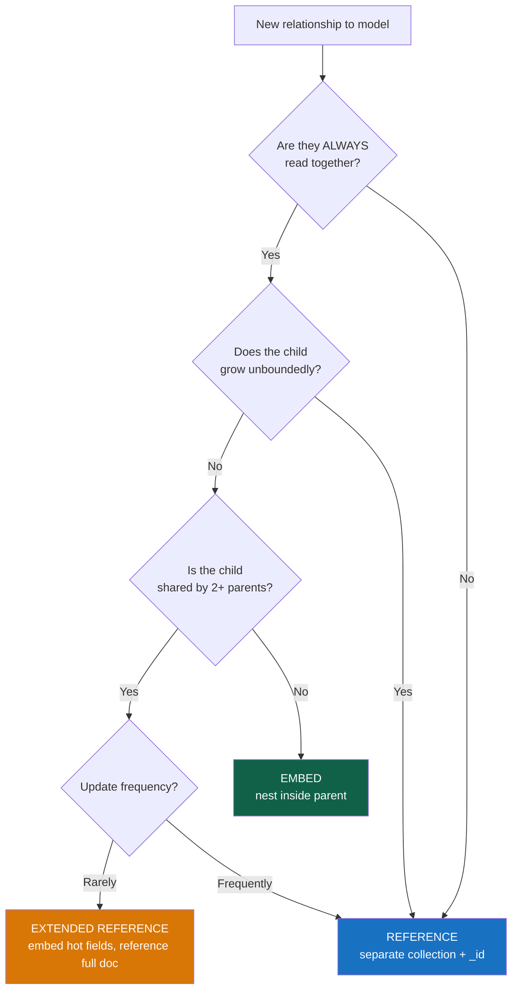

# Schema Design Patterns

> [!abstract] TL;DR
> MongoDB schema design is about optimizing for your **access patterns** — not eliminating redundancy as in relational normalization. The embedding vs referencing decision is foundational, and beyond it lie a set of battle-tested patterns: **Bucket** (group time-series into documents), **Outlier** (handle documents that break the norm), **Computed** (pre-compute expensive results), **Attribute** (flexible sparse k-v arrays), and **Extended Reference** (denormalize hot fields). Choose based on read/write ratios, document size, and query shape.

## The Core Decision: Embed vs Reference



### One-to-One: Always Embed

```javascript
// User and their address — always read together, 1:1 ownership
{
  "_id": ObjectId("..."),
  "name": "Alice",
  "email": "alice@example.com",
  "address": {
    "street": "123 Main St",
    "city": "New York",
    "zip": "10001",
    "country": "US"
  }
}
```

### One-to-Few: Embed

Embed when: small bounded list, always read with parent, child data is owned (not shared).

```javascript
// Blog post with a few tags — tags are always shown with the post
{
  "_id": ObjectId("..."),
  "title": "MongoDB Schema Design",
  "body": "...",
  "tags": ["mongodb", "schema", "nosql"],
  "author": { "name": "Alice", "avatar": "/images/alice.jpg" }
}

// Order with line items — items are owned by the order
{
  "_id": ObjectId("..."),
  "customerId": ObjectId("..."),
  "items": [
    { "sku": "W-100", "name": "Widget", "qty": 2, "price": 9.99 },
    { "sku": "G-250", "name": "Gadget", "qty": 1, "price": 42.00 }
  ],
  "total": 61.98
}
```

### One-to-Many: Reference

Reference when: large or unbounded list, or child has its own lifecycle.

```javascript
// User → posts: user has potentially thousands of posts — reference
// posts collection
{ "_id": ObjectId("post-1"), "authorId": ObjectId("user-1"), "title": "Post 1", "body": "..." }
{ "_id": ObjectId("post-2"), "authorId": ObjectId("user-1"), "title": "Post 2", "body": "..." }

// users collection — do NOT embed post array (unbounded)
{ "_id": ObjectId("user-1"), "name": "Alice", "email": "alice@example.com" }

// To fetch user's posts:
db.posts.find({ authorId: ObjectId("user-1") })
// Requires index: db.posts.createIndex({ authorId: 1 })
```

### Many-to-Many: Reference Arrays

```javascript
// Students ↔ Courses
// students collection
{ "_id": ObjectId("s1"), "name": "Alice", "courseIds": [ObjectId("c1"), ObjectId("c2")] }

// courses collection
{ "_id": ObjectId("c1"), "title": "MongoDB Mastery", "studentIds": [ObjectId("s1"), ObjectId("s2")] }

// Or: use a join collection (like SQL)
// enrollments collection
{ "studentId": ObjectId("s1"), "courseId": ObjectId("c1"), "enrolledAt": ISODate("..."), "grade": "A" }
```

---

## Pattern 1: Bucket Pattern

**Problem:** Time-series data with one document per event creates millions of tiny documents — poor index performance, high overhead.

**Solution:** Group events into "buckets" by time window or count.

```javascript
// Anti-pattern: one document per IoT reading
{ "_id": ObjectId("..."), "deviceId": "d-001", "ts": ISODate("2026-07-29T12:00:00Z"), "temp": 23.5 }
{ "_id": ObjectId("..."), "deviceId": "d-001", "ts": ISODate("2026-07-29T12:00:01Z"), "temp": 23.6 }
// 1000s of documents per device per day...

// Bucket pattern: group one hour of readings per document
{
  "_id": { "deviceId": "d-001", "hour": ISODate("2026-07-29T12:00:00Z") },
  "deviceId": "d-001",
  "startTime": ISODate("2026-07-29T12:00:00Z"),
  "endTime": ISODate("2026-07-29T12:59:59Z"),
  "count": 3600,           // readings in this bucket
  "readings": [
    { "ts": ISODate("2026-07-29T12:00:00Z"), "temp": 23.5 },
    { "ts": ISODate("2026-07-29T12:00:01Z"), "temp": 23.6 },
    // ... up to 3600 readings
  ],
  "summary": {
    "minTemp": 22.1,       // pre-computed for fast aggregation
    "maxTemp": 25.0,
    "avgTemp": 23.7
  }
}

// Append to bucket (create if not exists)
db.sensorData.updateOne(
  { "_id.deviceId": "d-001", "_id.hour": ISODate("2026-07-29T12:00:00Z"), "count": { $lt: 3600 } },
  {
    $push: { readings: { ts: new Date(), temp: 23.8 } },
    $inc: { count: 1 },
    $min: { "summary.minTemp": 23.8 },
    $max: { "summary.maxTemp": 23.8 }
  },
  { upsert: true }
)
```

**Benefits:**
- Dramatically fewer documents → smaller, faster B-tree indexes
- Pre-computed summary fields avoid full array scans for stats
- MongoDB 5.0+ time-series collections do this automatically

---

## Pattern 2: Outlier Pattern

**Problem:** Most documents fit a bounded embed pattern, but a small percentage (outliers) would exceed the 16 MB limit or make the typical document much larger.

**Solution:** Embed for the common case; add an overflow reference for outliers.

```javascript
// Most users have a reasonable number of followers
// But a celebrity might have 50 million — can't embed that!

// Normal user document
{
  "_id": ObjectId("u-normal"),
  "name": "Bob",
  "followerCount": 342,
  "followers": [ObjectId("u-1"), ObjectId("u-2"), ...],  // small enough to embed
  "hasOverflow": false    // flag: false = followers are complete in this doc
}

// Celebrity user document — use overflow flag
{
  "_id": ObjectId("u-celeb"),
  "name": "Celebrity Alice",
  "followerCount": 52000000,
  "followers": [ObjectId("u-1"), ObjectId("u-2"), ...],  // recent/VIP subset only
  "hasOverflow": true     // flag: true = fetch from overflow collection
}

// Overflow collection (only exists for outliers)
// celebrity_followers collection
{ "userId": ObjectId("u-celeb"), "followers": [...batch1...] }
{ "userId": ObjectId("u-celeb"), "followers": [...batch2...] }

// Application logic:
async function getFollowers(userId) {
  const user = await db.users.findOne({ _id: userId })
  if (!user.hasOverflow) return user.followers
  // Fetch from overflow collection
  return db.celebrity_followers.find({ userId }).toArray()
}
```

---

## Pattern 3: Computed Pattern

**Problem:** A query repeatedly aggregates data that rarely changes — summing order totals for a dashboard, computing an author's total article views. Every request runs an expensive aggregation.

**Solution:** Pre-compute and store the result in the document; update on write.

```javascript
// Without computed pattern: every dashboard load aggregates millions of orders
db.orders.aggregate([
  { $match: { customerId: ObjectId("u-001") } },
  { $group: { _id: null, totalSpent: { $sum: "$total" }, orderCount: { $sum: 1 } } }
])

// With computed pattern: store stats directly on the user document
// Update the user document every time an order is placed
db.users.updateOne(
  { _id: ObjectId("u-001") },
  {
    $inc: { "stats.totalSpent": orderTotal, "stats.orderCount": 1 },
    $max: { "stats.lastOrderDate": new Date() }
  }
)

// Dashboard query is now a single document lookup — O(1) instead of O(n)
const user = await db.users.findOne({ _id: ObjectId("u-001") }, { "stats": 1 })
```

**When to compute:**
- High read/write ratio (reads >> writes)
- Aggregation is expensive (many documents)
- Result changes infrequently or can be slightly stale

**Alternative: `$merge` for periodic materialization:**

```javascript
// Run nightly — materialize expensive aggregation to a "summary" collection
db.orders.aggregate([
  { $group: { _id: "$customerId", totalSpent: { $sum: "$total" }, orderCount: { $sum: 1 } } },
  { $merge: { into: "customerStats", on: "_id", whenMatched: "merge", whenNotMatched: "insert" } }
])
```

---

## Pattern 4: Attribute Pattern

**Problem:** Documents have many sparse optional fields (product specifications vary by category: electronics have CPU/RAM, clothing has size/color). Querying any of them requires an index per field — an index explosion.

**Solution:** Store sparse attributes as a key-value array — index the k-v pair once.

```javascript
// Anti-pattern: separate fields for every possible attribute
{
  "_id": "laptop-001",
  "category": "electronics",
  "cpu": "Intel i9",
  "ram": "32GB",
  "storage": "1TB NVMe",
  "color": null,     // null for electronics
  "size": null,      // null for electronics
  "material": null   // null for electronics
}

// Attribute pattern: k-v array
{
  "_id": "laptop-001",
  "category": "electronics",
  "specs": [
    { "k": "cpu",     "v": "Intel i9",  "u": "GHz" },
    { "k": "ram",     "v": "32",        "u": "GB" },
    { "k": "storage", "v": "1",         "u": "TB" }
  ]
}

// Clothing document — same specs field, different keys
{
  "_id": "shirt-001",
  "category": "clothing",
  "specs": [
    { "k": "size",     "v": "M" },
    { "k": "color",    "v": "navy" },
    { "k": "material", "v": "cotton" }
  ]
}

// ONE compound index on specs handles ALL attribute queries
db.products.createIndex({ "specs.k": 1, "specs.v": 1 })

// Query: find all products with ram >= 16GB
db.products.find({ specs: { $elemMatch: { k: "ram", v: { $gte: "16" } } } })
```

---

## Pattern 5: Extended Reference Pattern

**Problem:** Referencing avoids duplication but requires a `$lookup` for every read. For frequently-read fields from the referenced document, this is expensive.

**Solution:** Embed the most frequently-read fields from the referenced document directly. Keep the reference for the full document.

```javascript
// Pure reference — requires $lookup to get customer name on every order read
{ "_id": ObjectId("order-1"), "customerId": ObjectId("cust-1"), "total": 99.99 }

// Extended Reference pattern — embed the fields you always need
{
  "_id": ObjectId("order-1"),
  "customer": {
    "_id": ObjectId("cust-1"),     // the reference — used for full lookup if needed
    "name": "Alice Chen",           // denormalized: displayed on every order list
    "email": "alice@example.com",   // denormalized: needed for order confirmation emails
    "tier": "gold"                  // denormalized: needed for discount calculation
  },
  "total": 99.99
}

// The customer's full document (with address, payment methods, etc.) lives in `customers`
// Only fetch it via $lookup when you genuinely need the full profile

// When customer changes their name — update both:
// 1. customers collection (source of truth)
// 2. Optionally update recent orders (or accept slight staleness for historical orders)
```

**Trade-off:** Write complexity (must update denormalized fields when source changes) vs read performance (no join needed).

**Fields worth denormalizing:** Rarely-changed data (names, avatars, tier), data used in list views and emails.

---

## Pattern Summary Table

| Pattern | Problem Solved | Write Impact | Read Impact |
|---|---|---|---|
| **Embedding** | Related data always read together | Simple (one write) | Fastest (one document) |
| **Referencing** | Unbounded or shared data | Separate writes | Requires `$lookup` |
| **Bucket** | Time-series — millions of tiny docs | Append to bucket + upsert | Fewer docs, pre-computed stats |
| **Outlier** | Most docs fit embed; few would exceed 16 MB | Extra write for overflow | Check flag; two reads for outliers |
| **Computed** | Expensive repeated aggregation | Extra `$inc`/`$set` on write | O(1) read — field is pre-computed |
| **Attribute** | Sparse heterogeneous fields → index explosion | Same | Single compound index covers all attributes |
| **Extended Reference** | Join needed on every read for a few hot fields | Update denormalized fields when source changes | No `$lookup` for common reads |

---

## Common Pitfalls

1. **Applying relational normalization to MongoDB.** 3NF in MongoDB leads to over-referenced schemas requiring constant `$lookup`. Model for your access patterns, not for normalization.
2. **Embedding everything without bounding arrays.** "Embed if you read together" breaks down when the array is unbounded (chat messages, activity feeds). Always ask: "Can this grow forever?"
3. **Computed pattern with stale data.** If the pre-computed field is updated asynchronously (e.g., via a cron job rather than on write), queries may see stale values. Document the staleness tolerance clearly.
4. **Attribute pattern with numeric strings.** If `v` is stored as a string, range queries (`$gte: "16"`) use lexicographic comparison ("9" > "16"). Store numbers as numbers in the `v` field.
5. **Extended reference with stale denormalized data.** If the source document changes frequently (e.g., product price), the extended reference becomes a consistency problem. Only denormalize slow-changing fields.

---

## Review Questions

1. A MongoDB collection stores IoT sensor readings — currently 50 million documents. Query performance is degrading and storage is ballooning. Explain the Bucket pattern and how it would improve this.
2. An e-commerce platform has a `products` collection with electronics, clothing, furniture, and food items — each with completely different attributes. How would you apply the Attribute pattern, and what single index would cover all attribute-based searches?
3. You have orders referencing customers. Customer name and tier are displayed in every order list view. Explain the Extended Reference pattern and what data synchronization responsibility it creates.

#MongoDB #NoSQL #SchemaDesign #BucketPattern #ComputedPattern #AttributePattern
