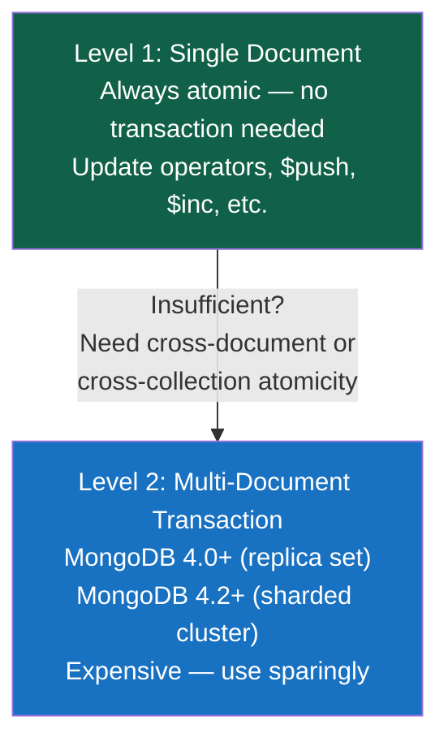
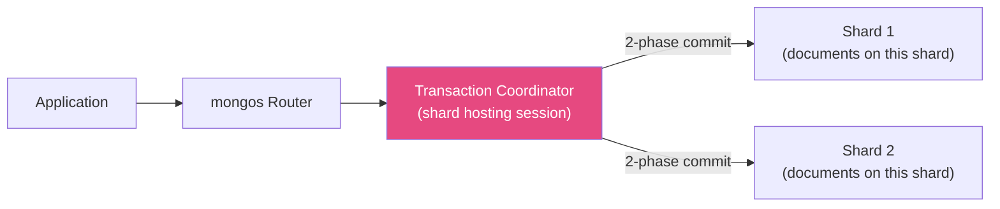

# Transactions and ACID

> [!abstract] TL;DR
> MongoDB has supported **multi-document ACID transactions** since version 4.0 (replica sets) and 4.2 (sharded clusters). But transactions are expensive — they add session overhead, hold write locks, and risk aborting under contention. The right design avoids them: use **single-document atomicity** (always free), `findOneAndUpdate` for atomic read-modify-write, and schema embedding to keep related data in one document. Use transactions only when you genuinely need atomicity across multiple documents or collections.

## MongoDB's Atomicity Guarantees

MongoDB provides atomicity at two levels:



**Single-document atomicity is free** — any `updateOne` with multiple `$set`/`$push`/`$inc` operators applies all changes atomically. No transaction needed.

```javascript
// Atomic within a single document — always safe, no transaction required
db.inventory.updateOne(
  { _id: "product-001", stock: { $gte: 5 } },   // check stock in the filter
  {
    $inc: { stock: -5, reservedCount: 5 },       // all operators apply atomically
    $push: { reservations: { orderId: "ord-1", qty: 5, at: new Date() } },
    $currentDate: { updatedAt: true }
  }
)
// If stock < 5, the filter doesn't match — no modification happens
```

---

## Multi-Document Transactions

### Session-Based API

Multi-document transactions require a **session** — a logical connection that groups operations:

```javascript
// Node.js / MongoDB Driver
const client = new MongoClient(uri)
await client.connect()
const session = client.startSession()

try {
  await session.withTransaction(async () => {
    const orders = client.db("shop").collection("orders")
    const inventory = client.db("shop").collection("inventory")

    // Both operations are part of the same transaction
    await orders.insertOne(
      { customerId: "u-001", items: [{ sku: "W-100", qty: 2 }], total: 19.98, status: "placed" },
      { session }
    )

    const result = await inventory.updateOne(
      { sku: "W-100", stock: { $gte: 2 } },
      { $inc: { stock: -2 } },
      { session }
    )

    if (result.matchedCount === 0) {
      // Insufficient stock — abort the transaction
      await session.abortTransaction()
      throw new Error("Insufficient stock for SKU W-100")
    }
  }, {
    readConcern: { level: "snapshot" },    // snapshot isolation within transaction
    writeConcern: { w: "majority" }        // durable write concern
  })

  console.log("Transaction committed successfully")
} catch (e) {
  console.error("Transaction aborted:", e.message)
} finally {
  await session.endSession()
}
```

### Manual Transaction Control

```javascript
// More granular control
const session = client.startSession()
session.startTransaction({
  readConcern: { level: "snapshot" },
  writeConcern: { w: "majority", j: true }
})

try {
  await db.collection("accounts").updateOne(
    { _id: "acc-A", balance: { $gte: 100 } },
    { $inc: { balance: -100 } },
    { session }
  )

  await db.collection("accounts").updateOne(
    { _id: "acc-B" },
    { $inc: { balance: 100 } },
    { session }
  )

  await session.commitTransaction()
} catch (error) {
  await session.abortTransaction()
  throw error
} finally {
  await session.endSession()
}
```

---

## Read Concern and Write Concern

These control the **consistency/durability** of individual operations and transactions:

### Read Concern Levels

| Level | Description | Use Case |
|---|---|---|
| `local` | Read from primary (default); may include writes not yet replicated | Low-latency reads where slight staleness is OK |
| `available` | Like `local` but for sharded clusters — may include orphaned docs | Fastest sharded reads |
| `majority` | Only data acknowledged by majority of replica members | Important reads — won't be rolled back |
| `linearizable` | Read reflects all writes that completed before the read started | Strongest consistency; high latency |
| `snapshot` | Point-in-time snapshot (only in transactions) | Repeatable reads within a transaction |

### Write Concern Options

```javascript
// w: number of replicas that must acknowledge
// j: wait for journal flush (crash-safe)
// wtimeout: timeout in ms

// Default (fast, not fully durable)
{ writeConcern: { w: 1 } }                        // primary acknowledges only

// Production-safe
{ writeConcern: { w: "majority", j: true } }       // majority + journal

// Maximum durability
{ writeConcern: { w: "majority", j: true, wtimeout: 5000 } }

// Custom: wait for 3 specific members to acknowledge
{ writeConcern: { w: 3 } }
```

---

## Snapshot Isolation in Transactions

Transactions in MongoDB use **snapshot isolation** — each transaction sees a consistent point-in-time snapshot of the data as it was when the transaction began. Changes made by other concurrent transactions are not visible.

```javascript
// Transaction A reads documents 1 and 2 as they existed at transaction start time
// Even if Transaction B modifies document 2 during A's execution, A still sees the original
session.startTransaction({ readConcern: { level: "snapshot" } })

const doc1 = await collection.findOne({ _id: 1 }, { session })
// (some time passes, Transaction B updates doc 2)
const doc2 = await collection.findOne({ _id: 2 }, { session })
// doc2 still shows the original value — snapshot isolation

await session.commitTransaction()
```

---

## Write Conflicts and Retry Logic

MongoDB uses **optimistic concurrency** in transactions — if two transactions modify the same document, one will fail with a `WriteConflict` error. The losing transaction must be **retried** by the application:

```javascript
// Retry logic for transient transaction errors
async function runTransactionWithRetry(txnFunc, session) {
  while (true) {
    try {
      await txnFunc(session)
      break
    } catch (error) {
      if (error.hasErrorLabel("TransientTransactionError")) {
        // Transient error (write conflict, network hiccup) — safe to retry
        console.log("TransientTransactionError, retrying transaction...")
        continue
      }
      throw error  // non-transient error — don't retry
    }
  }
}

// Retry commit specifically (for UnknownTransactionCommitResult)
async function commitWithRetry(session) {
  while (true) {
    try {
      await session.commitTransaction()
      break
    } catch (error) {
      if (error.hasErrorLabel("UnknownTransactionCommitResult")) {
        // Commit may or may not have succeeded — retry commit (idempotent)
        console.log("UnknownTransactionCommitResult, retrying commit...")
        continue
      }
      throw error
    }
  }
}
```

---

## Transaction Limits and Constraints

| Constraint | Limit | Recommendation |
|---|---|---|
| Max transaction runtime | 60 seconds (default, configurable) | Keep transactions short — under 1 second |
| Max transaction size | 16 MB | Stay well under; transactions are for coordination, not bulk data |
| Oplog entry size | 16 MB | Large transactions that create large oplog entries will fail |
| Collections per transaction | No hard limit, but performance degrades | Minimize cross-collection operations |
| DDL operations | Not allowed in transactions | Cannot create/drop collections/indexes in a transaction |
| `system.*` collections | Cannot read/write | |
| Capped collections | Cannot write | Use regular collections for transactional data |

---

## Performance Cost of Transactions

**Transactions are significantly more expensive** than non-transactional operations:

| Operation | Relative Latency | Reason |
|---|---|---|
| Single-document write (no txn) | 1x (baseline) | No session overhead |
| `findOneAndUpdate` | ~1.1x | Atomic but no session |
| Multi-document transaction (2 ops) | ~3-5x | Session creation, lock coordination, commit round-trip |
| Multi-document transaction (10+ ops) | ~10x+ | Locks held longer; contention risk |

**Design philosophy:** MongoDB's schema design patterns exist specifically to **avoid transactions**:

```
Instead of a transaction across 3 collections...

Use embedding  → 1 document (atomic by default)
Use findOneAndUpdate → 1 round-trip, atomic
Use the Computed pattern → write one field, avoid a read

If you find yourself using transactions constantly → your schema is relational-in-disguise
```

---

## Distributed Transactions in Sharded Clusters

MongoDB 4.2+ supports multi-document transactions across **sharded clusters** (cross-shard transactions). These are even more expensive:



**Two-Phase Commit (2PC):**
1. **Prepare phase:** Coordinator asks each shard to lock and prepare their changes
2. **Commit phase:** All shards confirm → coordinator sends commit

If any shard fails in prepare phase, the coordinator sends abort to all. This adds two network round-trips minimum.

**Performance tip:** Design your shard key so that transactions only touch **one shard** — then no cross-shard coordination is needed.

---

## `findOneAndUpdate` as Transaction Alternative

For the common pattern of "check a condition, then update based on it," `findOneAndUpdate` is atomic and far cheaper than a transaction:

```javascript
// Pattern: Queue consumer — atomically claim a job
const job = await db.jobs.findOneAndUpdate(
  { status: "pending", workerPid: null },              // filter: unclaimed job
  {
    $set: { status: "processing", workerPid: process.pid },
    $currentDate: { claimedAt: true }
  },
  { returnDocument: "after", sort: { priority: -1, createdAt: 1 } }
)

if (!job) { /* No pending jobs */ return }
// Process job.value...

// Pattern: Inventory reservation — atomic check-and-decrement
const item = await db.inventory.findOneAndUpdate(
  { sku: "W-100", stock: { $gte: requestedQty } },     // filter: enough stock
  { $inc: { stock: -requestedQty, reserved: requestedQty } },
  { returnDocument: "after" }
)

if (!item) throw new Error("Insufficient stock")
```

---

## Common Pitfalls

1. **Using transactions for everything.** If you're using transactions on every write, your schema needs redesign — embed related data or use `findOneAndUpdate` for atomic single-document operations.
2. **Long-running transactions.** Transactions hold document-level write locks. A transaction running for 10+ seconds blocks concurrent writes on the same documents. Keep transactions under 1 second.
3. **Not handling `TransientTransactionError`.** Write conflicts are normal under concurrency. Without retry logic, your application will fail on the first conflict.
4. **Using `w: 1` in transactions.** If the primary fails between commit and replication, the transaction's writes can be lost. Always use `w: "majority"` in production transactions.
5. **DDL inside a transaction.** `createCollection`, `createIndex`, `dropCollection` are not allowed inside a transaction. Perform DDL operations outside transactions.
6. **Transactions on standalone `mongod`.** Transactions require a replica set (even a single-member replica set is fine). They don't work on a plain standalone instance.

---

## Review Questions

1. Explain why a single-document update with multiple operators (`$set`, `$inc`, `$push`) is always atomic in MongoDB without a transaction. When does this NOT give you enough atomicity?
2. A developer is implementing an e-commerce checkout that: (1) decrements inventory, (2) creates an order, (3) charges a credit card via an external API. Should steps 1 and 2 be in a transaction? Should step 3? Explain your reasoning.
3. What is a `TransientTransactionError` and why must your application retry the entire transaction when it occurs?

#MongoDB #NoSQL #Transactions #ACID #writeConcern #readConcern #snapshot
