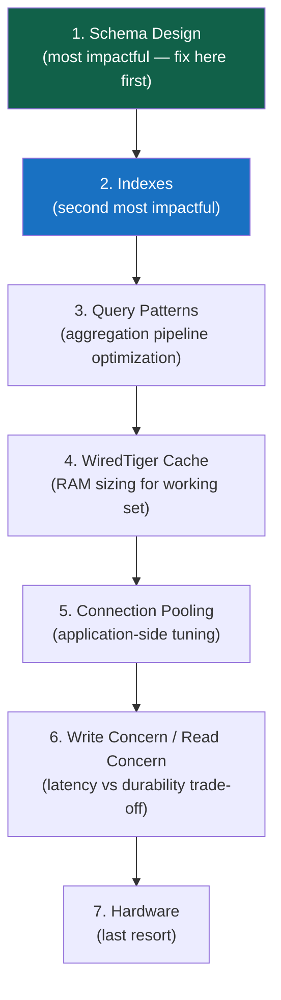
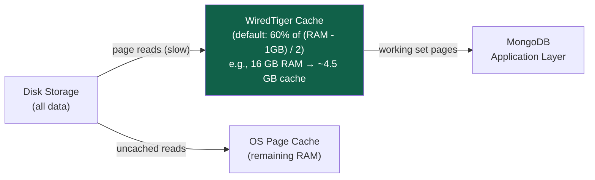

# Performance and Monitoring

> [!abstract] TL;DR
> MongoDB performance problems follow a predictable pattern: missing indexes, wrong schema, insufficient RAM, or connection pool exhaustion. The **database profiler** captures slow queries; `explain("executionStats")` diagnoses individual queries; Atlas Performance Advisor automates both. WiredTiger's cache (default 60% of RAM) must hold your working set — if it doesn't, you see I/O thrashing. Connection pool settings and write concern tuning round out the production performance toolkit.

## The Performance Hierarchy



---

## The Database Profiler

The profiler logs operations that exceed a threshold to `db.system.profile`:

```javascript
// Profiler levels:
// 0 = off (default)
// 1 = log operations slower than slowms threshold
// 2 = log ALL operations (high overhead — dev only)

// Enable profiling for operations > 100ms
db.setProfilingLevel(1, { slowms: 100 })

// Check current profiling settings
db.getProfilingStatus()

// Query the profile collection (most recent slow ops first)
db.system.profile.find({
  op: { $in: ["query", "update", "insert"] },
  millis: { $gt: 100 }
}).sort({ ts: -1 }).limit(20).pretty()

// Find the most common slow queries
db.system.profile.aggregate([
  { $group: { _id: "$ns", count: { $sum: 1 }, avgMs: { $avg: "$millis" }, maxMs: { $max: "$millis" } } },
  { $sort: { avgMs: -1 } }
])
```

**Key profile document fields:**

```json
{
  "op": "query",
  "ns": "shop.orders",
  "command": { "find": "orders", "filter": { "status": "pending" } },
  "keysExamined": 0,         // index keys examined — 0 = no index used
  "docsExamined": 500000,    // documents examined — should ≈ nreturned
  "nreturned": 42,           // documents returned
  "millis": 3200,            // execution time ms
  "planSummary": "COLLSCAN", // winning plan — COLLSCAN is the problem
  "ts": ISODate("2026-07-29T12:00:00Z"),
  "locks": { "Global": { "acquireCount": { "r": 1 } } }
}
```

---

## Reading `explain("executionStats")`

```javascript
// Run explain on any query
const explain = await db.collection("orders")
  .find({ customerId: ObjectId("..."), status: "pending" })
  .sort({ createdAt: -1 })
  .explain("executionStats")

console.log(JSON.stringify(explain.executionStats, null, 2))
```

**Critical metrics:**

```
nReturned:         42       ← documents returned to the application
totalKeysExamined: 42       ← index entries scanned  (should ≈ nReturned)
totalDocsExamined: 42       ← documents fetched       (0 = covered query)
executionTimeMillis: 3      ← total execution time

winningPlan.stage: "FETCH"  ← stages: COLLSCAN (bad) | IXSCAN (good) | FETCH | SORT
```

**Diagnosis quick reference:**

| Symptom | Likely Cause | Fix |
|---|---|---|
| `COLLSCAN` | No usable index | Add index on filter fields |
| `SORT` stage in plan | No index for sort | Add sort field to compound index (ESR rule) |
| `keysExamined` >> `nReturned` | Low-selectivity index | Add filter fields with higher cardinality earlier |
| `docsExamined` >> `nReturned` | Index used but many false positives | More selective compound index |
| `docsExamined: 0` | Covered query | Optimal — no improvement needed |
| `totalDocsExamined` in millions for a small result | Wrong index or missing compound | Rebuild compound index with ESR |

```javascript
// Explain for aggregation pipeline
db.orders.explain("executionStats").aggregate([
  { $match: { status: "pending" } },
  { $group: { _id: "$customerId", total: { $sum: "$amount" } } }
])
```

---

## WiredTiger Cache

WiredTiger is MongoDB's default storage engine. Its **cache** stores frequently-accessed data pages in memory — the working set.



**Default cache size:** `max(60% * (RAM - 1 GB) / 2, 256 MB)`
- 8 GB RAM → ~2.125 GB cache
- 16 GB RAM → ~4.5 GB cache
- 64 GB RAM → ~19.5 GB cache

**Configure in `mongod.conf`:**
```yaml
storage:
  wiredTiger:
    engineConfig:
      cacheSizeGB: 12   # override default calculation
```

**Monitoring cache effectiveness:**
```javascript
// Check cache stats
db.adminCommand({ serverStatus: 1 }).wiredTiger.cache
// Key metrics:
// "bytes currently in the cache"      → current usage
// "maximum bytes configured"          → cache size limit
// "pages read into cache"             → reads from disk
// "tracked dirty bytes in the cache"  → pending writes

// High "pages read into cache" relative to requests = cache thrashing = need more RAM
```

---

## Key Server Metrics to Monitor

```javascript
// Full server status — the gold mine
const status = db.adminCommand({ serverStatus: 1 })

// Opcounters — operations per second
status.opcounters
// { insert: 150, query: 1200, update: 80, delete: 5, getmore: 0, command: 300 }

// Connections
status.connections
// { current: 45, available: 955, totalCreated: 1200 }
// current / (current + available) = connection utilization

// Memory
status.mem
// { resident: 8192, virtual: 12288 }  (MB)
// resident = actual RAM used

// Replication lag (if replica set)
status.repl.lag   // seconds

// Index miss rate (triggers disk reads)
const indexStats = status.indexCounters
// indexStats.missRatio should be < 0.01 (< 1%)

// Active operations
db.adminCommand({ currentOp: true })
```

---

## Connection Pooling

MongoDB drivers maintain a connection pool — reuse TCP connections instead of creating new ones per request:

```javascript
// Node.js driver — connection pool configuration
const client = new MongoClient(uri, {
  maxPoolSize: 100,         // max connections in pool (default: 100)
  minPoolSize: 10,          // min connections maintained
  maxIdleTimeMS: 30000,     // close connections idle for 30s
  waitQueueTimeoutMS: 5000, // throw error if no connection available after 5s
  serverSelectionTimeoutMS: 5000,  // timeout for finding a server
  connectTimeoutMS: 10000,         // TCP connect timeout
  socketTimeoutMS: 0,              // 0 = no timeout on open connections
})

// Monitor pool events for debugging
client.on("connectionPoolCreated", event => console.log("Pool created:", event))
client.on("connectionCheckedOut", event => console.log("Connection checked out"))
client.on("connectionCheckOutFailed", event => console.error("Pool exhausted:", event))
```

**Sizing the pool:**
- Rule of thumb: `maxPoolSize = (CPUs * 4) + 2` as a starting point
- Each connection holds ~1 MB RAM on the server
- Too many connections → server RAM exhaustion; too few → application waits
- For serverless/Lambda: use `maxPoolSize: 1` and connect outside the handler

```javascript
// Serverless-friendly pattern (Lambda, Cloud Functions)
let cachedClient = null

async function getDb() {
  if (!cachedClient) {
    cachedClient = await MongoClient.connect(uri, { maxPoolSize: 1 })
  }
  return cachedClient.db("mydb")
}
```

---

## Slow Query Playbook

**Step 1: Identify slow queries**
```javascript
// Enable profiler
db.setProfilingLevel(1, { slowms: 50 })

// Or check Atlas Performance Advisor (Atlas clusters)
// Atlas UI → Performance Advisor → Slow Queries tab
```

**Step 2: Run explain on the slow query**
```javascript
db.collection("orders").find(slowFilter).sort(slowSort).explain("executionStats")
// Look for: COLLSCAN, SORT stage, high keysExamined/nReturned ratio
```

**Step 3: Design a better index (ESR rule)**
```javascript
// Equality → Sort → Range
// Query: { status: "pending", customerId: "u-001" }, sort: { createdAt: -1 }
db.orders.createIndex({ status: 1, customerId: 1, createdAt: -1 })
```

**Step 4: Verify with explain**
```javascript
// After creating the index, run explain again
// Should see: IXSCAN, no SORT stage, keysExamined ≈ nReturned
```

**Step 5: Monitor after index creation**
```javascript
// Check if the new index is being used
db.orders.aggregate([{ $indexStats: {} }])
// Look at "accesses.ops" for the new index — should increase
```

---

## Atlas Performance Advisor and Query Profiler

**Performance Advisor** (M10+):
- Automatically identifies slow queries (threshold: 100ms)
- Suggests specific indexes with estimated improvement
- One-click index creation from the UI

**Atlas Query Profiler** (M10+):
- Visual query profiler showing all operations above threshold
- Filter by operation type, namespace, duration
- No profiler overhead — Atlas captures this differently from the profiler collection

---

## MongoDB Ops Manager and Cloud Manager

For self-hosted MongoDB (not Atlas):
- **Ops Manager** — enterprise on-premise monitoring, backup, and automation
- **Cloud Manager** — cloud-hosted monitoring for self-managed MongoDB
- Both provide: dashboards, alerting, log aggregation, automated backups

---

## Performance Tuning Checklist

```
Schema Level:
□ Working set fits in WiredTiger cache (< 60-70% cache usage)?
□ Hot documents are small (no large, rarely-read arrays embedded)?
□ Frequently read-together data is co-located (embedded)?

Index Level:
□ All filter fields in a query have an index?
□ Compound index follows ESR rule?
□ Sort field is included in a compound index (no in-memory SORT stage)?
□ Covered queries used where possible (projection = indexed fields)?
□ Unused indexes dropped (slow down writes unnecessarily)?

Query Level:
□ $match is first in aggregation pipeline?
□ $project reduces document size early in pipeline?
□ $lookup foreign field is indexed?
□ allowDiskUse: true on large aggregations?

Infra Level:
□ WiredTiger cache sized appropriately (or larger instances)?
□ Connection pool sized to (CPUs * 4)?
□ Write concern is majority for production data?
□ Replica set deployed across availability zones?
```

---

## Common Pitfalls

1. **Tuning hardware before fixing indexes.** More RAM doesn't help if queries do COLLSCAN — the larger collection still needs to be scanned. Always fix indexes first.
2. **Not monitoring replication lag.** A secondary falling 10+ seconds behind is a performance problem (reads from secondary see stale data) and a risk (longer failover recovery).
3. **Too many connections overwhelming the server.** Each MongoDB connection uses ~1 MB server-side. 10,000 connections = 10 GB RAM just for connections. Use a connection pooler or reduce `maxPoolSize`.
4. **`$where` and unanchored `$regex` in production.** Both do collection scans. Profile shows them as slow but they're often buried in application code. Audit your queries.
5. **Large documents in a hot collection.** A 1 MB document occupies ~8 pages in WiredTiger. Reading it repeatedly thrashes the cache. Keep hot document sizes small (< 16 KB).
6. **Ignoring index bloat.** Each index adds overhead to every write. A collection with 20 indexes is much slower to write to than one with 5 targeted indexes. Audit and drop unused indexes.

---

## Review Questions

1. A developer reports that a MongoDB query is taking 10+ seconds. Walk through the diagnostic process step by step — from identifying the query to verifying the fix.
2. Explain what the WiredTiger cache is and what "cache thrashing" means. How would you detect it and what are the solutions?
3. A production application is hitting "connection pool exhausted" errors under load. What does this mean, how would you diagnose the root cause, and what tuning options are available?

#MongoDB #NoSQL #Performance #WiredTiger #QueryProfiler #Monitoring #ConnectionPool
