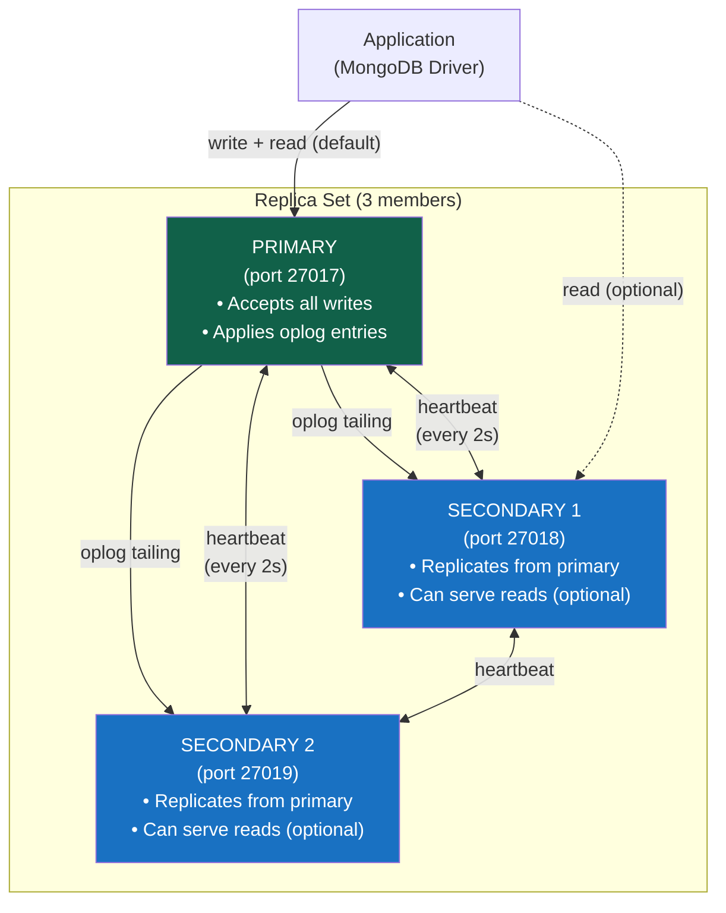
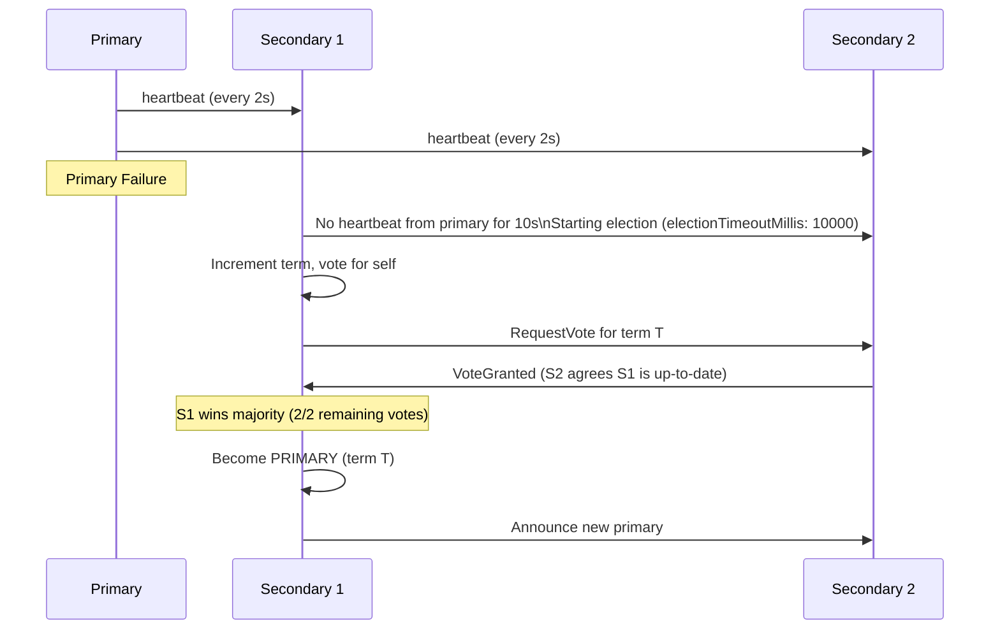

# Replication

> [!abstract] TL;DR
> A MongoDB **replica set** is a group of `mongod` instances that maintain identical data copies. One member is the **primary** (accepts all writes); the rest are **secondaries** (replicate via the **oplog**). If the primary fails, an automatic **election** (Raft-based majority vote) promotes a secondary within seconds. Replica sets provide **high availability**, **data durability**, and optionally serve reads from secondaries. Every production MongoDB deployment must be a replica set — sharded clusters use replica sets for each shard.

## Replica Set Architecture



---

## The Oplog (Operations Log)

The **oplog** (`local.oplog.rs`) is the backbone of replication:

- A special **capped collection** on each member's `local` database
- Stores every write operation as an idempotent oplog entry
- Secondaries **tail** the primary's oplog and replay entries in order
- Change streams are built on top of the oplog

```javascript
// View recent oplog entries (on any member)
use local
db.oplog.rs.find().sort({ $natural: -1 }).limit(5).pretty()

// Oplog entry structure
{
  "ts": Timestamp(1690000000, 1),   // operation timestamp (BSON Timestamp)
  "t": NumberLong(1),               // election term
  "h": NumberLong(0),               // deprecated
  "v": 2,                           // oplog format version
  "op": "u",                        // operation: i=insert, u=update, d=delete, c=command, n=noop
  "ns": "shop.orders",              // namespace (db.collection)
  "o2": { "_id": ObjectId("...") }, // filter (for updates)
  "o": { "$v": 2, "diff": { "u": { "status": "shipped" } } }  // the change
}

// Check oplog size and time range
db.adminCommand({ replSetGetStatus: 1 }).members  // see oplog lag per member

// Oplog size (resize if change streams need longer window)
// Set in mongod.conf: replication.oplogSizeMB: 10240  (10 GB)
```

---

## Replica Set Configuration

```javascript
// Initialize a new replica set (run on the primary-to-be)
rs.initiate({
  _id: "rs0",
  members: [
    { _id: 0, host: "mongo1:27017", priority: 2 },  // higher priority = preferred primary
    { _id: 1, host: "mongo2:27017", priority: 1 },
    { _id: 2, host: "mongo3:27017", priority: 1 }
  ]
})

// Check replica set status
rs.status()
rs.conf()

// Add a member
rs.add("mongo4:27017")

// Add an arbiter (votes but holds no data — for odd member counts)
rs.addArb("mongo-arb:27017")
```

### Special Member Types

| Type | Votes | Holds Data | Can Become Primary | Use Case |
|---|---|---|---|---|
| Regular secondary | Yes | Yes | Yes | Normal replica |
| **Arbiter** | Yes | No | No | Break election ties without full data copy |
| **Hidden** | Yes | Yes | No (priority: 0) | Analytics, backups — hidden from drivers |
| **Delayed** | Yes | Yes | No (priority: 0) | Lag behind by N seconds — protection against accidental deletes |
| **Non-voting** | No | Yes | No (votes: 0) | More than 7 members; reduces election overhead |

```javascript
// Configure hidden member (e.g., analytics replica)
rs.reconfig({
  _id: "rs0",
  members: [
    { _id: 0, host: "mongo1:27017" },
    { _id: 1, host: "mongo2:27017" },
    { _id: 2, host: "mongo3:27017" },
    { _id: 3, host: "mongo-analytics:27017", hidden: true, priority: 0, votes: 1 }
  ]
})

// Configure delayed member (lag 1 hour behind primary)
{ _id: 4, host: "mongo-delayed:27017", hidden: true, priority: 0, slaveDelay: 3600 }
```

---

## Election Process

MongoDB uses a **Raft-inspired election protocol** with majority voting:



**Election conditions:**
- Primary fails to send heartbeats for `electionTimeoutMillis` (default: 10 seconds)
- Primary steps down manually (`rs.stepDown()`)
- A member with higher priority comes online (triggered after stabilization delay)
- Network partition isolates the primary from the majority

**Election requirements:**
- Candidate must have the **most up-to-date oplog** among voting members
- Candidate needs **majority of votes** (e.g., 2 out of 3, or 3 out of 5)
- Without a majority (network split to two equal halves), neither side can elect — the cluster becomes **read-only**

---

## Read Preferences

Read preference determines which replica set member the driver sends reads to:

| Read Preference | Routing | Use Case |
|---|---|---|
| `primary` (default) | Always primary | Strongly consistent reads — always up-to-date |
| `primaryPreferred` | Primary if available; secondary if primary down | Mostly fresh, tolerates primary failure |
| `secondary` | Any secondary | Analytics, reporting — may see stale data |
| `secondaryPreferred` | Secondary if available; primary if no secondaries | Offload reads from primary |
| `nearest` | Lowest network latency member | Geographic latency optimization |

```javascript
// Configure read preference in connection string
mongodb://mongo1:27017,mongo2:27017,mongo3:27017/shop?replicaSet=rs0&readPreference=secondaryPreferred

// Per-operation read preference (Node.js driver)
const docs = await collection.find(filter, {
  readPreference: "secondary",
  maxStalenessSeconds: 120   // tolerate up to 2 minutes of replication lag
}).toArray()

// Targeting by tag (e.g., "datacenter: NYC")
rs.reconfig({
  members: [
    { _id: 0, host: "mongo1:27017", tags: { "dc": "nyc", "region": "us-east" } },
    { _id: 1, host: "mongo2:27017", tags: { "dc": "lon", "region": "eu-west" } }
  ]
})

collection.find(filter, {
  readPreference: new ReadPreference("nearest", [{ dc: "nyc" }])
})
```

---

## Write Concern and Durability

```javascript
// j: true — wait for journal flush (survive mongod crash)
// w: "majority" — wait for majority of voting members to acknowledge
db.orders.insertOne(doc, {
  writeConcern: { w: "majority", j: true, wtimeout: 5000 }
})

// Default w:1 risk: write acknowledged by primary, then primary crashes before replication
// The new primary won't have this write → "rollback" (written to rollback/ directory)

// Check for rollbacks
// After a failover, the old primary may have writes that newer members don't:
// These are written to: <dbpath>/rollback/<collection>.<timestamp>.bson
// Review and re-apply if needed
```

---

## Monitoring Replication Lag

```javascript
// Check replication status (run on any member)
db.adminCommand({ replSetGetStatus: 1 })
// Look at members[].optimeDate vs primary's optimeDate

// Check optime lag per member
const status = db.adminCommand({ replSetGetStatus: 1 })
const primaryOptime = status.members.find(m => m.state === 1).optimeDate
status.members.forEach(m => {
  const lagMs = primaryOptime - m.optimeDate
  console.log(`${m.name}: lag = ${lagMs}ms`)
})

// Atlas: Replication lag is visible in Atlas monitoring UI
// Alert threshold: > 10 seconds lag is concerning
```

---

## Operational Procedures

### Manual Stepdown (Rolling Maintenance)

```javascript
// Force the primary to step down (another member will be elected)
rs.stepDown(60)  // don't re-elect this member for 60 seconds
```

### Rolling Restart for Upgrades

```bash
# 1. Restart each secondary first (they come back as secondary)
# 2. Step down the primary (triggers election)
# 3. Restart the old primary (now a secondary)
# Cluster stays available throughout — zero downtime upgrade

# On each secondary:
mongod --config mongod.conf --shutdown
mongod --config mongod.conf  # with new version

# Then on primary:
mongo --eval "rs.stepDown(120)"
mongod --config mongod.conf --shutdown
mongod --config mongod.conf
```

### Docker / Kubernetes Replica Set

```yaml
# Minimal Kubernetes StatefulSet for a 3-member replica set
apiVersion: apps/v1
kind: StatefulSet
metadata:
  name: mongodb
spec:
  replicas: 3
  serviceName: mongodb
  template:
    spec:
      containers:
        - name: mongodb
          image: mongo:7.0
          command: ["mongod", "--replSet", "rs0", "--bind_ip_all"]
          ports:
            - containerPort: 27017
```

---

## Common Pitfalls

1. **Using a standalone `mongod` in production.** No automatic failover, no change streams, no transactions. Always deploy a replica set (minimum 3 members).
2. **Deploying a 2-member replica set without an arbiter.** Two members can't form a majority alone — if one fails, no election can happen. Use 3 members (or 2 + arbiter).
3. **Even number of members without thought.** 4 members = 3 needed for majority. One failure can still elect. But a 2-2 network split means neither half can elect. 3 or 5 members are safer.
4. **Ignoring replication lag.** A secondary falling far behind means: staleness for secondary reads, longer recovery time after primary failure, and change stream resume tokens becoming invalid faster.
5. **Deploying all members in the same datacenter.** If the datacenter loses power, all members go down. Distribute members across availability zones.
6. **Not sizing the oplog.** Default oplog may be only a few hours of operations. For change stream consumers or delayed replicas, increase `oplogSizeMB`.

---

## Review Questions

1. Explain why a MongoDB replica set requires an **odd number of members** (or an even number + arbiter). What happens in a 2-node cluster when the primary fails?
2. A team deploys MongoDB with `w: 1` (default write concern) and experiences data loss after a primary failover. Explain the sequence of events and how `w: "majority"` prevents this.
3. You have a MongoDB cluster with a primary in US-East and two secondaries in US-East and EU-West. A user in Europe complains about slow reads. What read preference would you configure, and what consistency trade-off does it introduce?

#MongoDB #NoSQL #ReplicaSet #Oplog #Election #ReadPreference #HighAvailability
