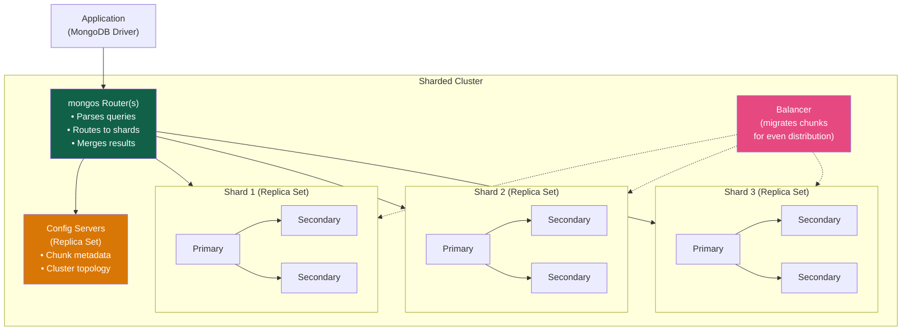
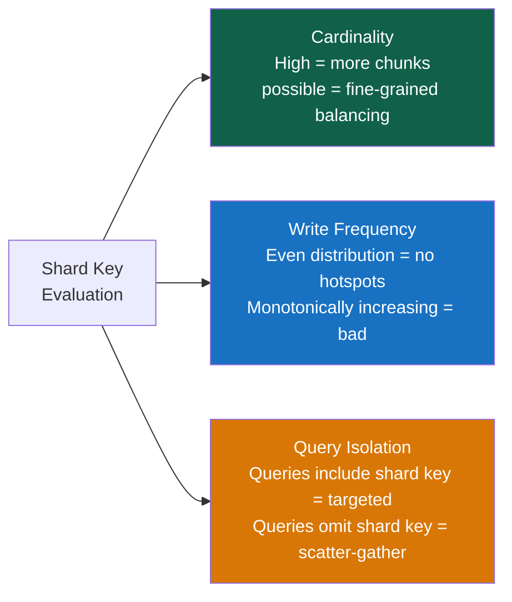

# Sharding

> [!abstract] TL;DR
> MongoDB **sharding** horizontally partitions a collection across multiple **shards** (each a replica set) using a **shard key**. A **mongos** router directs queries to the correct shard(s) using chunk metadata from **config servers**. Shard key selection is the single most critical and irreversible decision: it must have high cardinality, avoid hotspots, and align with query patterns. Use sharding when your replica set exceeds ~200 GB, or when CPU/disk I/O is saturated.

## Sharded Cluster Architecture



**Components:**
- **mongos** — the query router; clients connect to `mongos`, not directly to shards
- **Config servers** — a replica set storing chunk ranges and shard topology metadata
- **Shards** — each shard is a full replica set storing a subset of the data
- **Balancer** — a background process that migrates chunks between shards to keep them balanced

---

## The Shard Key

The shard key is a field (or compound fields) that determines how documents are distributed across shards. It is:
- **Immutable** — cannot be changed after sharding (in MongoDB < 5.0; resharding possible in 5.0+)
- **Indexed** — MongoDB automatically creates an index on the shard key
- **Required** — every document must have the shard key field

```javascript
// Enable sharding on a database
sh.enableSharding("shop")

// Shard a collection — this is the critical decision
sh.shardCollection("shop.orders", { customerId: 1 })         // range-based sharding
sh.shardCollection("shop.events", { userId: "hashed" })      // hashed sharding
sh.shardCollection("shop.logs", { tenantId: 1, _id: 1 })    // compound shard key
```

---

## Shard Key Properties: What Makes a Good Key



### High Cardinality

The shard key must have enough distinct values to create many chunks. Low cardinality → jumbo chunks that can't be split → imbalanced shards.

```
BAD: { status: 1 }        — only 5 distinct values → at most 5 chunks → imbalanced
BAD: { country: 1 }       — 195 values → may be OK for small data
GOOD: { userId: 1 }       — millions of users → fine-grained balancing
GOOD: { userId: "hashed" } — uniformly distributed hash values
```

### No Hotspots (Write Distribution)

Monotonically increasing shard keys send **all new writes to the latest chunk** on one shard:

```
BAD: { _id: 1 }           — ObjectId has timestamp prefix → monotonically increasing → hot shard
BAD: { createdAt: 1 }     — always increasing timestamp → all inserts go to one shard
BAD: { sequenceNum: 1 }   — auto-increment → hot shard

FIX: { _id: "hashed" }    — hash distributes inserts randomly → even write distribution
FIX: { userId: 1 }        — random-ish user IDs → even distribution
```

### Query Isolation (Targeted Queries)

Queries that **include the shard key** are **targeted** — routed to one shard. Queries that **omit the shard key** are **scatter-gather** — sent to all shards and results merged at mongos.

```javascript
// TARGETED — includes shard key (customerId)
db.orders.find({ customerId: ObjectId("u-001"), status: "pending" })
// mongos routes to exactly 1 shard → fast

// SCATTER-GATHER — omits shard key
db.orders.find({ status: "pending", total: { $gt: 100 } })
// mongos sends to ALL shards → slow (fan-out)

// Always include the shard key in your most frequent queries
```

---

## Range Sharding vs Hashed Sharding

| | Range Sharding | Hashed Sharding |
|---|---|---|
| **Chunk assignment** | Contiguous key ranges → one chunk per range | Hash of key value → random distribution |
| **Write distribution** | BAD for monotonically increasing keys | EXCELLENT — always uniform |
| **Range queries** | EXCELLENT — targeted, uses index | BAD — scatter-gather (hash breaks ordering) |
| **Use case** | Query by range on shard key (date ranges, user ID ranges) | Write-heavy, insert distribution matters most |

```javascript
// Range sharding — good for range queries, bad for monotonic keys
sh.shardCollection("analytics.sessions", { userId: 1 })
// Query: { userId: { $gte: "a", $lte: "m" } } → targeted (one shard has this range)

// Hashed sharding — good for uniform inserts
sh.shardCollection("events.clickstream", { userId: "hashed" })
// All range queries on userId → scatter-gather
```

---

## Chunks

MongoDB divides the shard key space into **chunks** — ranges of key values. Each chunk lives on exactly one shard.

```javascript
// View chunk distribution
sh.status()
// Output shows:
// { databases: [...], shards: [...], chunks: { "shop.orders": { "shard1": 12, "shard2": 11, "shard3": 13 } } }

// Check chunk distribution detail
db.getSiblingDB("config").chunks.find({ ns: "shop.orders" }).sort({ min: 1 }).pretty()
```

**Chunk lifecycle:**
1. Collection starts as one chunk on one shard
2. As data grows, chunks **split** at the midpoint (automatic, triggered by `chunkSize` threshold — default 128 MB)
3. The **balancer** migrates chunks between shards to equalize shard data sizes
4. **Jumbo chunks** — chunks that exceed `chunkSize` but can't split (low cardinality shard key) → unbalanced → must be manually split or shard key redesigned

**Pre-splitting chunks** (for known data distribution, e.g., A-Z user IDs):

```javascript
// Pre-split before loading data to avoid initial balancer thrash
sh.splitAt("shop.users", { userId: "M" })   // split at M
sh.splitAt("shop.users", { userId: "G" })
sh.splitAt("shop.users", { userId: "S" })
// Then move chunks to desired shards
sh.moveChunk("shop.users", { userId: "A" }, "shard1")
sh.moveChunk("shop.users", { userId: "M" }, "shard2")
sh.moveChunk("shop.users", { userId: "S" }, "shard3")
```

---

## Zone Sharding (Data Locality)

Zones let you **pin specific shard key ranges to specific shards** — essential for data sovereignty, hot/cold tiering, and geographic locality:

```javascript
// Example: Pin EU user data to EU shards (GDPR compliance)
sh.addShardTag("eu-shard1", "EU")
sh.addShardTag("eu-shard2", "EU")
sh.addShardTag("us-shard1", "US")
sh.addShardTag("us-shard2", "US")

// Shard key includes region prefix
sh.shardCollection("shop.users", { region: 1, userId: 1 })

// Assign key ranges to zones
sh.addTagRange("shop.users",
  { region: "EU", userId: MinKey },   // lower bound
  { region: "EU", userId: MaxKey },   // upper bound
  "EU"
)
sh.addTagRange("shop.users",
  { region: "US", userId: MinKey },
  { region: "US", userId: MaxKey },
  "US"
)

// EU user queries are now routed to EU shards only
db.users.find({ region: "EU", userId: "eu-u-001" })  // targeted to EU shard
```

---

## When to Shard

Sharding adds significant operational complexity. Use a replica set as long as possible:

| Signal | Action |
|---|---|
| Data > 200 GB per replica set | Consider sharding |
| CPU consistently > 70% on primary | Shard for read/write distribution |
| Disk I/O saturated on primary | Shard to spread I/O |
| Write throughput > replica set capacity | Shard for write scale |
| Single region replica set serving global traffic | Zone sharding for latency |

**Don't shard for:**
- Schema flexibility (MongoDB always has this)
- "Future-proofing" — premature sharding adds complexity with no benefit
- Small collections — indexes solve most query performance problems

---

## Resharding (MongoDB 5.0+)

MongoDB 5.0 introduced online resharding — change the shard key without downtime:

```javascript
// Reshard a collection to a new shard key (online, no downtime)
db.adminCommand({
  reshardCollection: "shop.orders",
  key: { customerId: "hashed" }   // new shard key
})

// Monitor resharding progress
db.getSiblingDB("admin").aggregate([{ $currentOp: { allUsers: true } }])
  .filter(op => op.type === "op" && op.desc === "ReshardingRecipientService")
```

---

## Common Pitfalls

1. **Monotonically increasing shard key.** Using `_id`, `createdAt`, or any auto-increment field creates a permanent hotspot. All new writes hit one shard. Use hashed sharding or a compound key that includes a high-cardinality field.
2. **Low-cardinality shard key.** `{ status: 1 }` with 5 values means at most 5 chunks. Some shards will always hold more data. The balancer can't split below unique key values.
3. **Sharding for the wrong reason.** Sharding doesn't help if the bottleneck is an unindexed query (fix: add an index). It adds latency, complexity, and transaction overhead for no gain if the single replica set isn't the bottleneck.
4. **Scatter-gather on every query.** If your most frequent query doesn't include the shard key, every read fans out to all shards. This is often worse than a single large replica set.
5. **Not pre-splitting before bulk loads.** Loading millions of documents without pre-splitting creates one massive chunk that must be split and balanced after the fact — balancer storms and slow performance during load.
6. **Cross-shard transactions in high-throughput paths.** Multi-document transactions that touch multiple shards use 2PC. At high throughput, this creates contention and degrades performance significantly.

---

## Review Questions

1. Explain the difference between **range sharding** and **hashed sharding**. A team has an `events` collection with a `createdAt` timestamp. Why is `{ createdAt: 1 }` a bad shard key and how would you fix it?
2. What is a **scatter-gather query** in a sharded cluster? Give an example of a sharded collection and a query that would be targeted vs one that would scatter-gather.
3. A company must store EU user data only on EU-located servers (GDPR). How would you use **zone sharding** to implement this, and what shard key would you choose?

#MongoDB #NoSQL #Sharding #ShardKey #ScatterGather #ZoneSharding #HorizontalScale
