# MongoDB — Master Map of Content

> [!abstract] About This Vault
> A comprehensive MongoDB deep-dive reference: **13 notes across 3 sections**. Goes far deeper than the Database vault's overview notes ([[Document_Stores]] and [[MongoDB]]). Covers the full stack from BSON internals and CRUD, through advanced aggregation, schema patterns, transactions, and change streams, to production operations (replication, sharding, Atlas, and performance tuning). Every note pairs concept explanation with runnable MongoDB shell/driver code, trade-off tables, common pitfalls, and review questions. Cross-linked to [[_MOC_Database_Master]].

## Vault Architecture

```mermaid
graph TD
    Master["MongoDB Master"]

    Master --> S01["01 Fundamentals\n5 notes"]
    Master --> S02["02 Advanced\n4 notes"]
    Master --> S03["03 Operations\n4 notes"]

    S01 --> OV["MongoDB_Overview\nDocument DB, use cases, Atlas, 7.x"]
    S01 --> DC["Documents_and_Collections\nBSON types, ObjectId, GridFS, schema"]
    S01 --> CR["CRUD_Operations\ninsert/find/update/delete, bulkWrite"]
    S01 --> QO["Query_Operators\n$eq/$in/$elemMatch/$expr/$regex"]
    S01 --> IX["Indexes\nB-tree, compound, TTL, partial, ESR, explain"]

    S02 --> AP["Aggregation_Pipeline\n$match/$group/$lookup/$unwind/$facet"]
    S02 --> SD["Schema_Design_Patterns\nBucket/Outlier/Computed/Attribute/ExtRef"]
    S02 --> TX["Transactions_and_ACID\nMulti-doc ACID, sessions, writeConcern"]
    S02 --> CS["Change_Streams\nCDC, resume tokens, $search filter"]

    S03 --> RP["Replication\nReplica set, oplog, election, readPreference"]
    S03 --> SH["Sharding\nShard key, chunks, zones, mongos"]
    S03 --> AC["Atlas_and_Cloud\nAtlas Search, Vector Search, App Services"]
    S03 --> PM["Performance_and_Monitoring\nProfiler, WiredTiger, explain, connections"]

    style Master fill:#116149,color:#fff
    style S01 fill:#1971c2,color:#fff
    style S02 fill:#d97706,color:#fff
    style S03 fill:#7c3aed,color:#fff
```



---

## Sections at a Glance

| # | Section | Notes | Key Topics | Difficulty |
|---|---------|-------|------------|------------|
| 01 | Fundamentals | 5 | Document model, BSON, CRUD, query operators, indexes | Beginner |
| 02 | Advanced | 4 | Aggregation pipeline, schema patterns, transactions, CDC | Intermediate |
| 03 | Operations | 4 | Replication, sharding, Atlas, performance | Intermediate → Advanced |

---

## Section 01 — Fundamentals

| Note | What It Covers |
|---|---|
| [[MongoDB_Overview]] | MongoDB vs relational, vs other NoSQL (Cassandra/DynamoDB/Redis), Atlas overview, 7.x features, when to use |
| [[Documents_and_Collections]] | BSON type catalog, ObjectId internals (12-byte structure), GridFS, schema validation, time-series collections, polymorphic docs |
| [[CRUD_Operations]] | `insertOne`/`insertMany` (ordered/unordered), cursor methods, all update operators (`$set`/`$inc`/`$push`/`$pull`/`$addToSet`/positional), `findOneAndUpdate`, `bulkWrite`, write concern |
| [[Query_Operators]] | Comparison, logical, element, array (`$all`/`$elemMatch`/`$size`), evaluation (`$regex`/`$expr`/`$where`), projection operators, the `$elemMatch` trap |
| [[Indexes]] | B-tree internals, all index types (unique/sparse/partial/TTL/text/wildcard/geo/hashed), ESR rule for compound indexes, covered queries, `explain` reading, hidden indexes |

---

## Section 02 — Advanced

| Note | What It Covers |
|---|---|
| [[Aggregation_Pipeline]] | All pipeline stages (`$match`/`$group`/`$project`/`$lookup`/`$unwind`/`$facet`/`$bucket`/`$out`/`$merge`), all accumulators, `$$ROOT`/`$$REMOVE` system variables, optimization tips |
| [[Schema_Design_Patterns]] | Embedding vs referencing (decision flowchart), Bucket, Outlier, Computed, Attribute, Extended Reference patterns with full code examples |
| [[Transactions_and_ACID]] | Session-based multi-doc transactions, `withTransaction`, write/read concern levels, snapshot isolation, retry logic for `TransientTransactionError`, distributed sharded transactions (2PC), cost analysis |
| [[Change_Streams]] | `collection.watch()`, change event structure, `fullDocument`/`fullDocumentBeforeChange`, resume tokens, CDC patterns (cache invalidation, Elasticsearch sync, Kafka), Atlas Triggers |

---

## Section 03 — Operations

| Note | What It Covers |
|---|---|
| [[Replication]] | Replica set architecture, oplog internals, election process (Raft), member types (hidden/delayed/arbiter), read preferences, write concern durability, rolling restarts, replication lag monitoring |
| [[Sharding]] | Mongos/config servers/shards architecture, shard key properties (cardinality/hotspots/query isolation), range vs hashed sharding, chunks and balancer, zone sharding for data locality, resharding (5.0+) |
| [[Atlas_and_Cloud]] | Cluster tiers, Atlas Search (Lucene + `$search`), Atlas Vector Search (`$vectorSearch` for AI embeddings), Atlas Stream Processing, backups/PITR, Performance Advisor, App Services (triggers/functions) |
| [[Performance_and_Monitoring]] | Performance hierarchy, database profiler, `explain` diagnosis, WiredTiger cache sizing, key server metrics (`serverStatus`), connection pool tuning, slow query playbook, performance checklist |

---

## Learning Paths

### Path A — Application Developer

> Start here if you're building a backend service that uses MongoDB as its database.

**Goal:** Write efficient queries, design good schemas, use the aggregation pipeline confidently.

1. [[MongoDB_Overview]] — understand the document model and when it fits
2. [[Documents_and_Collections]] — BSON types, `_id`, schema design basics
3. [[CRUD_Operations]] — full CRUD, `findOneAndUpdate`, `bulkWrite`
4. [[Query_Operators]] — all operators, `$elemMatch` trap, `$expr`
5. [[Indexes]] — creating indexes, ESR rule, reading `explain`
6. [[Aggregation_Pipeline]] — `$match`/`$group`/`$lookup`/`$unwind`
7. [[Schema_Design_Patterns]] — Bucket, Computed, Attribute, Extended Reference
8. [[Transactions_and_ACID]] — when to use and when to avoid transactions
9. [[Change_Streams]] — real-time events for reactive features

---

### Path B — MongoDB DBA / DevOps

> Start here if you're responsible for deploying, operating, or scaling MongoDB.

**Goal:** Run MongoDB reliably in production — HA, scaling, backups, monitoring.

1. [[Replication]] — replica set setup, election, oplog, read preferences
2. [[Performance_and_Monitoring]] — profiler, WiredTiger, connection pools, explain
3. [[Indexes]] — index design, covered queries, hidden indexes
4. [[Sharding]] — shard key design, zone sharding, chunk balancing
5. [[Atlas_and_Cloud]] — Atlas clusters, backups, Performance Advisor
6. [[Transactions_and_ACID]] — performance cost, distributed transactions
7. [[Change_Streams]] — oplog requirements, resume token persistence

---

### Path C — Data Engineer

> Start here if you're building data pipelines, CDC systems, or analytics on MongoDB data.

**Goal:** Extract, transform, and stream data from MongoDB to downstream systems.

1. [[Aggregation_Pipeline]] — deep mastery of `$group`/`$lookup`/`$facet`/`$out`/`$merge`
2. [[Change_Streams]] — CDC patterns, Kafka integration, resume tokens
3. [[Schema_Design_Patterns]] — Bucket pattern for time-series, Computed for pre-aggregation
4. [[Atlas_and_Cloud]] — Atlas Stream Processing, Atlas Data Federation, Vector Search
5. [[Indexes]] — partial indexes for analytics, covered queries, text indexes
6. [[Performance_and_Monitoring]] — aggregation pipeline optimization, allowDiskUse

---

## Related Vaults and Cross-Links

This vault is a MongoDB deep-dive that extends the Database vault:

- **[[_MOC_Database_Master]]** — the parent Database vault: relational model, SQL, transactions, distributed databases, all NoSQL families
- **[[Document_Stores]]** — Database vault overview of document databases (embed vs reference, aggregation overview, CouchDB comparison)
- **[[MongoDB]]** — Database vault systems note (architecture overview, when to use)
- **[[NoSQL_Overview]]** — Database vault: all four NoSQL families in context
- **[[Replication_Strategies]]** — Database vault: replication patterns and oplog mechanics
- **[[Database_Sharding]]** — Database vault: sharding and partitioning theory
- **[[_MOC_DB_NoSQL]]** — Database vault NoSQL section MOC

---

## Quick Reference

### Update Operators Cheatsheet
```javascript
$set       → set field value
$unset     → remove field
$inc       → increment/decrement number
$mul       → multiply number
$push      → append to array
$pull      → remove from array by value
$addToSet  → add to array if not present
$pop       → remove first (-1) or last (1) array element
$rename    → rename field
$min/$max  → update if new value is smaller/larger
```

### ESR Rule for Compound Indexes
```
E → Equality fields first
S → Sort fields second
R → Range fields last
```

### Aggregation Pipeline Stage Order
```
$match → $project (narrow) → $lookup → $unwind → $group → $sort → $limit
Put $match FIRST — it's the only stage that uses indexes
```

### Shard Key Must-Haves
```
✓ High cardinality (millions of distinct values)
✓ Even write distribution (not monotonically increasing)
✓ Present in your most frequent queries (targeted, not scatter-gather)
✗ Avoid: ObjectId, timestamps, auto-increment as range shard key
```

#MOC #MongoDB #NoSQL #MasterMOC #DocumentDatabase
