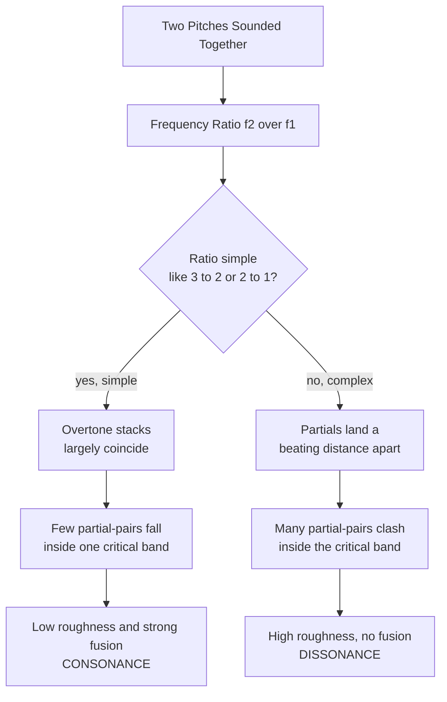

# 🎼 Intervals and Consonance

> [!abstract] TL;DR
> An **interval** is the distance between two pitches, measured both in **semitones** (0 to 12 within an octave) and by **name-plus-quality** (minor third, perfect fifth, tritone, and so on). Some intervals sound stable and "at rest" — **consonant** — while others sound tense and "wanting to move" — **dissonant**. That difference is not arbitrary: intervals whose fundamental frequencies form **simple whole-number ratios** (2:1 octave, 3:2 fifth, 4:3 fourth, 5:4 third) let the two tones' overtones *coincide* rather than *beat*, so few partials clash inside the ear's **critical band**. The **Plomp-Levelt** sensory-dissonance model turns that beating into a quantitative roughness curve whose valleys fall almost exactly on the intervals Western music has treated as consonant for a thousand years. Intervals are also the atoms from which **chords** and **scales** are built.

---

## Intuition

**Analogy — two picket fences.** Imagine sliding one picket fence in front of another and looking through both. When the two post-spacings are in a **simple ratio** — say every second post lines up (2:1), or every third against every second (3:2) — the posts snap into a clean, regularly repeating pattern that your eye reads as *orderly and stable*. Nudge one fence so the spacings are in some ugly ratio like 45:32 and the posts *almost* line up but never quite do; you get a restless, shimmering **moiré** that the eye finds agitated and unresolved.

Your **ear** does the auditory version of this every time two notes sound together. Each note is not a single frequency but a stack of overtones (its **harmonic series**). When the two fundamentals are in a simple ratio, whole columns of overtones **coincide** and the sound fuses into one smooth object — **consonance**. When the ratio is complex, overtones land a hair apart and "beat" against each other, producing the audible roughness we call **dissonance**. The picket-fence moiré *is* the beating; consonance is just the ratios at which the fences line up.

---

## How It Works

### Two ways to measure the same gap

An interval can be named two ways, and both matter:

1. **Chromatic size (semitones).** Count half-steps on a keyboard. The octave is divided into 12 equal semitones, so every interval has a number from 0 (unison) to 12 (octave).
2. **Diatonic name + quality.** Count *letter names* (a third spans three letters, C-D-E) and then refine with a **quality** word — *perfect, major, minor, augmented, diminished*. This is why C-E and C-D♯ can occupy the same 4 semitones yet be spelled and function differently (a major third versus an augmented second). Same distance in **equal temperament**, different musical meaning — the essence of **enharmonic equivalence**.

### Interval quality, inversion, and compounds

- **Quality families.** *Unison, fourth, fifth, octave* take **perfect / augmented / diminished**. *Seconds, thirds, sixths, sevenths* take **major / minor / augmented / diminished**. Widen a perfect or major interval by a semitone and it becomes **augmented**; narrow a perfect or minor one and it becomes **diminished**.
- **Inversion (the "rule of 9").** Flip the two notes (move the lower one up an octave) and the two sizes always sum to **9** — a third inverts to a sixth, a second to a seventh, a fourth to a fifth. Quality flips too: **major ↔ minor**, **augmented ↔ diminished**, while **perfect stays perfect**. Consonance is preserved under inversion, which is why thirds and sixths behave as a pair.
- **Simple vs compound.** A **simple** interval fits inside one octave; a **compound** interval exceeds it (a ninth is a compound second, a tenth a compound third). Musically a compound interval keeps the "flavour" of its simple form.
- **Harmonic vs melodic.** Sounded **together** an interval is **harmonic** (a vertical sonority); sounded **one-after-another** it is **melodic** (a horizontal step or leap). Consonance/dissonance is primarily a claim about the *harmonic* case.

### The physical basis of consonance

Simple frequency ratios do two things at once:

1. **Harmonic coincidence.** For a 3:2 fifth (e.g., 200 Hz and 300 Hz), the overtone series overlap heavily — 600, 1200 Hz partials are shared — so the composite spectrum is sparse and "clean."
2. **Critical-band roughness (Plomp-Levelt).** The cochlea analyses sound in overlapping **critical bands**. Two partials closer than about a critical bandwidth cannot be fully resolved; they **beat**, and beating near roughly one-quarter of a critical band produces maximum **sensory roughness**. Complex ratios sprinkle many partial-pairs into this danger zone; simple ratios keep them out. Helmholtz first attributed dissonance to this **beating** of upper partials in 1863; Plomp and Levelt (1965) made it quantitative.



---

## Key Concepts

### Secondary Level

**What an interval is.** The pitch distance between two notes, counted in **semitones**. The twelve intervals inside an octave, with their common names:

| Semitones | Interval (abbrev.) | Just-intonation ratio | Category |
|---|---|---|---|
| 0 | Perfect unison (P1) | 1:1 | Perfect consonance |
| 1 | Minor second (m2) | 16:15 | Dissonance |
| 2 | Major second (M2) | 9:8 | Dissonance |
| 3 | Minor third (m3) | 6:5 | Imperfect consonance |
| 4 | Major third (M3) | 5:4 | Imperfect consonance |
| 5 | Perfect fourth (P4) | 4:3 | Consonance (context-dependent) |
| 6 | Tritone (A4 / d5) | 45:32 or 7:5 | Dissonance |
| 7 | Perfect fifth (P5) | 3:2 | Perfect consonance |
| 8 | Minor sixth (m6) | 8:5 | Imperfect consonance |
| 9 | Major sixth (M6) | 5:3 | Imperfect consonance |
| 10 | Minor seventh (m7) | 9:5 or 16:9 | Dissonance |
| 11 | Major seventh (M7) | 15:8 | Dissonance |
| 12 | Perfect octave (P8) | 2:1 | Perfect consonance |

**Consonance vs dissonance.** Consonant intervals sound **stable and finished**; dissonant intervals sound **tense and unfinished**, creating the forward pull that makes music move. The traditional three-way split: **perfect consonances** (unison, octave, fifth), **imperfect consonances** (thirds, sixths), and **dissonances** (seconds, sevenths, the tritone).

**The octave and unison** are the most consonant intervals of all — a 2:1 octave sounds so fused that we give both notes the *same letter name* (octave equivalence).

**The tritone — the "devil's interval."** Exactly half an octave (6 semitones), the tritone (*diabolus in musica*) is the most unstable interval in the diatonic system. Medieval theorists warned against it; today it is the tense core of the **dominant seventh** chord that drives music home to the tonic.

### Undergraduate Level

**Interval quality precisely.** The quality is determined by the number of semitones *for a given letter-name distance*. A "third" (three letter names) is **major** at 4 semitones, **minor** at 3, **diminished** at 2, **augmented** at 5. This decoupling of *spelling* from *size* is why **enharmonic equivalence** exists: A♯ and B♭ are the same key on a piano but different spellings that imply different intervals and functions.

**Inversion in practice.** Because inversion sums to 9 and flips quality (perfect excepted), the consonant set is closed under inversion: fifth↔fourth, major third↔minor sixth, minor third↔major sixth. This symmetry underlies **invertible counterpoint** and chord-inversion theory.

**Just ratios and tuning systems.** The consonant ratios (2:1, 3:2, 4:3, 5:4, 6:5, 5:3, 8:5) come from the low harmonics and define **just intonation**. But you cannot tune a fixed keyboard so every key's fifths and thirds are pure — the ratios don't close (the "comma" problems). **Twelve-tone equal temperament (12-TET)** compromises: it makes every semitone exactly `2^(1/12)`, so the tempered fifth is `2^(7/12) ≈ 1.4983` rather than the pure `1.5`, and the tempered major third `2^(4/12) ≈ 1.2599` rather than `1.25`. The slight impurity is a controlled, distributed dissonance traded for the freedom to play in every key.

**The perfect fourth's special status.** Acoustically the 4:3 fourth is highly consonant, yet in **species counterpoint** a fourth *above the bass* is treated as a dissonance requiring resolution. This is the first hint that "consonance" splits into a **sensory** dimension (roughness, which the fourth passes) and a **musical/contextual** dimension (voice-leading function, which it can fail).

**Intervals build everything.** Stack two thirds and you get a **triad** (major third + minor third = major triad; the reverse = minor triad). Stack alternating whole and half steps and you get a **scale**. The quality of the thirds and the placement of the tritone are what give each chord and mode its character, so interval theory is the foundation beneath chords and scales.

### Graduate Level

**Three competing theories of consonance.**
1. **Beating / roughness (Helmholtz → Plomp-Levelt → Sethares).** Dissonance = sensory **roughness** from unresolved partials within critical bands. It predicts the classic dissonance curve and, crucially, makes consonance **timbre-dependent**: change the spectrum (inharmonic partials) and the consonant intervals move. Sethares (1993) used exactly this to design custom scales matched to inharmonic timbres (xenharmonic music).
2. **Harmonicity / tonal fusion (Stumpf, Terhardt).** Consonance = the degree to which the composite spectrum matches a single **harmonic series**, so the brain fuses it into one virtual pitch. This explains why octaves and fifths sound "as one" and connects to the **missing-fundamental** mechanism of pitch perception.
3. **Familiarity / statistical exposure (McDermott, and cross-cultural work).** Preference for consonant intervals correlates with individuals' exposure and sensitivity to harmonicity; some populations with little exposure to Western polyphony (e.g., the Tsimané) show weak or absent consonance preference, arguing part of the effect is **learned**, not purely sensory. Modern consensus: **roughness + harmonicity + enculturation** all contribute.

**Register dependence.** The same ratio is **rougher in the bass**. Critical bandwidth is roughly constant in hertz above ~500 Hz, so at low frequencies a given musical interval spans a *larger fraction* of a critical band's worth of beating partials — which is why composers voice close thirds high and spread intervals wide in the bass. A purely ratio-based theory cannot explain this; the critical-band model does.

**Sensory vs musical consonance.** These must be distinguished. *Sensory* (psychoacoustic) consonance is roughness, measurable in the lab, largely culture-free for the roughness component. *Musical* consonance is a **stylistic, functional** category: a suspension is a dissonance even when the interval is sensorily mild, and jazz voicings pile on sensory dissonance that trained listeners hear as stable. The Plomp-Levelt curve models the former, not the latter.

---

## Python Demo

The **Plomp-Levelt sensory-dissonance model** (Sethares parametrisation). Each note is a **harmonic complex tone** (a fundamental plus decaying overtones). We hold a root fixed at middle C and sweep a second complex tone from **unison up to the octave**, summing the roughness of every pair of partials. Roughness of a partial-pair peaks near a **critical-bandwidth beating distance** and vanishes at unison and at wide separations. The resulting curve **dips at the simple ratios** — and those dips land on exactly the consonant intervals. numpy and matplotlib only.

```python
import numpy as np
import matplotlib.pyplot as plt

# --- Plomp-Levelt roughness of TWO PURE tones (Sethares 1993 parametrisation) ---
# Roughness peaks near ~1/4 of a critical band apart, then decays to zero.
def pair_roughness(f1, f2, a1, a2):
    d_star = 0.24                 # position of maximum roughness (frac. of crit. band)
    s1, s2 = 0.0207, 18.96        # critical-band scaling constants
    b1, b2 = 3.5, 5.75            # two exponential decay rates
    fmin = np.minimum(f1, f2)
    df   = np.abs(f2 - f1)
    s    = d_star / (s1 * fmin + s2)
    loud = np.minimum(a1, a2)     # roughness scales with the quieter partial
    return loud * (np.exp(-b1 * s * df) - np.exp(-b2 * s * df))

# --- A harmonic complex tone: partial frequencies and (decaying) amplitudes ---
def complex_tone(f0, n_partials=6, rolloff=0.88):
    n     = np.arange(1, n_partials + 1)
    freqs = f0 * n
    amps  = rolloff ** (n - 1)
    return freqs, amps

# --- Total sensory dissonance between a fixed root and a swept upper tone ---
def total_dissonance(f_root, f_upper, n_partials=6):
    f1, a1 = complex_tone(f_root,  n_partials)
    f2, a2 = complex_tone(f_upper, n_partials)
    d = 0.0
    for i in range(len(f1)):          # every partial of the root ...
        for j in range(len(f2)):      # ... against every partial of the upper tone
            d += pair_roughness(f1[i], f2[j], a1[i], a2[j])
    return d

# --- Sweep the upper tone from unison (1:1) to the octave (2:1) ---
f_root = 261.63                        # middle C
ratios = np.linspace(1.0, 2.0, 1200)
diss   = np.array([total_dissonance(f_root, f_root * r) for r in ratios])
diss   = diss / diss.max()             # normalise to [0, 1]

# --- The classic consonant intervals, as just-intonation ratios ---
consonant = {
    "Unison 1:1":  1/1,
    "m3 6:5":      6/5,
    "M3 5:4":      5/4,
    "P4 4:3":      4/3,
    "P5 3:2":      3/2,
    "M6 5:3":      5/3,
    "Octave 2:1":  2/1,
}

# --- Plot the dissonance curve and mark the consonant dips ---
fig, ax = plt.subplots(figsize=(10, 5.5))
ax.plot(ratios, diss, color="#1f77b4", lw=2, label="Plomp-Levelt sensory dissonance")

for name, r in consonant.items():
    y = diss[np.argmin(np.abs(ratios - r))]   # dissonance value at that ratio
    ax.plot(r, y, "v", color="#d62728", ms=10)
    ax.annotate(name, xy=(r, y), xytext=(0, -18),
                textcoords="offset points", ha="center", fontsize=8, color="#d62728")

ax.set_xlabel("Interval size  (frequency ratio of upper tone to root)")
ax.set_ylabel("Relative sensory dissonance  (roughness)")
ax.set_title("Plomp-Levelt Dissonance Curve over One Octave\n"
             "Valleys fall on the simple-ratio consonant intervals")
ax.set_xlim(1.0, 2.0)
ax.set_ylim(0, 1.05)
ax.grid(True, ls="--", alpha=0.3)
ax.legend(loc="upper right")
plt.tight_layout()
plt.show()

# Expected output:
#   * A high roughness "hump" just above unison (partials beating within a
#     critical band) and another before the octave.
#   * Sharp DIPS exactly at 6:5, 5:4, 4:3, 3:2, 5:3, and deep minima at
#     1:1 and 2:1 -- the model reproduces the traditional consonance hierarchy
#     from pure acoustics, with no music theory hard-coded in.
```

---

## Real-World Applications

**Orchestration and voicing.** Arrangers instinctively obey the register-dependence of roughness: they voice close thirds and sixths in the upper register but **spread intervals wide in the bass**, because a low major third crams beating partials into a critical band and turns "muddy." The Plomp-Levelt curve is the physics behind that rule of thumb.

**Tuning systems and temperament.** The whole history of tuning — Pythagorean, meantone, well-temperament, 12-TET — is a negotiation between the pure consonant ratios and the impossibility of closing them on a fixed keyboard. Understanding intervals-as-ratios explains *why* a piano's thirds beat slightly and why a barbershop quartet or a string section, free of fixed tuning, drifts toward **just intonation** to lock in beat-free chords.

**Synthesis and xenharmonic scale design.** Sethares showed that because sensory consonance depends on **timbre**, you can build electronic timbres with stretched or inharmonic partials whose dissonance curve dips at *non-standard* ratios — enabling consonant music in exotic tunings (e.g., Bohlen-Pierce). This is a direct engineering use of the model demonstrated above.

**Audio mixing and arrangement.** Engineers space simultaneous instruments to avoid partials colliding in the same critical band ("frequency masking" and muddiness), a mixing-desk cousin of harmonic-interval spacing. Gamelan tuning deliberately exploits inharmonic metallophone spectra so that "shimmering" beats are an intended aesthetic, not a defect.

**Instrument tuning by beats.** Guitarists and piano tuners tune **by listening to the beat rate** between a target interval's coinciding partials — slowing the beats to zero produces a pure interval. That practical trick is Helmholtz's beating theory applied by ear.

---

## Common Pitfalls

- **Confusing semitone count with interval name.** Four semitones can be a **major third (C-E)** or an **augmented second (C-D♯)** — same distance, different spelling, quality, and function. Always count *letter names first*, then adjust quality. Enharmonic equivalence in 12-TET hides real theoretical distinctions.
- **Assuming consonance is purely simple ratios.** Equal temperament's "fifth" is `2^(7/12) ≈ 1.4983`, not `3:2` — yet it sounds fine. And cross-cultural studies show the *preference* for consonance is partly learned. Roughness, harmonicity, and enculturation all contribute; do not reduce consonance to a single number.
- **Ignoring register.** The same interval is far rougher in the bass than in the treble because critical bandwidth is roughly constant in hertz. A ratio-only view predicts identical consonance at all pitches, which is audibly false.
- **Treating the tritone as "just bad."** The tritone is dissonant *in isolation* but is the functional engine of tonal harmony — it defines the dominant seventh and its resolution. Dissonance is a *tool*, not a flaw.
- **Confusing sensory with musical consonance.** A suspension or a jazz voicing can be sensorily rough yet function as a point of rest, and a bare perfect fourth can be "dissonant" in strict counterpoint. The Plomp-Levelt curve models roughness, not musical function — never conflate the two.
- **Miscounting inversions.** Inverted interval sizes sum to **9, not 8** (a third inverts to a sixth). Forgetting this — and that quality flips major↔minor while perfect stays perfect — is the classic theory-exam error.

---

## Related Concepts

- [[Auditory_and_Speech_Perception]] — The critical-band, pitch, and missing-fundamental mechanisms this note relies on; also notes that **categorical perception occurs for musical intervals**, linking interval identity to speech-perception research.
- [[Auditory_System_and_Sound_Processing]] — The cochlea, the basilar membrane, and **critical bands** are the biological hardware that makes beating partials audible as roughness; the physiological substrate of the Plomp-Levelt model.
- [[Wave_Motion_and_Properties]] — Superposition and **beat frequencies** are the physics of two nearby partials adding and cancelling; Helmholtz's beating theory of dissonance is applied superposition.
- [[Digital_Audio_Fundamentals]] — Frequency, harmonics, and sampling — the representation in which the ratios and partials discussed here are actually computed and synthesised.
- [[Spectrograms_Features]] — The time-frequency view where an interval's coinciding and beating partials become directly visible as overlapping harmonic stacks.

---

## Review Questions

### Secondary

1. On a piano, what is the interval from C up to G in **semitones**, and what is its name and quality? Explain in one sentence why this interval sounds "stable" while C up to the neighbouring F♯ (the tritone) sounds "tense."

### Undergraduate

2. A major third spans 4 semitones and its just ratio is 5:4 (= 1.25), but in 12-tone equal temperament it is `2^(4/12) ≈ 1.2599`. (a) Invert the major third — what interval and quality do you get, and what do the two sizes sum to? (b) Explain why a fixed keyboard *cannot* tune every third and fifth to its pure ratio, and what 12-TET trades away to play in all keys. (c) Would you expect the tempered third to beat slightly? Why?

### Graduate

3. The Plomp-Levelt model reproduces the consonance hierarchy from roughness alone, yet three phenomena resist a pure roughness account: (i) the perfect fourth above the bass is "dissonant" in counterpoint despite its clean 4:3 spectrum; (ii) the same interval is rougher in the bass than the treble; and (iii) some populations show little preference for consonance. For each, name the additional mechanism or theory required (harmonicity/fusion, critical-bandwidth register effects, or enculturation) and explain how it complements — rather than replaces — the roughness model.

---

## Sources

- Helmholtz, H. von (1863/1885). *On the Sensations of Tone as a Physiological Basis for the Theory of Music* (trans. A. J. Ellis). — The foundational beating-of-upper-partials theory of dissonance.
- Plomp, R., & Levelt, W. J. M. (1965). Tonal consonance and critical bandwidth. *Journal of the Acoustical Society of America*, 38(4), 548-560. — The empirical critical-band model of sensory dissonance.
- Sethares, W. A. (1993/2005). *Tuning, Timbre, Spectrum, Scale*. Springer. — The dissonance-curve algorithm used in the demo and the timbre-dependence of consonance.
- Terhardt, E. (1974). Pitch, consonance, and harmony. *Journal of the Acoustical Society of America*, 55(5), 1061-1069. — The harmonicity/tonal-fusion complement to roughness.
- McDermott, J. H., Lehr, A. J., & Oxenham, A. J. (2010). Individual differences reveal the basis of consonance. *Current Biology*, 20(11), 1035-1041. — Evidence that harmonicity and exposure, not roughness alone, drive consonance preference.
- Kostka, S., Payne, D., & Almén, B. (2018). *Tonal Harmony* (8th ed.). McGraw-Hill. — Standard reference for interval naming, quality, inversion, and the consonance/dissonance classification.

---

#music-theory #intervals #consonance #dissonance #plomp-levelt
