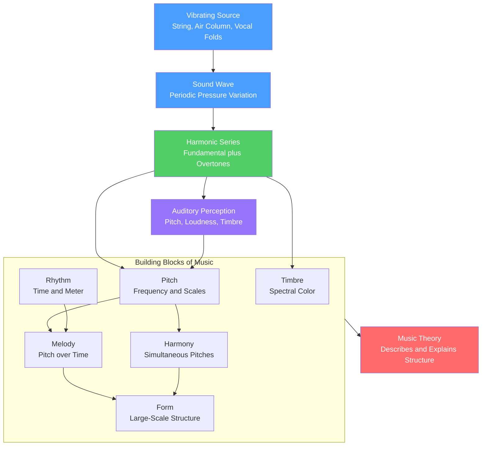

# 🎼 Music Theory Overview

> [!abstract] TL;DR
> Music theory is the systematic study of how music is built — how pitch, rhythm, melody, harmony, timbre, and form are organised — and *why* those structures work the way they do. It is simultaneously **descriptive** (it codifies what composers and cultures actually do) and grounded in **physics, mathematics, and cognition** (small-integer frequency ratios sound consonant, the harmonic series shapes our scales, and perception decides what counts as "the same" note). This overview surveys the building blocks and maps the six sections of this vault.

---

## Intuition

**Analogy first.** Think of music theory as the **grammar of a language you already speak fluently but have never diagrammed**. A three-year-old forms correct sentences without knowing what a "subordinate clause" is; likewise, most people can tell when a song resolves, when a rhythm is "off," or when a singer is flat, long before they can name a dominant seventh chord. Music theory is the linguistics of that intuition: it does not *invent* the rules, it *observes and explains* the ones your ear already enforces. Just as grammar reveals that "the cat sat" and "sat the cat the" use the same words but only one is well-formed, theory reveals why C-E-G sounds stable and C-C#-D sounds like a cluster of tension.

The twist that makes music special among languages is that its "grammar" is anchored in **physics**. When a guitar string vibrates it does not produce one frequency — it produces a **fundamental plus a whole-number ladder of overtones** (the harmonic series). Two notes whose fundamentals share many of those overtones (a ratio like 2:1 or 3:2) fuse pleasantly; notes that share few (like 45:32) clash. So the "grammar" of harmony is partly a *report on the acoustics of vibrating objects* and partly a *report on how the human auditory system groups and prefers those vibrations*. Music theory lives exactly at that seam between the world's physics and the ear's psychology.

---

## How It Works

Music theory sits at the meeting point of three domains and describes six building blocks. **Physics** supplies the raw material: a vibrating source radiates a periodic pressure wave whose energy is distributed across a fundamental and its overtones. **Perception** turns that wave into experienced qualities — pitch, loudness, and timbre — and imposes strong regularities (octave equivalence, the missing fundamental, critical-band roughness). **Convention** then organises those percepts into culturally learned systems of scales, chords, meters, and forms. Music theory is the codification of the whole chain.

The building blocks it studies are:

1. **Pitch** — how high or low a note is, tied to frequency; organised into scales and keys.
2. **Rhythm** — the organisation of events in time: beat, tempo, meter, subdivision.
3. **Melody** — a succession of single pitches perceived as a coherent line.
4. **Harmony** — pitches sounding *together*: intervals, chords, and progressions.
5. **Timbre** — the "colour" of a sound, determined mainly by its spectral envelope and how it evolves over time; why a violin and a flute playing the same note sound different.
6. **Form** — the large-scale architecture: phrases, sections, and whole-movement designs (verse-chorus, binary, sonata).



**The dual nature.** Read the diagram two ways. Bottom-up, it is a **physical-perceptual** account: vibrations become spectra become percepts become the raw ingredients of scales and chords. That is the "why it works" half — acoustics and cognition. Top-down, music theory is **descriptive and analytical**: given the finished music of Bach, a Beatles song, or a raga, it names the patterns and explains the choices. Neither half is complete alone. Pure acoustics cannot tell you why a Neapolitan chord resolves the way it does in a specific style; pure convention cannot tell you why octaves sound "the same" across every culture on Earth. Good theory keeps both in view.

**How this vault is organised (6 sections).**

1. **Foundations of Music Theory** (this section) — pitch and frequency, notation and the staff, the harmonic series, and the acoustic/cognitive basis of the whole subject.
2. **Rhythm and Meter** — beat, tempo, time signatures, subdivision, syncopation, and polyrhythm.
3. **Scales, Intervals and Tuning** — intervals as ratios, diatonic scales and modes, and tuning systems from Pythagorean and just intonation to 12-tone equal temperament.
4. **Harmony and Chords** — triads and seventh chords, functional harmony (tonic-subdominant-dominant), voice leading, and chord progressions.
5. **Melody, Counterpoint and Form** — melodic construction, species counterpoint, phrase structure, and musical forms.
6. **Analysis, Cognition and World Music** — Schenkerian and post-tonal analysis, music perception and expectation, and non-Western systems (maqam, raga, gamelan).

---

## Key Concepts

### Secondary Level

**A note has a pitch, and pitch tracks frequency.** Press a piano key and it plays a **note** — a sound with a definite highness or lowness called **pitch**. Higher pitch means faster vibration (higher frequency in hertz). The note we call **A4** is standardised at **440 Hz** (concert pitch).

**The octave is music's most fundamental relationship.** Double a frequency and you get a note that sounds like "the same note, higher" — 220 Hz, 440 Hz, and 880 Hz are all **A**. This **octave equivalence** is why note names repeat (C, D, E ... then C again) and it holds across virtually every musical culture.

**Twelve notes fill the octave in Western music.** The **chromatic scale** divides the octave into 12 equal steps (semitones): C, C#, D, D#, E, F, F#, G, G#, A, A#, B, then C again. A **scale** is a chosen subset of these (the major scale picks 7), and a **key** is a scale used as the tonal "home base" of a piece.

**Rhythm is pitch's partner in time.** The **beat** is the steady pulse you tap your foot to; **tempo** is how fast it goes (beats per minute); **meter** groups beats into repeating patterns (groups of 3 give a waltz, groups of 4 give most pop songs). Notes have **durations** (whole, half, quarter) that fit into that grid.

**Chords stack notes; melody strings them out.** Play three or more notes together and you get a **chord** (C-E-G is a C major triad); play notes one after another and you get a **melody**. Harmony is the study of chords and how they connect.

**Timbre is why instruments sound different.** A trumpet and a violin can play the exact same pitch yet sound nothing alike. That difference in "tone colour" is **timbre**, and it comes mostly from the *mix of overtones* each instrument produces and how the sound starts and fades.

### Undergraduate Level

**The harmonic series is the acoustic backbone.** A vibrating string or air column produces a fundamental frequency *f* plus overtones at 2*f*, 3*f*, 4*f*, and so on. The amplitudes of these harmonics define timbre, and — crucially — the *intervals between the early harmonics* are the intervals our scales are built from: the octave (2:1), perfect fifth (3:2), perfect fourth (4:3), and major third (5:4) all appear in the first six harmonics. Scales are, in part, an attempt to fill the octave with notes that echo these consonant ratios.

**Intervals are frequency ratios.** Consonance correlates with simple ratios. The **perfect fifth** is 3:2 (1.5), the **perfect fourth** 4:3, the **major third** 5:4. The more complex the ratio, the more the tones' overtones fall close together and beat, producing perceived roughness. This is the quantitative heart of consonance and dissonance.

**Equal temperament trades pure ratios for flexibility.** In **12-tone equal temperament (12-TET)** each semitone is exactly the ratio 2^(1/12) ≈ 1.05946, so twelve of them multiply to a perfect 2:1 octave. This makes *every* key equally usable (you can modulate anywhere and transpose freely) at the cost of every interval except the octave being *slightly* out of tune relative to its pure ratio. The equal-tempered fifth (1.4983) is close to but not exactly 3:2; the equal-tempered major third (1.2599) is noticeably sharper than 5:4. Just intonation keeps the pure ratios but only in a limited set of keys.

**The MIDI pitch equation formalises the piano keyboard.** Any note can be indexed by an integer *n* (MIDI note number, with A4 = 69) and its frequency computed as **f = 440 · 2^((n − 69)/12)**. This single logarithmic formula encodes octave equivalence (add 12 to *n* and *f* doubles) and equal temperament in one line — see the Python demo.

**Diatonic scales and modes.** The **major scale** is a specific pattern of whole and half steps (W-W-H-W-W-W-H). Rotating that pattern to start on each degree yields the seven **modes** (Ionian, Dorian, Phrygian, Lydian, Mixolydian, Aeolian, Locrian). The **minor** scale is the Aeolian mode. These are the raw pitch collections most Western melody and harmony draw on.

**Functional harmony.** In tonal music, chords take on *functions* relative to the key's home chord (the **tonic**). The **dominant** (built on the fifth degree) creates tension that pulls strongly back to the tonic — the V–I cadence is the fundamental gesture of Western tonality. Subdominant, predominant, and secondary-dominant functions extend this grammar of tension and resolution.

**Form and the logarithmic ear.** Pitch perception is **logarithmic**: equal *ratios* sound like equal musical *steps*, not equal Hz differences. The octave from 220 to 440 Hz (a 220 Hz gap) and the octave from 440 to 880 Hz (a 440 Hz gap) feel identical in size. This is why we plot music on a log-frequency axis and why the MIDI equation uses an exponent.

### Graduate Level

**The commas: why perfect tuning is impossible.** Stacking twelve pure 3:2 fifths overshoots seven octaves by the **Pythagorean comma** (ratio 531441:524288 ≈ 23.5 cents). Stacking four pure fifths versus one pure 5:4 major third differ by the **syntonic comma** (81:80 ≈ 21.5 cents). No tuning can make all fifths *and* all thirds pure *and* close the octave — this impossibility is the mathematical reason temperaments exist. Historical **meantone**, **well-temperaments**, and modern **equal temperament** are all different compromises distributing these commas.

**Psychoacoustic models of consonance.** Helmholtz (1863) attributed dissonance to **beating between adjacent overtones**. Plomp and Levelt (1965) quantified this: two partials sound rough when their separation is a fraction of the **critical band**, and the total dissonance of a chord is the summed roughness of all partial pairs. This reframes consonance as *timbre-dependent*: on instruments with inharmonic spectra (gamelan metallophones, bells), the most consonant intervals are *not* the small-integer ratios — Sethares showed you can design a spectrum to match any desired scale, decoupling consonance from simple arithmetic.

**Cognition, statistics, and expectation.** Krumhansl's probe-tone experiments revealed a stable **tonal hierarchy** — listeners rate the tonic as most stable, then the fifth and third, matching the statistics of tonal music. Huron's *Sweet Anticipation* (2006) grounds musical affect in **prediction**: the pleasure and tension of harmony arise from expectations formed by statistical learning of a style, and from the interplay of expected versus actual events. This is the cognitive-science face of theory — the "grammar" is partly a learned probability distribution over musical events.

**Post-tonal and transformational theory.** When music abandons a tonal centre (Schoenberg, Webern), classical functional harmony no longer applies. **Pitch-class set theory** (Forte) treats the 12 pitch classes as an integer set (mod 12) and analyses music via set classes, interval vectors, and operations of transposition and inversion. **Neo-Riemannian** and **transformational theory** (Lewin, Cohn) model harmony as *motions* in geometric spaces (e.g., the Tonnetz), and Tymoczko's *A Geometry of Music* (2011) recasts voice leading as paths through orbifolds — theory as literal geometry.

**Analytical hierarchy: Schenker.** Schenkerian analysis posits that tonal works are elaborations (prolongations) of a simple underlying structure (the *Ursatz*), organised in **structural levels** from foreground surface to deep background. It is the music-theoretic analogue of a hierarchical grammar and remains influential and contested.

**World music systems.** Western 12-TET is one solution among many. Arabic and Turkish **maqam** systems use intervals smaller than a semitone (quarter tones, and unequal microtonal steps). Indian classical **raga** organises melody around fixed drone-referenced *shruti* and characteristic phrases, not chord functions. Indonesian **gamelan** uses **slendro** and **pelog** tunings that vary from ensemble to ensemble and pair with inharmonic metallic timbres. Treating these as "out of tune" versions of the Western system is a category error — they are internally coherent, cognition-grounded alternatives.

---

## Python Demo

Three panels tie the acoustics of pitch and timbre to the mathematics of the chromatic scale. Panels 1 and 2 show two tones at the **same pitch** (A4 = 440 Hz) but different **timbre**: a pure sine (a single frequency) versus a harmonically rich tone (fundamental plus overtones with 1/n falloff, a sawtooth-like spectrum). Panel 3 applies the MIDI equation **f = 440 · 2^((n − 69)/12)** to map one octave of the chromatic scale (C4 to C5) and shows the octave doubling. numpy and matplotlib only.

```python
import numpy as np
import matplotlib.pyplot as plt

# ---------------------------------------------------------------
# 1 & 2. Two tones of the SAME pitch (A4 = 440 Hz), different timbre.
# ---------------------------------------------------------------
fs   = 44100                                  # audio sample rate (Hz)
dur  = 0.02                                    # 20 ms so we see a few cycles
t    = np.linspace(0, dur, int(fs * dur), endpoint=False)
f0   = 440.0                                   # fundamental: A4

# Pure sine tone: one frequency, plain timbre.
pure = np.sin(2 * np.pi * f0 * t)

# Harmonic-rich tone: fundamental + harmonics with 1/n amplitude falloff.
harmonics = np.arange(1, 11)                   # harmonics 1..10
amps      = 1.0 / harmonics                    # 1/n amplitude (sawtooth-like)
rich = sum(a * np.sin(2 * np.pi * (n * f0) * t)
           for n, a in zip(harmonics, amps))
rich = rich / np.max(np.abs(rich))             # normalise to [-1, 1]

# ---------------------------------------------------------------
# 3. MIDI note -> frequency:  f = 440 * 2**((n - 69) / 12)
#    Map one octave: MIDI 60 (C4) up to 72 (C5).
# ---------------------------------------------------------------
def midi_to_freq(n):
    return 440.0 * 2.0 ** ((n - 69) / 12.0)

midi_notes = np.arange(60, 73)                 # C4 .. C5 inclusive (13 notes)
freqs      = midi_to_freq(midi_notes)
names      = ['C4', 'C#4', 'D4', 'D#4', 'E4', 'F4', 'F#4',
             'G4', 'G#4', 'A4', 'A#4', 'B4', 'C5']

# ---------------------------------------------------------------
# Plot
# ---------------------------------------------------------------
fig, ax = plt.subplots(1, 3, figsize=(15, 4.4))

ax[0].plot(t * 1000, pure, color='#1f77b4', lw=1.5)
ax[0].set_title('Pure Sine Tone at 440 Hz\nsingle frequency  =  plain timbre')
ax[0].set_xlabel('Time (ms)')
ax[0].set_ylabel('Amplitude')
ax[0].set_ylim(-1.15, 1.15)
ax[0].grid(True, ls='--', alpha=0.3)

ax[1].plot(t * 1000, rich, color='#d62728', lw=1.5)
ax[1].set_title('Harmonic-Rich Tone at 440 Hz\nfundamental + 9 harmonics  =  full timbre')
ax[1].set_xlabel('Time (ms)')
ax[1].set_ylim(-1.15, 1.15)
ax[1].grid(True, ls='--', alpha=0.3)

x = np.arange(len(freqs))
ax[2].plot(x, freqs, color='#2ca02c', alpha=0.4, zorder=1)
ax[2].scatter(x, freqs, color='#2ca02c', zorder=3)
ax[2].axhline(midi_to_freq(60), color='gray', ls=':', lw=1)
ax[2].axhline(midi_to_freq(72), color='gray', ls=':', lw=1)
ax[2].set_title('Chromatic Scale, One Octave C4 to C5\nf = 440 * 2^((n-69)/12)')
ax[2].set_xticks(x)
ax[2].set_xticklabels(names, rotation=45, ha='right', fontsize=8)
ax[2].set_ylabel('Frequency (Hz)')
ax[2].grid(True, ls='--', alpha=0.3)

plt.tight_layout()
plt.show()

# The octave doubles exactly: C5 is precisely twice C4.
print(f"C4 = {midi_to_freq(60):7.2f} Hz")
print(f"A4 = {midi_to_freq(69):7.2f} Hz   (concert-pitch anchor)")
print(f"C5 = {midi_to_freq(72):7.2f} Hz   (exactly 2x C4)")

# Expected output:
#   * Panel 1: a smooth single sine wave (~9 cycles in 20 ms).
#   * Panel 2: same period/pitch but a jagged, sawtooth-like waveform
#              (same fundamental, extra overtones -> different timbre).
#   * Panel 3: an upward-curving (exponential) frequency map;
#              C5 sits at exactly double the height of C4.
```

---

## Real-World Applications

**Digital synthesis, MIDI, and DAWs.** Every synthesizer and digital audio workstation is applied music theory plus acoustics. **MIDI** encodes notes as the integer *n* of the pitch equation; synthesis engines build timbres by adding harmonics (additive synthesis), filtering harmonic-rich waves (subtractive), or modulating frequency (FM). The pure-vs-rich tone contrast in the demo is literally the difference between a raw oscillator and a filtered patch.

**Pitch correction and Auto-Tune.** Software like Auto-Tune and Melodyne detects a singer's fundamental frequency, compares it to the nearest note of a chosen scale (using the same equal-tempered grid), and shifts the pitch. It is music theory (scales, keys) fused with signal processing (pitch tracking, resynthesis).

**Music information retrieval (MIR).** Shazam-style audio fingerprinting, automatic key and chord detection, beat tracking, and recommendation systems all rest on theoretic constructs. Chord-recognition models classify against a vocabulary of triads and sevenths; key-finding algorithms (Krumhansl-Schmuckler) correlate a piece's pitch-class histogram against the empirically measured tonal hierarchy.

**Instrument design and tuning.** Piano tuners apply **stretched tuning** because real strings are slightly inharmonic; organ builders and electronic-instrument designers choose among temperaments. Sethares' spectrum-scale matching is used to design instruments and scales for inharmonic sources like tuned percussion.

**Generative and AI music.** Models from rule-based algorithmic composition to neural systems (e.g., Transformer-based symbolic and audio generators) are trained on or constrained by theoretic structure — key, meter, chord function, and form — which shapes both their training representations and their evaluation.

---

## Common Pitfalls

- **Confusing pitch with frequency.** Pitch is a *perceptual* attribute, not a raw number. The **missing fundamental** proves it: play only the harmonics 400, 600, 800 Hz and listeners still hear a 200 Hz pitch. Frequency is physical; pitch is what the brain computes from the harmonic pattern.
- **Treating A = 440 Hz as a law of nature.** Concert pitch is a *convention*. Baroque ensembles often use A ≈ 415 Hz; some orchestras tune to 442 or 443 Hz. The letter name maps to a frequency only after you fix a reference and a temperament.
- **Assuming equal temperament is "perfectly in tune."** In 12-TET *every* interval except the octave is slightly detuned from its pure ratio. It is a deliberate compromise that buys the freedom to play in all keys — not an acoustic ideal. Beginners who assume "in tune = equal temperament" miss why just intonation and historical temperaments exist.
- **Equating equal frequency steps with equal musical steps.** Pitch is logarithmic. A 100 Hz rise from 100 to 200 Hz is an octave; the same 100 Hz rise from 1000 to 1100 Hz is barely a whole step. Always reason in *ratios*, not differences.
- **Reducing timbre to waveform shape alone.** Timbre depends on the spectral envelope *and* its evolution over time — the attack transient, decay, and vibrato matter as much as the steady-state overtone mix. Two sounds with identical static spectra but different attacks are easily told apart.
- **Mistaking Western tonal theory for universal music theory.** Functional harmony, the 12-note chromatic scale, and equal temperament are one culture's solution. Maqam, raga, and gamelan use different intervals, different organising principles, and sometimes inharmonic timbres. They are not defective approximations of the Western system.

---

## Related Concepts

**Acoustics and the harmonic series (Signals & Systems)**
- [[Fourier_Series]] — Decomposes any periodic tone into a fundamental plus integer-multiple harmonics; this *is* the mathematical statement of the harmonic series behind timbre and consonance.
- [[Frequency_Spectrum]] — The spectral view of a sound where a note's fundamental and overtones appear as discrete lines; timbre is a spectrum's shape.
- [[DFT_and_FFT]] — The computational tool that extracts pitch and spectrum from a recorded signal, underlying pitch detection and MIR.
- [[Fourier_Transform]] — Generalises harmonic analysis to non-periodic and transient sounds, essential for analysing attacks and inharmonic timbres.

**Physics of vibration and sound (Physics)**
- [[Oscillations_and_SHM]] — Simple harmonic motion is the elementary vibration whose superposition builds every musical tone.
- [[Wave_Motion_and_Properties]] — Standing waves on strings and in air columns explain why instruments produce a discrete harmonic series.
- [[Waves_in_Fluids_and_Acoustics]] — The acoustics of sound propagation, resonance, and the pressure waves that carry music to the ear.

**Digital representation and audio analysis (Audio & Speech)**
- [[Digital_Audio_Fundamentals]] — Sampling, bit depth, and the Nyquist limit: how the tones in the demo become numbers a computer can process.
- [[STFT_and_Windowing]] — Short-time analysis that tracks how pitch and timbre change over time, the front end of most music analysis.
- [[Spectrograms_Features]] — Time-frequency images where melody, harmony, and rhythm become visible for MIR and machine learning.
- [[Mel_Filterbank_MFCCs]] — Perceptually warped features that approximate the ear's frequency resolution, used in music tagging and genre classification.

**Perception and cognition (Cognitive Science)**
- [[Auditory_and_Speech_Perception]] — How the brain turns a pressure wave into pitch, timbre, and streams; the missing fundamental and critical-band roughness that ground consonance live here.

---

## Review Questions

### Secondary

1. A tuning fork vibrates at 440 Hz. Another sounds "the same note but higher." Give the most likely frequency of the second fork and name the interval between them. Why do musicians give both notes the same letter name?

### Undergraduate

2. Using the equation f = 440 · 2^((n − 69)/12), compute the frequency of the note a perfect fifth (7 semitones) above A4, and compare it to the pure just-intonation fifth (ratio 3:2 above 440 Hz). By how many hertz do they differ, and what does that gap illustrate about equal temperament? Then explain why a pure sine and a sawtooth wave at 440 Hz have the *same* pitch but *different* timbre.

### Graduate

3. Helmholtz and Plomp-Levelt model consonance as the absence of roughness between overtones, which predicts small-integer ratios sound consonant *because* harmonic instruments have harmonic spectra. (a) Explain how Sethares' spectrum-scale matching uses this to argue consonance is timbre-dependent rather than purely arithmetic, and what that implies for gamelan tunings. (b) Contrast this acoustic account of consonance with Krumhansl's and Huron's *cognitive* account of tonal stability and expectation. Are the two competing or complementary explanations of why certain sounds feel "right"?

---

## Sources

- Helmholtz, H. von (1885/1954). *On the Sensations of Tone as a Physiological Basis for the Theory of Music* (A. J. Ellis, trans.). Dover. — The founding text linking acoustics, the harmonic series, and consonance.
- Benward, B., & Saker, M. (2014). *Music in Theory and Practice* (9th ed.). McGraw-Hill. — Standard undergraduate survey of pitch, rhythm, harmony, and form.
- Sethares, W. A. (2005). *Tuning, Timbre, Spectrum, Scale* (2nd ed.). Springer. — Quantitative treatment of consonance, temperament, and spectrum-scale matching.
- Krumhansl, C. L. (1990). *Cognitive Foundations of Musical Pitch*. Oxford University Press. — Empirical basis of the tonal hierarchy and key-finding.
- Huron, D. (2006). *Sweet Anticipation: Music and the Psychology of Expectation*. MIT Press. — Statistical-learning and prediction account of musical affect.
- Tymoczko, D. (2011). *A Geometry of Music*. Oxford University Press. — Modern geometric and voice-leading perspective on tonal and post-tonal theory.

---

#music-theory #music #harmony #acoustics
