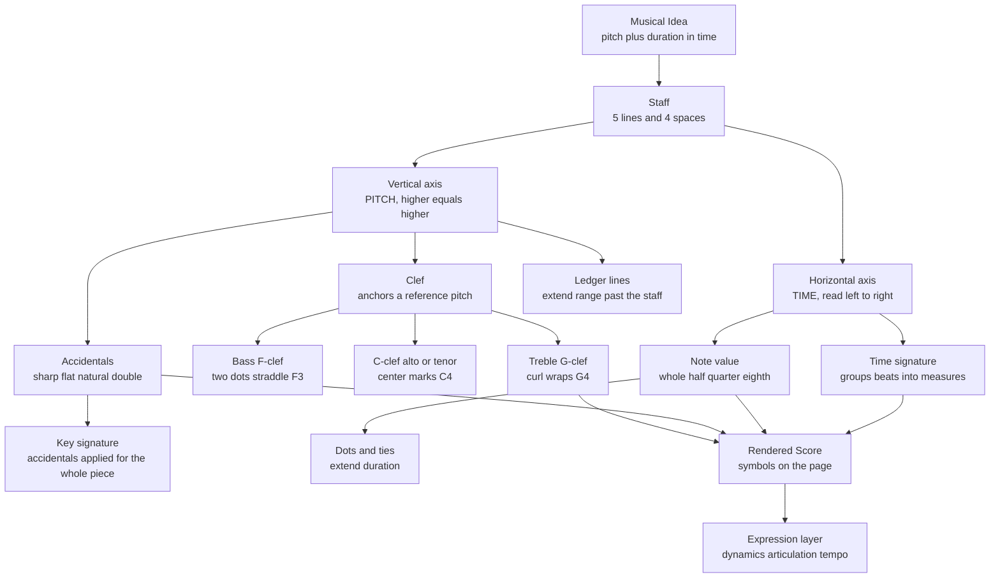

# 🎼 Notation and the Staff

> [!abstract] TL;DR
> Western staff notation is a two-dimensional graph: **vertical position encodes pitch** (up is higher) and **horizontal position encodes time** (left to right). A **clef** calibrates the vertical axis to real pitches, note-head shapes and stems encode **duration**, and a small vocabulary of accidentals, key signatures, and expression marks fills in the rest. It is a compact, lossy, but extraordinarily durable instruction format for reproducing music.

## Intuition

**Analogy first:** think of a piece of sheet music as a **scatter plot printed sideways**. The five horizontal lines of the staff are like faint gridlines on a chart. The **y-axis is pitch** — a dot placed higher on the page means a higher note, exactly the way a taller bar means a bigger number. The **x-axis is time** — you read left to right, and how far apart two dots sit horizontally tells you their rhythmic spacing. A melody is just a path traced across this pitch-vs-time plane.

Everything else in notation is annotation *on top of* that graph: the **clef** is the legend that says "this line means the pitch G4"; the **shape** of each dot (open, filled, flagged) tells you how long to hold it; **sharps and flats** nudge a dot up or down by a semitone without moving it off its line. Once you see the staff as a labelled graph, the symbols stop being arbitrary and start being coordinates.

This is not a loose metaphor. A modern **piano roll** in any DAW (Digital Audio Workstation) is literally this graph with the decoration stripped away — horizontal bars on a pitch-vs-time grid — which is why it is the natural computational representation of the same information.

## How It Works

Staff notation solves one core problem: **how do you write down a sound so a stranger centuries later can reproduce it?** It does so by fixing a coordinate system and layering symbols onto it.

1. **The staff (stave)** is **five lines and four spaces**. Each line and each space is one *diatonic step* (a letter name). Moving from a space to the adjacent line moves you one step up the musical alphabet.
2. **The musical alphabet** cycles through seven letters — **A B C D E F G** — then repeats an octave higher. Only seven letters exist because Western music is built on **seven-note diatonic scales**; the black keys are spelled as alterations of these letters, not as new names.
3. **A clef** anchors the otherwise-abstract lines to concrete pitches. Without a clef the staff is just five blank lines; the clef says "*this* line is G4" (treble) or "*this* line is F3" (bass), and every other position follows.
4. **Duration** is encoded by note-head fill, stems, and flags, using a strict **halving system**: each note value is exactly half the length of the one above it (whole → half → quarter → eighth → sixteenth ...).
5. **Time signatures** group beats into measures (bars), and **accidentals / key signatures** shift pitches chromatically. Layered on top, **dynamics, articulation, and tempo marks** describe *how* to perform the notes.

The result is read as a stream: scan left to right, and at each horizontal position read the vertical coordinate (through the clef) to get pitch and the note shape to get duration.



## Key Concepts

### Secondary (foundational)

**The staff and note placement.** Five lines, four spaces. In **treble clef**, the lines from bottom to top spell **E G B D F** (mnemonic: "Every Good Boy Deserves Fudge") and the spaces spell **F A C E**. In **bass clef**, lines spell **G B D F A** and spaces spell **A C E G**.

**Clefs and why they exist.** A single staff covers only about an octave-and-a-half comfortably. Different instruments and voices live in different registers, so notation uses **movable reference symbols** so that most notes land *on* the staff rather than floating far above or below it:

| Clef | Symbol origin | Anchors | Typical users |
|------|---------------|---------|---------------|
| Treble (G-clef) | stylised letter **G** | curl centres on **G4** (2nd line up) | violin, flute, right-hand piano, soprano/alto voice, guitar (sounds an octave lower) |
| Bass (F-clef) | stylised letter **F** | two dots straddle **F3** (2nd line down) | cello, bassoon, tuba, left-hand piano, bass/baritone voice |
| Alto (C-clef) | stylised letter **C** | centre marks **C4** (middle line) | viola |
| Tenor (C-clef) | stylised letter **C** | centre marks **C4** (2nd line down) | high cello/bassoon/trombone passages |

The clef exists precisely to **keep pitches near the staff and minimise ledger lines**.

**Note names and octaves — Scientific Pitch Notation (SPN).** Every pitch gets a letter **A–G** plus an **octave number**: **C4 is middle C**. The octave number increments at each C, so B3 is immediately below C4, and A4 = 440 Hz is the standard tuning reference. This letter-plus-number scheme is the same one MIDI and audio software use.

**Ledger lines.** Short line-segments drawn above or below the staff to notate pitches outside its five-line range. **Middle C (C4)** sits on the first ledger line *below* the treble staff and the first ledger line *above* the bass staff — which is why the treble and bass staves of a piano grand staff meet at middle C.

**Accidentals.** Symbols that shift a pitch chromatically for the rest of the measure:

| Symbol | Name | Effect |
|--------|------|--------|
| ♯ | sharp | raise by one semitone |
| ♭ | flat | lower by one semitone |
| ♮ | natural | cancel a previous sharp/flat |
| 𝄪 | double sharp | raise by two semitones (whole tone) |
| 𝄫 | double flat | lower by two semitones |

**Note durations — the halving system.** Each value is half the previous:

| Note | Rest | Relative length |
|------|------|-----------------|
| Whole (semibreve) | 𝄻 | 4 beats (in 4/4) |
| Half (minim) | 𝄼 | 2 beats |
| Quarter (crotchet) | 𝄽 | 1 beat |
| Eighth (quaver) | 𝄾 | ½ beat |
| Sixteenth (semiquaver) | 𝄿 | ¼ beat |

**Dots and ties.** A **dot** after a note adds **half its value** (a dotted half = 2 + 1 = 3 beats). A **tie** joins two notes of the same pitch into one sustained duration, and is the only way to sustain a note across a bar-line.

### Undergraduate

**Transposing clefs and instruments.** Guitar and tenor voice use a treble clef with a small **8** below it — they *sound* an octave lower than written. Many wind/brass instruments are *transposing*: a written C on a B♭ trumpet sounds a B♭. Notation deliberately separates the **written** pitch from the **sounding** pitch to keep fingerings consistent across an instrument family.

**Key signatures and the circle of fifths.** Instead of writing an accidental on every altered note, a **key signature** at the start of each staff declares a set of sharps or flats that apply throughout. Sharps are added in the order **F C G D A E B**; flats in the reverse order **B E A D G F C**. The *number* and *type* of accidentals identifies the key and its relative minor — a direct visual encoding of scale structure (see the companion note on scales and modes).

**Enharmonic equivalence.** F♯ and G♭ sound identical on a piano (in 12-tone equal temperament) but are **spelled differently** because they play different *functional* roles. Notation preserves spelling because the letter name carries harmonic meaning that a raw frequency does not.

**Time signatures.** Two stacked numbers: the **top** counts beats per measure, the **bottom** names the beat unit (4 = quarter, 8 = eighth). **Simple** meters (2/4, 3/4, 4/4) subdivide the beat into two; **compound** meters (6/8, 9/8, 12/8) group beats in threes. The deeper mechanics of pulse, grouping, and tempo live in the companion rhythm note.

**Dynamics, articulation, and expression.**

| Category | Examples | Meaning |
|----------|----------|---------|
| Dynamics | *pp p mp mf f ff* | soft → loud (pianissimo to fortissimo) |
| Change | crescendo, diminuendo, *sfz* | get louder / softer, sudden accent |
| Articulation | staccato (dot), legato (slur), accent, tenuto | how each note is attacked and released |
| Tempo | *Adagio, Andante, Allegro, Presto*; ♩ = 120 | speed, often with an explicit metronome mark |
| Expression | *dolce, espressivo, rubato* | interpretive character |

### Graduate

**Notation is a lossy encoding.** Staff notation quantises a continuous acoustic performance onto a **discrete grid**: 12 pitches per octave (assuming equal temperament) and dyadic rhythmic subdivisions. It cannot natively express **microtonality**, **just-intonation** ratios, continuous glissandi, or nuanced *rubato* — these require extra symbols, text, or convention. Notation is therefore best understood as **prescriptive instructions plus a shared performance-practice tradition**, not a complete recording.

**Historical arc.** Western notation evolved from **neumes** (9th-century gestural marks above text) → **Guido d'Arezzo's staff and solmisation** (~1025, which fixed relative pitch and gave us do-re-mi) → **mensural notation** (encoding duration) → the modern five-line staff standardised over the Baroque and Classical eras. Each step traded expressive freedom for **reproducibility and precision**.

**Extended and graphic notation.** 20th-century composers (Cage, Penderecki, Crumb, Berio) pushed beyond the staff with **graphic scores**, **proportional/spatial notation** (physical distance = literal time), tone clusters, and instrument-specific tablature-like glyphs — explicit acknowledgements of the staff's expressive limits.

**Computational and alternative notations.** The staff has machine-readable descendants and cousins:

| System | Encodes | Notes |
|--------|---------|-------|
| **MIDI** | pitch (note number), velocity, onset/offset time | event stream, not a rendering; the digital lingua franca of note data |
| **Piano roll** | pitch-vs-time bars | visual form of MIDI; the DAW equivalent of the staff |
| **MusicXML / MEI** | full engraved score semantics | interchange formats between notation programs |
| **Tablature (tab)** | *where to put fingers* (string + fret) | ignores absolute pitch; instrument-specific |
| **Solfège / movable-do** | *scale-degree function* | do-re-mi relative to the tonic; great for ear training |
| **Nashville Number System** | chords as scale degrees (1, 4, 5 ...) | key-independent chord charts for session musicians |

The through-line: staff notation optimises for **absolute pitch and rhythm across all instruments**, while tab, solfège, and Nashville numbers optimise for **relative/functional** information that transposes freely.

## Python Demo

A **piano roll** is the modern computational equivalent of the staff: horizontal bars on a **pitch (MIDI number) vs time** grid. Below we render a short melody as piano-roll bars, annotate each note name via scientific pitch notation, and overlay the five treble-**staff lines** as horizontal reference lines mapped to their pitches — making the "staff = labelled pitch-vs-time graph" idea concrete. Uses only **numpy** and **matplotlib**.

```python
import numpy as np
import matplotlib.pyplot as plt
from matplotlib.patches import Rectangle

# --- MIDI number -> scientific pitch notation --------------------------
NOTE_NAMES = ["C", "C#", "D", "D#", "E", "F",
              "F#", "G", "G#", "A", "A#", "B"]

def midi_to_name(m):
    """Convert a MIDI note number to SPN, e.g. 60 -> 'C4' (middle C)."""
    octave = m // 12 - 1          # MIDI 60 == C4 == middle C
    return f"{NOTE_NAMES[m % 12]}{octave}"

# --- A short melody: 'Twinkle, Twinkle' first phrase -------------------
# Each event is (midi_pitch, start_beat, duration_beats)
melody = [
    (60, 0, 1), (60, 1, 1), (67, 2, 1), (67, 3, 1),    # C4 C4 G4 G4
    (69, 4, 1), (69, 5, 1), (67, 6, 2),                # A4 A4 G4(half)
    (65, 8, 1), (65, 9, 1), (64, 10, 1), (64, 11, 1),  # F4 F4 E4 E4
    (62, 12, 1), (62, 13, 1), (60, 14, 2),             # D4 D4 C4(half)
]

fig, ax = plt.subplots(figsize=(12, 5))

# --- The 5 treble-staff lines, mapped to the pitches they represent ----
# In treble clef the lines are (bottom to top): E4 G4 B4 D5 F5
staff_pitches = [64, 67, 71, 74, 77]
for m in staff_pitches:
    ax.axhline(m, color="0.65", linewidth=1.3, zorder=0)
    ax.text(-0.5, m, midi_to_name(m), va="center", ha="right",
            color="0.4", fontsize=9)

# --- Middle C (C4 = 60) lives on a LEDGER line below the treble staff ---
ax.axhline(60, color="0.8", linewidth=1.0, linestyle="--", zorder=0)
ax.text(-0.5, 60, "C4 (ledger)", va="center", ha="right",
        color="0.55", fontsize=8)

# --- Draw each note as a horizontal piano-roll bar --------------------
for pitch, start, dur in melody:
    ax.add_patch(Rectangle((start, pitch - 0.4), dur, 0.8,
                           facecolor="steelblue", edgecolor="navy",
                           zorder=3))
    ax.text(start + dur / 2, pitch, midi_to_name(pitch),
            va="center", ha="center", color="white",
            fontsize=8, zorder=4)

# --- Axes make the pitch-vs-time coordinate system explicit -----------
ax.set_xlim(-1.2, 16)
ax.set_ylim(58, 79)
ax.set_xlabel("Time  (beats, read left to right)")
ax.set_ylabel("Pitch  (MIDI number, higher = higher)")
ax.set_title("Piano Roll: the computational equivalent of the staff")
ax.set_xticks(np.arange(0, 17, 2))       # beat grid (a de-facto time signature)
ax.grid(axis="x", color="0.9", zorder=0)
plt.tight_layout()
plt.savefig("piano_roll.png", dpi=150)
plt.show()
```

The horizontal grey lines are the same five staff lines a musician reads; the dashed line is the ledger line for middle C. The bars are the notes — exactly what you would see in a DAW, and exactly the graph the staff has always been.

## Real-World Applications

- **Performance and orchestration.** Every orchestra, band, and choir runs on staff notation; a conductor's full score stacks dozens of transposing and non-transposing staves that must align rhythmically bar-for-bar.
- **Music engraving software.** Sibelius, Finale, Dorico, and the open-source MuseScore render staff notation from an internal model and export **MusicXML** for interchange and **MIDI** for playback.
- **Digital Audio Workstations.** Ableton, Logic, FL Studio, and Cubase display notes as **piano-roll bars** — the same pitch-vs-time graph — because it maps directly to MIDI note events (see the companion MIDI note).
- **Optical Music Recognition (OMR).** Computer-vision systems (e.g. Audiveris, PhotoScore) scan printed scores and convert the staff back into machine-readable MusicXML/MIDI — the inverse of engraving.
- **Music education and ear training.** Solfège (movable-do) and the Nashville Number System teach *relative* pitch and function; apps like flashcard trainers drill staff reading and scientific pitch notation.
- **Music Information Retrieval (MIR).** Melody transcription and score-following research represent notes as MIDI pitch/onset events — the piano-roll form is the standard model input.

## Common Pitfalls

- **Reading the wrong clef.** The *same dot* is a different pitch in treble vs bass vs alto clef. Always identify the clef before naming a note — a middle-line note is B4 in treble but D3 in bass.
- **Forgetting accidentals persist for the whole measure.** A sharp applied to one note carries to every same-letter note **until the next bar-line** (or a natural cancels it). Beginners re-sharp unnecessarily or miss the carry-over.
- **Confusing note *value* with note *pitch*.** A filled head with a flag (eighth note) is about **duration**, not "a lower note." Shape = time, vertical position = pitch — keep the two axes separate.
- **Ignoring the key signature.** A key signature of two sharps means **every** F and C is sharp for the whole piece unless a natural appears. Playing them natural is the single most common sight-reading error.
- **Assuming written pitch equals sounding pitch.** On transposing instruments (B♭ clarinet, guitar's 8vb treble clef) the written note is not the concert pitch — a constant trap in ensemble arranging.
- **Treating notation as a full recording.** *Rubato*, exact dynamics balance, and micro-timing are **not** captured; two faithful performances of the same score can differ substantially. Notation is prescriptive, not descriptive.
- **Mishandling ties vs slurs.** A **tie** joins identical pitches into one longer note; a **slur** (same-looking curve) over *different* pitches means play them smoothly (legato). Confusing them corrupts rhythm.

## Related Concepts

- [[Rhythm_Meter_and_Tempo]] — the time axis of the staff: how note values, time signatures, beats, and tempo turn horizontal spacing into pulse *(companion note, forthcoming)*
- [[Scales_and_Modes]] — the pitch axis: how key signatures encode diatonic scales and why enharmonic spelling matters *(companion note, forthcoming)*
- [[MIDI]] — the event-stream descendant of notation: pitch numbers, velocity, and onset/offset times that the piano roll visualises *(Section 06, forthcoming)*

## Review Questions

1. **(Secondary)** In treble clef, name the pitch sitting on the middle (third) line and the pitch in the top space. Then explain why a clef is required before any line on the staff can be read as a specific pitch.
2. **(Undergraduate)** A passage has a key signature of three flats (B♭ E♭ A♭). A composer wants an A-natural in the second measure but the note falls on a ledger line above the staff. Describe every symbol involved and state whether the natural carries over to the *next* measure.
3. **(Graduate)** Staff notation, MIDI, tablature, and the Nashville Number System all "notate music," yet a session guitarist might prefer a Nashville chart while an orchestral violinist needs the staff. Explain what information each system optimises for, and identify one musical property that standard staff notation *cannot* represent without extension.

## Sources

- Gould, Elaine. *Behind Bars: The Definitive Guide to Music Notation.* Faber Music, 2011.
- Read, Gardner. *Music Notation: A Manual of Modern Practice* (2nd ed.). Taylor & Francis, 1979.
- Benward, Bruce & Saker, Marilyn. *Music in Theory and Practice, Vol. 1* (8th ed.). McGraw-Hill, 2008.
- MIDI Association — MIDI 1.0 Specification and note-number reference: https://www.midi.org/specifications
- W3C — MusicXML 4.0 specification: https://www.w3.org/2021/06/musicxml40/

#music-theory #notation #staff #clefs #sheet-music
