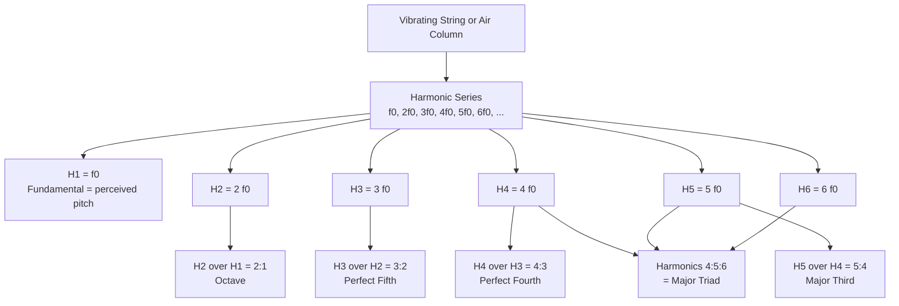

# 🎵 Pitch and the Harmonic Series

> [!abstract] TL;DR
> **Pitch** is the perceptual correlate of a tone's **fundamental frequency** $f_0$. A vibrating string or air column never produces a single frequency — it produces $f_0$ plus a stack of **partials** at integer multiples $2f_0, 3f_0, 4f_0, \dots$, the **harmonic series**. The simple frequency ratios between adjacent harmonics (2:1, 3:2, 4:3, 5:4) are exactly the intervals we hear as consonant — octave, fifth, fourth, major third — and harmonics 4:5:6 spell a major triad. The harmonic series is therefore the acoustic root of Western tuning, of consonance, and (via the relative loudness of the partials) of timbre.

## Intuition — analogy FIRST

Pluck a guitar string. It looks like one thing wobbling, but physically it vibrates in many shapes **at the same time**: the whole string swinging back and forth (slowest, loudest), the two halves swinging in opposite directions (twice as fast), the three thirds (three times as fast), and so on. Each of these modes radiates its own pure tone. The slowest mode sets the **pitch** you name ("that's an A"); the faster modes are quieter tones stacked exactly on top, at 2×, 3×, 4× the base frequency.

Your ear does not hear these as separate notes — it fuses them into one rich sound with a single pitch. The *pattern* of which faster modes are present, and how loud each is, is what makes a violin sound different from a flute on the same note. That built-in ladder of frequencies is the harmonic series, and remarkably, the first few rungs of the ladder *are* the most consonant musical intervals.

---

## How It Works

### Core mechanics

1. A string fixed at both ends (or an air column) can only sustain **standing waves** whose ends match the boundary — the allowed wavelengths are $\lambda_n = 2L/n$ for $n = 1, 2, 3, \dots$
2. Since frequency $f_n = v / \lambda_n$, the allowed frequencies are $f_n = n \cdot \dfrac{v}{2L} = n \cdot f_0$ — **exact integer multiples** of the fundamental $f_0$.
3. The real vibration is a **superposition** of all these modes at once. Because every partial's period divides the fundamental's period, the composite waveform repeats at $f_0$ — so the ear assigns **one pitch**, $f_0$, to the whole blend.
4. The **ratios between adjacent harmonics** are small whole numbers: $H_2{:}H_1 = 2{:}1$ (octave), $H_3{:}H_2 = 3{:}2$ (perfect fifth), $H_4{:}H_3 = 4{:}3$ (perfect fourth), $H_5{:}H_4 = 5{:}4$ (major third). Simple ratios → harmonics of the two tones line up → little beating → we perceive **consonance**.
5. Harmonics 4, 5, 6 sound together as the ratio $4{:}5{:}6$ — a **major triad** (root, major third, perfect fifth). The major chord is thus baked into the physics of any vibrating body.



---

## Key Concepts

### Secondary

- **Pitch** = how high or low a note sounds. It tracks the **fundamental frequency** $f_0$ measured in hertz (Hz). Standard tuning: A above middle C = **440 Hz** (A4).
- Doubling the frequency raises the pitch by exactly one **octave**. 220 Hz, 440 Hz, and 880 Hz are all "A", one octave apart each — this is **octave equivalence**.
- A single vibrating object makes not one tone but a **fundamental plus overtones** at higher frequencies. Pure sine tones (no overtones) sound thin and "electronic"; real instruments sound full because of their overtones.
- **Register** is the region of the pitch range you are in (low, middle, high). Same note name in different registers = same **pitch class**, different octave.

### Undergraduate

- **Harmonics, partials, overtones — the vocabulary.** The $n$-th *harmonic* has frequency $n f_0$. The $n$-th *partial* is the same list starting the count at the fundamental. *Overtones* count from the first frequency **above** $f_0$, so **1st overtone = 2nd harmonic**. Watch the off-by-one.
- **Standing waves give integer multiples.** For a string of length $L$, wave speed $v$: $f_n = n\,v/(2L)$. Open air columns behave the same; a tube closed at one end supports only **odd** harmonics ($f_0, 3f_0, 5f_0, \dots$), which is why a clarinet sounds "hollow" and plays a twelfth above when overblown.
- **Just intonation** builds intervals from these pure ratios: octave 2:1, perfect fifth 3:2, perfect fourth 4:3, major third 5:4, minor third 6:5. **Equal temperament** instead divides the octave into 12 equal steps so every key sounds equally (slightly) out of tune — the ET fifth is 700 cents versus the pure 702.
- **Consonance from alignment.** Two tones a fifth apart (3:2) share many coincident harmonics, so their combined spectrum has few clashing near-frequencies and little **beating** → consonant. Dissonant intervals (e.g. a tritone) have harmonics that fall a critical-bandwidth apart → roughness.
- **Pitch is logarithmic — use cents.** Equal *musical* distance means equal *frequency ratio*, not equal frequency difference. The **cent** measures this: $\text{cents} = 1200 \cdot \log_2\!\left(\dfrac{f_2}{f_1}\right)$. One octave = 1200 cents; one equal-tempered semitone = 100 cents. This is why the same 10 Hz gap sounds huge low down and negligible up high.

### Graduate

- **Missing fundamental / residue pitch.** Play only harmonics $2f_0, 3f_0, 4f_0$ with **no** energy at $f_0$ and listeners still hear the pitch $f_0$. The auditory system infers the fundamental from the **spacing** of the upper partials (pattern-recognition and temporal/autocorrelation models). This is how a tiny phone speaker or a telephone (300–3400 Hz band) conveys a convincing bass line it cannot physically reproduce.
- **Timbre = the spectral envelope.** Same pitch, same loudness, different instruments = different **relative amplitudes and phases of the partials**. Timbre lives in *how the harmonic series is weighted*, plus the attack transient — see the companion **Timbre** note.
- **Brass play the overtone series directly.** A bugle has one fixed tube length, yet plays a melody: the player's lips select which harmonic of the tube resonates (overblowing). Valves or a slide change the tube length to shift the whole series to a new $f_0$. The gaps between playable bugle notes are literally the gaps in the harmonic series.
- **Inharmonicity.** Real strings have stiffness, so partials are slightly **sharp** of exact integers: $f_n \approx n f_0 \sqrt{1 + B n^2}$. Piano tuners compensate with **stretched tuning** — octaves tuned slightly wide so the tuned octave matches the stretched partials.
- **Why you cannot have pure ratios in every key.** Stacking pure fifths (3:2) never lands back on a pure octave — the mismatch is the **Pythagorean comma** ($\approx 23.5$ cents); stacking pure thirds vs fifths gives the **syntonic comma**. Temperaments distribute these errors; equal temperament spreads them evenly.
- **Fourier connection.** A periodic tone's harmonic spectrum is precisely its **Fourier series line spectrum**: the composite waveform in the time domain and the stem of partial amplitudes in the frequency domain are two views of the same signal (see [[Fourier_Series]] and [[Frequency_Spectrum]]).

---

## Python Demo

```python
# Synthesize a musical tone by summing the harmonic series
# (fundamental + integer-multiple partials with decreasing amplitude),
# then plot the composite waveform and its harmonic spectrum.
# numpy + matplotlib only.

import numpy as np
import matplotlib.pyplot as plt

# --- Parameters ---
f0 = 220.0          # fundamental frequency in Hz (A3)
fs = 44100          # sample rate in Hz
duration = 0.02     # seconds to plot (~4 periods of f0)
n_harmonics = 8     # number of partials to sum

t = np.linspace(0, duration, int(fs * duration), endpoint=False)

# --- Build the tone: f0 + 2f0 + 3f0 + ..., amplitude ~ 1/n (sawtooth-like) ---
composite = np.zeros_like(t)
freqs, amplitudes = [], []
for n in range(1, n_harmonics + 1):
    amp = 1.0 / n                                   # partials get quieter
    composite += amp * np.sin(2 * np.pi * n * f0 * t)
    freqs.append(n * f0)
    amplitudes.append(amp)

freqs = np.array(freqs)
amplitudes = np.array(amplitudes)

# --- Interval each harmonic makes with the harmonic just below it ---
interval_labels = {
    2: "Octave 2:1",
    3: "Perfect 5th 3:2",
    4: "Perfect 4th 4:3",
    5: "Major 3rd 5:4",
}

# --- Plot ---
fig, ax = plt.subplots(2, 1, figsize=(11, 7))

# (1) Composite waveform in the time domain
ax[0].plot(t * 1000, composite, color="navy")
ax[0].set_xlabel("Time in milliseconds")
ax[0].set_ylabel("Amplitude")
ax[0].set_title(f"Composite Waveform: sum of {n_harmonics} harmonics of f0 = {f0:.0f} Hz")
ax[0].grid(alpha=0.3)

# (2) Harmonic spectrum in the frequency domain (stem plot of partials)
markerline, stemlines, baseline = ax[1].stem(freqs, amplitudes, basefmt=" ")
markerline.set_color("crimson")
stemlines.set_color("crimson")
ax[1].set_xlabel("Frequency in Hz")
ax[1].set_ylabel("Partial amplitude")
ax[1].set_title("Harmonic Spectrum (integer multiples of f0)")
ax[1].grid(alpha=0.3)

# Annotate each partial and mark the musical interval it forms
for n in range(1, n_harmonics + 1):
    label = f"H{n}"
    if n in interval_labels:
        label += f"\n{interval_labels[n]}"
    ax[1].annotate(label, (freqs[n - 1], amplitudes[n - 1]),
                   textcoords="offset points", xytext=(0, 8),
                   ha="center", fontsize=8)

plt.tight_layout()
plt.show()

# Sanity check: the composite period should equal 1/f0
print(f"Fundamental period 1/f0 = {1000/f0:.3f} ms  (waveform repeats at this rate)")
```

Running it shows a repeating waveform whose period is $1/f_0$ (even though eight frequencies are present), and a stem plot with evenly spaced spikes at $f_0, 2f_0, \dots$ — the octave, fifth, fourth, and major third fall out at H2, H3, H4, H5.

---

## Real-World Applications

- **Brass and bugle calls.** Military bugle calls (Reveille, Taps) use only the notes of one tube's overtone series — no valves needed. Trumpets and French horns add valves purely to relocate that series.
- **Missing fundamental in tiny speakers.** Phones, laptops, and earbuds cannot move enough air to produce deep bass, yet you hear it: they emit the upper harmonics and your brain reconstructs $f_0$. DSP "bass enhancement" (e.g. MaxxBass, Waves) deliberately synthesizes harmonics to exploit this.
- **Additive and subtractive synthesis.** A Hammond organ / additive synth literally sums harmonic partials with drawbar amplitudes; a subtractive synth starts with a harmonic-rich sawtooth and filters partials away. Both are the harmonic series in action.
- **Pitch detection.** Algorithms like the Harmonic Product Spectrum, YIN, and autocorrelation find pitch by locating the comb of equally spaced harmonics — the basis of Auto-Tune, guitar tuners, and Melodyne.
- **Overtone singing and the didgeridoo.** Tuvan throat singers shape the vocal tract to boost single upper harmonics into audible melody notes over a fixed drone.
- **Instrument tuning.** Piano tuners apply **stretched tuning** because of inharmonic partials; barbershop and a cappella groups tune chords to pure just ratios to "lock" and ring.

---

## Common Pitfalls

- **Confusing pitch with frequency.** Frequency is physical and linear in Hz; pitch is perceptual and **logarithmic**. A rise from 100→200 Hz and 200→400 Hz are both one octave, despite different Hz gaps. Always reason in ratios/cents for musical distance.
- **Off-by-one on overtones.** The **1st overtone is the 2nd harmonic**. Mixing the two counting schemes silently shifts every interval by one rung.
- **Assuming the fundamental is the loudest (or even present) partial.** It often is not; pitch survives even when $f_0$ is entirely absent (missing-fundamental effect).
- **Treating equal temperament ratios as the pure ones.** The ET major third (400 cents) is a noticeably sharp approximation of the pure 5:4 (386 cents); the ET fifth is 2 cents flat of 3:2. Do not derive just intervals from a piano.
- **Expecting perfect integer partials.** Real strings are inharmonic; stiff, short, thick strings (piano bass) deviate most. This breaks naive $n f_0$ assumptions in tuning and analysis.
- **Thinking a pure sine has "rich" pitch.** A sine has a single frequency and no overtones — it is the *thinnest* possible timbre, not the fullest.

---

## Related Concepts

- [[Fourier_Series]] — a periodic tone's harmonic spectrum *is* its Fourier series line spectrum; the partials are the Fourier coefficients.
- [[Frequency_Spectrum]] — the stem plot of partial amplitudes is the discrete spectrum of a harmonic tone.
- [[Waves_in_Fluids_and_Acoustics]] — standing pressure waves in air columns generate the same integer-multiple overtone series as strings.
- [[Oscillations_and_SHM]] — each partial is a simple harmonic oscillation; the tone is their linear superposition.
- [[Wave_Motion_and_Properties]] — boundary conditions on a fixed string quantize the allowed wavelengths $\lambda_n = 2L/n$, forcing integer-multiple frequencies.

> [!note] Companion notes to build in this section
> This foundations note is designed to link to sibling notes **Timbre** (relative amplitudes of partials), **Intervals_and_Consonance** (why simple ratios sound stable), and **Psychoacoustics** (missing fundamental, critical bands, pitch models). Create those and wire the links both ways.

---

## Review Questions

1. **(Secondary)** A cello string vibrates at 130 Hz. What is the frequency of the note exactly one octave higher, and what is the frequency of the note two octaves higher? Explain why these are the "same" note name.
2. **(Undergraduate)** A string fixed at both ends has fundamental $f_0$. Show why its allowed frequencies are integer multiples $n f_0$, and use the ratio between the 3rd and 2nd harmonics to explain why the interval of a perfect fifth "falls out" of the harmonic series. How many cents is the pure fifth, and how does that compare to equal temperament?
3. **(Graduate)** A budget Bluetooth speaker rolls off everything below 180 Hz, yet listeners clearly hear the 90 Hz bass note of a track. Explain the phenomenon, name the acoustic cue the auditory system uses, and describe one signal-processing technique that deliberately exploits it. Then explain why you cannot tune a keyboard so that *every* key has pure 3:2 fifths and 2:1 octaves simultaneously.

---

## Sources

- Hermann von Helmholtz, *On the Sensations of Tone as a Physiological Basis for the Theory of Music*, 1877 (Dover reprint 1954).
- Thomas D. Rossing, F. Richard Moore, Paul A. Wheeler, *The Science of Sound*, 3rd ed., Addison-Wesley, 2002.
- Juan G. Roederer, *The Physics and Psychophysics of Music: An Introduction*, 4th ed., Springer, 2008.
- William A. Sethares, *Tuning, Timbre, Spectrum, Scale*, 2nd ed., Springer, 2005.
- Brian C. J. Moore, *An Introduction to the Psychology of Hearing*, 6th ed., Brill, 2012.

---

#music-theory #harmonic-series #pitch #overtones #acoustics
