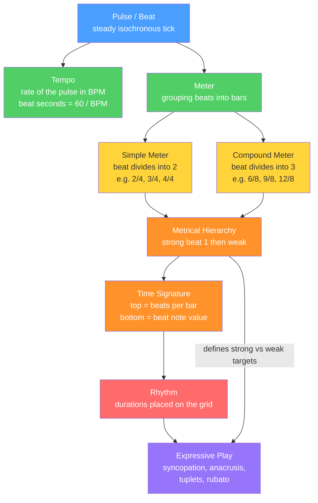

# 🥁 Rhythm, Meter, and Tempo

> [!abstract] TL;DR
> **Rhythm** is the pattern of durations of sounds and silences in time; **pulse** (the beat) is the steady, regular tick your body wants to tap along to underneath that pattern; **tempo** is how fast that pulse runs (measured in beats-per-minute); and **meter** is the way the brain groups those beats into recurring bundles of strong and weak — a *metrical hierarchy* — that turns a flat stream of ticks into "ONE-two-three-four." Everything expressive in time — downbeats, syncopation, pickups, swing, rubato — is defined *relative to* this pulse-and-meter scaffold, which is why these three ideas are the load-bearing foundation of every other rhythmic concept.

---

## Intuition

**Analogy — start with your own body.** Put your hand on your chest and feel your heartbeat, or notice your feet while walking: *lub-DUB, lub-DUB* … *left-right, left-right*. Two things are already happening for free. First, there is a **steady, evenly spaced pulse** you could tap along with even in silence — that is the *beat*. Second, the pulses are not all equal: *lub-**DUB***, *LEFT-right* — some feel heavier than others, and they clump into repeating groups of two (or three). That felt grouping of heavy-and-light is **meter**. How quickly your heart is beating — resting versus sprinting — is **tempo**.

Music is built on exactly this. A drummer laying down a steady kick is supplying the *pulse*; the fact that you hear it as "ONE-two-three-four | ONE-two-three-four" rather than an undifferentiated string of hits is *meter*; and whether the song feels like a slow ballad or a frantic dance is *tempo*. A **rhythm** — the actual tune of a melody or a drum fill — is then any pattern of long and short notes laid *on top of* that invisible grid. You feel the grid so strongly that when a note deliberately dodges it (lands on a weak spot and holds through a strong one), you get that irresistible off-kilter tug called *syncopation*.

---

## How It Works

Rhythm perception is a two-layer system. The bottom layer is an **objective signal**: actual note onsets at actual moments in time. The top layer is a **subjective grid** the listener *imposes* — a mental clock that the brain locks onto after only a few beats (a process called **entrainment**) and then keeps running even through silences. Meter is that grid; rhythm is the signal; and music is interesting precisely because of the *tension between the two*.

### From pulse to meter, step by step

1. **Pulse / beat.** The regular, isochronous (equally spaced) reference tick. It is felt, not necessarily sounded — the beat can continue through a rest.
2. **Tempo.** The rate of that pulse, in **beats per minute (BPM)**. Beat duration in seconds is simply `60 / BPM`: at 120 BPM each beat lasts 0.5 s; at 60 BPM, 1.0 s. Historically marked with Italian words — *largo* (very slow, ~40–60), *adagio*, *andante* (walking pace, ~76–108), *moderato*, *allegro* (fast, ~120–168), up to *presto* and *prestissimo* — and, since Maelzel's **metronome** (1815), with exact numbers.
3. **Note durations & the halving system.** Western notation builds durations by repeated halving: a whole note splits into two half notes, each into two quarters, then eighths, sixteenths, and so on. A **dot** adds half of a note's value (a dotted quarter = quarter + eighth = three eighths), and **ties** join durations across the grid.
4. **Meter — grouping the beats.** The ear bundles beats into repeating units called **measures (bars)**. Two orthogonal choices define the meter:
   - **How many beats per bar** → *duple* (2), *triple* (3), *quadruple* (4).
   - **How each beat divides** → **simple** meter (beat splits into **2**) vs **compound** meter (beat splits into **3**, and the beat is a *dotted* note).
5. **Metrical hierarchy.** Within a bar, positions carry inherited weight: the **downbeat** (beat 1) is strongest, secondary strong beats come next (beat 3 in quadruple time), and subdivisions between beats are weakest. Formally, a pulse's strength equals *how many metrical levels it is an onset of* — the Lerdahl–Jackendoff **metrical grid**.
6. **Time signature.** The written fraction that encodes all of the above: the **top number** = beats per bar, the **bottom number** = which note value gets one beat. `4/4` = four quarter-note beats; `3/4` = three quarter beats (waltz); `6/8` = six eighth-notes felt as **two** dotted-quarter beats (compound duple).

### Playing with and against the grid

- **Downbeat vs upbeat.** The downbeat is beat 1 (conductor's hand moves *down*); the *upbeat* is the weak beat just before it (hand moves *up*).
- **Anacrusis / pickup.** Notes that begin *before* the first full downbeat — a musical running start (e.g., "Oh-oh **say** can you see").
- **Syncopation.** Deliberately accenting weak positions or off-beats, contradicting the metrical hierarchy — the engine of funk, jazz, and Latin *groove*.
- **Tuplets.** Squeezing an "unnatural" number of notes into a beat — a **triplet** fits 3 evenly where 2 would go; likewise quintuplets, etc.
- **Polymeter & additive meter.** Two meters running at once (e.g., 3-against-4), or bars built from uneven additive groups like 3+2+3 = 8 (Balkan and prog rhythms).
- **Rubato.** Expressively stretching and compressing tempo ("robbed time") so the *rhythm breathes* while the underlying meter is still implied.



---

## Key Concepts

### Secondary (school-level intuition)
- **Beat, tempo, bar.** You can clap a steady beat, count it in fours, and speed it up or slow it down. A slow song has a low BPM, a fast one a high BPM.
- **Note values.** Whole, half, quarter, eighth notes — each half the length of the one before. Rests are silences with the same values.
- **Time signature basics.** `4/4` ("common time") is four beats a bar; `3/4` is a waltz; the *top number* tells you how many beats to count.
- **Strong and weak beats.** Beat 1 is the "big" one you naturally emphasize when tapping.

### Undergraduate (music-theory rigor)
- **Simple vs compound, duple/triple/quadruple.** A full 2×3 classification: `2/4` (simple duple), `3/4` (simple triple), `4/4` (simple quadruple), `6/8` (compound duple), `9/8` (compound triple), `12/8` (compound quadruple). In compound meters the *beat* is a dotted note and the *bottom number* names the subdivision, not the beat.
- **The metrical grid.** Lerdahl & Jackendoff formalize accent as the number of metrical levels aligned at a time-point, producing the strong/weak template that listeners project.
- **Syncopation formalized.** An onset on a metrically weak position that is *not* re-articulated on the following strong position — the note "steals" the strong beat by holding through it.
- **Tuplets and cross-rhythm.** Triplets, duplets in compound meter, and *hemiola* (temporarily hearing 3/4 as 6/8 or vice versa) as controlled ambiguity between division schemes.
- **Anacrusis and phrasing.** Pickups shift the perceived phrase boundary off the barline, changing where listeners feel arrival.

### Graduate (research / advanced)
- **Beat induction & entrainment.** How does the brain find the beat? Oscillator models (e.g., resonance theory, Large & Kolen) treat perception as coupled neural oscillators phase-locking to periodic input — a *dynamical* account of why we can tap along and predict the next beat. (See **[[Music_Cognition]]** and **[[Auditory_and_Speech_Perception]]**.)
- **Metric ambiguity and re-interpretation.** Pieces that support multiple simultaneous parsings; listeners' choice of tactus (the beat level they tap) is level-dependent and tempo-dependent (typically ~600 ms, near 100 BPM, is preferred).
- **Polymeter, polyrhythm, additive meter.** Concurrent independent meters and uneven bar constructions (aksak 2+2+2+3, etc.); microtiming deviations that create *groove* rather than error. (See **[[Advanced_Rhythm]]**.)
- **Expressive timing & rubato.** Systematic, reproducible tempo curves at phrase boundaries; the interaction of *categorical* notated rhythm with *continuous* performed timing, central to computational performance modeling and generative music.

---

## Python Demo

```python
# Metrical grids + tempo conversion, using only numpy and matplotlib.
# Shows: (1) BPM -> beat duration in seconds and derived note values,
#        (2) the metrical hierarchy (accent weight per pulse) for 4/4, 3/4, 6/8,
#        (3) a syncopated rhythm (tresillo 3-3-2) plotted against the 4/4 grid.

import numpy as np
import matplotlib.pyplot as plt


# ------------------------------------------------------------------
# 1) TEMPO: convert BPM -> seconds per beat, and derive note durations
# ------------------------------------------------------------------
def beat_duration_seconds(bpm):
    """One beat lasts 60 / BPM seconds."""
    return 60.0 / bpm

print("Tempo term      BPM     beat        eighth      sixteenth")
for name, bpm in [("Largo", 50), ("Andante", 84),
                  ("Moderato", 108), ("Allegro", 132), ("Presto", 184)]:
    d = beat_duration_seconds(bpm)
    print(f"{name:12s} {bpm:4d}   {d:6.3f} s   {d/2:6.3f} s   {d/4:6.3f} s")


# ------------------------------------------------------------------
# 2) METRICAL HIERARCHY
#    A pulse's accent weight = the number of metrical levels at which
#    it is an onset (the Lerdahl-Jackendoff metrical grid).
# ------------------------------------------------------------------
def metrical_weights(n_pulses, level_periods):
    """level_periods: pulse-periods of each metrical level, e.g. [1,2,4,8]."""
    idx = np.arange(n_pulses)
    w = np.zeros(n_pulses)
    for period in level_periods:
        w[idx % period == 0] += 1.0
    return w

# Each grid: n = subdivision pulses per bar, periods = metrical levels,
#            per_beat = subdivisions per notated beat.
grids = {
    "4/4 simple quadruple": dict(n=8, periods=[1, 2, 4, 8], per_beat=2),
    "3/4 simple triple":    dict(n=6, periods=[1, 2, 6],    per_beat=2),
    "6/8 compound duple":   dict(n=6, periods=[1, 3, 6],    per_beat=3),
}


# ------------------------------------------------------------------
# 3) A SYNCOPATED RHYTHM: the tresillo 3-3-2 against the 4/4 grid.
#    Onsets fall on eighth-pulses 0, 3, 6 -> two of them dodge the beat.
# ------------------------------------------------------------------
tresillo = [0, 3, 6]                       # onsets in eighth-note pulses
bpm = 120
eighth = beat_duration_seconds(bpm) / 2.0  # eighth = half a quarter-note beat
print(f"\nTresillo 3-3-2 at {bpm} BPM (eighth = {eighth:.3f} s):")
for p in tresillo:
    print(f"  pulse {p}: onset at t = {p * eighth:.3f} s")


# ------------------------------------------------------------------
# PLOT
# ------------------------------------------------------------------
fig, axes = plt.subplots(2, 2, figsize=(12, 7))
axes = axes.ravel()

for ax, (name, cfg) in zip(axes[:3], grids.items()):
    pulses = np.arange(cfg["n"])
    w = metrical_weights(cfg["n"], cfg["periods"])
    ax.stem(pulses, w, basefmt=" ")
    for beat in pulses[pulses % cfg["per_beat"] == 0]:
        ax.axvline(beat, color="0.85", zorder=0)  # notated beat lines
    ax.set_title(name)
    ax.set_xticks(pulses)
    ax.set_xlabel("pulse (subdivision index)")
    ax.set_ylabel("accent weight")
    ax.set_ylim(0, w.max() + 0.6)

# Fourth panel: tresillo onsets on top of the 4/4 grid
ax = axes[3]
pulses = np.arange(8)
w44 = metrical_weights(8, [1, 2, 4, 8])
ax.stem(pulses, w44, basefmt=" ")
ax.plot(tresillo, [w44[p] for p in tresillo], "rv",
        markersize=15, label="rhythm onset")
ax.set_title("Tresillo 3-3-2 vs 4/4 grid  (syncopation)")
ax.set_xticks(pulses)
ax.set_xlabel("pulse (eighth-note index)")
ax.set_ylabel("accent weight")
ax.legend()

plt.tight_layout()
plt.show()

# Reading the figure: onsets on pulses 3 and 6 land on LOW-weight positions
# and hold through the following strong beats -> that mismatch IS syncopation.
```

**What it shows.** The stem heights *are* the metrical hierarchy: in 4/4, beat 1 towers over beat 3, which towers over the even-numbered beats, which tower over the off-beats. In 6/8 you can see it is genuinely *duple* — only two tall pulses (0 and 3), not six equal ones — which is why 6/8 does not sound like fast 3/4. The tempo table makes the `60/BPM` law concrete, and the tresillo panel visually explains syncopation as onsets deliberately parked on the short bars of the grid.

---

## Real-World Applications

> **Example — DAWs, click tracks, and MIDI.** Every digital audio workstation (Ableton Live, Logic, FL Studio) is built directly on this model. The project has a **tempo in BPM**, a **time signature** that draws the bar/beat grid, and a **metronome click** that accents the downbeat. "Quantizing" a recorded performance means snapping note onsets to the nearest grid subdivision — literally forcing the *rhythm* back onto the *meter*. Producers then deliberately add **swing** (shifting off-beats late) or leave notes off-grid to preserve *groove*.

> **Example — the metronome and tempo maps.** From Maelzel's mechanical metronome to app-based ones, performers practice with an external pulse to internalize steady tempo; film-scoring composers write **tempo maps** and **click tracks** so an orchestra locks to picture, and *rubato* passages are notated as gradual BPM curves.

> **Example — global groove.** The **tresillo / 3-3-2** pattern in the demo underlies Cuban son, reggaeton's *dembow*, and countless pop hits; **additive meters** (7/8, 9/8 as 2+2+2+3) drive Balkan folk and progressive rock; and **beat-tracking / tempo-estimation** algorithms in Shazam-style MIR and DJ software (see **[[Music_Cognition]]**) computationally recover exactly the pulse and meter a human taps to.

---

## Common Pitfalls

- **Confusing meter with tempo.** Meter is *grouping* (how beats bundle into strong/weak); tempo is *speed* (BPM). You can change one without the other — a waltz stays 3/4 whether slow or fast.
- **Reading the time-signature bottom number as "beats."** In `6/8` the 8 does **not** mean "eight beats." The bottom number names the note *value*; 6/8 has *two* dotted-quarter beats. Treating 6/8 as fast 3/4 (six equal beats) destroys the compound feel.
- **Thinking 6/8 = 3/4 because both have six eighths.** They contain the same eighth-notes but *group* them differently (3+3 vs 2+2+2), producing opposite accent patterns. Grouping, not note count, defines the meter.
- **Equating "loud" with "strong beat."** Metrical strength is *positional*, not dynamic. A quiet note on beat 1 is still metrically strong; syncopation exploits exactly this by putting *loud* events on *weak* positions.
- **Losing the pulse during rests or syncopation.** Beginners stop counting when nothing sounds. The beat continues silently — hold the internal pulse *through* rests, ties, and pickups or the rhythm will drift.
- **Rushing tuplets and rubato.** Triplets get squeezed into "two-and-a-bit," and rubato becomes uncontrolled speeding up. Both require the steady meter to still be *implied* underneath the deviation.
- **Ignoring the anacrusis when counting in.** Starting a piece on the pickup as if it were the downbeat mis-locates every barline that follows.

---

## Related Concepts

- [[Notation_and_the_Staff]] — how note durations, dots, ties, rests, and time signatures are actually written down on the staff.
- [[Groove]] — microtiming, swing, and feel; the expressive layer that lives *on top of* the meter defined here (Section 05).
- [[Advanced_Rhythm]] — polyrhythm, polymeter, additive/odd meters, and metric modulation extend this foundation (Section 05).
- [[Music_Cognition]] — beat induction, entrainment, and neural oscillator models of *why* we perceive pulse and meter (Section 06).
- [[Auditory_and_Speech_Perception]] — the general auditory grouping and temporal-perception machinery that rhythmic entrainment is a special case of.

---

## Review Questions

1. **(Conceptual)** Explain, using the idea of a *metrical hierarchy*, why a note that is played *softly* on beat 1 can still feel "stronger" than a note played *loudly* on the "and" of beat 2. What does this reveal about the difference between metrical accent and dynamic accent?
2. **(Scenario)** A songwriter hands you a drum loop with kicks landing on eighth-pulses 0, 3, and 6 of a 4/4 bar at 100 BPM. In seconds, when does each kick occur, and why will listeners hear this as syncopated rather than as a change of meter? What would you change to make it feel like straight 6/8 instead?
3. **(Trade-off / comparison)** You must notate a fast folk tune that a fiddler plays as "two big beats, each split into three." Compare notating it in `6/8` versus `3/4`: which better captures the *felt* meter, what does each choice imply about beaming, tuplets, and the metrical grid, and what is lost if you pick the wrong one?

---

## Sources

- Lerdahl, F. & Jackendoff, R. (1983). *A Generative Theory of Tonal Music.* MIT Press — the metrical-grid / strong-weak hierarchy framework.
- London, J. (2012). *Hearing in Time: Psychological Aspects of Musical Meter* (2nd ed.). Oxford University Press.
- Cooper, G. & Meyer, L. B. (1960). *The Rhythmic Structure of Music.* University of Chicago Press.
- Large, E. W. & Kolen, J. F. (1994). "Resonance and the Perception of Musical Meter." *Connection Science*, 6(2–3), 177–208 — oscillator model of beat induction.
- [Open Music Theory — Rhythm and Meter](https://viva.pressbooks.pub/openmusictheory/part/rhythm-and-meter/)

---

#music-theory #rhythm #meter #tempo #pulse
