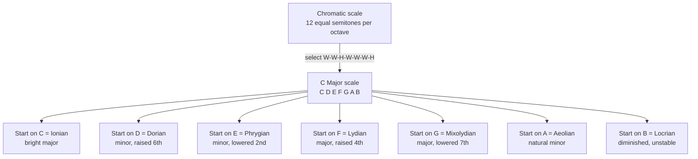

# 🎼 Scales and Modes

> [!abstract] TL;DR
> A **scale** is an ordered selection of pitches from the 12 available notes in an octave, defined by a fixed pattern of whole and half steps; **modes** are the seven scales you get by starting that same pattern on each of its own notes. Scales supply the raw vocabulary of melody and harmony and are what give a piece its sense of *key* and emotional color.

---

## Intuition

**Analogy:** Think of the octave as a staircase from the ground floor to the identical-sounding floor above. The **chromatic scale** is a staircase with 12 evenly-spaced small steps. A "scale" is a decision about which of those steps to actually plant your foot on — you skip some and take a bigger stride, so you climb using a mix of *small steps* (half steps) and *big steps* (whole steps). The particular rhythm of big-and-small strides is the scale's fingerprint.

Now for **modes**: imagine seven friends who all walk up the *exact same* staircase using the *exact same* footholds, but each one starts from a different rung. Even though they touch identical planks, the journey *feels* different depending on where you begin — one feels bright and triumphant, another dark and tense. That is precisely what a mode is: the same set of notes, re-centered on a different home note, producing a different mood.

The word *scale* even comes from the Latin *scala*, meaning "ladder."

---

## How It Works

### Core Mechanics

1. **The octave and the 12 semitones.** Doubling a frequency produces a note we hear as "the same" — an octave higher. Western music divides that octave into **12 equal semitones** (the chromatic scale). Each semitone is the smallest step on a piano: any two adjacent keys, black or white.

2. **Steps.** A **half step (H)** = 1 semitone (e.g. E→F). A **whole step (W)** = 2 semitones (e.g. C→D). Every scale is just a recipe of W's and H's that must add up to 12.

3. **The major scale** uses the pattern **W‑W‑H‑W‑W‑W‑H** = step sizes `2,2,1,2,2,2,1`. Starting on C this produces C D E F G A B — the white keys of the piano. Its sound is bright, stable, and "resolved," largely because of the two half steps landing on the 3rd and the leading tone.

4. **The three minor scales** all darken the 3rd degree (a lowered/minor third):
   - **Natural minor** (Aeolian): `2,1,2,2,1,2,2` — A B C D E F G. Sad, plain, folk-like.
   - **Harmonic minor**: raise the 7th of natural minor by a semitone → `2,1,2,2,1,3,1`. This restores a strong **leading tone** (a half step below the tonic) so the dominant chord resolves, but creates an exotic **augmented 2nd** between the 6th and 7th degrees.
   - **Melodic minor**: raise both the 6th and 7th ascending → `2,1,2,2,2,2,1` (classically reverts to natural minor descending). It smooths out the augmented 2nd for melodies.

5. **The seven diatonic modes** are rotations of the major-scale pattern — start the `2,2,1,2,2,2,1` cycle on each successive note:

   | Mode | Start on (in C) | Quality | Characteristic note |
   |------|-----------------|---------|---------------------|
   | Ionian | C | Major | (the major scale itself) |
   | Dorian | D | Minor | raised 6th (hopeful minor) |
   | Phrygian | E | Minor | lowered 2nd (Spanish/dark) |
   | Lydian | F | Major | raised 4th (dreamy, floating) |
   | Mixolydian | G | Major | lowered 7th (bluesy, rock) |
   | Aeolian | A | Minor | natural minor |
   | Locrian | B | Diminished | lowered 2nd and 5th (unstable) |

6. **Scale degrees** each have a functional name: **1 Tonic**, **2 Supertonic**, **3 Mediant**, **4 Subdominant**, **5 Dominant**, **6 Submediant**, **7 Leading tone** (or **Subtonic** when a whole step below the tonic, as in natural minor). The tonic is "home"; the dominant creates the strongest pull back to it.

7. **Symmetric and gapped scales** break the diatonic mold:
   - **Major pentatonic** (`2,2,3,2,3`, 5 notes) and **minor pentatonic** (`3,2,2,3,2`) omit the half steps, avoiding all dissonance — which is why they appear independently across Chinese, Celtic, African, and blues traditions.
   - **Blues scale** = minor pentatonic + a chromatic "blue note" ♭5: `3,2,1,1,3,2`.
   - **Whole-tone scale** (`2,2,2,2,2,2`, 6 notes) has no half steps and no tonic — dreamlike, "impressionist" (Debussy).
   - **Octatonic / diminished scale** (`2,1,2,1,2,1,2,1`, 8 notes) alternates W and H — tense, used in jazz and horror scoring.

8. **Key signatures and the circle of fifths.** Moving up a perfect fifth (7 semitones) adds exactly one sharp; moving down a fifth adds one flat. Arranging the 12 keys by fifths forms the **circle of fifths**, which tells you a key's sharps/flats and shows which keys are "closely related" (few accidentals apart) — the backbone of smooth modulation.

9. **Relative vs parallel.**
   - **Relative** major/minor share the *same notes and key signature* but different tonics (C major ↔ A minor).
   - **Parallel** major/minor share the *same tonic* but differ by three notes (C major ↔ C minor). Borrowing chords between parallel keys is called *modal interchange*.

### Flow / Architecture



---

## Key Concepts

**Secondary (high-school level).** A scale is a ladder of notes built from whole and half steps. Major sounds happy, minor sounds sad. The first note is the *tonic* (home). Every scale spans one octave and repeats. You can find C major on a piano by playing only the white keys.

**Undergraduate (music-theory core).** Master the W/H recipes for major and all three minors; name all seven scale degrees and their functions; derive the diatonic modes as rotations and identify each mode's *characteristic scale degree* (the one note that distinguishes it from the parallel major or minor). Understand the circle of fifths as both a key-signature lookup and a map of harmonic distance, and distinguish relative from parallel keys. Equal temperament: each semitone multiplies frequency by `2^(1/12) ≈ 1.0595`.

**Graduate (advanced / theoretical).** Analyze scales as **pitch-class sets** and study their symmetry (whole-tone and octatonic scales are *transpositionally symmetric*, which erodes any single tonal center). Compare **equal temperament** against **just intonation** — ET's major third (400 cents) is ~14 cents sharp of the pure 5:4 ratio (386 cents), the price paid for playing in all 12 keys without retuning. Explore **modal interchange**, **negative harmony**, non-Western systems (maqam quarter-tones, Indonesian slendro/pelog, raga *that* systems), and how scale choice interacts with voice leading and chord-scale theory in jazz.

---

## Python Demo

```python
# Build Western scales purely from their semitone-step patterns,
# derive the seven diatonic modes as rotations of the major scale,
# compute pitch frequencies under 12-tone equal temperament,
# and visualize each scale on the 12-tone pitch-class circle.
import numpy as np
import matplotlib.pyplot as plt

NOTE_NAMES = ["C", "C#", "D", "D#", "E", "F", "F#", "G", "G#", "A", "A#", "B"]

# Interval patterns as semitone steps; each pattern sums to 12 (one octave).
MAJOR_STEPS         = [2, 2, 1, 2, 2, 2, 1]   # W-W-H-W-W-W-H
NATURAL_MINOR_STEPS = [2, 1, 2, 2, 1, 2, 2]   # Aeolian mode
MINOR_PENTA_STEPS   = [3, 2, 2, 3, 2]         # 5-note minor pentatonic

def build_scale(root_pc, steps):
    """Return the pitch classes (0-11) of a scale from a root and step pattern.
       The final step wraps back to the octave, so we consume all but the last."""
    pcs = [root_pc % 12]
    for s in steps[:-1]:
        pcs.append((pcs[-1] + s) % 12)
    return pcs

def equal_temperament_freq(pc, octave=4, a4=440.0):
    """Frequency (Hz) of a pitch class in a given octave under 12-TET.
       MIDI convention: C4 = 60, A4 = 69, and each semitone = 2**(1/12)."""
    midi = 12 * (octave + 1) + pc
    return a4 * 2 ** ((midi - 69) / 12)

# --- C major scale + its frequencies (C4 should come out ~261.63 Hz) ---
c_major = build_scale(0, MAJOR_STEPS)
print("C major       :", [NOTE_NAMES[p] for p in c_major])
print("Frequencies Hz:", [round(equal_temperament_freq(p), 2) for p in c_major])

# --- A natural minor: relative minor of C major (identical notes, new tonic) ---
a_minor = build_scale(9, NATURAL_MINOR_STEPS)
print("A nat. minor  :", [NOTE_NAMES[p] for p in a_minor])

# --- Seven diatonic modes = rotations of the major-scale step pattern ---
MODE_NAMES = ["Ionian", "Dorian", "Phrygian", "Lydian",
              "Mixolydian", "Aeolian", "Locrian"]
print("\nModes built on C (same shape, rotated start):")
for i, name in enumerate(MODE_NAMES):
    rotated = MAJOR_STEPS[i:] + MAJOR_STEPS[:i]       # rotate the recipe
    mode_pcs = build_scale(0, rotated)                # all rooted on C to compare
    print(f"  {name:11s}: {[NOTE_NAMES[p] for p in mode_pcs]}")

# --- Visualize scales on the 12-tone pitch-class circle ---
def plot_pitch_circle(ax, pcs, title):
    angles = np.linspace(0, 2 * np.pi, 12, endpoint=False) + np.pi / 2
    xs, ys = np.cos(angles), np.sin(angles)           # clock-like layout
    ax.plot(xs, ys, "o", color="lightgray", ms=20)
    for pc in range(12):
        ax.text(xs[pc], ys[pc], NOTE_NAMES[pc], ha="center", va="center", fontsize=8)
    sel = np.array(pcs)
    ax.plot(np.append(xs[sel], xs[sel[0]]),
            np.append(ys[sel], ys[sel[0]]),
            "-o", color="crimson", lw=2, ms=12)
    ax.set_title(title, fontsize=10)
    ax.set_aspect("equal")
    ax.axis("off")

fig, axes = plt.subplots(1, 3, figsize=(12, 4))
plot_pitch_circle(axes[0], c_major, "C Major (Ionian)")
plot_pitch_circle(axes[1], a_minor, "A Natural Minor (Aeolian)")
plot_pitch_circle(axes[2], build_scale(0, MINOR_PENTA_STEPS), "C Minor Pentatonic")
plt.tight_layout()
plt.show()
```

Running it prints the note names and equal-tempered frequencies, confirms that C major and A minor share the same seven notes (relative keys), lists all seven modes as rotations of one pattern, and draws three pitch-class circles whose polygons visibly differ in shape — a geometric picture of each scale's "step fingerprint."

---

## Real-World Applications

> **Example — Jazz improvisation (chord-scale theory):** A jazz soloist reads a `Dm7 – G7 – Cmaj7` (ii–V–I) and plays **D Dorian** over the Dm7, **G Mixolydian** over G7, and **C Ionian** over Cmaj7 — three modes of the *same* C-major collection, each re-centered so its characteristic note lands on a chord tone. This is the everyday practical payoff of modes being rotations of one scale.

- **Pop and rock** lean on **major/minor pentatonic** (guitar solos), **Mixolydian** (dominant-7th rock riffs, "Sweet Home Alabama"), and **Aeolian** (minor-key ballads).
- **Film scoring** exploits modal color: **Lydian** for wonder and awe (much of John Williams' fanfare writing), **Phrygian/Locrian** for menace, the **octatonic** scale for horror and instability.
- **The blues scale** underpins blues, R&B, and rock — the ♭5 "blue note" is the genre's signature.
- **Instrument tuners, synthesizers, and DAWs** all implement the `2^(n/12)` equal-temperament formula from the demo to convert MIDI note numbers to frequencies.
- **Music information retrieval** systems perform automatic **key and scale detection** (e.g. the Krumhansl–Schmuckler algorithm) by correlating a piece's pitch histogram against scale profiles.

---

## Common Pitfalls

- **Treating a mode as merely "the major scale starting on a different note."** Rotation only *generates* the pitch set; a mode only *sounds* like itself when its own tonic is established (by a pedal, drone, or chord progression). Noodle "D E F G A B C" without emphasizing D and the ear just hears C major — the Dorian flavor evaporates.
- **Confusing relative and parallel minor.** Relative minor shares the *key signature* (C major ↔ A minor); parallel minor shares the *tonic* (C major ↔ C minor) and differs by three flats. Mixing them up wrecks key analysis.
- **Miscounting semitones.** The natural half steps sit between **E–F** and **B–C**; forgetting this leads to spelling scales with the wrong accidentals. Always verify the pattern sums to 12.
- **Forgetting harmonic minor's augmented 2nd.** Raising the 7th of natural minor opens a 3-semitone gap between the ♭6 and ♮7 — melodically awkward, which is exactly why melodic minor exists.
- **Assuming equal temperament is "in tune."** ET thirds and sixths are measurably off the pure just-intonation ratios; it is a deliberate compromise that trades a little beating for the freedom to modulate to any of the 12 keys.
- **Enharmonic spelling sloppiness.** C# and D♭ are the same pitch in ET but are *not* interchangeable in notation — correct spelling encodes the scale degree and harmonic function.

---

## Related Concepts

- [[Waves_in_Fluids_and_Acoustics]] — the physics of frequency, octaves, and standing waves that scales quantize into discrete pitches.
- [[Fourier_Series]] — the harmonic (overtone) series decomposed by Fourier analysis is the acoustic reason certain scale intervals sound consonant.
- [[DFT_and_FFT]] — spectral analysis that reveals the frequency ratios and harmonic content behind tuning systems and scale/key detection.
- [[Auditory_System_and_Sound_Processing]] — how the ear and auditory cortex map frequency to perceived pitch height, the substrate scales are built on.
- [[Music_Classification_MIR]] — music information retrieval, where automatic key and scale recognition is a core task.

*Forthcoming sibling notes in this vault (not yet created, to be linked once they exist):* Intervals_and_Consonance, Chords, and World_Music_Scales (S05), plus Cadences/Modulation for the circle-of-fifths connection.

---

## Review Questions

1. **(Recall)** Write out the whole/half-step pattern of the major scale, then name the seven scale degrees in order (tonic, supertonic, …). Which two scale degrees are separated by a half step in a major scale?

2. **(Application)** You are in the key of C major. (a) What is its *relative* minor and what is its *parallel* minor? (b) Which notes change between C major and C minor? (c) Construct D Dorian and explain why it contains the same notes as C major yet sounds different.

3. **(Analysis / trade-off)** The whole-tone and octatonic scales are both *transpositionally symmetric*. Explain how that symmetry weakens any sense of a single tonic, and discuss why equal temperament — despite mistuning every interval except the octave — became the dominant tuning system for keyboard music.

---

## Sources

- Aldwell, E., Schachter, C., & Cadwallader, A. — *Harmony and Voice Leading*, 5th ed. (Cengage, 2018).
- Tymoczko, D. — *A Geometry of Music* (Oxford University Press, 2011): [OUP page](https://global.oup.com/academic/product/a-geometry-of-music-9780195336672)
- Levine, M. — *The Jazz Theory Book* (Sher Music, 1995).
- musictheory.net — free interactive lessons on scales and key signatures: [musictheory.net/lessons](https://www.musictheory.net/lessons)
- Wikipedia — *Mode (music)*: [en.wikipedia.org/wiki/Mode_(music)](https://en.wikipedia.org/wiki/Mode_(music))

---

#music-theory #scales #modes #major-minor #diatonic
