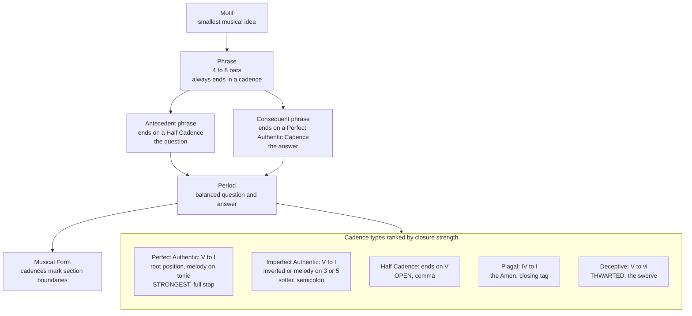

# 🎵 Cadences and Phrase Structure

> [!abstract] TL;DR
> A **cadence** is a short harmonic-melodic formula that ends a musical phrase, and it works exactly like **punctuation** in language. The **perfect authentic cadence (V–I)** is a full stop; the **half cadence** (a phrase that stops *on* the tense dominant, V) is a comma; the **deceptive cadence (V–vi)** is a sentence that dodges its expected ending. Cadences create graded degrees of **closure**, and by punctuating **phrases** — typically 4- or 8-bar units — into balanced **antecedent–consequent periods** and **sentences**, they build the hierarchy of tension and release that we perceive as musical **form**.

---

## Intuition

**Analogy first — punctuation for the ear.** Read a sentence aloud and listen to your own voice. At a *comma* you pause but your pitch stays **up**, signalling "more is coming." At a *full stop* your pitch **falls** and the thought feels complete. A cadence does the identical job in music, using the identical cue: rising, unresolved harmonic tension means "keep going," while a falling, resolved release means "done."

- A **half cadence** is a **comma**: the music pauses on the tense dominant chord, unmistakably unfinished, hanging in the air.
- A **perfect authentic cadence** is a **full stop**: the dominant falls home to the tonic and the melody lands on the keynote — thought complete.
- A **deceptive cadence** is the **rhetorical swerve**: you set up the ending, everyone leans in for the final word, and the sentence darts sideways instead — "...and they lived happily ever—".

Just as you cannot parse a paragraph without its punctuation, you cannot parse music without its cadences. Phrases are the clauses and sentences; cadences are the marks that group them; and a balanced pair of phrases — a *question* that ends on a comma answered by a *statement* that ends on a full stop — is the musical equivalent of a well-formed sentence. Everything technical below is just a precise account of **which chords make the pull, how strongly, and where the ear expects the marks to fall.**

---

## How It Works

### Core mechanics

A cadence is never a single event; it is the **convergence of several signals of closure** arriving together:

1. **Harmonic goal** — the chord the phrase lands on, named by Roman numeral relative to the key's tonic. The dominant (V) is maximally tense; the tonic (I) is maximally at rest.
2. **Root motion** — the strongest possible bass move in tonal music is the **descending perfect fifth**, V down to I. This is the same 3:2 relationship that sits low in the harmonic series, which is why V–I feels like *gravity*.
3. **Voice leading** — the **leading tone** (scale-degree 7) strains upward by a semitone to the tonic (1), and the dissonant **tritone** inside a dominant seventh chord resolves outward to consonance. Closure is, at root, dissonance becoming consonance.
4. **Melodic goal** — where the top voice lands. A soprano arriving on scale-degree **1** feels far more final than one resting on 3 or 5.
5. **Metric placement and rhythm** — cadences that fall on a **strong (hyper)downbeat**, often with a slowing of harmonic rhythm, close much harder than the same chords on a weak beat.

The **five classic cadence types**, ranked from strongest to weakest closure:

| Cadence | Formula | Feel | Punctuation |
|---|---|---|---|
| **Perfect Authentic (PAC)** | V–I, both root position, soprano on 1 | strongest possible close | full stop |
| **Imperfect Authentic (IAC)** | V–I but inverted, or soprano on 3/5, or vii°6–I | softer close | semicolon |
| **Half (HC)** | any phrase ending *on* V (I–V, ii–V, IV–V) | open, expectant | comma |
| **Plagal** | IV–I, the "Amen" | after-the-fact confirmation | closing tag |
| **Deceptive / Interrupted** | V–vi (V–VI in minor) | thwarted resolution | dash / swerve |

### Phrases, periods, and sentences

A **phrase** is the basic unit of musical syntax — a stretch of music, usually **4 bars** (grouped into 8-bar spans), that expresses one coherent gesture and *ends in a cadence*. Phrases are themselves built from smaller **motifs** (the shortest recognizable idea; the "basic idea" of the phrase), which is where the motivic-development side of theory connects to form: a phrase is a motif elaborated to cadential closure.

Two archetypes organize how phrases combine:

- **Period (antecedent–consequent, "question and answer").** A first phrase (the *antecedent*) ends on a **weak** cadence, usually a Half Cadence — the question. A second phrase (the *consequent*) restates similar material but ends on a **strong** PAC — the answer. If the two phrases begin identically it is a *parallel* period; if not, a *contrasting* period.
- **Sentence (Satz; Schoenberg / Caplin).** An asymmetrical design: a **presentation** (a basic idea plus its repetition, often prolonging the tonic) → a **continuation** (fragmentation of the idea, faster harmonic rhythm, sequences, rising momentum) → a **cadence** that closes it. Where the period is symmetrical call-and-response, the sentence is *statement → intensification → arrival*.

Real phrases bend these templates through **elision** (the last bar of one phrase doubles as the first bar of the next, splicing them), **extension**, and **expansion** (internal stretching), so live music rarely lands in tidy 4-bar boxes.

### How cadences build form

Cadences are the joints of musical architecture at every scale. A weak cadence keeps a section *open* and flowing; a PAC *closes* a section. A PAC **in a new key** confirms a **modulation** and stakes out a new tonal region — which is precisely how cadences articulate large forms (the medial caesura and expositional close of sonata form, the sectional boundaries of rondo and binary forms). The **circle of fifths** supplies the cadential fuel: chains of descending-fifth root motion (ii–V–I) are the standard approach to a strong cadence, and each modulation is a new point on the circle confirmed by its own cadence.



---

## Key Concepts

### Secondary Level

**A cadence is a musical "ending" formula — the ear's punctuation.** Some cadences sound *finished*, some sound *unfinished*, and that single difference is what your ear is really tracking.

**Finished vs unfinished.** The **authentic cadence** (ending on the *home* chord, the tonic) sounds like a full stop — you could clap now. The **half cadence** (ending on the tense dominant chord) sounds like a comma — the music is clearly not done and something must follow.

**A phrase is a musical sentence.** It is a chunk of music, often about **4 bars**, that you could sing in roughly one breath and that ends with a cadence. Songs are built by stringing phrases together.

**Question and answer.** Many tunes come in pairs: a first phrase that leaves you hanging (the *question*, ending on a comma) and a second phrase that resolves it (the *answer*, ending on a full stop). "Twinkle Twinkle Little Star" and countless folk melodies are exactly this shape.

### Undergraduate Level

**The five cadence types, precisely.**

- **Perfect Authentic Cadence (PAC):** V–I (or V7–I) with **both chords in root position** and the **soprano ending on scale-degree 1**. This is the only cadence strong enough to close a large section. It is tonal music's strongest gesture of finality.
- **Imperfect Authentic Cadence (IAC):** still V–I, but *weakened* — an inverted V or I, a soprano ending on 3 or 5, or a leading-tone chord substituting for V (vii°6–I). Closes, but softly.
- **Half Cadence (HC):** any phrase that **ends on V**, approached from I, ii, IV, or I6. It does not resolve; it *poses*. The **Phrygian half cadence** (iv6–V in minor) is a characteristic Baroque variant.
- **Plagal Cadence:** IV–I, the church "Amen." In strict Classical theory it is *post-cadential* — a confirming tag appended **after** a PAC — rather than a phrase-defining cadence in its own right.
- **Deceptive (Interrupted) Cadence:** V–vi. The dominant sets up a resolution to I, the leading tone still rises to 1, but the **bass moves to 6 instead of home**. The result is a chord that shares two notes with the tonic yet is *not* tonic — resolution deferred.

**Closure is graded and multi-parametric.** No single feature makes a cadence "strong." Finality is the *sum* of harmonic goal, root-position voicing, soprano on 1, downbeat placement, and rhythmic slowing. Change any one and the closure weakens — a V–I on a weak beat with the melody on 3 is barely a cadence at all.

**Period structure.** The **antecedent** ends with a weak cadence (typically HC); the **consequent** parallels it but ends with a strong PAC. The two phrases are of comparable length and mirror each other — symmetry is the point.

**Circle of fifths and cadential harmony.** The V→I resolution *is* a descending perfect fifth, the strongest root motion in the system. Approaching the dominant through the circle (…–ii–V–I) chains descending fifths for maximum drive, and each fresh cadence can confirm a fresh key one step around the circle.

### Graduate Level

**The sentence (Satz) vs the period.** Following Schoenberg and formalized by **William Caplin**, the sentence is a distinct 8-bar type: a **presentation** (basic idea + varied repetition, usually over a prolonged tonic) followed by a **continuation** (motivic *fragmentation*, acceleration of harmonic rhythm, sequential drive) that liquidates the idea into a **cadence**. The period is spatial symmetry (two balanced arches); the sentence is temporal process (statement intensifying into arrival). Distinguishing them is central to Formenlehre analysis.

**Caplin's theory of formal functions** sharpens the very definition of "cadence." A cadence is not merely arriving on a chord — it is a specific *cadential progression* (often prefaced by the **cadential six-four**, I6/4–V–I) placed to articulate formal closure. Caplin distinguishes the genuine cadence from a mere *harmonic arrival*, and catalogues its failures: the **evaded cadence**, the **abandoned cadence**, and Janet Schmalfeldt's **"one more time" technique**, where an evaded cadence forces the passage to loop back and try again, generating expansion.

**Elision, extension, and hypermeter.** Phrases rarely stay in 4-bar boxes. **Elision** overlaps a cadence with the downbeat of the next phrase (one bar does double duty). **Extension** and **internal expansion** stretch phrases to 5, 6, or 9 bars. These interact with **hypermeter** — the metrical grouping of whole bars into strong/weak patterns — and a cadence that lands "early" or "late" against the hypermetric grid is a primary source of rhythmic drama.

**Cadences as agents of large-scale form.** In sonata theory (**Hepokoski & Darcy**), the **medial caesura** and the **essential expositional closure (EEC)** — the first satisfying PAC in the secondary key — are *the* structural events that define the exposition. At this level cadences are not local endings but the load-bearing pillars of the tonal plot: they define where keys are confirmed, where sections divide, and where the whole movement finally comes to rest.

**Stylistic and historical variation.** Cadential syntax is period-specific. The Renaissance **clausula** (with its suspension-driven voice leading), the Baroque and Classical functional cadence, the Romantic *weakening* and evasion of cadence, jazz's **ii–V–I** with **tritone substitution**, pop's plagal and modal (bVII–I, v–I) cadences, and the dissolution of functional cadence altogether in post-tonal music are each a different grammar of closure. What counts as an "ending" is itself a stylistic convention.

---

## Python Demo

This models the **perceived closure strength** of the three most contrasting cadences. Each chord is assigned a **tension value** by its harmonic function — 0 is complete rest (the tonic), 1 is maximum pull (the dominant seventh). Three 8-chord phrases share an **identical 5-chord setup** so that only the *cadence* differs, isolating its effect. The left panel plots the tension-resolution profile; the right panel scores final closure as `1 minus final tension`. numpy and matplotlib only.

```python
import numpy as np
import matplotlib.pyplot as plt

# Perceived harmonic TENSION by chord function in a major key.
# 0 = full rest (home), 1 = maximum pull (wants to resolve now).
tension = {
    "I":   0.00,   # tonic, root position: home, complete rest
    "I6":  0.20,   # tonic first inversion: stable but less grounded
    "vi":  0.35,   # submediant: tonic substitute, soft residual tension
    "IV":  0.50,   # subdominant (predominant): departure from home
    "ii":  0.55,   # supertonic (predominant): departure, pulls toward V
    "V":   0.90,   # dominant: strong tension, wants to resolve to I
    "V7":  1.00,   # dominant seventh: maximum tension (tritone inside)
}

# Three 8-chord phrases. Bars 1-5 are IDENTICAL, so only the cadence differs.
setup = ["I", "vi", "IV", "ii", "V"]
authentic = setup + ["V7", "I",  "I"]    # V7 -> I : Perfect Authentic Cadence
half      = setup + ["I6", "ii", "V"]    #  ... -> V : Half Cadence (stays open)
deceptive = setup + ["V7", "vi", "vi"]   # V7 -> vi: Deceptive Cadence (thwarted)

phrases = {
    "Authentic  V7 to I  (strong closure)": authentic,
    "Half  ends on V  (open)":              half,
    "Deceptive  V7 to vi  (thwarted)":      deceptive,
}
colors = {"Authentic": "#2ca02c", "Half": "#ff7f0e", "Deceptive": "#d62728"}

x = np.arange(1, 9)  # bar positions 1..8

fig, (axL, axR) = plt.subplots(
    1, 2, figsize=(14, 5), gridspec_kw={"width_ratios": [2.4, 1]}
)

finals = {}
for label, chords in phrases.items():
    y = np.array([tension[c] for c in chords])
    name = label.split()[0]
    axL.plot(x, y, marker="o", lw=2, color=colors[name], label=label)
    finals[name] = y[-1]

axL.axhline(0.0, color="gray", ls=":", lw=1)
axL.text(1.0, 0.03, "rest / home", color="gray", fontsize=8)
axL.set_title("Tension-Resolution Profile of a Phrase\n"
              "identical setup, three different cadences")
axL.set_xlabel("Bar position in phrase")
axL.set_ylabel("Perceived harmonic tension  [0 = rest, 1 = max pull]")
axL.set_ylim(-0.08, 1.12)
axL.set_xticks(x)
axL.grid(True, ls="--", alpha=0.3)
axL.legend(loc="upper left", fontsize=8)

# Annotate what happens at the cadence point (final bar).
axL.annotate("closes home", xy=(8, 0.00), xytext=(6.3, 0.20),
             arrowprops=dict(arrowstyle="->", color="#2ca02c"),
             color="#2ca02c", fontsize=9)
axL.annotate("stays open", xy=(8, 0.90), xytext=(6.0, 0.72),
             arrowprops=dict(arrowstyle="->", color="#ff7f0e"),
             color="#ff7f0e", fontsize=9)
axL.annotate("thwarted", xy=(8, 0.35), xytext=(6.3, 0.52),
             arrowprops=dict(arrowstyle="->", color="#d62728"),
             color="#d62728", fontsize=9)

# Right panel: closure strength = 1 - final tension.
names = list(finals.keys())
closure = [1.0 - finals[n] for n in names]
bars = axR.bar(names, closure, color=[colors[n] for n in names])
axR.set_title("Closure Strength\n[1 minus final tension]")
axR.set_ylabel("Perceived finality")
axR.set_ylim(0, 1.08)
for b, c in zip(bars, closure):
    axR.text(b.get_x() + b.get_width() / 2, c + 0.02,
             f"{c:.2f}", ha="center", fontsize=9)
axR.grid(True, axis="y", ls="--", alpha=0.3)

plt.tight_layout()
plt.show()

for n in names:
    print(f"{n:10s} final chord tension = {finals[n]:.2f}   closure = {1 - finals[n]:.2f}")

# Expected output:
#   * Left panel: three curves rise together through the shared setup, then split
#     at the cadence -- green falls to 0 (PAC, full closure), orange stays high
#     near 0.9 (half cadence, open), red drops only to 0.35 (deceptive, partial).
#   * Right panel: closure bars ~ Authentic 1.00, Deceptive 0.65, Half 0.10.
#   * Printed:
#       Authentic  final chord tension = 0.00   closure = 1.00
#       Half       final chord tension = 0.90   closure = 0.10
#       Deceptive  final chord tension = 0.35   closure = 0.65
```

The numbers mirror the theory: the PAC drains all tension (strongest closure), the half cadence leaves it near maximum (an open comma), and the deceptive cadence resolves *part way* — enough to feel like an ending narrowly missed.

---

## Real-World Applications

**Songwriting and pop production.** Verses often end on a **half cadence** to keep momentum pushing into the chorus, while the chorus closes with a **PAC** for arrival and payoff. The **deceptive cadence** is a standard emotional device — the Beatles' "You Never Give Me Your Money" and countless ballads swerve to vi to prolong yearning — and the **plagal / modal** cadences (IV–I, bVII–I) give gospel, rock, and folk their characteristic non-dominant endings.

**Film, game, and generative music.** Composers deliberately **avoid or defer cadences** to sustain tension under dialogue or gameplay, using evaded and deceptive cadences to keep a cue "open" indefinitely and saving a PAC for the emotional beat. Generative and AI music systems must *learn cadential grammar and phrase periodicity* to sound coherent; models are often conditioned on cadence points, and "musical closure" is an explicit evaluation target.

**Music Information Retrieval and computational musicology.** Automatic **Roman-numeral analysis**, chord recognition, and **cadence detection** feed phrase and structural segmentation (chorus detection, form analysis). Corpora such as the annotated Bach chorales, the Beethoven string-quartet dataset, and toolkits like **music21** and **DCML** encode cadence labels precisely because cadences are the most reliable markers of phrase and section boundaries.

**Music education and theory pedagogy.** Ear-training drills to identify PAC / IAC / HC / deceptive by sound, and part-writing rules (the cadential six-four, resolving the leading tone, avoiding parallel fifths at the cadence) are staples of the undergraduate theory sequence. Cadence identification is one of the most common exam and interview tasks in music theory.

---

## Common Pitfalls

- **Confusing a half cadence with an authentic cadence.** A HC *ends on V*; an authentic cadence *ends on I*. Students see "I–V" and wrongly call it authentic. The cadence is named by where you **stop**, not where you start.
- **Calling every V–I a PAC.** A **perfect** authentic cadence requires **root-position** V and I **and** the soprano on scale-degree 1. Miss any of those and it is an **imperfect** authentic cadence (IAC), which closes far more weakly.
- **Over-weighting the plagal cadence.** IV–I (the "Amen") is *post-cadential* in Classical theory — a tag after a PAC — not the primary structural cadence. Treating it as a phrase-defining close misreads the form.
- **Assuming every phrase is exactly 4 bars.** Elisions, extensions, and internal expansions produce 3-, 5-, 6-, and 9-bar phrases. Real hypermeter is irregular; a rigid 4-bar template will mislabel the music.
- **Judging closure from chords alone.** Closure is multi-parametric. A V–I on a weak beat with the melody on 3 is nowhere near as final as a downbeat, root-position PAC with the soprano on 1. Ignore melody and meter and you will overrate weak cadences.
- **Mistaking the deceptive cadence's vi for real tonic.** The submediant shares two notes with the tonic but is **not home**. It signals that the phrase must continue — reading it as an ending breaks the analysis.
- **Reading Roman numerals without a key.** Cadence identity depends entirely on the tonic. The same chords function differently in different keys; always establish the key first.

---

## Related Concepts

- [[Functional_Harmony_and_Progressions]] — Cadences are the *punctuating goals* of the tonic–predominant–dominant cycle; the V→I cadence is the strongest instance of dominant-to-tonic function, and the T–PD–D–T grammar is what a cadence brings to a close.
- [[Scales_and_Modes]] — Cadences target specific **scale degrees**; the leading tone (7→1) and the circle-of-fifths root motion driving V→I are properties of the diatonic scale, and modal scales generate their own non-functional cadences.
- [[Intervals_and_Consonance]] — Cadential resolution *is* the resolution of dissonance into consonance: the tritone inside V7 and the leading-tone semitone are the unstable intervals that a cadence releases.
- [[Rhythm_Meter_and_Tempo]] — Phrase structure is metric grouping raised one level (**hypermeter**); cadences characteristically land on strong hyperdownbeats, and elisions shift the metric grid.
- [[Pitch_and_the_Harmonic_Series]] — The dominant-to-tonic pull is prefigured acoustically by the perfect fifth (3:2) low in the harmonic series, grounding cadential root motion in physics rather than mere convention.
- [[Music_Theory_Overview]] — Situates cadence and phrase within the six building blocks of music; **form** is the large-scale architecture that cadences articulate.

> Note: this note also anticipates two siblings still to be written in the Melody/Form section — a **Musical Form** note (how cadences carve out binary, rondo, and sonata designs) and a **Motif / Motivic Development** note (how motifs are elaborated into phrases). Wikilinks should be added once those files exist.

---

## Review Questions

### Secondary

1. Using the punctuation analogy, match each of these to a comma, a full stop, or a dash, and say which one sounds "finished": (a) a phrase ending on the home chord, (b) a phrase ending on the tense dominant chord, (c) a phrase that sets up the home chord but lands on a surprise chord instead. Which cadence would you expect at the very end of a song, and why?

### Undergraduate

2. You are handed a four-bar phrase whose final two chords are **V–I**, but the V is in first inversion and the melody ends on scale-degree 3. Is this a PAC or an IAC, and what exactly disqualifies it from being the stronger type? Then explain why a phrase ending **ii–V** is a *half* cadence even though it "sounds like it's going somewhere," and describe what must happen next.

### Graduate

3. Compare a **period** and a **sentence** as ways of building an 8-bar unit: identify the cadence you expect at the end of each constituent phrase, and explain how the deceptive cadence and Schmalfeldt's "one more time" technique can be used to *expand* either structure. Finally, describe how a PAC in a **new key** functions differently from a PAC in the home key — what larger-scale formal work is it doing (reference the notion of essential expositional closure in sonata theory)?

---

## Sources

- Caplin, W. E. (1998). *Classical Form: A Theory of Formal Functions for the Instrumental Music of Haydn, Mozart, and Beethoven*. Oxford University Press. — Definitive modern treatment of cadence, phrase, period, and sentence.
- Schoenberg, A. (1967). *Fundamentals of Musical Composition* (G. Strang & L. Stein, Eds.). Faber & Faber. — Origin of the sentence/period distinction and motivic phrase construction.
- Laitz, S. G. (2016). *The Complete Musician: An Integrated Approach to Theory, Analysis, and Listening* (4th ed.). Oxford University Press. — Standard undergraduate treatment of cadence types and phrase structure.
- Aldwell, E., Schachter, C., & Cadwallader, A. (2011). *Harmony and Voice Leading* (4th ed.). Schirmer/Cengage. — Voice-leading detail of cadential formulas, including the cadential six-four.
- Hepokoski, J., & Darcy, W. (2006). *Elements of Sonata Theory: Norms, Types, and Deformations in the Late Eighteenth-Century Sonata*. Oxford University Press. — Cadence as the articulator of large-scale form (medial caesura, essential expositional closure).

---

#music-theory #cadence #phrase #form #closure
