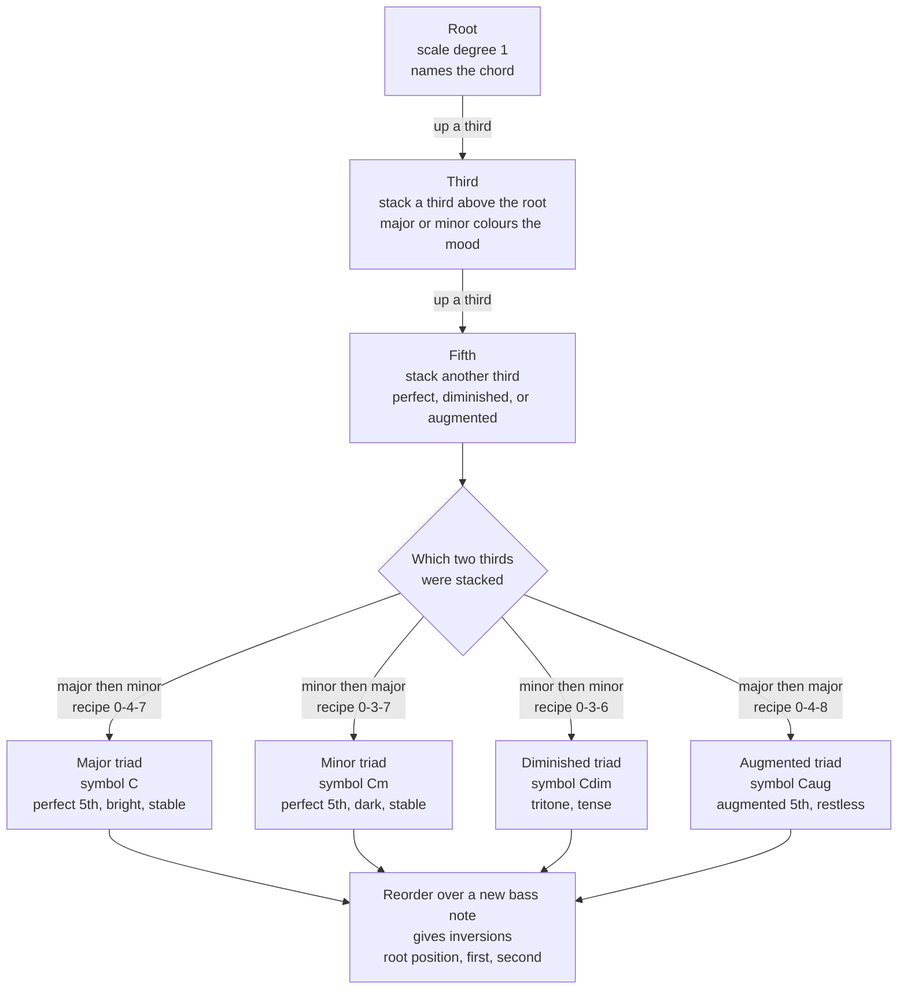

# 🎹 Chords and Triads

> [!abstract] TL;DR
> A **chord** is three or more pitches sounded together; the smallest and most fundamental one is the **triad** — a **root**, a **third**, and a **fifth** stacked in **thirds** (this stacking-by-thirds is called **tertian harmony**). Which *two* thirds you stack fixes the chord's **quality**: **major** (semitones 0-4-7), **minor** (0-3-7), **diminished** (0-3-6), or **augmented** (0-4-8). Building a triad on every degree of a scale yields the **diatonic triads** — I ii iii IV V vi vii° in a major key — that **Roman-numeral analysis** and every chord progression are made of, while reordering the same three notes over a different bass gives an **inversion**.

---

## Intuition

**Analogy first.** Picture a triad as a **three-person vocal group standing on a ladder**. The **bass singer at the bottom** is the **root**: they announce *who the chord is* — a "C" group or a "G" group. The **middle singer** is the **third**, and they hold the emotional dial: nudge that middle note down a semitone and the whole group sounds sad (**minor**), nudge it up and it sounds bright (**major**). The **top singer** is the **fifth**, mostly reinforcing and propping up the stack so it feels stable. Crucially, move the same three people to different rungs — send the middle or top singer down to the bottom — and it is still *the same trio*, just re-voiced. That re-voicing is an **inversion**: the chord's identity is *which notes*, not *who is on the floor*.

The ladder has one spacing rule: each singer stands a **third** above the one below — skip a letter name (C, skip D, land on E, skip F, land on G). Because Western harmony is built by stacking these thirds, its chords are called **tertian**. Add one more singer a third above the top and the trio becomes a quartet — a **seventh chord**. Everything else in harmony grows from this simple act of stacking thirds.

---

## How It Works

### Core Mechanics

1. **Tertian construction.** Start on a **root**. Add the note a **third** above it (skip one letter) — the **third** of the chord. Add another third — the **fifth**. Root, third, fifth: two stacked thirds spanning a fifth from bottom to top. Because the stacking interval is the third, this is **tertian harmony**.

2. **Quality comes from the *size* of each third.** A third is either **major** (4 semitones) or **minor** (3 semitones). The four combinations give the four **triad qualities**, each with a standard **chord symbol** (shown for a C root):
   - **Major** = major 3rd then minor 3rd, recipe **0-4-7**, symbol **C**. Perfect fifth outside; bright and stable.
   - **Minor** = minor 3rd then major 3rd, recipe **0-3-7**, symbol **Cm**. Perfect fifth outside; dark and stable.
   - **Diminished** = minor 3rd then minor 3rd, recipe **0-3-6**, symbol **Cdim** or **C°**. Outer interval is a **tritone** (diminished fifth); tense.
   - **Augmented** = major 3rd then major 3rd, recipe **0-4-8**, symbol **C+** or **Caug**. Outer interval is an **augmented fifth**; restless.
   Major and minor keep a **perfect fifth** on the outside and sound consonant; diminished and augmented alter that fifth and sound unstable.

3. **Inversions and figured bass.** A chord's identity is its set of note-names, not their vertical order. Whichever member sits in the **bass** names the inversion, and Baroque **figured bass** notates it by counting intervals above the bass note:
   - **Root position** — root in the bass (C-E-G). Figured bass **5/3**.
   - **First inversion** — third in the bass (E-G-C). Figured bass **6/3**, abbreviated **6**.
   - **Second inversion** — fifth in the bass (G-C-E). Figured bass **6/4**.

4. **Diatonic triads and Roman numerals.** Build a triad on *each* degree of a scale using only that scale's notes and you get the **diatonic triads**. In a **major key** the qualities are fixed: **I ii iii IV V vi vii°** = major, minor, minor, major, major, minor, diminished. **Roman-numeral analysis** encodes quality in the letter case: **uppercase = major**, **lowercase = minor**, **° = diminished**, **+ = augmented**. One analysis then describes the progression in *any* key.

5. **Voicing.** The same triad can be **closed** (all three notes packed within one octave) or **open** (spread beyond an octave), and any member may be **doubled**. Voicing changes color and playability without changing the chord.

6. **From triads to progressions.** Chords gain meaning in sequence. Each diatonic triad carries a **function** relative to the home chord: the **dominant** (V) pulls toward the **tonic** (I); the **subdominant / predominant** (IV, ii) leads toward the dominant. A progression such as **I-IV-V-I** or **I-V-vi-IV** is simply diatonic triads arranged to build and release tension — the topic of **functional harmony**. Not every stack of three is tertian: **sus chords** replace the third with a fourth (**sus4** = 0-5-7) or a second (**sus2** = 0-2-7), and a **power chord** (**C5** = 0-7) keeps only root and fifth, so it has *no third* and therefore *no major/minor quality* at all.

### Flow / Architecture



---

## Key Concepts

### Secondary Level

**A chord is notes sounded together; a triad is the three-note core.** Play three or more notes at once and you have a **chord**. The most important chord is the **triad**: three notes named the **root**, the **third**, and the **fifth**. On a keyboard, C-E-G is a triad — start on C, skip a key to E, skip a key to G.

**The chord is named after its root.** C-E-G is a "C chord" because C is the root. Slide the whole shape up so the root is G and you get a "G chord." The letter at the bottom of the stack is the chord's name.

**The third decides happy or sad.** Keep the root and fifth but move only the middle note down one key and the chord flips from bright (**major**, symbol **C**) to dark (**minor**, symbol **Cm**). That single note — the third — is the mood switch.

**Chord symbols are shorthand.** Guitarists and songwriters read letters, not stacked notes: **C** (major), **Cm** (minor), **Cdim** (diminished), **C+** (augmented). A whole song can be written as a row of these symbols above the lyrics.

**Chords are the harmony under a melody.** A melody is notes played one after another; a chord is notes played together underneath. Strum a chord while you sing and the chord is the **harmony** supporting the tune.

### Undergraduate Level

**Tertian harmony and the four qualities.** Western chords are built by **stacking thirds** (tertian). A triad is two stacked thirds; whether each third is **major (4 semitones)** or **minor (3 semitones)** yields four qualities with fixed semitone recipes: **major 0-4-7**, **minor 0-3-7**, **diminished 0-3-6**, **augmented 0-4-8**. Major and minor frame a **perfect fifth** (7 semitones) and are consonant; the **diminished** triad's outer interval is a **tritone** (6 semitones) and the **augmented** triad's is an **augmented fifth** (8 semitones), both dissonant.

**Inversions and figured bass.** Because a triad is defined by its pitch-classes, the same chord appears in three **inversions** depending on the bass note: **root position** (5/3), **first inversion** (third in bass, figured **6**), and **second inversion** (fifth in bass, **6/4**). Figured bass — a bass line with interval numbers beneath — was the standard Baroque shorthand from which realized harmony is reconstructed.

**Diatonic triads and Roman-numeral analysis.** Stacking thirds on each scale degree using only diatonic notes fixes the qualities of a major key: **I ii iii IV V vi vii°**. Roman numerals encode both degree and quality (case for major/minor, ° and + for diminished/augmented), giving a key-independent vocabulary for analysis: `C-Am-F-G` in C major is `I-vi-IV-V` in *any* major key.

**Voicing choices.** A **closed** voicing packs the chord within an octave; an **open** voicing spreads it wider for a fuller sound. **Doubling** (repeating a chord member in another octave) and choosing which note is on top shape the texture — the same four-note SATB triad can be voiced dozens of ways.

**Sus and power chords.** Not all common sonorities are triads. **sus4** (0-5-7) and **sus2** (0-2-7) suspend the third, creating an open, unresolved color; the **power chord** (0-7) drops the third entirely, which is why distorted rock guitar favors it — omitting the third avoids the harsh intermodulation a distorted major/minor third would produce.

### Graduate Level

**Function follows quality.** The four qualities are not just colors; they enable **functional harmony**. The **dominant** triad (V, major) and the **leading-tone** triad (vii°, diminished) both contain the key's **tritone** (scale degrees 4 and 7), whose instability drives the V-I and vii°-I resolutions. The tonic (I), meanwhile, is the maximally stable major triad. Quality, tritone content, and root motion together explain *why* progressions pull the way they do.

**Symmetry and harmonic ambiguity.** The **augmented triad** divides the octave into three equal major thirds, so it is **invariant under transposition by 4 semitones** (C+ = E+ = G#+ enharmonically) — it has no single unambiguous root and can pivot between distant keys. The **diminished triad** shares this symmetric flavor as a subset of the fully symmetric diminished-seventh chord. This mod-12 symmetry makes both qualities prized for **enharmonic reinterpretation** and modulation.

**Acoustic basis of consonance.** Helmholtz and the Plomp-Levelt roughness model explain *why* major and minor triads sound settled while diminished and augmented sound tense: the near-just **perfect fifth (~3:2)** and **major/minor third (~5:4, 6:5)** in a consonant triad place partials at wide, non-beating spacings, whereas the **tritone** and **augmented fifth** put partials inside a **critical band**, producing roughness. Consonance is thus partly a fact about *spectra*, not just convention — the demo below makes this audible-as-visible.

**Voice leading between triads.** Common-practice style connects triads by **smooth voice leading**: retain common tones, move remaining voices by step, and avoid **parallel perfect fifths and octaves** (which collapse independent voices) and **doubled leading tones** (which weaken resolution). Neo-Riemannian theory formalizes triad-to-triad moves (P, L, R transformations) as minimal voice-leading motions on the Tonnetz — treating triads as points and progressions as geometric paths.

**Beyond tertian.** Extending the stack upward adds a fourth third to make **seventh chords**, then ninths and elevenths — the ladder that jazz harmony climbs. Abandoning thirds for **quartal** (stacked-fourth) or **secundal** (cluster) harmony steps outside the tertian system entirely, a hallmark of 20th-century and modal-jazz voicings.

---

## Python Demo

Build the four triad qualities as **semitone stacks** above a root, synthesize each by summing **equal-tempered sine waves**, then compare the harmonic content of a **major** versus a **diminished** triad. The major triad's partials fall near the small-integer ratio **4:5:6**, so its composite waveform is regular; the diminished triad has no simple ratio and includes a **tritone (C-Gb)**, so its waveform is rough and its partials beat. numpy and matplotlib only.

```python
import numpy as np
import matplotlib.pyplot as plt

# ---------------------------------------------------------------
# Build the four triad qualities as semitone stacks above a root,
# synthesize each by summing equal-tempered sine partials, then
# compare a MAJOR vs a DIMINISHED triad in time and in spectrum.
# ---------------------------------------------------------------
fs   = 44100                      # sample rate (Hz)
dur  = 1.0                        # seconds
root = 261.63                     # C4 in Hz (the chord root)
t    = np.linspace(0, dur, int(fs * dur), endpoint=False)

# Interval recipes: semitones above the root that define each quality.
TRIADS = {
    "major":      [0, 4, 7],      # major 3rd + minor 3rd  -> bright, stable
    "minor":      [0, 3, 7],      # minor 3rd + major 3rd  -> dark, stable
    "diminished": [0, 3, 6],      # minor 3rd + minor 3rd  -> tense (tritone)
    "augmented":  [0, 4, 8],      # major 3rd + major 3rd  -> restless
}

def et_freq(root_hz, semitones):
    """Equal-tempered frequency: each semitone multiplies by 2**(1/12)."""
    return root_hz * 2.0 ** (semitones / 12.0)

def synth(recipe):
    """Sum three equal-amplitude sine partials into one chord signal."""
    chord = sum(np.sin(2 * np.pi * et_freq(root, s) * t) for s in recipe)
    return chord / len(recipe)     # keep the peak near +/- 1

# Print the stacked frequencies so tertian construction is explicit.
for name, recipe in TRIADS.items():
    hz = [round(et_freq(root, s), 2) for s in recipe]
    print(f"{name:11s} {recipe}  ->  {hz} Hz")

major = synth(TRIADS["major"])        # C  - E  - G
dimin = synth(TRIADS["diminished"])   # C  - Eb - Gb

# Magnitude spectrum up to 900 Hz (a Hann window sharpens the peaks).
def spectrum(sig, fmax=900.0):
    windowed = sig * np.hanning(sig.size)
    mag  = np.abs(np.fft.rfft(windowed))
    freq = np.fft.rfftfreq(sig.size, 1.0 / fs)
    keep = freq <= fmax
    return freq[keep], mag[keep] / mag.max()

fmaj, Xmaj = spectrum(major)
fdim, Xdim = spectrum(dimin)

# ---------------------------------------------------------------
# Plot: composite waveform (first 40 ms) + spectrum for each triad.
# ---------------------------------------------------------------
win = slice(0, int(fs * 0.04))        # 40 ms window shows the wave shape
fig, ax = plt.subplots(2, 2, figsize=(13, 6.5))

ax[0, 0].plot(t[win] * 1000, major[win], color="#2ca02c", lw=1.2)
ax[0, 0].set_title("Major triad  C-E-G  waveform\nnear 4:5:6 ratio  ->  regular, smooth")
ax[0, 0].set_xlabel("Time (ms)"); ax[0, 0].set_ylabel("Amplitude")

ax[0, 1].plot(t[win] * 1000, dimin[win], color="#d62728", lw=1.2)
ax[0, 1].set_title("Diminished triad  C-Eb-Gb  waveform\nno simple ratio  ->  rough, beating")
ax[0, 1].set_xlabel("Time (ms)"); ax[0, 1].set_ylabel("Amplitude")

ax[1, 0].vlines(fmaj, 0, Xmaj, color="#2ca02c", lw=1.5)
ax[1, 0].set_title("Major triad spectrum (3 partials)")
ax[1, 0].set_xlabel("Frequency (Hz)"); ax[1, 0].set_ylabel("Magnitude")

ax[1, 1].vlines(fdim, 0, Xdim, color="#d62728", lw=1.5)
ax[1, 1].set_title("Diminished triad spectrum (3 partials)")
ax[1, 1].set_xlabel("Frequency (Hz)"); ax[1, 1].set_ylabel("Magnitude")

for a in ax.flat:
    a.grid(True, ls="--", alpha=0.3)
plt.tight_layout()
plt.show()

# Expected output:
#   * Console: major -> [261.63, 329.63, 392.0] Hz (approx 4:5:6);
#              diminished -> [261.63, 311.13, 369.99] Hz.
#   * Major waveform repeats on a clear period (near 4:5:6).
#   * Diminished waveform looks jagged / aperiodic (no simple ratio,
#     the C-Gb tritone beats against the other partials).
#   * Both spectra show three lines; only their SPACING differs, and
#     that spacing is exactly what the ear reads as consonant vs tense.
```

---

## Real-World Applications

**Songwriting and lead sheets.** Pop, rock, folk, and jazz are notated as rows of **chord symbols** (C, Am, F, G) over lyrics or a melody. The ubiquitous **I-V-vi-IV** and **ii-V-I** are just diatonic triads (plus a seventh) selected for their functional pull. Fake books and Nashville-number charts are Roman-numeral analysis in daily working use.

**Guitar and the power chord.** Open-position chord shapes are physical triad voicings; **power chords (root + fifth)** dominate rock and metal precisely because they omit the third, keeping the sound clean under heavy distortion where a real major/minor third would generate harsh intermodulation products.

**Notation software and DAWs.** Sibelius, MuseScore, and DAWs like Ableton and Logic parse chord symbols, auto-generate voicings, transpose by re-labeling Roman numerals, and offer chord-track features that harmonize melodies from a triad vocabulary.

**Music information retrieval (MIR).** Automatic **chord recognition** classifies audio frames against a template vocabulary of triads and sevenths using **chroma / pitch-class profile** features — the machine-learning analogue of the spectrum comparison in the demo. Key-finding and cover-song detection lean on the same triad-based representations.

**Generative and AI music.** Symbolic and audio generation models are trained on or conditioned by chord functions and Roman-numeral structure; a "chord-conditioned" model literally consumes the triad/quality vocabulary described here as its harmonic control signal.

---

## Common Pitfalls

- **Thinking the bass note is the root.** Inversions change the bass, not the identity. E-G-C is still a **C major** triad in first inversion, not an "E chord." The root is the note the thirds are stacked *from*, wherever it sits in the texture.
- **Calling any three notes a triad.** A triad must be **tertian** — two stacked thirds. Clusters, **sus** chords, and **power** chords are not triads (a power chord has only two pitch-classes and *no quality* at all). Reserve "triad" for the four third-stacked qualities.
- **Confusing a diminished *triad* with a diminished *seventh* chord.** The triad (0-3-6) is three notes; the diminished seventh (0-3-6-9) is four. The symbols °(triad) and °7 (seventh) look alike but differ by one note that changes everything.
- **Misreading figured-bass "6".** A first-inversion triad figured **6** is *not* an "added-sixth chord." The 6 counts a sixth above the *bass*; the chord is still a plain triad, just inverted.
- **Roman-numeral case slips.** Case is meaning: `V` is a major dominant, `v` a minor one, `vii°` diminished, `III+` augmented. Writing `II` where you mean `ii` silently changes the analysis.
- **Enharmonic and symbol mix-ups.** `C+` (augmented) versus `C°` (diminished), and spelling a diminished triad's fifth as **Gb** (correct, a diminished fifth) versus **F#** (an augmented fourth) — wrong spelling breaks the tertian logic even when the piano key is identical.
- **Ignoring voice leading between triads.** Moving triads in blunt parallel produces **parallel fifths and octaves** that erase voice independence; doubling the **leading tone** weakens its resolution. Correct triads badly connected still sound wrong.

---

## Related Concepts

- [[Pitch_and_the_Harmonic_Series]] — Harmonics **4:5:6** of a single vibrating string already spell a **major triad**; the harmonic series is the acoustic origin of the triad and of why its intervals sound consonant.
- [[Music_Theory_Overview]] — Places chords and harmony among the six building blocks of music (pitch, rhythm, melody, harmony, timbre, form).
- [[Rhythm_Meter_and_Tempo]] — Chords are deployed *in time*; **harmonic rhythm** (how often the chord changes) is a rhythmic dimension of a progression.
- [[Fourier_Series]] — Each note is a fundamental plus harmonics; summing several notes' harmonics is exactly what produces a chord's composite spectrum in the demo.
- [[Frequency_Spectrum]] — The line-spectrum view used to compare the major and diminished triads: same three-partial structure, different spacing.
- [[Auditory_and_Speech_Perception]] — **Critical-band roughness** explains why the tritone in a diminished triad and the altered fifth in an augmented triad are heard as tense, while major/minor triads fuse.

---

## Review Questions

### Secondary

1. Spell a **C major** triad and a **C minor** triad on a keyboard by naming their three notes each. Which single note is different between them, and how does that one note change how the chord sounds?

### Undergraduate

2. In the key of **D major**, list all seven **diatonic triads** with their **Roman numerals** and **qualities** (I through vii°). Then take the tonic triad, put it in **first inversion**, and give both its note order (lowest to highest) and its **figured-bass** symbol. Finally, explain why C-E-G, E-G-C, and G-C-E are all "the same chord."

### Graduate

3. A **major** triad (0-4-7) and a **diminished** triad (0-3-6) each contain exactly three notes, yet the major sounds stable and the diminished sounds tense. (a) Using **frequency ratios** and the **Plomp-Levelt critical-band roughness** model, explain the difference in terms of where the partials fall. (b) The **augmented** triad (0-4-8) is symmetric under transposition by 4 semitones, giving it no unambiguous root — describe how a composer exploits this symmetry for **modulation and enharmonic reinterpretation**, and contrast it with the functional role the **tritone** gives the dominant (V) and leading-tone (vii°) triads.

---

## Sources

- Kostka, S., Payne, D., & Almén, B. (2018). *Tonal Harmony* (8th ed.). McGraw-Hill. — Standard text on triads, inversions, figured bass, and Roman-numeral analysis.
- Aldwell, E., Schachter, C., & Cadwallader, A. (2018). *Harmony and Voice Leading* (5th ed.). Cengage. — Authoritative treatment of triad function and voice leading.
- Benward, B., & Saker, M. (2014). *Music in Theory and Practice* (9th ed.). McGraw-Hill. — Undergraduate survey of chord construction and diatonic harmony.
- Piston, W., & DeVoto, M. (1987). *Harmony* (5th ed.). Norton. — Classic reference on tertian harmony and progression.
- Open Music Theory (2nd ed.). *Triads and Seventh Chords / Roman Numerals*. [viva.pressbooks.pub/openmusictheory](https://viva.pressbooks.pub/openmusictheory/) — Open-access, worked examples of triad quality, inversion, and figured bass.

---

#music-theory #chords #triads #harmony #tertian
