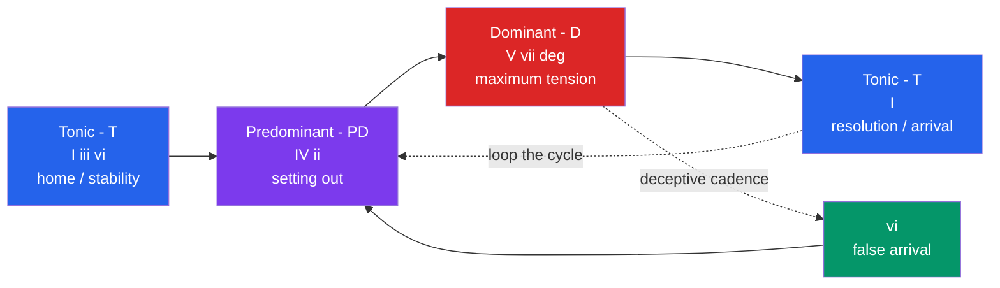

# 🎵 Functional Harmony and Chord Progressions

> [!abstract] TL;DR
> Functional harmony organizes the chords of a key into three roles — **tonic** (home/rest), **predominant** (departure), and **dominant** (tension) — that pull toward one another in a repeating **T → PD → D → T** cycle. The dominant-to-tonic resolution (V–I) is the strongest gravitational pull in tonal music, and the resulting progressions behave enough like a probabilistic process that they can be modeled as a **Markov chain**.

---

## Intuition

**Analogy — a journey away from home and back.** Imagine leaving your house, walking down the road, feeling the pull to turn around, and finally stepping back through your own front door. That arc of *departure → suspense → homecoming* is exactly what a chord progression does emotionally. The **tonic** chord is home: stable, restful, nowhere left to go. The **predominant** is stepping out onto the road. The **dominant** is the moment of maximum tension — a stretched rubber band, or the top of a swing at the instant before it falls back. The return to tonic is the release: the band snaps back, you arrive home.

Everything technical below is just a precise description of *which chords create the pull* and *how strongly* — the tension-and-release narrative is the whole point of harmony, and the chords are the storytelling grammar.

---

## How It Works

### Chords have functions, not just names

In a major key, the seven diatonic triads built on each scale degree get grouped into three **functions** based on how they behave — where they *want to go*:

| Function | Symbol | Chords (major key) | Feeling | Tendency |
|----------|--------|--------------------|---------|----------|
| Tonic | **T** | I, vi, iii | rest, resolution, home | can go anywhere |
| Predominant (subdominant) | **PD** | IV, ii | motion, departure | pulls toward the dominant |
| Dominant | **D** | V, vii° | tension, instability | pulls hard back to tonic |

The core engine of tonal music is the cycle **T → PD → D → T**. You start at rest, set out, build tension, and resolve. Repeat, and you have a song.

### Why V → I is the strongest move

The dominant chord (V, or V7 with its added seventh) contains two "unstable" notes that crave resolution:

1. **The leading tone** — scale degree 7, a half-step below the tonic. It sounds like it is leaning upward and *must* rise to scale degree 1.
2. **The tritone** — in a V7 chord, the leading tone (3rd of the chord) and the seventh form a tritone, the most dissonant interval. When V7 moves to I, the leading tone resolves up and the seventh resolves down by step; the tritone "collapses" inward onto the stable tonic. This voice-leading resolution is the acoustic heart of a cadence.

Because vii° also contains the leading tone and the tritone, it functions as a lighter substitute for the dominant.

### Roman numeral analysis

We label chords by **Roman numerals** relative to the key, not by absolute letter names. Uppercase = major triad, lowercase = minor, `°` = diminished. In C major: I = C, ii = Dm, iii = Em, IV = F, V = G, vi = Am, vii° = B°. Because the numerals are relative, the *same* analysis (e.g. ii–V–I) transposes to every key — which is exactly why it is the lingua franca of harmony and why probabilistic models operate on scale-degree symbols rather than raw pitches.

### The functional cycle



### Prolongation and harmonic rhythm

Real music does not sprint through the cycle in four chords. **Tonic prolongation** stretches the "home" region — you can decorate the tonic with neighbor chords, pedal points, or a I–IV–I oscillation before ever leaving. **Harmonic rhythm** is the *rate* at which functional chords change: a hymn might change every beat, while an ambient track might sit on one chord for sixteen bars. Slow harmonic rhythm with fast surface activity is a hallmark of pop and film scoring; fast harmonic rhythm drives Baroque and bebop.

### Common progressions (the canon)

- **I–IV–V–I** — the textbook authentic cadence template; T–PD–D–T in its purest form.
- **ii–V–I** — the backbone of jazz and common-practice harmony; predominant → dominant → tonic with strong root motion down by fifths.
- **I–V–vi–IV** — the "axis" or "pop" progression behind hundreds of hits; note that vi substitutes for tonic and the loop never fully "closes," giving it endless replay energy.
- **12-bar blues** — I–I–I–I / IV–IV–I–I / V–IV–I–V; loosens functional rules by making I and IV dominant-quality sevenths.
- **Circle-of-fifths progression** — I–IV–vii°–iii–vi–ii–V–I, each root a fifth below the last, chaining a sequence of mini-resolutions.

### Secondary dominants and tonicization

You can borrow tension from outside the key. A **secondary dominant** such as **V/V** ("five of five") is the dominant *of* the dominant — in C major that is D major (D–F♯–A), whose F♯ leading-tone points at G. Inserting V/V before V briefly makes V feel like a temporary tonic; this is **tonicization**, a momentary spotlight that stops short of a full key change (see modulation, its larger cousin).

### The deceptive cadence

Set up a V that everyone expects to resolve to I — then move to **vi** instead. Because vi shares two notes with I and is also a tonic-function chord, it feels like arriving home through the wrong door: resolution *and* surprise at once. This **deceptive cadence** (V–vi) is the classic tool for extending a phrase and denying premature closure.

---

## Key Concepts

### 🟢 Secondary (foundations)
- **Three functions:** Tonic (I, iii, vi) = rest, Predominant (IV, ii) = departure, Dominant (V, vii°) = tension.
- **The cycle:** T → PD → D → T is the default narrative of a phrase.
- **Roman numerals:** uppercase = major, lowercase = minor, `°` = diminished; relative to the key so they transpose freely.
- **Starter progressions:** I–IV–V–I, I–V–vi–IV, and the 12-bar blues.

### 🟡 Undergraduate (mechanics)
- **Voice-leading resolution:** in V7→I the leading tone rises to 1 and the chordal seventh falls; the tritone resolves inward — the physical source of "dominant pull."
- **Root motion by descending fifth** is the strongest progression; the circle of fifths chains these.
- **Cadence taxonomy:** Perfect/Imperfect Authentic (V–I), Half (…–V), Plagal (IV–I), and Deceptive (V–vi).
- **Secondary dominants / applied chords** (V/V, V/vi, …) and **tonicization** as local, temporary dominant relationships.
- **Harmonic rhythm** and **tonic prolongation** as structural, not decorative, choices.

### 🔴 Graduate (theory and modeling)
- **Prolongational / Schenkerian view:** surface chords elaborate a deep structural framework (the Ursatz); function is hierarchical, not merely a bead-string of labels.
- **Generative grammars of harmony:** Rohrmeier's generative syntax and Lerdahl–Jackendoff's GTTM treat harmony as recursive, tree-structured syntax with headed prolongations — closer to language than to a flat Markov chain.
- **Neo-Riemannian / transformational theory:** for chromatic music where classical function breaks down, PLR transformations describe chord-to-chord moves without invoking a tonic.
- **Corpus and probabilistic models:** n-gram, Hidden Markov, and neural models learn transition statistics; on real corpora the V→I and ii→V transitions dominate the learned matrix, empirically confirming functional tendencies. The Markov assumption captures local pull but *misses* long-range hierarchy and cadential planning.

---

## Python Demo

Model a diatonic chord progression as a first-order **Markov chain**: each chord's next move depends only on the current chord (the memoryless property), with transition probabilities that encode functional tendencies. We build the 7×7 transition matrix over the diatonic chords, sample a progression, and visualize the matrix as a heatmap.

```python
# Functional harmony as a first-order Markov chain.
# Requires only numpy and matplotlib.
import numpy as np
import matplotlib.pyplot as plt

# Diatonic chords of a major key, ordered by scale degree.
# Roman numerals encode root AND quality: uppercase=major, lowercase=minor, vii is diminished.
chords = ["I", "ii", "iii", "IV", "V", "vi", "vii"]
n = len(chords)

# Transition matrix P[i, j] = probability of moving FROM chord i TO chord j.
# Rows = current chord, columns = next chord. Values encode functional tendencies:
#   - V resolves strongly to I (authentic cadence) and sometimes to vi (deceptive)
#   - predominants ii and IV push toward V
#   - vii (leading-tone chord) resolves to I
#   - tonic I is a launch pad and can move almost anywhere
P = np.array([
    # I     ii    iii   IV    V     vi    vii
    [0.05, 0.15, 0.05, 0.25, 0.25, 0.20, 0.05],  # from I
    [0.05, 0.05, 0.00, 0.10, 0.60, 0.05, 0.15],  # from ii
    [0.05, 0.00, 0.05, 0.40, 0.10, 0.40, 0.00],  # from iii
    [0.25, 0.15, 0.00, 0.05, 0.45, 0.05, 0.05],  # from IV
    [0.60, 0.05, 0.00, 0.05, 0.10, 0.15, 0.05],  # from V   -> note the strong pull to I
    [0.05, 0.35, 0.05, 0.35, 0.10, 0.05, 0.05],  # from vi
    [0.65, 0.00, 0.10, 0.00, 0.05, 0.15, 0.05],  # from vii -> leading-tone resolves to I
])

# Normalise each row so it is a valid probability distribution.
P = P / P.sum(axis=1, keepdims=True)

def generate_progression(start="I", length=8, seed=0):
    """Sample a chord progression by walking the Markov chain."""
    rng = np.random.default_rng(seed)
    idx = chords.index(start)
    progression = [chords[idx]]
    for _ in range(length - 1):
        idx = rng.choice(n, p=P[idx])
        progression.append(chords[idx])
    return progression

prog = generate_progression(start="I", length=8, seed=7)
print("Generated progression:  " + "  ->  ".join(prog))

# Visualise the transition matrix as a heatmap.
fig, ax = plt.subplots(figsize=(6.5, 5.5))
im = ax.imshow(P, cmap="magma", vmin=0, vmax=1)

ax.set_xticks(range(n)); ax.set_xticklabels(chords)
ax.set_yticks(range(n)); ax.set_yticklabels(chords)
ax.set_xlabel("Next chord")
ax.set_ylabel("Current chord")
ax.set_title("Functional Harmony as a Markov Chain\nP[current -> next]")

# Annotate each cell with its probability.
for i in range(n):
    for j in range(n):
        val = P[i, j]
        ax.text(j, i, f"{val:.2f}", ha="center", va="center",
                color="white" if val < 0.5 else "black", fontsize=8)

fig.colorbar(im, ax=ax, label="transition probability")
plt.tight_layout()
plt.show()
```

A typical sampled run produces something like `I -> IV -> V -> I -> vi -> ii -> V -> I` — a perfectly idiomatic phrase, because the bright band across the `V → I` cell of the heatmap biases the walk toward cadential resolution. This is the essence of functional harmony reduced to a stochastic matrix: local tendencies, aggregated, produce music that "sounds right." What it cannot capture is long-range planning — that a composer aims a whole 8-bar phrase at a single arrival — which is why higher-order and hierarchical models improve on the plain first-order chain.

---

## Real-World Applications

- **Songwriting and production:** the I–V–vi–IV "axis" progression underpins a huge share of Western pop; understanding function lets writers substitute chords (vi for I, iii for V) without breaking the emotional arc.
- **Jazz improvisation:** the ii–V–I is the atomic unit jazz musicians drill in all twelve keys; players target the leading tone and the tritone resolution when soloing over the V chord.
- **Film and game scoring:** composers withhold the tonic to sustain tension (deceptive cadences, prolonged dominants) and deliver V–I resolution at emotional payoffs.
- **Algorithmic composition and MIR:** Markov chains, HMMs, and neural nets (e.g. Google Magenta) learn chord-transition statistics to generate or harmonize melodies; chord-recognition systems label progressions with Roman numerals from audio (see music information retrieval).
- **Assistive tools:** Band-in-a-Box, Hooktheory, and DAW chord-suggestion plugins rank likely next chords using exactly the transition-probability idea demonstrated above.

---

## Common Pitfalls

- **Treating Roman numerals as labels instead of functions.** Naming a chord "vi" tells you little; knowing it is a *tonic-function* substitute explains why V–vi is a deceptive cadence and why vi can begin or end a phrase.
- **Forcing every style into T–PD–D–T.** Modal pop, loop-based EDM, blues, and post-tonal music are often *non-functional*; the leading tone may be absent and no chord "resolves." Applying common-practice function there is a category error.
- **Ignoring voice leading.** A progression can be functionally correct yet sound clumsy if the leading tone does not resolve or if voices leap awkwardly. Function chooses the chords; voice leading realizes them.
- **Over-trusting the first-order Markov model.** It captures local pull but has no memory of the phrase, so it will happily wander or resolve at the wrong moment. Cadential timing needs hierarchy, not just transition probabilities.
- **Confusing tonicization with modulation.** A single V/V–V does not change the key; it spotlights the dominant. Only a sustained, cadentially-confirmed shift is a true modulation.

---

## Related Concepts

- [[Markov_Chains]] — the memoryless stochastic process used in the Python demo to model chord-to-chord tendencies; the transition matrix is its defining object, and V→I dominance is a Markov transition probability.
- [[Music_Classification_MIR]] — music information retrieval systems perform automatic chord recognition and Roman-numeral analysis, extracting the very harmonic functions described here from raw audio.

> [!note] Planned sibling notes in `Music_Theory/02_Harmony/`
> Once created, this note should link to **Chords_and_Triads** (the chords that receive functions), **Cadences** (the punctuation of functional resolution), **Modulation** (the large-scale cousin of tonicization), and **Jazz_Harmony** (extended-chord and tritone-substitution practice built on ii–V–I). These files do not yet exist, so no wikilinks are added here.

---

## Review Questions

**🟢 Secondary.** Assign each of the seven diatonic triads in C major to its harmonic function (T, PD, or D), and write out the chords of a I–IV–V–I progression as letter names.

**🟡 Undergraduate.** A phrase ends with a V chord that everyone expects to resolve to I, but instead moves to vi. Name this cadence, explain *why* vi can stand in for the expected resolution, and describe one musical situation in which a composer would want this effect.

**🔴 Graduate.** You train a first-order Markov chain on a corpus of pop songs and find the V→I transition is by far the most probable. What real feature of tonal harmony does this confirm, and what important structural aspect of harmony will this model still fail to capture? Propose one modeling change to address that limitation.

---

## Sources

- Walter Piston & Mark DeVoto, *Harmony* (5th ed.), W. W. Norton, 1987 — the standard reference on harmonic function and cadence.
- Dmitri Tymoczko, *A Geometry of Music*, Oxford University Press, 2011 — voice leading, chord function, and the geometry of progressions. [publisher](https://global.oup.com/academic/product/a-geometry-of-music-9780195336672)
- *Open Music Theory* (open online textbook) — chapters on harmonic function, Roman numerals, and cadences. [openmusictheory.github.io](https://openmusictheory.github.io/)
- Martin Rohrmeier, "Towards a generative syntax of tonal harmony," *Journal of Mathematics and Music*, 5(1), 2011. [Taylor & Francis](https://www.tandfonline.com/doi/abs/10.1080/17459737.2011.573676)
- Hooktheory, *Theory Tab / Trends* — empirical statistics of chord-progression frequency across popular music. [hooktheory.com/trends](https://www.hooktheory.com/trends)

---

#music-theory #harmony #functional-harmony #chord-progression #roman-numerals
