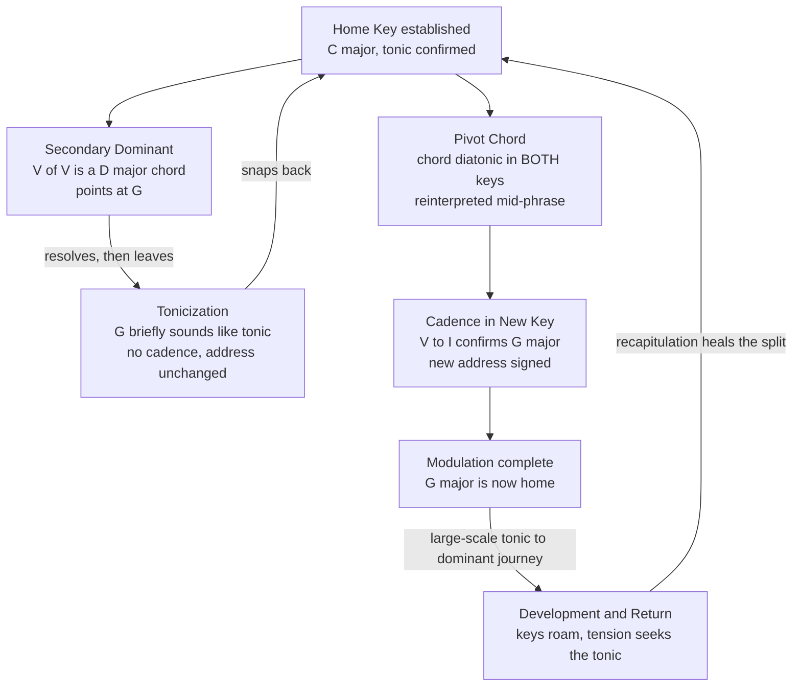

# 🎹 Modulation and Tonicization

> [!abstract] TL;DR
> **Tonicization** briefly borrows the pull of a foreign key to color one chord — you tip your hat to a new tonal center (usually with a **secondary dominant** like V/V) and then come straight home. **Modulation** is the real move: you pack your bags, travel to a new key, and *confirm* it with a cadence so the ear now hears a different note as "home." Which keys are easy to reach is governed by the **circle of fifths** — neighbors differ by a single accidental and share six of their seven notes, so a smooth **pivot chord** exists between them; distant keys share almost nothing and need chromatic force. Modulation is how tonal music builds large-scale drama: the tonic-to-dominant journey is the load-bearing beam of **sonata form**, and the abrupt semitone "truck-driver" bump is the cheap-but-effective final-chorus lift of pop.

---

## Intuition

**Analogy first.** Think of a key as your **home town**, and the tonic chord as your **house**. Every piece of tonal music is a story about leaving home and the tension of being away.

**Tonicization is a day trip.** You drive to the next town over, have lunch at *their* town square (you make *their* main chord feel, for a moment, like the center of the world), and drive home before dinner. You never changed your address. Musically, you slip in the one chord that "points at" a neighbor — a **secondary dominant** — let it resolve, and immediately resume the home key. The ear registers a flash of somewhere-else, then relief at returning.

**Modulation is moving house.** You go to the new town, sign a lease, change your mailing address, and start calling *that* town square "home." The ear stops hearing the old tonic as the reference point and re-centers on the new one. The paperwork that makes it official is a **cadence** in the new key — a full V-I that says, unambiguously, "this is home now."

**The map is the circle of fifths.** Some towns are next door (one accidental apart, sharing six of seven notes — you can drive there on a shared road, the **pivot chord**). Others are on the far side of the country (the tritone away, sharing almost nothing — you need to take a jarring flight, a **direct** or **chromatic** modulation). The distance you travel, and how smoothly you cross the border, is exactly what makes modulation feel gentle or dramatic.

---

## How It Works

### The core distinction: tonicization vs modulation

Both phenomena introduce notes and chords foreign to the prevailing key. The difference is **duration and confirmation**, and it lies on a continuum rather than a hard line:

1. **Tonicization** — a chord is momentarily treated as a temporary tonic. The classic device is the **secondary (applied) dominant**: a dominant-function chord aimed not at the real tonic but at some *other* diatonic chord. In C major, **D-F#-A** is not diatonic; it is **V/V** ("five of five"), the dominant *of* G. Play D7 then G and, for one beat, G feels like a local tonic. But nothing confirms G as the new key, so the ear snaps back to C. Tonicization enriches harmony without leaving home.

2. **Modulation** — the tonal center genuinely changes and is **established**, typically by (a) a **cadence** in the new key, (b) sufficient *time* spent there, and (c) the disappearance of the old tonic as a point of reference. A tonicization that is prolonged, cadentially confirmed, and structurally load-bearing simply *is* a modulation. The practical test: if you hummed the passage and were asked "what note sounds like home now?", tonicization answers with the old tonic, modulation with the new one.

### The circle of fifths and closely related keys

Arrange the twelve major keys so each is a **perfect fifth** (seven semitones) from the next: C, G, D, A, E, B, F#, C#/Db, Ab, Eb, Bb, F, back to C. Each clockwise step **adds one sharp** (or removes one flat); each counter-clockwise step does the reverse. Two crucial facts fall out:

- **Adjacent keys differ by exactly one accidental** and therefore **share six of their seven scale notes**. C major and G major differ only by F vs F#. That single-note overlap is why neighbors are called **closely related keys**.
- For any key, its closely related keys are its **dominant** (one step clockwise, up a fifth), its **subdominant** (one step counter-clockwise, down a fifth), and their **relative minors**, plus its own relative minor. All of these share a nearly identical note pool, so pivot chords are plentiful and modulation between them is smooth.

The farther apart two keys sit on the circle, the fewer notes they share, and the more chromaticism a modulation between them requires. The **tritone**-related key (six steps away, e.g., C to F#/Gb) shares only two notes and is maximally distant — the source of the most dramatic, jarring shifts.

### Modulation techniques (smooth to abrupt)

- **Common-chord / pivot-chord modulation** — find a chord that is **diatonic in both** the old and new key, sound it as a member of the old key, then *reinterpret* it as a member of the new key and cadence there. The listener glides across the border without noticing the crossing until it is done. This is the workhorse of Baroque and Classical practice.
- **Direct / phrase modulation** — end a phrase in the old key, then simply *begin* the next phrase in the new key with no preparation. Common in pop between verse and chorus and in the abrupt sectional shifts of Romantic music.
- **Chromatic modulation** — use a chromatically altered chord (a secondary dominant of the new key, or a borrowed chord) as the hinge; the chromatic voice-leading itself pulls the ear into the new key.
- **Common-tone modulation** — hold a single pitch across the seam and reharmonize it as belonging to a (often distant) new key. A shared note, not a shared chord, is the bridge — favored by Schubert and Romantic composers for surprising, distant shifts.
- **Enharmonic modulation** — respell an ambiguous chord (the **diminished seventh** or the **German augmented sixth**, which sounds like a dominant seventh) so it resolves into an unexpected, often remote key. The most powerful long-distance teleport in tonal harmony.
- **Sequential modulation** — repeat a melodic-harmonic pattern transposed by a consistent interval, marching through several keys. Coltrane's *Giant Steps* modulates by major thirds; development sections churn through keys by ascending fifths.

### Modulation as large-scale form

Modulation is not decoration — it is **structural architecture**. In **sonata form** (see the Musical Form section, S03), the exposition dramatizes a journey from the **tonic** to a contrasting key (the **dominant** in major-key works, the **relative major** in minor-key works); the development destabilizes tonality by roaming through many keys; and the recapitulation resolves the drama by restating the second theme *back in the tonic*, healing the original tonal split. The entire emotional arc of a Classical movement is a story told in keys. This is what theorists mean by **key areas** and **tonal architecture**: the sequence of established keys is the deep skeleton beneath the notes.



---

## Key Concepts

### Secondary Level

**A key is a home base; the tonic is home.** A piece in "C major" treats the note and chord C as the point of maximum rest. Every other chord is heard *relative* to that home — some create tension, some relax it.

**Tonicization is a quick visit; modulation is moving in.** If the music leans on a new chord for a moment and then returns, that is **tonicization**. If it travels to a new key, stays, and settles there, that is **modulation**. The everyday test: after the change, which note feels like "home"?

**The circle of fifths is the map of key relationships.** Twelve keys arranged so neighbors are a fifth apart. Neighbors are **closely related** — they share almost all their notes and slide into one another easily. Keys on opposite sides of the circle are **distant** and feel like a big jump.

**Relative and parallel keys are special neighbors.** The **relative** minor of C major is A minor — *same notes, different home* (no sharps or flats for either). The **parallel** minor of C major is C minor — *same home, different notes*. Relative keys are extremely closely related; a shift between them barely disturbs the ear.

**The "truck-driver" modulation is pop's cheapest thrill.** Bump the whole song up a semitone or whole tone for the final chorus — no preparation, just a lift. It injects a jolt of fresh energy and is instantly recognizable once you know to listen for it.

### Undergraduate Level

**Secondary (applied) dominants tonicize.** A **secondary dominant** is a dominant-function chord borrowed from a foreign key and aimed at a diatonic chord of the home key. In C major, **V/V = D-F#-A(-C)** resolves to G; **V/vi = E-G#-B(-D)** resolves to A minor. The tell-tale sign is a **chromatic** note (the raised F# or G#) that acts as the *leading tone of the tonicized chord*. Applied chords also include the **leading-tone seventh**, viio7/x. They intensify a progression without changing the key.

**Closely related keys, defined precisely.** For a given key, the closely related keys are those whose **key signatures differ by at most one accidental**: the dominant (V), the subdominant (IV), the relative minor (vi), and the relatives of the dominant and subdominant. In C major these are G, F, A minor, E minor, D minor. Pivot-chord modulations between these are effortless because six or more chords are shared.

**Pivot-chord (common-chord) modulation, step by step.** (1) Establish the old key. (2) Arrive at a chord **diatonic in both** keys — in C-to-G, the chord **C major (I in C = IV in G)** or **A minor (vi in C = ii in G)** works. (3) Reinterpret that chord as belonging to the new key. (4) Immediately introduce the new key's **dominant** (D7 in G) and **cadence** on the new tonic. The pivot is the hinge on which the tonal door swings.

**The taxonomy of techniques.** Beyond the pivot chord: **direct/phrase** (no preparation, start the new phrase in the new key), **chromatic** (an altered chord such as V7/new-tonic is the bridge), **common-tone** (one held pitch reharmonized), **enharmonic** (respell dim7 or Ger+6 to leap to a remote key), and **sequential** (transpose a pattern repeatedly to march through keys).

**Modulation drives sonata form.** The exposition's **tonic-to-dominant** (major) or **tonic-to-relative-major** (minor) modulation creates the structural tension a whole movement exists to resolve. The recapitulation's job is to bring the second theme home to the tonic. Learn to hear the key changes and you can hear the form.

**Distant vs close modulation and dramatic weight.** Modulating to a closely related key feels natural, conversational, expected. Modulating to a distant or chromatically-mediant-related key (C to E major, C to Ab major) feels expansive, surprising, or unsettling — Romantic composers exploit exactly this to signal awe, dream, or rupture.

### Graduate Level

**Tonal architecture and prolongation.** In Schenkerian terms, a "modulation" within a phrase is often better understood as a large-scale **prolongation** of a single diatonic scale-step of the *global* tonic. A modulation to the dominant is heard, at the background level, as an enormous expansion of the **V** in a I-V-I *Ursatz*. The distinction between a genuine structural key change and a prolonged tonicization is a question of *level*: what is a modulation at the phrase level may be a passing tonicization at the level of the whole movement. This hierarchy is why "how big is a modulation?" has no context-free answer.

**Schoenberg's monotonality and regions.** Schoenberg (*Structural Functions of Harmony*) argued that a well-composed tonal piece has **one tonality**, and that apparent modulations are **regions** of that single tonic — I-region, dominant-region, subdominant-region, mediant-region, and so on, arranged by degree of relationship. This reframes modulation not as *leaving* a key but as *touring the provinces of one kingdom*, and gives a principled measure of how far-flung a region is.

**Enharmonic pivots and the symmetry of the diminished seventh.** The fully diminished seventh chord divides the octave into equal minor thirds, so a single sonority (e.g., B-D-F-Ab) can be **respelled four ways** and resolve into four different keys a minor third apart. The **augmented sixth** chords exploit the enharmonic equivalence of the augmented sixth and the minor seventh (Ger+6 sounds identical to a dominant seventh), enabling teleportation to remote keys. These chromatic pivots are the engine of Romantic long-distance modulation and of the harmonic ambiguity later composers pushed toward atonality.

**Directional and progressive tonality.** Not all tonal works return home. In **progressive (directional) tonality**, a piece *ends in a different key than it began* (Mahler, Nielsen) — modulation becomes a one-way narrative rather than a departure-and-return, dissolving the classical assumption that the opening tonic is destiny.

**Sonata Theory and the tonal narrative.** Hepokoski and Darcy's *Elements of Sonata Theory* recasts the exposition's modulation as a rhetorical event: the **medial caesura** and the arrival of the **secondary key** are dramatized "moments" whose success or failure (the deformational possibilities) carry expressive meaning. Caplin's form-functional theory similarly reads modulation as one of the syntactic functions that articulate beginning, middle, and end. In both, key change is *the* primary carrier of large-scale musical narrative — the plot, not the scenery.

**Neo-Riemannian mediant relations.** Chromatic third relations (C-E, C-Ab, C-A, C-Eb) that share a common tone but no key signature proximity are modeled elegantly by **neo-Riemannian** transformations (P, L, R) as smooth voice-leading moves through the *Tonnetz*, explaining why "distant" chromatic-mediant modulations can nonetheless feel smooth: they are close in **voice-leading space** even when far apart on the circle of fifths. The circle of fifths is only one metric of distance among several.

---

## Python Demo

The circle of fifths is a *map of key distance*. This demo (numpy + matplotlib only) draws the twelve major keys on the circle, computes a **shared-scale-tone** distance metric between every pair of keys, shows which keys are closely related versus distant, and traces a **pivot-chord modulation** path from C major to its neighbor G major (close) contrasted with the tritone leap to F# major (distant).

```python
import numpy as np
import matplotlib.pyplot as plt

# ------------------------------------------------------------------
# Circle of fifths: 12 major keys, each a perfect fifth apart.
# Clockwise from C, every step adds one sharp / removes one flat.
# ------------------------------------------------------------------
circle = ['C', 'G', 'D', 'A', 'E', 'B', 'F#', 'C#', 'Ab', 'Eb', 'Bb', 'F']
tonics = [(7 * i) % 12 for i in range(12)]      # fifth chain: 0,7,2,9,4,11,...

MAJOR = np.array([0, 2, 4, 5, 7, 9, 11])        # major scale, semitones from tonic

def scale_pcs(tonic):
    """The 7 pitch classes (mod 12) of a major scale."""
    return set(int(x) for x in (tonic + MAJOR) % 12)

scales = [scale_pcs(t) for t in tonics]

# ------------------------------------------------------------------
# Key-distance metrics.
#   shared[i,j]  = how many of the 7 notes keys i and j have in common.
#   circle_dist  = minimum number of fifth-steps between two keys.
# Adjacent keys share 6 of 7 notes; the tritone-away key shares only 2.
# ------------------------------------------------------------------
n = 12
shared = np.zeros((n, n), dtype=int)
for i in range(n):
    for j in range(n):
        shared[i, j] = len(scales[i] & scales[j])

def circle_dist(i, j):
    d = abs(i - j)
    return min(d, n - d)

# Coordinates: place key 0 (C) at top, march clockwise.
angles = np.pi/2 - 2*np.pi*np.arange(n)/n
xs, ys = np.cos(angles), np.sin(angles)

fig, ax = plt.subplots(1, 3, figsize=(16, 5.2))

# ---- Panel 1: the circle of fifths, C and its close neighbors ringed ----
ax[0].plot(np.append(xs, xs[0]), np.append(ys, ys[0]),
           color='#cccccc', lw=1, zorder=1)
ax[0].scatter(xs, ys, s=560, color='#e8eef7', edgecolors='#33517a', zorder=2)
for k in range(n):
    ax[0].text(xs[k], ys[k], circle[k], ha='center', va='center',
               fontsize=11, fontweight='bold', zorder=3)
for nb in (0, 1, n-1):        # C (home), G (dominant), F (subdominant)
    ax[0].scatter(xs[nb], ys[nb], s=640, facecolors='none',
                  edgecolors='#d62728', lw=2.6, zorder=4)
ax[0].set_title('Circle of Fifths\nred rings: C and its closely related keys',
                fontsize=11)
ax[0].set_aspect('equal'); ax[0].axis('off')
ax[0].set_xlim(-1.4, 1.4); ax[0].set_ylim(-1.4, 1.4)

# ---- Panel 2: shared-scale-tone matrix (bright band = close keys) ----
im = ax[1].imshow(shared, cmap='viridis', vmin=2, vmax=7)
ax[1].set_xticks(range(n)); ax[1].set_yticks(range(n))
ax[1].set_xticklabels(circle, rotation=45, ha='right', fontsize=8)
ax[1].set_yticklabels(circle, fontsize=8)
ax[1].set_title('Shared Scale Tones Between Keys\nordered around the circle of fifths',
                fontsize=11)
for i in range(n):
    for j in range(n):
        ax[1].text(j, i, shared[i, j], ha='center', va='center',
                   color='white' if shared[i, j] < 6 else 'black', fontsize=7)
fig.colorbar(im, ax=ax[1], fraction=0.046, pad=0.04, label='notes in common')

# ---- Panel 3: modulation paths from C: close pivot vs distant leap ----
ax[2].plot(np.append(xs, xs[0]), np.append(ys, ys[0]),
           color='#dddddd', lw=1, zorder=1)
ax[2].scatter(xs, ys, s=400, color='#f2f2f2', edgecolors='#999999', zorder=2)
for k in range(n):
    ax[2].text(xs[k], ys[k], circle[k], ha='center', va='center',
               fontsize=9, zorder=3)
# Close: C -> G, one fifth-step, shares 6 notes -> smooth pivot modulation.
ax[2].annotate('', xy=(xs[1], ys[1]), xytext=(xs[0], ys[0]),
               arrowprops=dict(arrowstyle='-|>', color='#2ca02c', lw=2.8))
# Distant: C -> F#, the tritone, six steps, shares only 2 notes -> jarring.
ax[2].annotate('', xy=(xs[6], ys[6]), xytext=(xs[0], ys[0]),
               arrowprops=dict(arrowstyle='-|>', color='#d62728', lw=2.8, ls='--'))
ax[2].set_title('Modulation Paths from C major\ngreen: close pivot   red: distant leap',
                fontsize=11)
ax[2].set_aspect('equal'); ax[2].axis('off')
ax[2].set_xlim(-1.4, 1.4); ax[2].set_ylim(-1.4, 1.4)

plt.tight_layout()
plt.show()

# ------------------------------------------------------------------
# Spell out the pivot-chord modulation C major -> G major.
# The chord C-E-G is I in C major AND IV in G major: a natural pivot.
# ------------------------------------------------------------------
print("C major scale :", sorted(scales[0]))
print("G major scale :", sorted(scales[1]))
print("Shared notes  :", sorted(scales[0] & scales[1]),
      "->", shared[0, 1], "of 7 in common (only F vs F# differs)")
print()
print("Closest keys to C by shared scale tones:")
order = np.argsort(-shared[0])
for idx in order[1:5]:
    print(f"  {circle[idx]:3s}  shares {shared[0, idx]} notes,"
          f"  {circle_dist(0, idx)} fifth-step(s) away")

# Expected output:
#   * Panel 1: 12 keys on a ring; C, G, F ringed in red as close neighbors.
#   * Panel 2: a bright diagonal band -> keys near each other on the circle
#              share the most notes (6); the tritone corners share only 2.
#   * Panel 3: a short green arrow C->G (close, smooth) and a long dashed
#              red arrow C->F# straight across (distant, jarring).
#   * Printout: C & G share 6 notes; G, F, D, Bb are C's closest keys.
```

---

## Real-World Applications

**Classical sonata form (Mozart, Haydn, Beethoven).** The exposition of nearly every Classical sonata-form movement **modulates from tonic to dominant** (major) or **tonic to relative major** (minor), typically via a pivot chord in the transition. This is not ornament — it is the structural engine of the whole movement, whose recapitulation exists to resolve that key conflict by bringing the second theme home. Modulation *is* the form.

**Bach chorales and the pivot-chord textbook.** Bach's four-part chorales are the canonical training ground for common-chord modulation: nearly every phrase tonicizes or modulates to a closely related key and back, using pivots so smooth the border is invisible until the cadence lands. Undergraduate harmony courses drill on labeling exactly where the pivot occurs.

**Pop's "truck-driver" gear change.** The final-chorus semitone or whole-tone bump is a direct (unprepared) modulation used for a jolt of lift: Beyoncé's *Love on Top* modulates up **four times** in its final minute; Whitney Houston's *I Wanna Dance with Somebody*, Michael Jackson's *Man in the Mirror*, and countless Eurovision entries all deploy it. It is unsubtle and effective — pure energy injection with no cadential preparation.

**Jazz and sequential modulation — Coltrane changes.** John Coltrane's *Giant Steps* modulates by **major thirds** (B-G-Eb, an equal division of the octave), a sequential scheme so demanding it became a rite of passage for improvisers. Jazz reharmonization routinely tonicizes chords with secondary dominants (the "V of" chains) and modulates through remote keys at speed.

**Film and game scoring.** Composers use **distant and chromatic-mediant modulations** (C to E, C to Ab) to signal wonder, the supernatural, or a shift of scene — the "Hollywood" sound of awe. Common-tone and enharmonic modulations let a cue pivot instantly when the on-screen mood turns, holding one pitch as the emotional thread across the cut.

**Hymnody and congregational singing.** Hymn arrangers write a **modulating final verse** (often up a step, prepared by a brief reharmonized bridge) to lift a congregation into the last stanza — the sacred cousin of the pop truck-driver, but usually pivot-prepared rather than blunt.

---

## Common Pitfalls

- **Calling every secondary dominant a modulation.** A lone V/V that resolves and returns is **tonicization**, not modulation — the key never actually changed. Modulation requires the new key to be *established*, usually by a cadence and by spending real time there. If home still sounds like home afterward, you tonicized.
- **Forgetting to confirm the new key with a cadence.** Introducing the new key's dominant is not enough; without a **V-I cadence in the new key** the ear treats the passage as an extended tonicization or a passing region. The cadence is the paperwork that makes the move official.
- **Confusing relative and parallel keys.** **Relative** = same notes, different tonic (C major / A minor). **Parallel** = same tonic, different notes (C major / C minor). They are wildly different in distance: relative keys are maximally close (zero accidentals apart); parallel keys share a tonic but differ by three accidentals. Mixing up the terms wrecks any analysis.
- **Assuming distance on the circle of fifths is the only distance.** Two keys can be far apart on the circle yet close in **voice leading** (chromatic mediants like C and E share a common tone and move smoothly). Judging "how distant" a modulation feels by circle steps alone misses why Romantic chromatic-mediant shifts sound smooth despite crossing the whole circle.
- **Botching enharmonic spelling.** When pivoting on a diminished seventh or a German augmented sixth, the *spelling* must follow the destination key's voice leading. Spelling the pivot in the old key's terms produces an analysis (and often a notation) that contradicts how the chord actually resolves.
- **Treating the truck-driver modulation as sophisticated craft.** The unprepared semitone bump is a blunt energy trick, not a structural modulation in the Classical sense — it changes pitch level without any tonal argument. It is effective, but do not confuse it with the pivot-chord logic that binds a sonata together.
- **Over-modulating and blurring the home key.** If the music never stays anywhere long enough to establish a tonic, the ear loses its reference and the sense of "home" — and thus of departure and return — evaporates. Tension needs a stable frame to push against.

---

## Related Concepts

- [[Music_Theory_Overview]] — The parent survey of the vault; its **functional harmony** section introduces the tonic-dominant tension (the V-I pull) that modulation exploits on a large scale, and its treatment of scales and the chromatic collection underlies the circle of fifths used here.

> **Planned sibling notes (not yet in the vault):** this note is designed to link with *Functional Harmony and Progressions* (secondary dominants and the V-I grammar), *Cadences and Phrase Structure* (the cadence that confirms a modulation), *Scales and Modes* (the diatonic collections whose overlap defines closely related keys), and *Musical Form* (S03) (sonata form's tonic-to-dominant journey). Wire these wikilinks once those notes exist.

---

## Review Questions

### Secondary

1. A song in C major briefly plays a D major chord that resolves to G, then goes right back to sounding like C is "home." Did the song **modulate** to a new key, or merely **tonicize**? Explain your reasoning in one sentence, and name what feature would have to be present for it to count as a true modulation.

### Undergraduate

2. You want to modulate from **C major to G major** using a **pivot chord**. (a) Identify one chord that is diatonic in *both* keys and give its Roman numeral in each. (b) Write the four-stage plan (establish old key, pivot, new-key dominant, cadence). (c) Using the shared-tone idea from the demo, explain *why* C and G admit so many pivot chords, and why a modulation from C to F# major cannot rely on a simple diatonic pivot.

### Graduate

3. A theorist claims that "the modulation to the dominant in a sonata exposition is not really a change of key at all, but a prolongation of the global tonic's dominant." (a) Explain, using the idea of **structural levels** / prolongation, how a passage can be a genuine modulation at the phrase level yet a tonicization at the movement level. (b) Contrast this hierarchical view with Schoenberg's theory of **monotonality and regions**. (c) How does an **enharmonic modulation** on a diminished-seventh or augmented-sixth chord complicate any single, fixed measure of "key distance," and what does the neo-Riemannian notion of voice-leading proximity add?

---

## Sources

- Aldwell, E., Schachter, C., & Cadwallader, A. (2018). *Harmony and Voice Leading* (5th ed.). Cengage. — Authoritative treatment of tonicization, secondary dominants, and pivot-chord modulation.
- Kostka, S., Payne, D., & Almén, B. (2018). *Tonal Harmony* (8th ed.). McGraw-Hill. — Standard undergraduate text on modulation techniques, closely related keys, and the circle of fifths.
- Schoenberg, A. (1969). *Structural Functions of Harmony* (2nd ed., L. Stein, Ed.). Norton. — The theory of monotonality and tonal "regions."
- Caplin, W. E. (1998). *Classical Form: A Theory of Formal Functions for the Instrumental Music of Haydn, Mozart, and Beethoven*. Oxford University Press. — Modulation as a syntactic form-function in Classical structure.
- Hepokoski, J., & Darcy, W. (2006). *Elements of Sonata Theory*. Oxford University Press. — Modulation and the secondary key as the dramatic core of sonata form.
- Cohn, R. (2012). *Audacious Euphony: Chromatic Harmony and the Triad's Second Nature*. Oxford University Press. — Neo-Riemannian voice-leading distance and chromatic-mediant relations beyond the circle of fifths.

---

#music-theory #modulation #tonicization #circle-of-fifths #key-change
