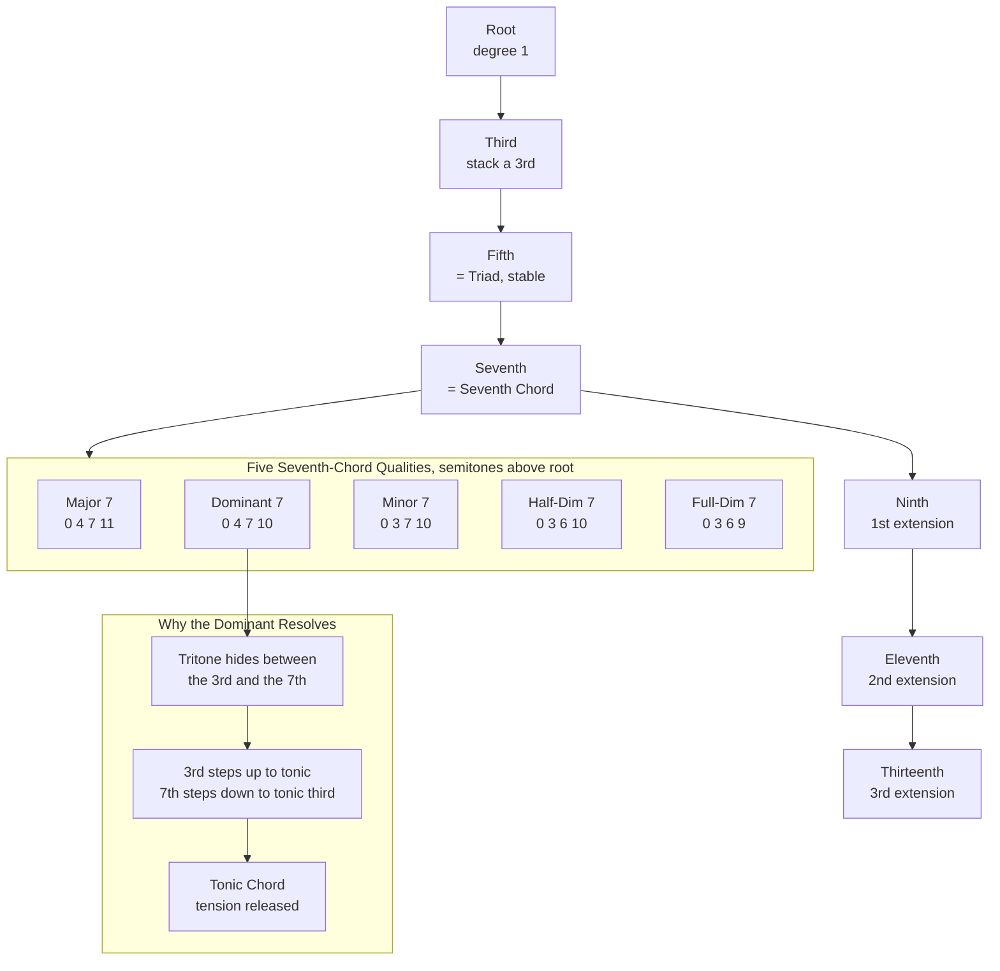

# 🎹 Seventh Chords and Extensions

> [!abstract] TL;DR
> A **seventh chord** stacks one more third on top of a triad, adding a fourth note — the seventh — and turning a stable three-note chord into a richer, more *directional* sound. There are **five common qualities** (major 7, dominant 7, minor 7, half-diminished 7, and fully diminished 7), distinguished entirely by their interval recipe in semitones. The **dominant seventh** is special: it contains a **tritone** between its 3rd and 7th, an unstable interval whose two voices pull inward and outward to resolve to the tonic — the engine of Western tonal motion. Keep stacking thirds and you get **extensions** — the 9th, 11th, and 13th — plus **altered** tones (b9, #9, #11, b13) and **added-tone** chords (add9, 6/9). These "color notes" are what give **jazz** and **impressionism** their lush, ambiguous palette.

---

## Intuition

**Analogy first.** Think of a **triad as a plain, fully resolved sentence** — "The dog sat." It is grammatically complete and it just *sits* there, stable. A **seventh chord** is that same sentence with a comma and a lean forward: "The dog sat, **and then** —". The added seventh is a raised eyebrow, a note that says *something is about to happen*. You are no longer at rest; you are pointed somewhere. **Extensions** (9th, 11th, 13th) are like piling on adjectives and subordinate clauses — "The restless, storm-grey dog sat by the flickering window, and then —". The core meaning is unchanged, but the *color* and *atmosphere* explode.

In the technical domain: a triad is three notes stacked in thirds (root, third, fifth). Add the next third up and you get the **seventh** — a note a step below the octave that gently rubs against the root and demands motion. The **dominant seventh** carries the strongest lean of all because it hides a **tritone**, the most restless interval in the system, which behaves like a stretched spring wanting to snap back to home base. Extensions keep the same "stack thirds" recipe going past the octave, spraying **color** onto the chord without changing its fundamental job.

---

## How It Works

### Core Mechanics

Western harmony is **tertian** — chords are built by stacking **thirds**. Start on a root, add a note a third above (the 3rd), add another third (the 5th) and you have a **triad**. Add one more third and you reach the **seventh**, producing a **seventh chord**. Because a third can be **major (4 semitones)** or **minor (3 semitones)**, the *sequence* of major and minor thirds you stack decides the chord's **quality**. Naming a chord is just reading off its recipe of semitone intervals above the root.

1. **Triad first.** Major triad = root + major third + minor third → semitones `0, 4, 7`. Minor triad = `0, 3, 7`. Diminished = `0, 3, 6`. Augmented = `0, 4, 8`.
2. **Add the seventh.** Stack one more third. Whether it is major or minor decides whether the top note is a **major 7th (11 semitones)** or a **minor 7th (10 semitones)** above the root.
3. **The five common qualities** emerge from combining triad + seventh:
   - **Major 7 (maj7):** major triad + major 7th → `0, 4, 7, 11`. Warm, lush, at rest.
   - **Dominant 7 (7):** major triad + minor 7th → `0, 4, 7, 10`. Tense, wants to resolve.
   - **Minor 7 (m7):** minor triad + minor 7th → `0, 3, 7, 10`. Soft, mellow.
   - **Half-diminished 7 (m7b5, ø7):** diminished triad + minor 7th → `0, 3, 6, 10`. Dark, plaintive.
   - **Fully diminished 7 (dim7, °7):** diminished triad + diminished 7th → `0, 3, 6, 9`. Symmetric, maximally unstable, ambiguous.
4. **The dominant's tritone.** In the dominant 7 (`0, 4, 7, 10`), the **3rd** and the **7th** are 6 semitones apart — a **tritone**. This interval is acoustically restless: its two voices resolve by half-step contrary motion (the 3rd rises to the tonic, the 7th falls to the tonic's 3rd), which is exactly *why* a V7 chord pulls so strongly to I. The tritone is the spring; the resolution is the release.
5. **Extensions — keep stacking thirds past the octave.** Add another third above the 7th and you reach the **9th** (`+14`), then the **11th** (`+17`), then the **13th** (`+21`). These wrap around the octave and become **color / tension notes** layered above the core four-note chord. A "C13" implies the whole stack: root, 3, 5, 7, 9, 11, 13.
6. **Alterations and added tones.** **Altered dominants** sharpen or flatten extensions for extra bite — **b9, #9, #11, b13** — heavily used to intensify a V7. **Added-tone chords** add a color note *without* the seventh: **add9** is a triad plus the 9th (no 7th), and **6/9** is a triad plus the 6th and 9th — sweet, stable, no urge to resolve.

### Flow / Architecture



---

## Key Concepts

### Secondary Level

**A seventh chord is a triad with one more note on top.** Take a C major triad — C, E, G — and add the note a third higher, B. Now you have **Cmaj7** (C-E-G-B), a four-note chord. That extra top note is the **seventh** (it is seven letter-names up from the root: C-D-E-F-G-A-**B**). Almost every chord in jazz, soul, and film music is a seventh chord or bigger.

**The seventh makes a chord sound "unfinished" in a good way.** A plain triad sounds settled, like a period at the end of a sentence. Adding a seventh makes it lean forward, like it wants to move to the next chord. That forward lean is the secret to why jazz and blues sound "smooth" and "flowing" instead of blocky.

**There are five seventh chords you hear all the time.** They differ only in which notes you stack:
- **Major 7** = warm and dreamy (the sound of a mellow ballad).
- **Dominant 7** = bluesy and tense; it wants to move.
- **Minor 7** = soft and cool (think smooth jazz).
- **Half-diminished** = sad, mysterious.
- **Fully diminished** = spooky, unstable, "horror-movie transition" chord.

**Extensions add extra color notes.** Stack even more notes above the seventh and you get **9th, 11th, and 13th** chords. These do not change the chord's basic job — they just make it richer and more colorful, the way spices change a dish without changing that it is soup. A **C13** is a big, lush, jazzy version of a C chord.

### Undergraduate Level

**Quality is fully determined by the interval recipe.** Because a chord's name is just its stack of thirds, you can label any four-note chord by measuring semitones from the root. Memorize the five recipes — `0,4,7,11` (maj7), `0,4,7,10` (dom7), `0,3,7,10` (m7), `0,3,6,10` (m7b5), `0,3,6,9` (dim7) — and you can name chords by ear or on paper. Note that **only one semitone** distinguishes maj7 from dom7 (the top note), yet their functions are worlds apart.

**The dominant seventh and the tritone.** The dominant 7 is the only common seventh chord whose 3rd and 7th form a **tritone** (6 semitones). A tritone is symmetric — it divides the octave exactly in half — and it is maximally dissonant, so it demands resolution. In a V7 → I cadence, the tritone resolves by **contrary stepwise motion**: the chord's 3rd (the key's leading tone) rises a half-step to the tonic, and its 7th falls a half-step to the tonic's 3rd. This double half-step pull is the mechanical heart of **functional harmony** and the reason the V7 → I cadence defines a key. The fully diminished 7 goes further: it stacks **two** tritones, which is why it is so unstable and can pivot to many keys.

**Extended chords stack past the octave.** After the 7th, the next thirds land on the **9th** (a major second above the octave, `+14`), the **11th** (a perfect fourth above the octave, `+17`), and the **13th** (a major sixth above the octave, `+21`). Naming convention: a chord "implies" all the odd numbers up to its name, so a **C11** theoretically contains root-3-5-7-9-11, though players routinely omit notes. The 9th, 11th, and 13th are the **color / tension notes** that separate a bare seventh chord from a lush jazz voicing.

**Altered dominants sharpen the tension.** To make a V7 pull even harder, jazz raises or lowers its extensions: **b9, #9, #11, b13**. The **7#9** ("Hendrix chord") clashes a major 3rd against a minor-3rd-sounding #9; the **7alt** chord (typically b9, #9, #11, b13) is the maximally tense dominant, drawn from the altered scale. These live only on dominants because their job is to intensify resolution.

**Added-tone chords are stable color, not tension.** An **add9** is a triad plus the 9th but **no 7th** (Cadd9 = C-E-G-D). A **6/9** chord adds both the 6th and 9th (C-E-G-A-D). These sound rich and modern but, lacking a seventh, they do not create the forward pull of an extended dominant — they are stable "postcard" chords, common as final chords in pop and jazz.

**Chord-scale relationships.** Every chord implies a **parent scale** whose notes are available for melody and further extension. A **Cmaj7** pairs with C Ionian (major) or Lydian; **C7** pairs with C Mixolydian (the dominant scale); **Cm7** with C Dorian; **Cm7b5** with C Locrian; an **altered dominant** with the C altered (super-Locrian) scale. This **chord-scale** thinking is the backbone of jazz improvisation: identify the chord's quality, pick the matching scale, and its extensions become the notes you can lean on.

### Graduate Level

**Extensions versus non-chord tones — a genuine analytical distinction.** A 9th is a **chord tone** (part of the harmony) only if it is structurally *present and sustained*; the same pitch can instead be a fleeting **non-chord tone** — a **suspension**, **appoggiatura**, or **passing tone** — that decorates a plain triad and resolves away. The difference is functional, not acoustic: in a **sus4** chord the 4th *replaces* the 3rd and must resolve down to it (a true suspension), whereas an **add4/11** *coexists* with the 3rd as color. Analysts decide by asking: does the note resolve by step (non-chord tone) or does it persist as stable color (extension)? Impressionist harmony deliberately blurs this line, treating former dissonances as stable sonorities in their own right.

**The "avoid note" problem.** Not every extension is usable over every chord. The classic case: the **11th (natural 4th) over a major or dominant chord** sits a half-step above the 3rd, producing a harsh b9 clash that muddies the chord's identity. Jazz theory therefore treats the natural 11 as an **avoid note** on dominants and major chords, replacing it with the **#11** (the Lydian fourth), which is consonant with the 3rd. On minor and half-diminished chords the natural 11 is fine. This is why "**Lydian dominant**" (7#11) and "**Lydian major**" (maj7#11) voicings are so idiomatic.

**Rootless and quartal voicings.** In an ensemble the bassist supplies the root, freeing the pianist to omit it. **Rootless voicings** (Bill Evans, Red Garland) voice only the **3rd, 7th, and one or two extensions** (9, 13), because the 3rd and 7th — the **guide tones** — carry the chord's quality and its tritone, while extensions carry color. A common four-note dominant voicing is `3-13-7-9` or `7-9-3-13`. **Quartal voicings** (McCoy Tyner) stack fourths instead of thirds, dissolving clear root-position identity into modal ambiguity — a hallmark of post-bop and modal jazz. These voicings show that a chord's **function** lives in a small set of critical notes, not in the full tertian stack.

**Voice leading of the guide tones.** Across a **ii-V-I** progression, the 3rds and 7ths of successive chords resolve into each other by half-step or common tone, producing smooth **guide-tone lines**. The 7th of Dm7 (C) becomes the 3rd of G7... no — the 7th of Dm7 (C) falls to the 3rd of G7 (B); the 7th of G7 (F) falls to the 3rd of Cmaj7 (E). This chain of falling sevenths is the linear skeleton of tonal jazz, and it is *why* seventh chords, not triads, are the default unit of jazz harmony: they carry the resolving voices built in.

**Impressionism and the emancipation of the seventh.** Debussy and Ravel treated 7th, 9th, and 11th chords as **stable colors** to be moved in **parallel** (planing), stripped of their functional obligation to resolve. A stream of parallel dominant 9ths creates shimmer rather than tension. This "**emancipation of dissonance**" — extensions used for timbre and mood rather than voice-leading force — is the direct ancestor of jazz color harmony and of the whole 20th-century expansion of the tertian vocabulary into higher and higher stacks of thirds.

---

## Python Demo

Four panels connect the arithmetic of stacking thirds to the sound of the chords. Panel A plots the **interval structure of the five seventh-chord qualities** on a semitone grid. Panel B shows how **extensions** (9th, 11th, 13th) keep stacking thirds above the dominant seventh. Panel C **synthesizes a G7 dominant chord resolving to a C-major tonic** and plots the waveform. Panel D shows the **spectrum** of the G7 chord, with its four fundamentals (G-B-D-F) marked — the B and F being the tritone that drives the resolution. numpy and matplotlib only.

```python
import numpy as np
import matplotlib.pyplot as plt

# --- Equal-tempered MIDI note -> frequency ---
def midi_to_freq(n):
    return 440.0 * 2.0 ** ((n - 69) / 12.0)

# --- The five seventh-chord recipes (semitones above root) ---
seventh_chords = {
    "Major 7  (maj7)":  [0, 4, 7, 11],
    "Dominant 7  (7)":  [0, 4, 7, 10],
    "Minor 7  (m7)":    [0, 3, 7, 10],
    "Half-Dim 7 (m7b5)":[0, 3, 6, 10],
    "Full-Dim 7 (dim7)":[0, 3, 6, 9],
}

# --- Dominant chord with progressive extensions (stack more thirds) ---
dom_extensions = {
    "Dom 7":  [0, 4, 7, 10],
    "Dom 9":  [0, 4, 7, 10, 14],
    "Dom 11": [0, 4, 7, 10, 14, 17],
    "Dom 13": [0, 4, 7, 10, 14, 17, 21],
}

# --- Additive synthesis: sum sine tones (fundamental + soft harmonics) ---
fs = 22050
def synth_chord(root_midi, intervals, dur=1.0, n_harm=4):
    t = np.linspace(0, dur, int(fs * dur), endpoint=False)
    sig = np.zeros_like(t)
    for semi in intervals:
        f0 = midi_to_freq(root_midi + semi)
        for h in range(1, n_harm + 1):
            sig += (1.0 / h) * np.sin(2 * np.pi * h * f0 * t)
    sig /= np.max(np.abs(sig))
    env = np.minimum.reduce([np.ones_like(t), t / 0.02, (dur - t) / 0.05])
    return sig * env

# G7 (dominant on G3=55: G-B-D-F) resolving to C major (C4=60: C-E-G)
g7   = synth_chord(55, [0, 4, 7, 10], dur=1.0)      # tension
cmaj = synth_chord(60, [0, 4, 7],     dur=1.3)      # rest
progression = np.concatenate([g7, cmaj])
t_prog = np.arange(len(progression)) / fs

# Spectrum of the G7 chord
spec  = np.abs(np.fft.rfft(g7))
freqs = np.fft.rfftfreq(len(g7), 1 / fs)

# --- Plot ---
fig = plt.figure(figsize=(14, 9))

# (A) Semitone grid of the five seventh chords
axA = fig.add_subplot(2, 2, 1)
for i, (name, iv) in enumerate(seventh_chords.items()):
    axA.plot([0, 12], [i, i], color="gray", lw=0.6, alpha=0.5, zorder=1)
    axA.scatter(iv, [i] * len(iv), s=140, color="#1f77b4", zorder=3)
axA.set_yticks(range(len(seventh_chords)))
axA.set_yticklabels(list(seventh_chords.keys()), fontsize=9)
axA.set_xticks(range(13))
axA.set_xlabel("Semitones above root")
axA.set_title("Interval Structure of the Five Seventh Chords")
axA.set_xlim(-0.5, 12.5)
axA.grid(True, axis="x", ls="--", alpha=0.3)

# (B) Extensions stacking further thirds on the dominant
axB = fig.add_subplot(2, 2, 2)
for i, (name, iv) in enumerate(dom_extensions.items()):
    axB.plot([0, max(iv)], [i, i], color="gray", lw=0.6, alpha=0.5, zorder=1)
    axB.scatter(iv, [i] * len(iv), s=140, color="#d62728", zorder=3)
axB.set_yticks(range(len(dom_extensions)))
axB.set_yticklabels(list(dom_extensions.keys()), fontsize=9)
axB.set_xticks(range(0, 22, 2))
axB.set_xlabel("Semitones above root   7 -> 9 -> 11 -> 13 add thirds")
axB.set_title("Extended Dominants Keep Stacking Thirds")
axB.grid(True, axis="x", ls="--", alpha=0.3)

# (C) Waveform: V7 -> I resolution
axC = fig.add_subplot(2, 2, 3)
axC.plot(t_prog, progression, color="#2ca02c", lw=0.5)
axC.axvline(1.0, color="black", ls=":", lw=1)
axC.text(0.50, 1.12, "G7  = tension", ha="center", fontsize=9)
axC.text(1.65, 1.12, "C major = rest", ha="center", fontsize=9)
axC.set_xlabel("Time (s)")
axC.set_ylabel("Amplitude")
axC.set_title("Dominant Seventh Resolving to Tonic")
axC.set_ylim(-1.25, 1.35)

# (D) Spectrum of the G7 chord with fundamentals marked
axD = fig.add_subplot(2, 2, 4)
axD.plot(freqs, spec, color="#9467bd", lw=1)
axD.set_xlim(0, 1200)
axD.set_xlabel("Frequency (Hz)")
axD.set_ylabel("Magnitude")
axD.set_title("Spectrum of G7 Chord: G  B  D  F")
ymax = spec[freqs < 1200].max()
for semi, lbl in zip([0, 4, 7, 10], ["G", "B", "D", "F"]):
    fpk = midi_to_freq(55 + semi)
    axD.axvline(fpk, color="gray", ls="--", alpha=0.4)
    axD.text(fpk, ymax * 0.95, lbl, ha="center", fontsize=9)

plt.tight_layout()
plt.show()

# The tritone that defines the dominant lives between the 3rd and the 7th
b = midi_to_freq(55 + 4)    # B, the 3rd  (leading tone of C)
f = midi_to_freq(55 + 10)   # F, the 7th
print(f"G7 third   B = {b:6.2f} Hz")
print(f"G7 seventh F = {f:6.2f} Hz")
print(f"Interval B to F = {10 - 4} semitones = a TRITONE (drives V7 -> I)")

# Expected output:
#   * Panel A: five rows; each chord's dots mark its semitone recipe.
#   * Panel B: the dominant chord growing taller as 9, 11, 13 are added.
#   * Panel C: a busy tense waveform (G7) followed by a calmer one (C major).
#   * Panel D: four spectral clusters at G, B, D, F plus their harmonics.
#   * Printout: B (~247 Hz) and F (~349 Hz), a 6-semitone tritone.
```

---

## Real-World Applications

**Jazz standards and the ii-V-I.** The entire jazz repertoire is built on seventh chords. The **ii7 - V7 - Imaj7** progression (e.g., Dm7 - G7 - Cmaj7) threads guide-tone lines through falling sevenths, and pianists voice each chord **rootlessly** with the 3rd, 7th, 9th, and 13th. Bebop and post-bop players (Charlie Parker, Bill Evans, Herbie Hancock) treat extensions and altered dominants as their default vocabulary, not decoration.

**Blues, gospel, and neo-soul.** The **dominant 7th** is the defining sound of the blues — the I, IV, and V chords are all dominant 7ths, giving the style its characteristic grit. Gospel and neo-soul (D'Angelo, Robert Glasper) pile on 9ths, 11ths, and 13ths and slide between extended voicings, producing that warm, "floating" harmony.

**Impressionist classical music.** Debussy and Ravel **planed** parallel 9th and 11th chords for color rather than function, dissolving traditional tension-and-release into shimmering atmosphere. This "emancipation of the seventh" reshaped 20th-century harmony and directly seeded jazz color chords.

**Film and game scoring.** Composers use **major 7** and **6/9** chords for warmth and nostalgia, **half-diminished** and **fully diminished** chords for suspense and instability, and **altered dominants** for maximum harmonic anxiety before a resolution. The fully diminished 7's symmetry makes it the go-to pivot for sudden, cinematic key changes.

**Music information retrieval and software.** Automatic **chord-recognition** systems must model a vocabulary far beyond triads — maj7, dom7, m7, m7b5, dim7, and extended chords — to transcribe real jazz and pop. DAWs, notation software, and "smart chord" tools in Ableton, Logic, and MuseScore encode these recipes so users can insert, voice, and re-harmonize extended chords automatically.

---

## Common Pitfalls

- **Confusing add9 with a 9th chord.** An **add9** (Cadd9 = C-E-G-D) is a *triad plus the 9th, with no 7th*. A true **9 chord** (C9 = C-E-G-Bb-D) includes the 7th and therefore the dominant tension. They sound and function differently — do not write "add9" when you mean "9."
- **Playing the natural 11 over a major or dominant chord.** The natural 11 sits a half-step above the 3rd and creates a muddy b9 clash — it is an **avoid note**. Use the **#11** (Lydian fourth) on major and dominant chords; save the natural 11 for minor and half-diminished chords.
- **Mixing up half-diminished and fully diminished.** **Half-diminished (m7b5, `0,3,6,10`)** has a *minor* 7th and one tritone; **fully diminished (dim7, `0,3,6,9`)** has a *diminished* 7th and two tritones. They look similar on paper but function and sound very differently — the fully diminished is symmetric and far more unstable.
- **Treating every extension as a chord tone.** A sustained 9th is color (an extension); a 9th that resolves down by step is a **non-chord tone** (a suspension or appoggiatura decorating a plain triad). Analyze whether the note *persists* or *resolves* before labeling the chord — otherwise you over-name the harmony.
- **Forgetting the tritone's voice leading.** In V7 → I the leading tone must rise and the 7th must fall. Voicing them in parallel or letting the 7th leap upward destroys the resolution and often creates forbidden parallel fifths. The whole point of the dominant seventh is *how its tritone resolves*.
- **Cramming in every note of a big chord.** A "C13" does not require all seven pitches. Real voicings **omit** the root (bass covers it), often the 5th, and any avoid notes. Beginners who voice every extension produce muddy, bottom-heavy chords instead of clear rootless voicings.
- **Ignoring the chord-scale match.** Improvising a natural 4th over a dominant, or a natural 6th over a Locrian half-diminished chord, fights the harmony. Match the chord quality to its parent scale so your extensions are consonant with the chord.

---

## Related Concepts

- [[Music_Theory_Overview]] — The parent survey of the six building blocks; seventh chords live inside its **Harmony** section and extend the triads introduced there.
- [[Pitch_and_the_Harmonic_Series]] — The **harmonic series** explains why stacked thirds sound consonant and why the seventh and its extensions appear as higher, "spicier" partials; chord tones map onto overtone ratios.
- [[Frequency_Spectrum]] — The spectral view used in the demo: a chord is a set of fundamentals plus overtones, and the tritone's roughness is visible as closely spaced spectral energy.

> [!note] Planned sibling notes
> This note is designed to cross-link with **Chords and Triads** (the three-note foundation seventh chords extend), **Functional Harmony and Progressions** (where the dominant seventh's tritone resolution is formalized as V7 → I), and **Jazz Harmony** (Section 05, chord-scale theory, rootless voicings, and altered dominants). Those notes do not yet exist in the vault, so no wikilinks are made to them here — add them once the notes are created.

---

## Review Questions

### Secondary

1. Start on the note C and build a four-note chord by stacking thirds: C, E, G, and one more third on top. What note do you add, and what is the name of the resulting chord? In one sentence, describe how a seventh chord *feels* different from a plain triad.

### Undergraduate

2. Two seventh chords have the semitone recipes `0, 4, 7, 11` and `0, 4, 7, 10`. Name both qualities and identify the single note that differs. Then explain why the second chord (the dominant 7) "wants to resolve" while the first (major 7) sounds at rest — refer specifically to the **tritone** and which two chord tones form it. What are the two half-step motions that resolve a G7 to a C major chord?

### Graduate

3. A pianist voices a C13 chord using only four notes and omits both the root and the 5th. (a) Which notes are the **guide tones**, and why can the root and 5th be dropped without losing the chord's identity? (b) The natural 11 is treated as an **avoid note** on this dominant chord — explain the acoustic reason and state which altered extension replaces it. (c) Contrast how **jazz** and **impressionist** harmony each use the 9th, 11th, and 13th: in one style they are tension notes demanding resolution, in the other they are stable colors moved in parallel. What does this reveal about the difference between an extension as a *chord tone* and as a *non-chord tone*?

---

## Sources

- Levine, M. (1995). *The Jazz Theory Book*. Sher Music. — The standard reference for seventh chords, extensions, chord-scale relationships, rootless voicings, and altered dominants.
- Aldwell, E., Schachter, C., & Cadwallader, A. (2018). *Harmony and Voice Leading* (5th ed.). Cengage. — Rigorous treatment of seventh chords, the dominant's tritone resolution, and non-chord-tone versus chord-tone analysis.
- Piston, W. (1987). *Harmony* (5th ed., revised by M. DeVoto). Norton. — Classic account of tertian harmony, seventh chords, and functional voice leading.
- Persichetti, V. (1961). *Twentieth-Century Harmony*. Norton. — Extensions, added-tone chords, planing, and the impressionist emancipation of the seventh.
- Tymoczko, D. (2011). *A Geometry of Music*. Oxford University Press. — Modern geometric perspective on how seventh chords and extensions sit in voice-leading space.

---

#music-theory #seventh-chords #extensions #jazz #harmony
