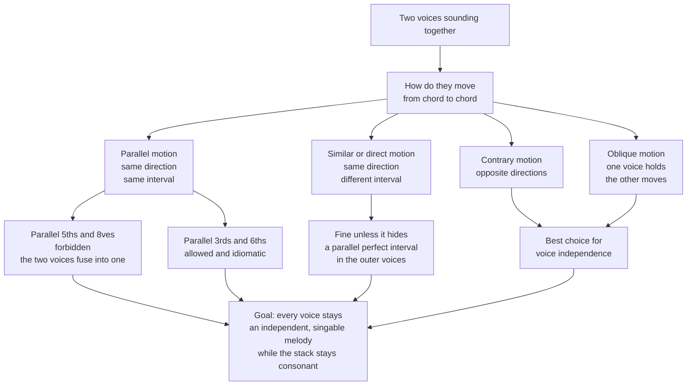

# 🎼 Voice Leading and Counterpoint

> [!abstract] TL;DR
> Voice leading is the craft of moving each individual melodic line smoothly from one chord to the next; counterpoint is the art of combining several such independent lines so they sound both like distinct melodies and like coherent harmony at the same time.

---

## Intuition

**Analogy:** Imagine four friends holding a conversation. A good conversation is not four people shouting the same sentence in unison, nor four people talking over each other about unrelated topics. It is four distinct voices, each with its own line of thought, that still add up to one shared, sensible discussion. Each person mostly reacts *gently* to what was just said (a small step, not a jarring leap), and when two of them start finishing each other's sentences in perfect lockstep, the conversation collapses back into a monologue — you have effectively lost a voice.

Music has exactly this dual nature. Read **across** the page and you hear four independent melodies (the horizontal, contrapuntal view). Read **down** the page at any instant and you hear a chord (the vertical, harmonic view). Voice leading is the set of habits that keeps every horizontal line singable and independent while the vertical stack stays consonant — smooth motion, common tones held over, and no two voices allowed to fuse into one.

---

## How It Works

### Core Mechanics

1. **Every note belongs to a *voice*, not just a chord.** In four-part (SATB) writing the voices are **S**oprano, **A**lto, **T**enor, and **B**ass. A progression is not four chords stacked in isolation — it is four horizontal lines that happen to line up into chords.
2. **Move as little as possible.** When going chord to chord, first ask: what note is shared between the two chords (the *common tone*)? Keep it in the same voice. Then move the remaining voices to the *nearest* available chord tone, preferably by step (a second) rather than a leap. Minimal motion is the guiding principle.
3. **Preserve voice independence.** The whole reason the classical rules exist is to keep the four lines sounding like four people, not one. The single most damaging thing you can do is let two voices march in parallel perfect fifths or octaves — because a perfect fifth or octave is so acoustically fused that two voices moving in parallel at that interval collapse into a single perceived voice.
4. **Classify the motion between any two voices.** Every pair of voices, at every chord change, moves in one of four ways (see diagram). Contrary and oblique motion maximize independence; parallel motion is the riskiest.
5. **Respect the texture rules.** Keep voices in their comfortable ranges, keep adjacent upper voices within an octave of each other (spacing), avoid *voice crossing* (alto going above soprano), and double the right chord tones — never double the **leading tone**, because it has a strong pull to resolve and two of them would demand two resolutions that create parallel octaves.
6. **Zoom out to counterpoint.** Voice leading between chords is the local, harmonic view. Counterpoint is the same discipline applied as a compositional art form: writing lines that are interesting *as melodies* while remaining correct *as harmony*. **Species counterpoint** (from Fux) trains this skill in graded stages.

### Types of Motion

- **Parallel** — both voices move the same direction by the same interval (both up a third, say). Fine for thirds and sixths, forbidden for perfect fifths and octaves.
- **Similar** (also called *direct*) — same direction, different interval. Watch for *hidden* fifths and octaves when the outer voices arrive at a perfect interval by similar motion.
- **Contrary** — voices move in opposite directions. The gold standard for independence.
- **Oblique** — one voice holds a note while the other moves. Also excellent for independence.

### Flow / Architecture



---

## Key Concepts

### Secondary — the core habits

- **Keep the common tone.** If two neighbouring chords share a note, hold it in the same voice.
- **Move by step.** Voices that are not holding a common tone should slide to the closest chord tone.
- **No parallel fifths or octaves.** The one prohibition every beginner learns first.
- **Horizontal vs vertical.** Across the page = melody; down the page = chord. Good music works in both directions at once.

### Undergraduate — SATB part-writing

- **SATB ranges and spacing.** Each voice has a working range; keep no more than an octave between soprano-alto and alto-tenor (tenor-bass may be wider). Avoid **voice crossing** and **overlap**.
- **Doubling.** In a root-position triad, double the root by default. **Never double the leading tone** or any tendency tone whose resolution would create parallels.
- **The four motions** (parallel, similar, contrary, oblique) and the concept of **hidden / direct fifths and octaves** reached by similar motion in the outer voices.
- **Functional voice leading.** Smooth voice leading is *how* a progression like ii-V-I acquires its inevitability: the leading tone rises to the tonic, the seventh of a chord falls by step, and inner voices barely move. Harmony and voice leading are two views of the same event.
- **Species counterpoint (Fux).** A graded curriculum against a fixed melody (the *cantus firmus*): **First species** (note against note), **Second** (two notes against one), **Third** (four against one), **Fourth** (syncopation and **suspensions**), and **Fifth / florid** (a free mixture of the first four).

### Graduate — the deep structure

- **Invertible (double) counterpoint.** Lines written so the upper and lower voice can be swapped and still sound correct — *invertible at the octave, tenth, or twelfth*. Bach's fugues rely on this; a subject and countersubject must remain valid whether stacked one way or the other, which constrains which intervals may appear.
- **Canon and imitation.** One voice states a line; another restates it (transposed and/or delayed). A **canon** is strict imitation for the whole piece; a **fugue** opens with imitative *exposition* of a subject and then develops it. This is voice leading as generative machinery.
- **Schenkerian voice leading.** A view in which surface harmony is the elaboration of a few deep contrapuntal lines (the *Urlinie* over an arpeggiated bass). Voice leading, not chord labels, is the primary structural force.
- **Parsimonious / neo-Riemannian voice leading.** Chords connected by the *smallest possible* total motion (the P, L, R transforms move a single voice by a semitone or tone), formalizing "minimal motion" as geometry on chord space.
- **Guide-tone lines in jazz.** The 3rds and 7ths of chords are the *guide tones*; a good jazz comper or arranger connects them by step across the changes. This is classical voice leading surviving into a completely different idiom.

---

## Python Demo

```python
# Visualize four-part (SATB) voice leading and programmatically flag
# parallel fifths and octaves. numpy + matplotlib only.
import numpy as np
import matplotlib.pyplot as plt

# --- A short chorale-style progression in C major, voiced for SATB -------
# Columns are chords (time); rows are voices given as MIDI note numbers.
# Chords:            C(I)   F(IV)  G(V)   C(I)
soprano = np.array([ 72,    77,    74,    72])   # C5  F5  D5  C5
alto    = np.array([ 64,    65,    67,    64])   # E4  F4  G4  E4
tenor   = np.array([ 55,    60,    59,    55])   # G3  C4  B3  G3
bass    = np.array([ 48,    53,    43,    48])   # C3  F3  G2  C3

voices = {"Soprano": soprano, "Alto": alto, "Tenor": tenor, "Bass": bass}
chord_labels = ["C (I)", "F (IV)", "G (V)", "C (I)"]

# --- Parallel-perfect-interval detector ----------------------------------
# A parallel fifth/octave = two voices a P5 (7 semitones) or P8/unison
# (0 mod 12) apart, then BOTH moving the SAME direction into another P5/P8.
# That fuses two independent lines into one -> the classical prohibition.
def interval_class(a, b):
    return abs(int(a) - int(b)) % 12

names = list(voices.keys())
flags = []  # (voice_a, voice_b, chord_index_from, kind)
for i in range(len(names)):
    for j in range(i + 1, len(names)):
        va, vb = voices[names[i]], voices[names[j]]
        for t in range(len(va) - 1):
            ic0 = interval_class(va[t],     vb[t])
            ic1 = interval_class(va[t + 1], vb[t + 1])
            step_a = va[t + 1] - va[t]
            step_b = vb[t + 1] - vb[t]
            same_dir = (np.sign(step_a) == np.sign(step_b)) and step_a != 0 and step_b != 0
            if same_dir and ic0 == ic1 and ic0 in (0, 7):
                kind = "octave" if ic0 == 0 else "fifth"
                flags.append((names[i], names[j], t, kind))

print("Voice-leading check:")
for va, vb, t, kind in flags:
    print(f"  PARALLEL {kind.upper():6s}: {va}-{vb} between chord {t + 1} and {t + 2}")
if not flags:
    print("  clean - no parallel fifths or octaves")

# --- Plot the four voices as lines on a pitch-vs-time graph ---------------
def midi_to_name(m):
    pc = ["C", "C#", "D", "D#", "E", "F", "F#", "G", "G#", "A", "A#", "B"]
    return f"{pc[int(m) % 12]}{int(m) // 12 - 1}"

fig, ax = plt.subplots(figsize=(9, 6))
x = np.arange(len(chord_labels))
colors = {"Soprano": "#d62728", "Alto": "#ff7f0e", "Tenor": "#2ca02c", "Bass": "#1f77b4"}
for name, v in voices.items():
    ax.plot(x, v, "-o", label=name, color=colors[name], linewidth=2, markersize=9)

# Highlight every flagged parallel with a thick faded band + a red label.
for va, vb, t, kind in flags:
    y0 = (voices[va][t]     + voices[vb][t])     / 2
    y1 = (voices[va][t + 1] + voices[vb][t + 1]) / 2
    ax.annotate("", xy=(t + 1, y1), xytext=(t, y0),
                arrowprops=dict(arrowstyle="-", color="red", lw=9, alpha=0.22))
    ax.text((t + t + 1) / 2, (y0 + y1) / 2,
            f"|| {kind}\n{va[0]}-{vb[0]}",
            color="red", fontsize=9, ha="center", va="center", weight="bold")

all_midi = np.concatenate(list(voices.values()))
yticks = np.arange(all_midi.min() - 2, all_midi.max() + 3, 3)
ax.set_yticks(yticks)
ax.set_yticklabels([midi_to_name(m) for m in yticks])
ax.set_xticks(x)
ax.set_xticklabels(chord_labels)
ax.set_xlabel("Chord (time) ->")
ax.set_ylabel("Pitch")
ax.set_title("SATB Voice Leading: smooth lines, with parallel 5ths / 8ves flagged")
ax.legend(loc="center right")
ax.grid(True, alpha=0.3)
plt.tight_layout()
plt.show()
```

**What you see:** the first move (C to F) sends every voice *up* in lockstep, so the detector flags a **parallel octave** (Soprano-Bass) and a **parallel fifth** (Tenor-Bass) at once — the textbook blunder. The later moves (F to G to C) use mixed contrary and oblique motion, so the lines stay smooth and independent and nothing is flagged.

---

## Real-World Applications

> **Example — Bach's chorales as the canonical model.** J. S. Bach's ~370 four-part chorale harmonizations are *the* training set for voice leading: a given hymn tune in the soprano, harmonized with three lower voices that are each a graceful, singable melody. Music students still analyze and imitate them because they demonstrate every rule (common-tone retention, contrary motion in the outer voices, correct doubling and resolution of tendency tones) in a compact form. His fugues (e.g. *The Well-Tempered Clavier*) extend the same discipline into **invertible counterpoint**, **canon**, and **imitation**, where subjects must combine correctly in multiple vertical arrangements.

> **Example — jazz guide-tone lines.** A jazz pianist voicing a ii-V-I does not play root-position triads; they connect the **3rds and 7ths** of each chord by the smallest possible motion (often a single semitone), producing a smooth inner-voice line beneath the melody. This is literally classical voice leading transplanted into a new harmonic language.

> **Example — pop and film scoring / arranging software.** String pads, vocal-harmony generators, and orchestration tools (and the arranging habits behind hits from The Beatles to modern film scores) rely on smooth voice leading to make chord changes sound "buttery" rather than lurching. Notation and DAW plugins increasingly include automated parallel-fifth checkers built on exactly the logic in the demo above.

---

## Common Pitfalls

- **Parallel fifths and octaves** — the classic error, and the reason for half the rules. It happens when you harmonize each chord in isolation and let two voices happen to leap the same way. Fix it by checking *pairs of voices across the barline*, exactly as the demo does, and favour contrary motion in the outer voices.
- **Doubling the leading tone** — because the leading tone *must* resolve up to the tonic, doubling it forces two voices to resolve to the same note, which is either a parallel octave or an awkward frustrated resolution. Double the root (or the fifth) instead.
- **Big leaps in inner voices** — soprano and bass can leap for melodic character, but alto and tenor should move as little as possible. Leaping inner voices break the "minimal motion" principle and make the texture muddy.
- **Voice crossing and overlap** — letting the alto rise above the soprano, or a voice moving past where an adjacent voice just was, destroys the listener's ability to track each line. Keep voices in order and in their lanes.
- **Unresolved tendency tones** — the seventh of a dominant seventh chord must fall by step; the leading tone must rise (at least in outer voices). Leaving them hanging is a voice-leading error even when the chords are "correct."
- **Thinking vertically only** — treating music as a stack of chord symbols and ignoring the horizontal lines. Every part-writing mistake ultimately comes from forgetting that each note lives inside a *melody*.

---

## Related Concepts

- [[Functional_Harmony_and_Progressions]] — voice leading is the mechanism that gives functional progressions (T-S-D-T, ii-V-I) their smoothness and inevitability; harmony is the vertical view, voice leading the horizontal one.
- [[Chords_and_Triads]] — voice leading decides *which inversion and spacing* of each triad to use and how to double its tones; you cannot part-write without knowing chord structure first.
- [[Texture]] — SATB chorale style is one specific *homophonic-to-polyphonic* texture; counterpoint (independent equal lines) sits at the polyphonic end of the texture spectrum.

> [!note] Vault status
> The three notes above are the intended sibling notes for this Harmony section. If they do not yet exist in the vault, these are forward links that will resolve automatically once each note is created.

---

## Review Questions

1. **(Recall / conceptual)** Explain in one sentence why parallel *thirds* and *sixths* are idiomatic and beautiful, but parallel *fifths* and *octaves* are forbidden in classical part-writing. What property of the perfect intervals is responsible?
2. **(Applied scenario)** You are harmonizing a chorale and the soprano moves E5 → D5 over a V → I in C major. The bass moves G2 → C3. Which chord tone should the leading tone (B) resolve to, and how would you set the inner voices so that no parallel octaves appear between the outer voices? Justify each voice's motion.
3. **(Analytical / trade-off)** A jazz arranger and a Baroque composer both prize "smooth voice leading," yet one writes root-position triads with a strong bass line and the other connects guide tones under a melody. Compare how the same principle (minimal motion, preserved independence) manifests in each idiom, and explain what each is willing to sacrifice — bass strength vs. inner-voice smoothness — to get it.

---

## Sources

- [Introduction to Species Counterpoint — Open Music Theory](https://viva.pressbooks.pub/openmusictheory/chapter/species-counterpoint/)
- [First-Species Counterpoint — Open Music Theory](https://viva.pressbooks.pub/openmusictheory/chapter/first-species-counterpoint/)
- [Open Music Theory — Table of Contents](https://openmusictheory.github.io/contents.html)
- [Johann Joseph Fux, *The Study of Counterpoint* (Gradus ad Parnassum, 1725), trans. Alfred Mann](https://archive.org/details/studyofcounterpo0000fuxj)
- [musictheory.net — Lessons](https://www.musictheory.net/lessons)

---

#music-theory #voice-leading #counterpoint #bach #part-writing
