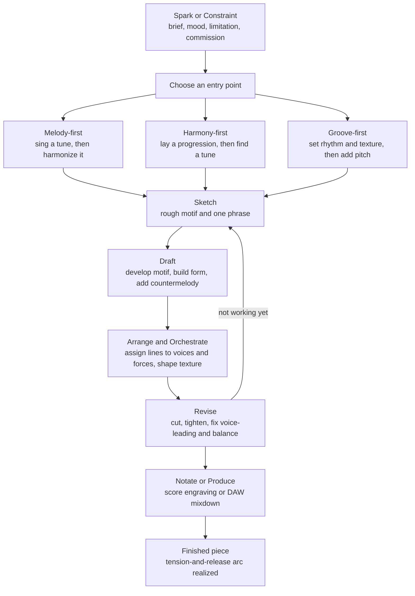

# 🎼 Composition and Arranging

> [!abstract] TL;DR
> **Composition** is the craft of creating an original piece by combining every element the rest of this vault studies in isolation — melody, harmony, rhythm, form, and texture — into a single coherent whole that carries a listener through an arc of **tension and release**. **Arranging** is the related but distinct craft of taking *existing* material and re-scoring it for particular voices and forces. Both are governed less by inviolable rules than by descriptive scaffolding you internalize and then bend on purpose: "learn the rules to break them."

---

## Intuition

**Analogy — cooking a meal, not memorizing a chemistry table.** Every earlier note in this section is like studying one ingredient: this note is about *cooking*. A cook who has memorized every property of salt, acid, fat, and heat still faces the real question — *how do I combine these into a dish someone wants to eat?* You start from an idea (a craving, a leftover, a dinner-party theme = your **constraint**), you taste and adjust (**draft and revise**), you plate it for the occasion (**arrange** the same recipe differently for a picnic versus a banquet), and you build a progression of courses that peaks and resolves (**form and narrative arc**). Recipes and theory are indispensable scaffolding, but the meal only exists because someone *combined* the parts with intent.

Everything technical below is just a precise account of *which elements you combine*, *in what order you tend to reach for them*, and *how the finished thing acquires shape and direction*.

---

## How It Works

### Composition = combining the elements

A finished piece is the simultaneous coordination of five layers, each of which has its own dedicated note in this vault:

| Layer | Question it answers | Where it lives |
|-------|---------------------|----------------|
| **Melody** | What is the memorable "tune"? | motif and phrase writing |
| **Harmony** | What chords support and color it? | [[Functional_Harmony_and_Progressions]] |
| **Rhythm / groove** | How does it move in time? | [[Rhythm_Meter_and_Tempo]] |
| **Form** | How are sections ordered over the whole? | musical form / [[Notation_and_the_Staff]] |
| **Texture** | How many independent voices, and how dense? | orchestration / arranging |

Composition is the act of making these layers *agree*: a melody note on a strong beat should sit comfortably over the chord beneath it; a section boundary in the form should coincide with a harmonic cadence; the texture should thin out to spotlight a solo and thicken for a climax.

### Inspiration versus craft, and constraints as fuel

Beginners wait for "inspiration." Working composers treat inspiration as a small spark and **craft** as the engine that turns one spark into three minutes of music. The most reliable accelerant is a **constraint**: a fixed key, a 12-bar form, "only three chords," a commission for solo cello, a film cue that must hit a cut at 47 seconds. A blank canvas is paralyzing; a bounded box is generative. Stravinsky put it bluntly — "the more constraints one imposes, the more one frees oneself." The whole Python demo below is nothing *but* constraints (favor small steps, resolve on strong beats, end on the tonic), and out of them a plausible melody falls.

### The workflow: sketch, draft, revise

Real composition is iterative, not linear. You **sketch** a rough motif or progression, **draft** it into phrases and sections, then **revise** — cutting, tightening, fixing voice-leading, rebalancing texture — often looping back to re-sketch when something is not working. The finished score is the *last* draft, never the first idea.

### Three entry points: melody-first, harmony-first, groove-first

There is no single correct order to reach for the layers. Composers pick an **entry point** and derive the rest:

- **Melody-first** — sing or improvise a tune, then *harmonize* it: find chords whose tones align with the melody's strong-beat notes. Folk, art song, and much classical writing start here.
- **Harmony-first** — lay down a chord progression (often a stock loop like I–V–vi–IV), then find a melody that floats over it. Much pop and jazz composition starts here.
- **Groove-first** — establish a rhythm and texture (a drum pattern, a bass ostinato, a synth timbre) and *then* add pitch material. Hip-hop, EDM, and funk typically start here.

### Harmonizing a melody and writing a countermelody

**Harmonizing** means choosing chords for a given tune. The rule of thumb: on each strong beat, pick a chord that *contains* the melody note as a chord tone, and prefer a functional progression (see [[Functional_Harmony_and_Progressions]]). A single melody can be harmonized many ways — reharmonization is a whole art.

A **countermelody** is a *second* independent, singable line that complements the main melody rather than merely supporting it with chords. Good countermelody moves when the melody rests (complementary rhythm), stays consonant on strong beats, and uses **contrary motion** so the two lines feel like two characters in dialogue rather than one doubled line.

### Developing material

A piece is not a parade of new ideas — it is one small idea (a **motif**) *transformed* so it stays familiar yet fresh: repeated, sequenced, inverted, augmented, fragmented, reharmonized. This economy of material is what makes a theme feel inevitable on its return. (The dedicated *Motif_Development* note in this section drills these techniques.)

### Arranging and orchestration: same notes, different clothes

**Arranging** takes an *existing* composition and adapts it for a particular set of **forces** — a solo-piano tune re-voiced for string quartet, a jazz standard charted for big band, a rock song stripped to voice and acoustic guitar. **Orchestration** is the specifically instrumental side of arranging: assigning lines to instruments whose ranges, timbres, and dynamics best carry them, and shaping the **texture** (see the texture/orchestration note). The pitches may be untouched; what changes is *who plays what, in which register, with what doubling and density*.

> **Composition versus arranging in one line:** the composer decides *what the notes are*; the arranger decides *how those notes are dressed and delivered*. A cover band's clever reharmonization is arranging; writing a brand-new bridge is composition.

### Tension and release: the narrative arc of a whole piece

Zoomed out, a successful piece is a **story**: it establishes a home, departs from it, accumulates tension (rising register, thickening texture, harmonic instability, rhythmic drive, withheld cadences), reaches a **climax**, and resolves. This large-scale arc is the same departure-and-homecoming shape that [[Functional_Harmony_and_Progressions]] describes at the four-chord level, now stretched across the entire form — a fractal of tension and release. The narrative craft here rhymes directly with prose (see [[Narrative_Structure_and_Storytelling]]).

### Algorithmic and generative composition

Because so much of the craft *is* rule-based, much of it can be **automated**. Rule systems, **Markov models** (see [[Markov_Chains]]), formal **grammars**, and modern neural networks all generate music by encoding the same constraints a human internalizes: which note tends to follow which, which chord resolves where, how a form repeats. This is the bridge from hand-written theory to AI composition and music information retrieval (see [[Music_Classification_MIR]]); the Python demo below is a deliberately tiny, transparent instance of it.

### Theory is descriptive scaffolding, not law

A crucial mindset: theory *describes* what has tended to sound good, it does not *prescribe* what you must do. The "rules" are compressed observations from a corpus, not physics. You **learn the rules to break them** — parallel fifths are "forbidden" in common-practice voice leading yet define the sound of power chords; unresolved dissonance is "wrong" yet is the whole point of much modern music. Master the scaffolding so your deviations are *choices*, not accidents.

### The compositional workflow



---

## Key Concepts

### 🟢 Secondary (foundations)
- **Composition** = making an original piece by combining melody, harmony, rhythm, form, and texture.
- **Arranging** = re-scoring an *existing* piece for different instruments or voices.
- **Constraints help, not hinder:** a fixed key or chord loop makes writing *easier*, not harder.
- **Sketch → draft → revise:** the first idea is never the finished piece; good music is rewritten.
- **Harmonize a melody** by choosing chords that contain the melody's strong-beat notes.

### 🟡 Undergraduate (mechanics)
- **Three entry points** — melody-first, harmony-first, groove-first — and how each derives the other layers.
- **Countermelody** craft: complementary rhythm, contrary motion, consonance on strong beats.
- **Motif development** (repetition, sequence, inversion, augmentation, fragmentation) as the engine of unity.
- **Orchestration** decisions: instrument range and timbre, doubling, register, and texture density.
- **Large-scale form** and the placement of the climax; aligning section boundaries with cadences.
- The composition-versus-arranging distinction, and why reharmonization sits on the arranging side.

### 🔴 Graduate (theory and modeling)
- **Generative systems:** formal grammars (Lerdahl–Jackendoff GTTM, Rohrmeier's harmonic syntax), L-systems, and rule-based expert systems as models of compositional competence.
- **Stochastic composition:** Markov chains and Hidden Markov Models over pitch/chord alphabets (see [[Markov_Chains]]); their strength at local coherence and failure at long-range form.
- **Neural generative models:** RNN/LSTM, Transformer, and diffusion architectures (Magenta, MuseNet, MusicLM) learn multi-scale structure from corpora; the tie-in to MIR feature learning (see [[Music_Classification_MIR]]).
- **Evaluation problem:** unlike classification, generative composition has no ground-truth label — quality is judged by human listening tests, plausibility metrics, and stylistic distance, which is why the field is hard.
- **Constraint satisfaction** as a formal frame: much of "the rules" reduces to CSP/optimization over voice-leading and harmonic-function constraints.

---

## Python Demo

A miniature **rule-based composer**: it generates a melody by a *constrained random walk* over the C-major scale — small steps are favored over leaps, strong beats are forced onto chord tones, and the piece ends on the tonic — then harmonizes it with a fixed **I–vi–IV–V** progression and plots the melody contour against the chord grid. This is the smallest honest example of algorithmic composition, and a direct conceptual bridge to Markov and neural generators.

```python
# Rule-based melody generation (constrained random walk) + simple harmonization.
# Bridges hand-written theory rules to algorithmic / AI composition.
# Requires only numpy and matplotlib.
import numpy as np
import matplotlib.pyplot as plt

rng = np.random.default_rng(42)

# --- Pitch space: a diatonic ladder over C major, ~2 octaves. ---
# Position p is an index on the scale (0 = C4, 1 = D4, ... 7 = C5, ...).
MAJOR_OFFSETS = [0, 2, 4, 5, 7, 9, 11]        # semitones for scale degrees 1..7

def pos_to_midi(p):
    """Map a ladder position to a MIDI note number."""
    octave, degree = divmod(p, 7)
    return 60 + 12 * octave + MAJOR_OFFSETS[degree]

# --- Chord progression: one chord per bar, I - vi - IV - V (a classic loop). ---
# A diatonic triad on scale degree r contains degree-classes {r, r+2, r+4} (mod 7).
PROGRESSION = [("I", 0), ("vi", 5), ("IV", 3), ("V", 4)]
BEATS_PER_BAR = 4

def chord_tone_classes(root_deg):
    return {(root_deg + i) % 7 for i in (0, 2, 4)}

def is_chord_tone(pos, root_deg):
    return (pos % 7) in chord_tone_classes(root_deg)

# --- Step preference: small steps favored over leaps (a "smooth" melodic line). ---
STEP_CHOICES = np.array([-4, -3, -2, -1, 0, 1, 2, 3, 4])
STEP_WEIGHTS = np.array([1, 2, 6, 10, 3, 10, 6, 2, 1], dtype=float)
STEP_WEIGHTS /= STEP_WEIGHTS.sum()

LO, HI = 0, 14                                 # two-octave singable range

def propose_step(pos):
    """Take one weighted random step, clamped to the allowed range."""
    for _ in range(20):
        nxt = pos + rng.choice(STEP_CHOICES, p=STEP_WEIGHTS)
        if LO <= nxt <= HI:
            return nxt
    return int(np.clip(pos, LO, HI))

def nearest_chord_tone(pos, root_deg):
    """Snap a position to the closest chord tone (used on strong beats)."""
    candidates = [p for p in range(LO, HI + 1) if is_chord_tone(p, root_deg)]
    return min(candidates, key=lambda c: abs(c - pos))

# --- Generate the melody, one note per beat, under the rules. ---
melody = []
pos = 4                                        # start on G4 (the 5th) for an upbeat opening
n_notes = len(PROGRESSION) * BEATS_PER_BAR

for k in range(n_notes):
    name, root_deg = PROGRESSION[k // BEATS_PER_BAR]
    strong = (k % BEATS_PER_BAR == 0)          # beat 1 = the metrically accented beat
    pos = propose_step(pos)
    if strong:                                 # RULE: resolve to a chord tone on strong beats
        pos = nearest_chord_tone(pos, root_deg)
    melody.append(pos)

melody[-1] = 0                                 # RULE: end on the tonic (C4) for closure
melody_midi = [pos_to_midi(p) for p in melody]
print("Melody (ladder positions):", melody)
print("Melody (MIDI notes)      :", melody_midi)

# --- Plot: melody contour against the chord grid. ---
fig, ax = plt.subplots(figsize=(11, 5))
x = np.arange(n_notes)
bar_colors = ["#dbeafe", "#ede9fe", "#dcfce7", "#fee2e2"]

for bar, (name, root_deg) in enumerate(PROGRESSION):
    x0 = bar * BEATS_PER_BAR - 0.5
    x1 = x0 + BEATS_PER_BAR
    ax.axvspan(x0, x1, color=bar_colors[bar % len(bar_colors)], alpha=0.7, zorder=0)
    ax.text((x0 + x1) / 2, max(melody_midi) + 2.2, name,
            ha="center", va="center", fontsize=14, fontweight="bold")
    for p in range(LO, HI + 1):                # dotted guide line at each chord tone
        if is_chord_tone(p, root_deg):
            ax.hlines(pos_to_midi(p), x0, x1, colors="gray",
                      linestyles="dotted", lw=0.8, zorder=1)

ax.step(x, melody_midi, where="mid", color="#1e3a8a", lw=1.6, zorder=2)
strong = [k for k in range(n_notes) if k % BEATS_PER_BAR == 0]
weak = [k for k in range(n_notes) if k % BEATS_PER_BAR != 0]
ax.scatter(strong, [melody_midi[k] for k in strong], s=120, color="#dc2626",
           zorder=3, label="strong beat = chord tone")
ax.scatter(weak, [melody_midi[k] for k in weak], s=60, color="#1e3a8a",
           zorder=3, label="weak beat = free step")

ax.set_xlabel("beat")
ax.set_ylabel("MIDI note number")
ax.set_title("Rule-based melody over a I - vi - IV - V chord grid\n"
             "dotted lines = chord tones; red notes land on chord tones on strong beats")
ax.legend(loc="lower left")
plt.tight_layout()
plt.show()
```

Running it prints a melody and draws a contour that hugs the dotted chord-tone guides on every red strong beat while wandering freely on the weak beats, and it always cadences home to C. Change the seed and you get a *different but equally idiomatic* tune — which is exactly the point: encode the constraints, and plausible music becomes a *sample* from a rule-shaped distribution. Swap the fixed weights for a learned transition matrix and you have a Markov composer; swap that for a neural net and you have Magenta.

---

## Real-World Applications

- **Songwriting and production:** writers use harmony-first loops (the I–V–vi–IV "axis") or groove-first beats as scaffolding, then top-line a melody and arrange it across verse/chorus/bridge sections.
- **Film, TV, and game scoring:** composers manage a whole cue's tension-and-release arc to land emotional payoffs on picture cuts, withholding cadences to sustain suspense and thickening orchestration at climaxes.
- **Arranging and cover versions:** the same song is re-orchestrated for orchestra, jazz combo, or solo guitar; reharmonization and re-voicing are the arranger's core tools.
- **Music education:** species counterpoint, figured-bass realization, and chorale harmonization are constraint-satisfaction exercises that train the combining skill directly.
- **Algorithmic and AI composition:** rule systems (Band-in-a-Box), Markov generators, and neural models (Google Magenta, OpenAI MuseNet, Google MusicLM) automate composition and arranging for demos, games, and assistive co-writing tools.
- **DAWs and notation software:** Ableton, Logic, MuseScore, and Sibelius are the modern workshop where sketching, drafting, arranging, and producing all happen; chord-suggestion and scale-lock features bake theory constraints into the tools.

---

## Common Pitfalls

- **Waiting for inspiration instead of setting a constraint.** A blank page is paralyzing; a small box ("three chords, 16 bars, key of D") is what actually unblocks writing. Constraints are fuel, not fences.
- **Confusing composition with arranging.** Reharmonizing or re-orchestrating an existing tune is *arranging*; only new melodic/structural material is *composition*. The distinction matters for credit, royalties, and skill focus.
- **Too many ideas, no development.** Novices pile up fresh motifs; the result feels aimless. Unity comes from *transforming one* idea (repetition, sequence, inversion), not from constant novelty.
- **Ignoring the strong-beat / chord-tone alignment.** A melody that lands on non-chord tones on every downbeat sounds accidental and unstable — the demo's single most important rule.
- **No large-scale arc.** A piece that stays at one dynamic, register, and density for three minutes has no story; deliberately plan where tension rises and where it resolves.
- **Treating theory as law.** "Rules" are descriptions of past practice, not commandments. Following them mechanically yields correct-but-lifeless music; breaking them *without knowing them* yields incoherence. Learn them so your deviations are choices.
- **Over-trusting a first-order generator.** A plain Markov/random-walk model has no memory of the phrase, so it produces locally plausible but formless output — good for a motif, hopeless for a whole movement without added structure.

---

## Related Concepts

- [[Functional_Harmony_and_Progressions]] — the harmonic layer you combine with melody; supplies the chord progressions you harmonize a tune against and the tension-and-release grammar the whole-piece arc scales up.
- [[Scales_and_Modes]] — the pitch vocabulary a melody's constrained random walk moves over; choosing a scale/mode sets the emotional color before a single note is written.
- [[Rhythm_Meter_and_Tempo]] — supplies the metric grid (strong vs weak beats) that decides where chord tones must land and drives groove-first workflows.
- [[Notation_and_the_Staff]] — the notation half of the "notate or produce" step, and the medium in which sketches become a shareable score.
- [[Pitch_and_the_Harmonic_Series]] — why certain combined tones sound consonant, the acoustic substrate under harmonization and orchestration choices.
- [[Markov_Chains]] — the memoryless stochastic model underpinning the algorithmic-composition bridge; upgrade the demo's fixed weights to a learned transition matrix and you have a Markov composer.
- [[Music_Classification_MIR]] — music information retrieval; the analysis counterpart to generation, and the feature-learning foundation of modern AI composition.
- [[Narrative_Structure_and_Storytelling]] — prose narrative's departure/climax/resolution arc is the direct literary analog of a piece's tension-and-release form.

*Forthcoming sibling notes in `Music_Theory/03_Melody_Form_and_Composition/` (not yet created, to be linked once they exist):* **Motif_Development** (developing material), **Musical_Form** (large-scale structure), **Texture_and_Orchestration** (arranging for forces), and **Song_Structure** (verse/chorus songwriting craft).

---

## Review Questions

**🟢 Secondary.** In your own words, state the difference between *composition* and *arranging*, and give one everyday example of each. Then explain why starting with a fixed constraint (like "only three chords") can make writing a song *easier* rather than harder.

**🟡 Undergraduate.** You are handed a finished four-bar melody in C major over the chords I–vi–IV–V. Describe, step by step, (a) how you would check that the melody is well harmonized on the strong beats, and (b) how you would write a *countermelody* that complements it. Name two specific techniques (e.g. contrary motion, complementary rhythm) and say why each helps.

**🔴 Graduate.** The Python demo generates melodies with a constrained random walk. Explain precisely *why* this approach produces locally plausible but formless music over a long span, connect that limitation to the Markov assumption, and propose two concrete modeling changes (one classical, one neural) that would give the generator large-scale form. How would you *evaluate* whether the improved model is actually better, given there is no ground-truth label?

---

## Sources

- Arnold Schoenberg, *Fundamentals of Musical Composition* (Faber, 1967) — the classic treatise on building pieces from motifs and phrases.
- Samuel Adler, *The Study of Orchestration* (4th ed., W. W. Norton, 2016) — standard reference on arranging and orchestration for real ensembles.
- Walter Piston, *Counterpoint* and *Orchestration* (W. W. Norton) — foundational texts on countermelody and instrumental writing.
- David Cope, *Computer Models of Musical Creativity* (MIT Press, 2005) — rule systems, grammars, and algorithmic composition. [MIT Press](https://mitpress.mit.edu/9780262033381/computer-models-of-musical-creativity/)
- Google Magenta project — open-source machine-learning models for music and art generation. [magenta.tensorflow.org](https://magenta.tensorflow.org/)
- *Open Music Theory* (open online textbook) — chapters on form, texture, and composition. [openmusictheory.github.io](https://openmusictheory.github.io/)

---

#music-theory #composition #arranging #songwriting #algorithmic-composition
