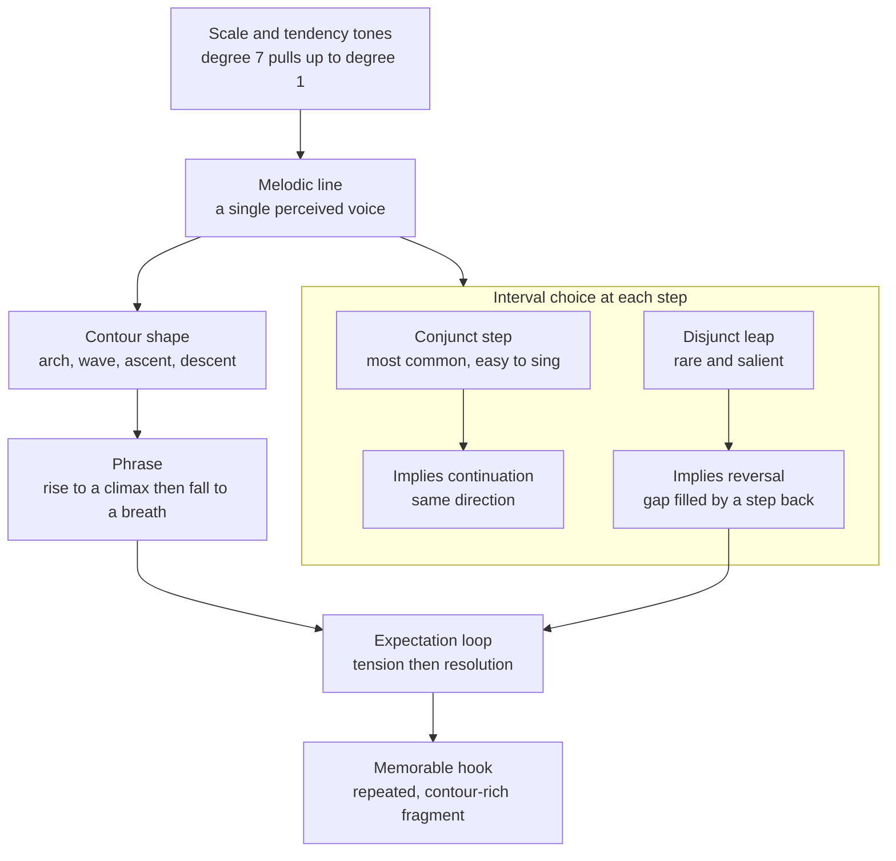

# 🎶 Melody and Melodic Construction

> [!abstract] TL;DR
> A **melody** is a coherent *horizontal* succession of pitches that the ear fuses into a single "voice" — the tune you can hum. It is built from a strong statistical bias toward small **stepwise (conjunct)** motion, occasional salient **leaps (disjunct)** that tend to be "filled in" by a step in the opposite direction, a recognizable **contour** that rises to a **climax** and settles at a phrase-ending breath, and **tendency tones** whose instability drives a continuous cycle of expectation and resolution.

---

## Intuition

**Analogy:** Think about the last song stuck in your head. You could *hum* it in the shower — but you were not humming the drum beat, and you were not humming the guitar chords underneath. You were humming exactly one thing: the **melody**, the single line of notes that "is" the song. That is the defining fact about melody — of everything happening in a piece of music at once, the melody is the one strand your brain grabs and remembers as *the tune*.

Now trace that hum with your hand in the air: it goes **up** here, **down** there, arcs over a high point, and comes to rest. That airborne shape — ignore the exact notes, just the up-and-down gesture — is the **melodic contour**, and it is often more memorable than the precise pitches themselves. A melody is that contour made of specific, singable steps and leaps, pulled along by the gravity of a home note.

---

## How It Works

### Core Mechanics

1. **Melody as a perceptual object.** Harmony is *vertical* (notes stacked at the same instant); melody is *horizontal* (notes in succession through time). Auditory grouping principles (proximity in pitch and time, good continuation) cause the ear to bind a line of tones into one **auditory stream** heard as a single entity. This is why a melody is "a thing" and not just a list of frequencies.

2. **Contour and its perceptual salience.** The **contour** is the sequence of up/down/same directions, stripped of exact interval sizes. Contours fall into archetypal shapes: **ascending**, **descending**, **arch** (up then down — the most common phrase shape), and **wave** (undulating). Dowling's classic experiments showed that for *unfamiliar* melodies, listeners remember the **contour** far better than the exact intervals — contour is a coarse, robust sketch the memory keeps even when the details blur.

3. **Conjunct vs disjunct motion, and why steps dominate.** Motion by a **step** (a 2nd — adjacent scale degrees) is **conjunct**; motion by a **leap** (a 3rd or larger) is **disjunct**. Across essentially every corpus ever counted (folk song, chorales, pop), **the majority of melodic intervals are steps** — typically 60-80%. Steps are easier to sing (small vocal adjustments), easier to hear as connected (small pitch proximity keeps the stream intact), and cheaper to predict. Leaps are rarer *because* they are salient: a big jump is an event.

4. **The gap-fill / post-skip reversal principle.** Empirically, a large leap tends to be **followed by a step in the opposite direction** — the leap opens a "gap" in pitch space that a subsequent step "fills." Two famous framings:
   - **Meyer** and **Narmour's Implication-Realization (I-R) model:** a small interval *implies continuation* in the same direction, whereas a large interval *implies reversal* of direction and a smaller following interval. Listeners form these implicit expectations and feel satisfaction when they are realized.
   - **The von Hippel & Huron caution:** much of the observed post-skip reversal is a **statistical artifact of a bounded register** — "regression to the mean." Because melodies live inside a limited range (**tessitura**), a leap tends to land near an edge, and the next note is simply more likely to move back toward the center *regardless of any active gap-filling rule*. Good analysis credits both the perceptual pull *and* the range constraint.

5. **Range and tessitura.** **Range** is the total span from lowest to highest note; **tessitura** is where the melody mostly sits (its comfortable "center of gravity"). Singable melodies keep a moderate range (often within a 10th) and a tessitura that suits the voice or instrument. Range and tessitura together bound the pitch space that shapes contour and post-skip reversal.

6. **Climax / high point.** A well-formed phrase usually has **one** structural **climax** — a highest (or most intense) note placed near, but not exactly at, the golden middle-to-late point of the line. The approach to and departure from the climax gives the phrase directed shape; scattering multiple co-equal high points flattens the sense of goal.

7. **Phrase shape and breathing.** A **phrase** is a complete musical thought, typically 2-4 bars, ending in a point of relative rest (a cadence) — the musical equivalent of a comma or period. Phrases are literally scaled to **breath** for singers and wind players; the arch contour (rise-peak-fall-to-rest) mirrors an exhale. Phrases combine into **antecedent-consequent** pairs (a "question" ending unresolved, an "answer" ending resolved).

8. **Scale degrees and tendency tones.** Within a key, some scale degrees are **stable** (1, 3, 5 — the tonic triad) and others are **unstable/active** and want to move to a neighbor:
   - **7 (leading tone) → 1 (tonic):** the strongest pull in tonal music, a half-step resolution up to home.
   - **4 → 3** and **6 → 5:** downward pulls by step.
   - **2 → 1** (or **2 → 3**): the supertonic settling.
   These **tendency tones** are the "gravity field" a melody moves through; ending on an unstable degree leaves the ear hanging.

9. **Repetition, sequence, and variation.** Coherence comes from **repetition** (exact restatement — the backbone of a hook), **sequence** (repeating a pattern at a different pitch level, e.g. up a step each time), and **variation** (restating with rhythmic or intervallic change). These give the paradoxical requirement of good melody: *enough repetition to be memorable, enough variation to stay interesting.*

10. **Melodic tension and expectation.** Under **Meyer**, musical emotion arises from the *arousal and inhibition of expectation*: the composer sets up an implication, then delays, deviates from, or confirms it. **Huron's ITPRA** theory decomposes each moment into **I**magination (pre-outcome anticipation), **T**ension (pre-outcome arousal), **P**rediction (was the outcome expected?), **R**eaction (fast, reflexive), and **A**ppraisal (slow, evaluative) responses. Melodies are pleasurable partly because they play this prediction game — a leading tone *strains*, then the tonic *relieves*.

11. **Melody vs harmony: chord tones and non-chord tones.** A melody unfolds *against* an implied or stated harmony. Notes that belong to the current chord are **chord tones**; notes that do not are **non-chord tones (NCTs)**, which create passing tension and then resolve:
    - **Passing tone (PT):** steps between two chord tones, filling a 3rd.
    - **Neighbor tone (NT):** steps away from a chord tone and back.
    - **Suspension (SUS):** a chord tone held over into the next chord where it is now dissonant, then resolving down by step.
    - Related NCTs: **appoggiatura** (leap in, step out), **escape tone** (step in, leap out), **anticipation** (arrives early). Most stepwise motion in real melodies *is* NCTs decorating an underlying chord-tone skeleton.

12. **The hook.** A **hook** is a short, high-repetition, high-contour-contrast melodic fragment engineered to lodge in memory — often the point where the tune leaps to its climax on the title lyric. Hooks concentrate every mechanism above: a distinctive contour, a well-placed climax, a resolved tendency tone, and immediate repetition.

### Flow / Architecture



---

## Key Concepts

**Secondary (high-school level).** A melody is the *tune* — the part you can sing or hum, one note after another. Most of the time a melody moves in small **steps** to the note right next door; now and then it makes a bigger **leap**, and after a leap it usually turns around and steps back the other way. Draw the tune's up-and-down shape in the air and you have its **contour**. Good tunes have a **high point** (climax), come to a resting spot to breathe (the end of a **phrase**), and repeat a catchy bit (the **hook**) so you remember it.

**Undergraduate (music-theory core).** Distinguish **conjunct** vs **disjunct** motion and know that steps statistically dominate. Analyze **contour** independently of exact intervals. Identify **tendency tones** and resolve them correctly (leading tone → tonic, degree 4 → 3, degree 6 → 5). Parse a melody against its harmony into **chord tones** and **non-chord tones** — passing tones, neighbor tones, suspensions, appoggiaturas — and understand that the stepwise surface usually elaborates a simpler chord-tone framework. Recognize **repetition, sequence, and variation** as the coherence engine, and locate the single structural **climax** within a **phrase** (including antecedent-consequent construction).

**Graduate (advanced / cognitive).** Engage the empirical melody literature: **Narmour's Implication-Realization** model and its bottom-up parameters (registral direction, intervallic difference, closure); **von Hippel & Huron's** demonstration that post-skip reversal is substantially explained by **tessitura and regression to the mean** rather than an active gap-fill instinct; **Meyer's** expectation theory and **Huron's ITPRA** framework for the affective mechanics of prediction. Model melody statistically with **n-gram / Markov** models, information-theoretic **entropy and surprisal** (IDyOM-style predictive modeling), or modern sequence models, and connect these to a **Schenkerian** reduction view in which foreground stepwise motion prolongs a background structural line. Consider cross-cultural universals (small-interval prevalence, arch phrases, descending phrase endings) versus style-specific idioms.

---

## Python Demo

```python
# Analyze and generate melody as CONTOUR + interval statistics.
#   Part 1: represent a real melody as scale degrees and plot its pitch contour.
#   Part 2: generate a longer melody whose ONLY built-in rules are
#           (a) small intervals are more likely than large ones (conjunct bias)
#           (b) a gentle restoring pull toward the register centre (tessitura),
#       then MEASURE that (i) steps dominate, and (ii) leaps are followed by a
#       reversal more often than steps are -- post-skip reversal / gap-fill
#       emerging from range constraints (von Hippel & Huron, 2000).
import numpy as np
import matplotlib.pyplot as plt

gen = np.random.default_rng(7)

# ---------------------------------------------------------------------
# PART 1 - a real melody as scale degrees -> a true pitch contour
# ---------------------------------------------------------------------
# Beethoven, "Ode to Joy" (opening) is famously almost entirely stepwise.
# Diatonic scale degrees in a major key (1 = tonic ... 8 = octave):
ode_degrees = [3, 3, 4, 5, 5, 4, 3, 2, 1, 1, 2, 3, 3, 2, 2]

MAJOR = {1: 0, 2: 2, 3: 4, 4: 5, 5: 7, 6: 9, 7: 11, 8: 12}  # degree -> semitones
ode = np.array([MAJOR[d] for d in ode_degrees])

ode_iv = np.diff(ode)                          # melodic intervals (semitones)
frac_step = np.mean(np.abs(ode_iv) <= 2)       # <= 2 semitones counts as a "step"
print(f"Ode to Joy: {frac_step*100:.0f}% of moves are stepwise (<= 2 semitones)")

# ---------------------------------------------------------------------
# PART 2 - generate a long melody to study interval STATISTICS
# ---------------------------------------------------------------------
def generate_melody(n, lo=-7, hi=7, restoring=0.6):
    """Pitches in diatonic-step units. Small intervals favoured; a restoring
       pull toward the centre makes over-shooting leaps tend to reverse."""
    pitches = [0]
    span = max(abs(lo), abs(hi))
    for _ in range(n - 1):
        cur = pitches[-1]
        mag = gen.geometric(0.6)                    # 1 most likely, 2 next, big rare
        p_up = np.clip(0.5 - restoring * cur / (2 * span), 0.05, 0.95)
        step = mag if gen.random() < p_up else -mag  # high notes tend to fall
        nxt = cur + step
        if nxt > hi:  nxt = 2 * hi - nxt            # reflect at register edges
        if nxt < lo:  nxt = 2 * lo - nxt
        pitches.append(nxt)
    return np.array(pitches)

mel = generate_melody(6000)
iv = np.diff(mel)                                    # intervals in scale steps
mag = np.abs(iv)
print(f"Generated melody: {np.mean(mag == 1)*100:.0f}% of intervals are single steps, "
      f"{np.mean(mag >= 3)*100:.0f}% are large leaps (>= 3 steps)")

# Post-skip reversal: does a leap change direction more often than a step?
prev, nxt = iv[:-1], iv[1:]
valid   = (prev != 0) & (nxt != 0)
reverse = (np.sign(prev) != np.sign(nxt)) & valid
is_leap = (np.abs(prev) >= 2) & valid               # a 3rd or larger
is_step = (np.abs(prev) == 1) & valid               # a 2nd
p_rev_leap = reverse[is_leap].mean()
p_rev_step = reverse[is_step].mean()
print(f"P(reversal | previous was a LEAP) = {p_rev_leap:.2f}")
print(f"P(reversal | previous was a STEP) = {p_rev_step:.2f}")
print(f"Mean next-interval size after a LEAP = {np.abs(nxt[is_leap]).mean():.2f} steps "
      f"(gap-fill: leaps are answered by smaller moves)")

# ---------------------------------------------------------------------
# Visualize: contour, interval histogram, post-skip reversal
# ---------------------------------------------------------------------
fig, ax = plt.subplots(1, 3, figsize=(14, 4))

ax[0].step(range(len(ode)), ode, where="mid", color="crimson", lw=2)
ax[0].plot(range(len(ode)), ode, "o", color="crimson", ms=5)
peak = int(ode.argmax())
ax[0].annotate("climax", (peak, ode[peak]), textcoords="offset points",
               xytext=(0, 10), ha="center", fontsize=9)
ax[0].set_title('"Ode to Joy" pitch contour')
ax[0].set_xlabel("note index (time)")
ax[0].set_ylabel("semitones above tonic")

bins = np.arange(iv.min() - 0.5, iv.max() + 1.5, 1)
ax[1].hist(iv, bins=bins, color="steelblue", edgecolor="white")
ax[1].axvline(0, color="gray", ls="--")
ax[1].set_title("Melodic interval distribution\nsteps dominate, leaps are rare")
ax[1].set_xlabel("interval in scale steps  (+ = up)")
ax[1].set_ylabel("count")

ax[2].bar(["after a STEP", "after a LEAP"], [p_rev_step, p_rev_leap],
          color=["#9ecae1", "#08519c"])
ax[2].set_ylim(0, 1)
ax[2].set_ylabel("P next move reverses direction")
ax[2].set_title("Post-skip reversal (gap-fill)")

plt.tight_layout()
plt.show()
```

Running it prints that "Ode to Joy" is essentially 100% stepwise (a textbook conjunct melody), and that the *generated* line — which was never told to fill gaps — nonetheless produces a spiky interval histogram peaked at ±1 step and a clearly higher reversal probability after leaps than after steps, with leaps answered by smaller moves. That is post-skip reversal appearing *for free* out of a bounded register, the honest version of the gap-fill story.

---

## Real-World Applications

> **Example — Query-by-humming and melody extraction (MIR):** Services like the old *Midomi/SoundHound* "hum to search" work because **contour** is a robust fingerprint. The system extracts the dominant pitch line, quantizes it to a **contour string** (up/down/same or coarse interval classes), and matches it against a database — leaning on exactly the Dowling insight that a slightly out-of-tune hummer still preserves the melody's *shape*. See also [[Music_Classification_MIR]].

- **Pop songwriting / topline writing:** producers craft **hooks** by putting the biggest **leap** and the **climax** note on the title lyric of the chorus, then repeating it — deliberately engineering the memorability mechanisms above.
- **Film and game scoring:** memorable themes (Williams' "Star Wars" main title, the "Jaws" two-note motif) exploit a decisive opening leap-then-fill and a strong tendency-tone resolution to feel both surprising and inevitable.
- **Algorithmic and AI composition:** Markov models, **MelodyRNN**, and Transformer models (e.g. *Music Transformer*) learn the step-dominant interval distribution and post-skip statistics straight from corpora — a well-trained model reproduces conjunct bias and gap-fill without being explicitly programmed to, exactly as the demo does.
- **Auto-accompaniment and harmonization tools** reverse the melody-harmony relationship, inferring a chord progression by treating the strong-beat, long-duration notes as **chord tones** and passing/neighbor notes as **NCTs**.
- **Music cognition research (IDyOM and related):** information-theoretic models predict listeners' note-by-note **surprisal**, which correlates with measured expectation and even physiological arousal — operationalizing Meyer and Huron's expectation theories.

---

## Common Pitfalls

- **Equating "melody" with "the top voice."** The melody is a *perceptual stream*, not a staff position; it can migrate between registers or instruments, and the highest sounding note is sometimes an accompaniment figure. Follow the ear, not the top line.
- **Leaping without resolving.** Stacking multiple large leaps in the same direction, or leaping to an unstable degree and abandoning it, produces an unsingable, incoherent line. Answer leaps with stepwise motion and resolve tendency tones.
- **Treating post-skip reversal as a mystical law.** As **von Hippel & Huron** showed, much of it is **regression to the mean** inside a bounded register. Do not over-claim an innate "gap-fill drive"; credit the tessitura constraint too.
- **Leaving tendency tones hanging.** Ending a phrase on the leading tone or on scale degree 4 sounds unfinished. Know where each unstable degree wants to go and honor (or *deliberately* deny) it.
- **No climax, or too many.** A melody with a flat register and no single high point feels aimless; one with several co-equal peaks dissipates its energy. Aim for one well-placed structural climax per phrase.
- **All variation and no repetition (or vice versa).** Endless novelty is un-memorable; endless repetition is boring. The craft is the balance of **repetition, sequence, and variation**.
- **Confusing contour memory with interval memory.** Listeners encode contour robustly but exact intervals loosely for new tunes — a "recognizable" cover that keeps the contour but alters intervals can still read as the same melody, and vice versa.

---

## Related Concepts

- [[Scales_and_Modes]] — supplies the pitch vocabulary and the **scale degrees / tendency tones** whose stability gradient a melody moves through.
- [[Intervals_and_Consonance]] — the step-vs-leap distinction and the consonant/dissonant status of chord tones vs non-chord tones are interval facts.
- [[Pitch_and_the_Harmonic_Series]] — pitch height and the acoustic basis of the "voice" a melodic stream traces.
- [[Rhythm_Meter_and_Tempo]] — a melody is pitch *and* rhythm; metric accent determines which notes read as structural chord tones vs passing decoration.
- [[Music_Theory_Overview]] — situates melody within the wider harmony/rhythm/form landscape.
- [[Auditory_System_and_Sound_Processing]] — the auditory-streaming and pitch mechanisms that let the brain fuse a note sequence into one perceived melody.
- [[Auditory_and_Speech_Perception]] — expectation, grouping, and the parallels between melodic contour and speech prosody.
- [[Music_Classification_MIR]] — melody extraction, contour matching, and query-by-humming in music information retrieval.

*Forthcoming sibling notes in this vault (to be linked once created):* `Motif_Development` (how a short melodic cell is spun into a whole line), `Music_Cognition` (S06, expectation/ITPRA in depth), and `Functional_Harmony_and_Progressions` (the harmonic frame melodies decorate).

---

## Review Questions

1. **(Secondary / recall)** In your own words, what is the difference between a **step** and a **leap** in a melody, and which one happens more often? Draw the **contour** of any tune you know and mark its high point (climax).

2. **(Undergraduate / application)** Given the melody fragment C-D-E-G-F-E over a C-major chord: (a) label each note as a **chord tone** or a **non-chord tone**, naming the type of NCT; (b) identify one **leap** and state what the "gap-fill" principle predicts should happen after it; (c) does the fragment obey that prediction?

3. **(Graduate / analysis)** **von Hippel & Huron** argue that post-skip reversal is largely a **regression-to-the-mean** artifact of a bounded register rather than an active gap-fill instinct. Design an analysis (or describe the demo above) that would let you separate the "tessitura constraint" contribution from a genuine perceptual gap-fill effect. What corpus evidence or generative-model result would distinguish the two?

---

## Sources

- Huron, D. (2006). *Sweet Anticipation: Music and the Psychology of Expectation.* MIT Press: [MIT Press page](https://mitpress.mit.edu/9780262582780/sweet-anticipation/)
- Meyer, L. B. (1956). *Emotion and Meaning in Music.* University of Chicago Press.
- Narmour, E. (1990). *The Analysis and Cognition of Basic Melodic Structures: The Implication-Realization Model.* University of Chicago Press.
- von Hippel, P., & Huron, D. (2000). "Why do skips precede reversals? The effect of tessitura on melodic structure." *Music Perception, 18*(1), 59-85: [JSTOR](https://www.jstor.org/stable/40285901)
- Dowling, W. J. (1978). "Scale and contour: Two components of a theory of memory for melodies." *Psychological Review, 85*(4), 341-354: [APA PsycNet](https://psycnet.apa.org/record/1979-22265-001)

---

#music-theory #melody #contour #phrasing #tension
