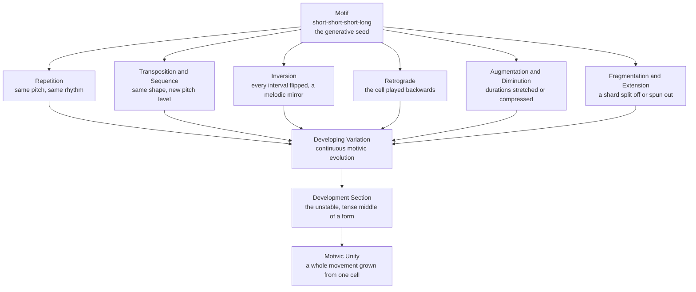

# 🌱 Motif Development and Variation

> [!abstract] TL;DR
> A **motif** is the smallest self-contained musical idea — a short pitch-and-rhythm cell such as Beethoven's Fifth "short-short-short-long." **Development** is the craft of growing an entire piece from that seed by applying a small toolkit of transformations (repetition, transposition, sequence, inversion, retrograde, augmentation, diminution, fragmentation, extension, displacement). Because every transformed version keeps a *family resemblance* to the original, the music stays unified while constantly changing — this is what makes a piece sound coherent rather than like a random string of tunes.

---

## Intuition

**Analogy — a seed and the plant it becomes.** Plant an acorn and you do not get a random forest; you get one oak, whose every branch, twig, and leaf is a variation on a single genetic blueprint. A **motif** is that acorn. The composer does not invent a fresh melody every eight bars — that would sound like channel-surfing. Instead they take one tiny cell and *grow* it: raise it higher (transposition), flip it upside down (inversion), stretch it in time (augmentation), snap off a twig and repeat just that (fragmentation). Every branch looks different, yet you can still see the oak in all of them.

That is the paradox development solves. Music needs **variety** to stay interesting and **unity** to stay coherent. Working one motif through systematic transformations gives you both at once: the surface is always new, but the DNA is always the same. Beethoven builds an entire symphonic movement out of four notes; you never get bored, and you never get lost, because everything you hear is that four-note cell in disguise.

---

## How It Works

### Core Mechanics

1. **The motif is a cell, not a melody.** A theme or phrase can be several bars long; a motif is the *irreducible* unit inside it — often just 2 to 5 notes with a distinctive rhythm. What makes it a motif is that it is *memorable and recognizable* even when its pitches are altered. Beethoven's Fifth cell is defined more by its rhythm (three shorts and a long) than by any specific pitch, which is why it survives every transformation.

2. **Thematic economy.** The generative idea is to derive maximal music from minimal material. Beethoven and, later, Brahms are the archetypes: Brahms's technique of continuously reshaping a motif so that each phrase evolves organically out of the previous one is what Schoenberg named **developing variation** — variation is not a decorative afterthought but the very engine of forward motion.

3. **The transformation toolkit.** Development is a finite set of operations applied to the motif's two dimensions, *pitch* and *rhythm*:
   - **Repetition** — restate the cell unchanged; the ear needs to *learn* the motif before it can recognize disguises.
   - **Transposition** — move the whole cell to a new pitch level, keeping every interval identical.
   - **Sequence** — immediate, repeated transposition by a fixed interval (up or down a step each time), building momentum like climbing stairs.
   - **Inversion** — flip every interval's direction: what went up now goes down by the same amount. A melodic mirror.
   - **Retrograde** — play the cell backwards (last note first).
   - **Retrograde-inversion** — do both: reverse *and* flip.
   - **Augmentation** — multiply every duration (usually by 2); the motif expands, often grandly, in the bass.
   - **Diminution** — divide every duration; the motif compresses into an agitated, faster version.
   - **Fragmentation** — keep only part of the cell (say, just its rhythm, or just its last two notes) and work that shard.
   - **Extension** — spin the cell out by adding notes, prolonging the phrase.
   - **Rhythmic displacement** — shift the motif so its accent lands on a different beat, disguising it metrically.

4. **Pitch vs interval representation.** Transposition and inversion are cleanest to reason about in **intervals** (the steps *between* notes) rather than absolute pitches. Transposition adds a constant to every pitch and thus preserves all intervals; inversion negates every interval (reflecting the contour around an axis). This is why transformed versions retain a family resemblance — they share an interval "shape."

5. **Motivic unity and coherence.** When a listener senses that a movement "hangs together," it is usually because a small number of motifs saturate the texture. Rudolph Reti called this the *thematic process*: even contrasting themes often turn out to be hidden variants of one germ cell.

6. **Development as the middle of a form.** In sonata form, the central **development section** is precisely where these transformations run wild — the composer fragments, sequences, and re-harmonizes the exposition's motifs through unstable keys before the recapitulation restores order. Development is therefore not only a technique but a structural *place*: the tense middle of the tension-and-release arc.

7. **Named large-scale variants of the idea.** Several famous compositional practices are all "one motif, many guises":
   - **Leitmotif** (Wagner) — a motif tagged to a character, object, or idea, then transformed to mirror the drama: the hero's theme in the minor when he is defeated, augmented and radiant at his triumph.
   - **Idée fixe** (Berlioz) / **thematic transformation** (Liszt) — a single recurring theme reshaped in mood and character across an entire multi-movement work.
   - **Twelve-tone row** (Schoenberg, serialism) — the most systematic version: a fixed ordering of all 12 pitches (the Prime, **P**) is subjected to exactly the operations above — **I** (inversion), **R** (retrograde), and **RI** (retrograde-inversion) — plus transposition, yielding 48 related forms that generate the whole work.

### Flow / Architecture



---

## Key Concepts

**Secondary (high-school level).** A **motif** is the tiniest musical idea — a few notes with a catchy rhythm, like the four-note opening of Beethoven's Fifth Symphony. Composers do not keep inventing brand-new tunes; they take one motif and change it in simple ways: play it higher or lower, upside down, backwards, slower, or faster. Because it is always the *same* idea in a new outfit, the whole piece feels connected. That is why a symphony can last twenty minutes and still sound like one thing.

**Undergraduate (music-theory core).** Distinguish **motif** (irreducible cell) from **phrase** and **theme** (larger constructions built from motifs). Fluently apply and identify the standard transformations — transposition, real vs tonal **sequence**, **inversion**, **retrograde**, **augmentation/diminution**, **fragmentation**, **extension**, and **rhythmic displacement** — in score analysis. Understand Schoenberg's **developing variation** as the mechanism of organic phrase growth, and recognize the **development section** of sonata form as the site where motivic manipulation is most concentrated. Analyze a **leitmotif** or Liszt-style **thematic transformation** as motivic identity persisting across changes of mode, meter, and orchestration.

**Graduate (advanced / theoretical).** Formalize transformations as operations on **pitch-class sets** and ordered rows: transposition **T_n**, inversion **T_nI**, retrograde **R**, and their composition, forming the group structure underlying **twelve-tone serialism** (the 48-member row table generated by P/I/R/RI × 12 transpositions). Study Reti's **thematic process** and Schenkerian reductions that expose deep motivic parallelisms across structural levels (**motivic enlargement**, where a surface motif is composed-out over an entire span). Engage the analytical debate over intentionality — whether detected motivic relationships are compositionally real or listener-constructed — and connect to computational **pattern discovery** in music information retrieval, where the same transformation invariances become similarity metrics.

---

## Python Demo

```python
# Motif development made visible.
# We take one short motif (Beethoven's Fifth cell) encoded as (pitch, duration)
# pairs, then programmatically apply the classic developmental transformations.
# Pitch is measured in DIATONIC SCALE-DEGREE STEPS above the tonic, so a
# transformation's effect on the CONTOUR (the up/down shape) is easy to see.
# Only numpy + matplotlib are used.
import numpy as np
import matplotlib.pyplot as plt

# --- The seed motif -------------------------------------------------------
# Beethoven's Fifth "short-short-short-long": G G G Eb in C minor.
# In C minor (C D Eb F G Ab B), G is the 5th degree, Eb is the 3rd degree.
# As diatonic steps above the tonic C:  G=4, Eb=2  (0-indexed degrees).
motif_pitch = np.array([4, 4, 4, 2])      # three repeated notes, then a fall
motif_dur   = np.array([1, 1, 1, 2], float)  # short short short LONG

# --- The transformation toolkit ------------------------------------------
def transpose(p, steps):
    """Shift every note by a constant: all intervals are preserved."""
    return p + steps

def invert(p, axis=None):
    """Reflect the contour: every interval flips sign (a melodic mirror).
       Reflect around the first note by default, so note[0] stays fixed."""
    if axis is None:
        axis = p[0]
    return 2 * axis - p

def retrograde(p, d):
    """Reverse the motif in time: last note becomes first."""
    return p[::-1], d[::-1]

def scale_duration(d, factor):
    """factor > 1 = augmentation (stretch); factor < 1 = diminution (compress)."""
    return d * factor

def sequence(p, d, shift, n):
    """Repeat the motif n times, each copy transposed by `shift` steps.
       Beethoven's own continuation sequences the cell downward by step."""
    ps = np.concatenate([p + k * shift for k in range(n)])
    ds = np.concatenate([d for _ in range(n)])
    return ps, ds

# --- Build the whole family ----------------------------------------------
retro_p, retro_d = retrograde(motif_pitch, motif_dur)
inv_p            = invert(motif_pitch)
ri_p, ri_d       = retrograde(inv_p, motif_dur)      # retrograde-inversion
seq_p, seq_d     = sequence(motif_pitch, motif_dur, shift=-1, n=3)

family = [
    ("Original (P)",            motif_pitch,            motif_dur),
    ("Transposition (+2)",      transpose(motif_pitch, 2), motif_dur),
    ("Inversion (I)",           inv_p,                  motif_dur),
    ("Retrograde (R)",          retro_p,                retro_d),
    ("Retrograde-Inversion",    ri_p,                   ri_d),
    ("Augmentation (x2)",       motif_pitch, scale_duration(motif_dur, 2.0)),
    ("Diminution (x0.5)",       motif_pitch, scale_duration(motif_dur, 0.5)),
    ("Sequence (down by step)", seq_p,                  seq_d),
]

# Print the numeric result of each transformation.
for name, p, d in family:
    print(f"{name:26s} pitch={list(p)}  dur={list(np.round(d,2))}")

# --- Plot each version's pitch contour as a held-note step line ----------
def plot_motif(ax, pitch, dur, title, color, ymin, ymax):
    starts = np.concatenate([[0], np.cumsum(dur)[:-1]])
    ends   = np.cumsum(dur)
    for p, s, e in zip(pitch, starts, ends):
        ax.plot([s, e], [p, p], "-", color=color, lw=4)   # held pitch = flat bar
        ax.plot(s, p, "o", color=color, ms=7)             # note onset
    ax.set_title(title, fontsize=9)
    ax.set_ylim(ymin - 1, ymax + 1)
    ax.set_xlabel("time (beats)")
    ax.set_ylabel("scale degree")
    ax.grid(alpha=0.25)

# Shared vertical range so the family resemblance is obvious across panels.
all_p = np.concatenate([p for _, p, _ in family])
ymin, ymax = all_p.min(), all_p.max()

fig, axes = plt.subplots(2, 4, figsize=(15, 6.5))
colors = plt.cm.viridis(np.linspace(0, 0.85, len(family)))
for ax, (name, p, d), c in zip(axes.ravel(), family, colors):
    plot_motif(ax, p, d, name, c, ymin, ymax)

fig.suptitle("One Motif, Eight Transformations - the family resemblance is visible",
             fontsize=13)
plt.tight_layout(rect=[0, 0, 1, 0.96])
plt.show()
```

Reading the eight panels side by side makes the geometry of development literal: **transposition** slides the identical shape vertically; **inversion** flips the falling gesture into a rising one; **retrograde** mirrors it left-to-right in time; **augmentation** and **diminution** stretch and squeeze the same contour horizontally without touching the pitches; and the **sequence** shows the cell stair-stepping downward, exactly as Beethoven's continuation does. Every panel is unmistakably a relative of the first — variety on the surface, one identity underneath.

---

## Real-World Applications

> **Example — Beethoven, Symphony No. 5 (first movement):** The entire *Allegro* is spun from the four-note "short-short-short-long" cell. Beethoven **sequences** it downward, **transposes** it through the orchestra, **fragments** it down to a single repeated note in the transition, and blasts it in **augmentation** in the horns. The development section is almost nothing *but* this motif fractured and recombined — the textbook demonstration of thematic economy.

- **Wagnerian opera (leitmotif):** In the *Ring* cycle, motifs for the Ring, the sword, Valhalla, and each character are **transformed** to track the drama — Siegfried's heroic theme appears radiant and augmented at his triumph, twisted into the minor at his death. Film scoring inherits this directly: John Williams' Force theme, Imperial March, and Rey's theme are leitmotifs developed across scenes.
- **Sonata development sections:** The central "middle" of Classical and Romantic sonata-form movements is defined *as* the zone of maximal motivic manipulation before the recapitulation restores stability — a structural payoff of the technique.
- **Serialism and twelve-tone music:** Schoenberg, Berg, and Webern generate whole works from one row via P/I/R/RI transformations — development formalized into a strict combinatorial system.
- **Jazz and pop hooks:** A rhythmic "hook" is a motif; improvisers **sequence** and **fragment** a lick through a chord progression, and producers build entire tracks by **rhythmic displacement** and re-pitching of a two-bar cell.
- **Music information retrieval:** Automatic **pattern discovery** and theme-finding algorithms search a score or audio stream for repeated cells that are invariant under transposition, inversion, and augmentation — the same transformation set, now used as a *similarity* measure.

---

## Common Pitfalls

- **Confusing a motif with a theme or phrase.** A motif is the *irreducible* cell; a theme is a larger structure built from motifs. Labeling a whole eight-bar melody "the motif" misses the point — development works on the small germ, not the finished tune.
- **Assuming a motif is defined by its pitches.** Often the *rhythm* is the identity (Beethoven's cell survives any pitch). Transpose or re-pitch it and it is still the motif; change the rhythm and the ear may lose it. Track which dimension carries the recognizability.
- **Real vs tonal sequence.** A **real sequence** transposes intervals exactly (leaving the key); a **tonal sequence** keeps the notes diatonic (interval sizes shift slightly to stay in the scale). Copying a sequence by exact semitones when the passage is diatonic produces wrong notes, and vice versa.
- **Inversion without a defined axis.** "Flip it upside down" is ambiguous until you fix the reflection point. Inverting around the first note, the tonic, or a fixed pitch axis gives *different* results — state the axis.
- **Developing before establishing.** You cannot vary what the listener has not learned. Skipping the plain **repetition** that imprints the motif leaves later transformations unrecognizable, so the "unity" never lands.
- **Over-development / motivic monotony.** The opposite failure: relentlessly working one cell with no contrast becomes claustrophobic. Development needs episodes of release, new material, and cadential arrival to breathe.
- **Retrograde is often inaudible.** The ear tracks pitch and rhythm forward in time; a strict retrograde frequently is *not* perceived as related to the original. It can be a compositional / structural device more than a heard one — do not assume listeners will catch it.

---

## Related Concepts

- [[Scales_and_Modes]] — motifs are built from scale degrees; transposition and (tonal) inversion are defined *relative to the scale*, so the mode supplies the pitch alphabet a motif is transformed within.
- [[Intervals_and_Consonance]] — transposition preserves intervals and inversion negates them; the interval "shape" is exactly what makes transformed versions recognizable as relatives.
- [[Rhythm_Meter_and_Tempo]] — augmentation, diminution, and rhythmic displacement are transformations of a motif's *durational* dimension against the meter, which is often the motif's true identity.
- [[Functional_Harmony_and_Progressions]] — development sections drive a motif through unstable keys and sequences of secondary dominants; harmony supplies the tension-and-release the fragmented motif rides on.
- [[Music_Classification_MIR]] — music information retrieval performs automatic motif and theme discovery, using invariance under transposition, inversion, and augmentation as a similarity metric.
- [[Markov_Chains]] — a complementary, statistical view of musical continuation; motivic development is the *deterministic, memory-rich* counterpart to the memoryless transition model.
- [[DFT_and_FFT]] — the frequency-domain retrograde/reflection symmetries mirror, in the time domain, the reversal and inversion operations applied to a motif.

> [!note] Forthcoming sibling notes in `Music_Theory/03_Melody_Form_and_Composition/`
> This note is the natural neighbour of **Melody_and_Melodic_Construction** (how motifs assemble into phrases and themes), **Musical_Form_and_Structure** (where the development section lives in sonata and other forms), and **Composition_and_Arranging** (applying developmental technique in practice). Those files do not exist yet, so no wikilinks are added until they are created.

---

## Review Questions

1. **(Secondary / recall)** What is a *motif*, and how does it differ from a full melody? Name four ways a composer can transform a motif while keeping it recognizable, and explain why the four-note cell of Beethoven's Fifth survives being played on different pitches.

2. **(Undergraduate / application)** Given the motif with scale-degree pitches `[0, 2, 3, 1]` and durations `[1, 1, 1, 2]`: write out (a) its inversion around the first note, (b) its retrograde, and (c) its augmentation by a factor of 2. Then explain what "developing variation" means and why the *repetition* of a motif must usually precede its variation.

3. **(Graduate / analysis)** Twelve-tone serialism reduces motivic development to four operations — P, I, R, and RI — over 12 transpositions, giving 48 row forms. Relate these operations to the classical transformations in this note, and discuss the analytical controversy: when a Schenkerian or Retian analysis claims two contrasting themes are variants of one hidden motif, what would count as evidence that the relationship is *compositionally real* rather than merely constructed by the analyst?

---

## Sources

- Arnold Schoenberg, *Fundamentals of Musical Composition*, ed. Gerald Strang & Leonard Stein (Faber & Faber, 1967) — the classic treatment of the motive and its developmental transformations.
- Arnold Schoenberg, *Style and Idea*, ed. Leonard Stein (University of California Press, 1975) — origin of the term *developing variation*.
- Rudolph Reti, *The Thematic Process in Music* (Macmillan, 1951) — the thesis that whole works grow from one or a few germ cells.
- William E. Caplin, *Classical Form: A Theory of Formal Functions for the Instrumental Music of Haydn, Mozart, and Beethoven* (Oxford University Press, 1998) — motive, phrase, and the development section.
- *Open Music Theory* (open online textbook), chapters on motive, phrase, and thematic development: [openmusictheory.github.io](https://openmusictheory.github.io/)
- Wikipedia — *Motif (music)* and *Developing variation*: [en.wikipedia.org/wiki/Motif_(music)](https://en.wikipedia.org/wiki/Motif_(music))

---

#music-theory #motif #development #variation #transformation
