# 🏛️ Musical Form and Structure

> [!abstract] TL;DR
> **Form** is the large-scale architecture of a piece of music — how its sections are ordered, **repeated**, **contrasted**, and **varied** over time. Those three forces (repetition creates unity, contrast creates interest, variation reconciles the two) are the engine that generates every design from a two-part **binary** dance to the **sonata form** that governs the Classical symphony. Sections are articulated by cadences and confirmed by key, so form is inseparable from harmony; and because form is fundamentally about *repetition and return*, a computer can reveal it directly from audio as a **self-similarity matrix** whose blocks and diagonals expose the piece's skeleton.

---

## Intuition

**Analogy first — form is the floor plan of a building.** You can walk through a house without ever seeing the blueprint, yet the blueprint is *why* the walk makes sense: entrance hall, living room, a corridor that returns you to a familiar landing, an upstairs that echoes the layout below. Musical form is exactly this floor plan drawn in time instead of space. A listener experiences a song moment-to-moment — a chorus arrives, a bridge takes an unexpected turn, the final chorus feels like coming home — without ever consciously naming the architecture. Form is the architect's diagram of that experience: where the rooms are, which ones repeat, and how you move between them.

Push the analogy one step further and it becomes precise. **Repetition** is reusing a room design so the house feels coherent (every bedroom shares a layout). **Contrast** is putting a very different room next door so the house is not monotonous (a bright kitchen after a dim hallway). **Variation** is the *same* room redecorated — recognisably the master bedroom, but repainted. A composer builds a whole piece by arranging labelled "rooms" (sections A, B, C...) using only these three moves. Once you hear form this way, `A B A` stops being jargon and becomes obvious: state an idea, leave home for something different, return home changed by the journey.

---

## How It Works

### The three primitive forces

Every form, no matter how large, is assembled from three operations on musical material:

| Force | What it does | Why the ear wants it |
|-------|--------------|----------------------|
| **Repetition** | restates material unchanged | creates unity, memorability, a sense of "home" |
| **Contrast** | introduces new, different material | prevents monotony, creates drama and departure |
| **Variation** | restates material altered (ornamented, reharmonised, reorchestrated) | balances unity and interest — the "same but new" |

Form is the *pattern of these operations across time*. Label each distinct block of material with a letter, and a form becomes a string: `A A` is repetition, `A B` is contrast, `A A'` is variation, `A B A` is departure-and-return.

### The hierarchy: from phrase to whole movement

Form is nested, not flat. Small units combine into larger ones, and cadences are the punctuation that mark the joints:

1. **Motif** — the smallest memorable cell (a handful of notes; Beethoven's four-note "fate" figure). Developed by repetition, sequence, inversion, augmentation.
2. **Phrase** — a musical "sentence" ending in a cadence, typically 4 bars. A weak (half) cadence leaves it open; a strong (authentic) cadence closes it.
3. **Period / sentence** — two phrases in a question-answer pair (antecedent + consequent), the antecedent ending on a half cadence, the consequent on an authentic cadence.
4. **Section** — several phrases grouped and closed by a strong cadence; the unit we label A, B, C.
5. **Movement / whole piece** — the arrangement of sections into a complete design.

Harmony, melody, and cadence together **articulate** this hierarchy: a section feels complete because it *ends in its key with a firm cadence*; a new section feels like departure because it *changes key or theme*. Form is what you hear when harmony and phrasing operate at the largest scale.

### The small forms

- **Binary form `A B`** — two complementary sections, each usually repeated: `‖: A :‖ ‖: B :‖`. A moves from the tonic to a new key (often the dominant); B travels back home. The backbone of Baroque dance suites.
- **Rounded binary `A B A'`** — a binary whose B section ends by *bringing back the opening A* to close. The seed from which sonata form grew.
- **Ternary form `A B A`** — three sections where the outer two are the *same key and material* and the middle contrasts. Unlike rounded binary, the returning A is a full, independent restatement. The da capo aria and the minuet-and-trio are ternary.

### Strophic vs. through-composed

- **Strophic** — one section of music repeated for every verse of text (`A A A A...`); hymns, folk songs, most pop verses. Maximum repetition.
- **Through-composed** — continuous new material with little or no large repetition (`A B C D...`); art songs (Schubert's *Erlkönig*) that follow a dramatic narrative. Maximum contrast.

### The larger forms

- **Theme and variations `A A' A'' A'''...`** — state a theme, then present a series of variations that reharmonise, ornament, or transform it while keeping its skeleton (phrase structure, harmony) recognisable. Pure application of the variation force.
- **Rondo `A B A C A`** — a recurring **refrain (A)** alternates with contrasting **episodes (B, C, ...)**. The obsessive return of A makes rondo the most repetition-driven of the large forms; common as a bright, dance-like finale.
- **Sonata form** — see below; the central dramatic form of the Classical era.
- **Fugue** — a contrapuntal *procedure* rather than a fixed sectional mould. A single melody, the **subject**, is announced alone, then imitated in another voice as the **answer** (transposed to the dominant), while the first voice continues in **counterpoint**. Statements of the subject in various keys alternate with **episodes** (developmental passages built from fragments) that modulate between entries. Its "form" is the pattern of subject-entries and episodes, not an A-B-A template.

### Sonata form — the tonal drama

Sonata form is the crowning form of the Classical era (Haydn, Mozart, Beethoven) and grew out of rounded binary. Its logic is a **tonal journey away from home and a hard-won return**, dramatised through two contrasting theme groups:

- **Exposition** — presents **Theme Group 1** in the tonic (I), a **transition** that *modulates* away, and **Theme Group 2** in a contrasting key (the dominant V in major keys, the relative major III in minor). The two key areas set up a tonal *conflict*. Often repeated.
- **Development** — the drama: themes are **fragmented**, combined, sequenced, and pushed through a restless succession of foreign keys, building instability. A **retransition** on the dominant prepares the return.
- **Recapitulation** — Theme Group 1 returns in the tonic as expected, but now the **transition is rewritten so Theme Group 2 also stays in the tonic**. The tonal conflict of the exposition is *resolved* — both themes finally agree on the home key. An optional **coda** affirms the tonic emphatically.

The whole point is the resolution: material that first appeared in a *foreign* key returns transformed into the *home* key. This is why sonata form is inseparable from **modulation** — the plot literally *is* the key scheme.

```mermaid
flowchart LR
    subgraph EXP["Exposition"]
        direction LR
        P1["Theme Group 1<br/>key of I - tonic<br/>stable, assertive"]
        TR1["Transition<br/>modulates I toward V"]
        S1["Theme Group 2<br/>key of V - dominant<br/>lyrical, contrasting"]
        C1["Closing<br/>firm cadence in V"]
        P1 --> TR1 --> S1 --> C1
    end
    subgraph DEV["Development"]
        direction LR
        D1["Fragmentation<br/>motifs broken and combined"]
        D2["Modulation<br/>restless, unstable keys"]
        D3["Retransition<br/>dominant pedal prepares return"]
        D1 --> D2 --> D3
    end
    subgraph REC["Recapitulation"]
        direction LR
        P2["Theme Group 1<br/>key of I - tonic"]
        TR2["Transition<br/>rewritten to stay in I"]
        S2["Theme Group 2<br/>key of I - now tonic<br/>conflict resolved"]
        CODA["Coda<br/>final affirmation of I"]
        P2 --> TR2 --> S2 --> CODA
    end
    C1 -->|"repeat then move on"| D1
    D3 --> P2
```



### The multi-movement cycle

Large works nest *forms within a form*. The **sonata cycle** — shared by the solo **sonata**, **string quartet**, **symphony**, and **concerto** — typically strings together three or four self-contained movements, each in its own form:

1. **Fast** — usually in sonata form (the intellectual centre of gravity).
2. **Slow** — lyrical; ternary, theme-and-variations, or a slow sonata.
3. **Dance** — a minuet-and-trio or scherzo (both ternary), sometimes omitted in a three-movement plan.
4. **Finale** — fast and often light; rondo or sonata-rondo.

The movements contrast in tempo, key, and character, so the *cycle itself* is a large-scale application of contrast and return across tens of minutes.

### Popular song forms

Modern songwriting uses its own vocabulary of sections — verse, chorus, bridge, pre-chorus — but the same three forces:

- **Verse-chorus** — alternating **verse** (same music, changing lyrics; advances the story) and **chorus** (same music *and* lyrics; the memorable emotional payload), often `Verse - Chorus - Verse - Chorus - Bridge - Chorus`. The chorus is the repetition anchor; the bridge is the one big contrast.
- **AABA (32-bar)** — the classic Tin Pan Alley and jazz-standard form: two verses (A), a contrasting **bridge or "middle eight"** (B), then a final verse (A). Structurally identical to ternary form.
- **12-bar blues** — a fixed harmonic loop (`I-I-I-I / IV-IV-I-I / V-IV-I-V`) repeated strophically as the container for successive verses and solos.

---

## Key Concepts

### 🟢 Secondary (foundations)
- **Form is the arrangement of sections over time.** Label distinct blocks with letters (A, B, C) and read the design as a string.
- **Three forces:** repetition (unity), contrast (variety), variation (same-but-changed).
- **Small forms:** binary `A B`, ternary `A B A`; strophic (repeat the same tune) vs. through-composed (all new).
- **Everyday forms:** verse-chorus and AABA in pop; rondo `A B A C A` as a returning refrain.
- **Return feels like home.** Bringing back the opening material is the single most powerful formal gesture.

### 🟡 Undergraduate (mechanics)
- **The phrase-to-section hierarchy:** motif → phrase → period (antecedent-consequent) → section → movement, with cadences marking the joints.
- **Cadence and key articulate form:** a section closes because it reaches a strong cadence in its key; a new section departs by changing theme or key.
- **Rounded binary vs. ternary:** rounded binary's return is *part of* the second half and often abbreviated; ternary's return is a full independent restatement.
- **Sonata form as tonal drama:** exposition sets up a key conflict (I vs. V), development destabilises, recapitulation resolves by pulling Theme 2 into the tonic. Requires **modulation**.
- **Fugue as procedure:** subject, tonal/real answer, countersubject, episodes, and stretto — form defined by the pattern of subject entries, not a sectional template.
- **The sonata cycle:** fast-slow-dance-finale, each movement its own form.

### 🔴 Graduate (theory and analysis)
- **Formenlehre and its rival schools:** the traditional textbook "form as mould" view vs. **Sonata Theory** (Hepokoski and Darcy), which recasts sonata form in terms of normative *action zones*, "medial caesura" options, and deviations measured against generic defaults.
- **Caplin's theory of formal functions:** distinguishes *tight-knit* vs. *loose* organisation and classifies theme-types (sentence, period, hybrid) by their intrinsic beginning-middle-end functions rather than surface labels.
- **Form as hierarchy, not sequence:** Schenkerian analysis treats a movement as the prolongation of a single background structure; the "sections" are surface elaborations of a deeper tonal span. Lerdahl and Jackendoff's GTTM formalises grouping structure as a recursive tree.
- **Computational structure analysis (MIR):** the **self-similarity matrix (SSM)** turns audio into a picture of its own form — repeated sections appear as off-diagonal **blocks** (homogeneity) or **stripe/diagonal** paths (repetition). Algorithms such as spectral clustering on the SSM, the checkerboard-kernel novelty function (Foote), and structure features perform automatic segmentation and labelling.
- **Ambiguity and the analyst's role:** real works blur categories (sonata-rondo, "rotational" forms, elided sections). Formal labels are interpretive claims about function and hierarchy, not objective facts read off the score.

---

## Python Demo

The classic Music Information Retrieval view of form. We represent a **rondo** (`A B A C A B A`) as a timeline of feature vectors — each section is a "theme signature" (here a 12-dimensional chroma-like vector) held for its duration, with a little per-bar noise for realism. Building the **self-similarity matrix** (every frame compared to every other by cosine similarity) makes the form visible: because the refrain **A** recurs, its blocks light up *off the diagonal*, revealing repetition and return as bright square patches. A color-coded **form timeline bar** underneath aligns the picture to the labelled sections. numpy and matplotlib only.

```python
# Musical form as a self-similarity matrix (the MIR structure-analysis view).
# A recurring refrain (A) produces bright OFF-DIAGONAL blocks -> "return".
import numpy as np
import matplotlib.pyplot as plt
from matplotlib.colors import ListedColormap
from matplotlib.patches import Patch

# 1. Define a rondo form: refrain A alternates with contrasting episodes B, C.
form      = ["A", "B", "A", "C", "A", "B", "A"]   # section order
durations = [8,   6,   8,   6,   8,   6,   8]      # bars per section

# 2. Give each distinct section a fixed "theme signature" (chroma-like vector).
#    Identical labels share a vector, so their frames are highly similar.
rng    = np.random.default_rng(42)
d      = 12                                        # 12 pitch classes
labels = sorted(set(form))                         # ['A', 'B', 'C']
theme  = {lab: rng.random(d) for lab in labels}

# 3. Expand sections into a per-bar feature timeline (add slight noise).
rows, frame_labels = [], []
for lab, dur in zip(form, durations):
    for _ in range(dur):
        rows.append(theme[lab] + 0.05 * rng.standard_normal(d))
        frame_labels.append(lab)
F = np.asarray(rows)                               # shape: (n_bars, 12)
T = F.shape[0]

# 4. Self-similarity matrix: cosine similarity of every bar vs. every bar.
Fn = F / np.linalg.norm(F, axis=1, keepdims=True)
S  = Fn @ Fn.T                                     # shape: (T, T), values in [0, 1]

# 5. Plot: SSM heatmap on top, color-coded form timeline bar below.
palette   = {"A": "#4a9eff", "B": "#51cf66", "C": "#ff6b6b"}
lab_to_i  = {lab: i for i, lab in enumerate(labels)}
strip     = np.array([[lab_to_i[l] for l in frame_labels]])
strip_cmap = ListedColormap([palette[lab] for lab in labels])

fig = plt.figure(figsize=(7.2, 8.2))
gs  = fig.add_gridspec(2, 1, height_ratios=[12, 1], hspace=0.08)

axS = fig.add_subplot(gs[0])
imS = axS.imshow(S, cmap="magma", vmin=0, vmax=1, extent=[0, T, T, 0])
axS.set_title("Self-Similarity Matrix of a Rondo  (A B A C A B A)\n"
              "bright off-diagonal blocks = the refrain A returning")
axS.set_xlabel("Time (bars)")
axS.set_ylabel("Time (bars)")
fig.colorbar(imS, ax=axS, fraction=0.046, pad=0.04, label="cosine similarity")

axT = fig.add_subplot(gs[1], sharex=axS)
axT.imshow(strip, aspect="auto", cmap=strip_cmap, extent=[0, T, 0, 1])
axT.set_yticks([])
axT.set_xlabel("Form timeline")
handles = [Patch(color=palette[l], label=f"Section {l}") for l in labels]
axT.legend(handles=handles, ncol=len(labels), loc="upper center",
           bbox_to_anchor=(0.5, -0.9), frameon=False)

plt.tight_layout()
plt.show()

print("Form:      ", " ".join(form))
print("Total bars:", T)
# Expected picture:
#   * A bright main diagonal (every bar is identical to itself).
#   * Bright SQUARE blocks off the diagonal wherever two A sections align
#     -> visual proof of the refrain returning four times.
#   * B-vs-B and the single C sit as their own dimmer blocks; A-vs-B / A-vs-C
#     regions stay dark (contrast). The timeline bar shows blue A refrains
#     framing green B and red C episodes.
```

---

## Real-World Applications

- **Music production and songwriting:** DAW arrangement views literally lay out colored section blocks (Intro, Verse, Chorus, Bridge). Producers reason in form — "the chorus needs to hit harder on its return," "add a pre-chorus to lift into the hook" — which is repetition/contrast/variation applied by ear.
- **Automatic structure segmentation (MIR):** streaming services and tools like Spotify's audio analysis, `librosa`, and the MSAF library compute self-similarity matrices and novelty curves to auto-detect verses, choruses, and drops. This powers "jump to chorus," thumbnailing, DJ software auto-cue points, and mashup alignment.
- **Music generation:** symbolic and audio generative models (Music Transformer, MusicLM and successors) struggle most with *long-range form* — keeping a coherent A-B-A over minutes — precisely because local note prediction does not guarantee global architecture. Form-aware conditioning and hierarchical models target this.
- **Film, game, and adaptive audio:** interactive scores are built as labelled sections with rules for transitioning between them (loop the exploration theme A, cut to combat theme B on a trigger), so form becomes a runtime state machine.
- **Music education and analysis:** teaching students to hear sonata form, spot the recapitulation, or map a pop song's sections trains the ear to think architecturally, the core skill of formal analysis.

---

## Common Pitfalls

- **Confusing rounded binary with ternary.** Both bring back the opening A, but rounded binary's return is *embedded in and dependent on* the second reprise (often shortened, and the whole second half is repeated), whereas true ternary's A is a self-standing, fully closed section. Listen for whether the return can "stand alone."
- **Treating sonata form as a fill-in-the-blank mould.** Sonata form is a *tonal drama*, not a fixed sequence of bars. Its identity lives in the **key relationships** (conflict in the exposition, resolution in the recapitulation), not in checking off "first theme / bridge / second theme." Many textbook diagrams miss that the recapitulation's whole job is to *re-route Theme 2 into the tonic*.
- **Calling a fugue a "form" with fixed sections.** A fugue is a **contrapuntal procedure**: the shape emerges from where subject entries and episodes fall. Two fugues can have completely different sectional maps and both be textbook fugues.
- **Labelling by surface, not function.** Two passages can share a melody yet play different formal roles (an idea heard as a *theme* the first time and as *transition/closing* material later). Formal labels describe *function and position*, not just tune identity.
- **Reading the self-similarity matrix backwards.** Off-diagonal brightness means *two different times sound alike* (repetition/return). Beginners sometimes expect repeats on the main diagonal — but the diagonal is always bright (everything equals itself); the *evidence of form* is in the off-diagonal blocks and stripes.
- **Assuming more repetition is worse writing.** Strophic songs and rondos lean hard on repetition by design; through-composed art songs avoid it by design. Neither is "better" — form choice serves the expressive goal.

---

## Related Concepts

- [[Functional_Harmony_and_Progressions]] — cadences and key changes are the *punctuation* that articulate form; a section closes with an authentic cadence, and the whole plot of sonata form is a large-scale harmonic conflict (tonic vs. dominant) and its resolution.
- [[Music_Classification_MIR]] — music information retrieval systems perform automatic structure segmentation using exactly the self-similarity matrix built in the Python demo, detecting verses, choruses, and repeats from raw audio.
- [[Music_Theory_Overview]] — form is one of the six building blocks of music surveyed there ("large-scale architecture: phrases, sections, and whole-movement designs"); this note zooms into that block.
- [[Scales_and_Modes]] — the key areas that a sonata-form exposition travels between (I to V, or i to III) and the modulations that define the development are built from these scale and key relationships.
- [[Rhythm_Meter_and_Tempo]] — phrases and periods live inside metrical groupings (hypermeter), and contrast of tempo between movements is a primary organiser of the sonata cycle.

> [!note] Planned sibling notes in `Music_Theory/`
> This note anticipates dedicated notes on **Cadences and Phrase Structure** and **Modulation and Tonicization** (Harmony section), and on **Motif Development** and **Song Structure** (this section). Those files do not yet exist, so no wikilinks are made to them; once created, they are the natural neighbors — cadences and modulation *build* form from below, while motif development and song structure are the melodic and popular-music faces of it.

---

## Review Questions

**🟢 Secondary.** Using letters, write out the section pattern of (a) a simple ternary form and (b) a rondo. In one sentence each, explain what "repetition" and "contrast" contribute to why a listener enjoys the music.

**🟡 Undergraduate.** A friend says "sonata form is just A B A like a big ternary." Explain what is *right* about the comparison (its rounded-binary ancestry) and what is *wrong* — specifically, describe the tonal conflict set up in the exposition and how the recapitulation resolves it, and why that resolution cannot happen in a plain ternary form.

**🔴 Graduate.** You run automatic structure analysis on a pop song and obtain a self-similarity matrix. (a) Describe what a chorus that returns three times looks like in the matrix and why it appears *off* the diagonal. (b) The algorithm confidently segments the song but mislabels the bridge as a second verse. Propose one reason a purely similarity-based method makes this error, and one additional feature or method that would help it distinguish *contrasting function* from mere *acoustic difference*.

---

## Sources

- Caplin, W. E. (1998). *Classical Form: A Theory of Formal Functions for the Instrumental Music of Haydn, Mozart, and Beethoven*. Oxford University Press. — The modern theory of formal functions and theme-types.
- Hepokoski, J., & Darcy, W. (2006). *Elements of Sonata Theory*. Oxford University Press. — The authoritative rethinking of sonata form as normative action zones and deviations.
- Benward, B., & Saker, M. (2014). *Music in Theory and Practice* (9th ed.). McGraw-Hill. — Standard undergraduate treatment of binary, ternary, rondo, sonata, and fugue.
- Foote, J. (1999). "Visualizing Music and Audio using Self-Similarity." *Proceedings of ACM Multimedia*. — Introduces the self-similarity matrix and checkerboard-kernel novelty for structure analysis. [dl.acm.org](https://dl.acm.org/doi/10.1145/319463.319472)
- Paulus, J., Müller, M., & Klapuri, A. (2010). "Audio-Based Music Structure Analysis." *Proceedings of ISMIR*. — Survey of computational form-segmentation methods. [ismir.net](https://www.ismir.net/)
- *Open Music Theory* (open online textbook) — chapters on form, binary/ternary designs, and sonata form. [openmusictheory.github.io](https://openmusictheory.github.io/)

---

#music-theory #form #sonata #structure #analysis
