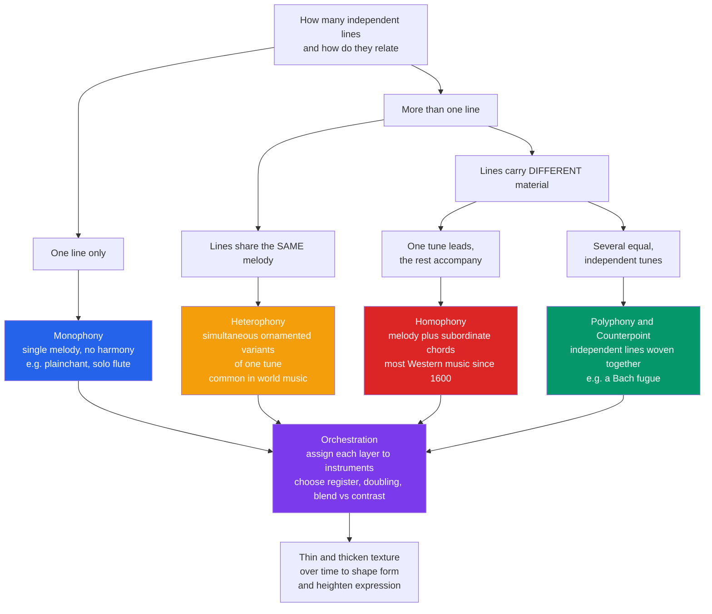

# 🧵 Texture and Orchestration

> [!abstract] TL;DR
> **Texture** describes how many independent lines (voices) a piece has *at once* and how they relate: **monophony** (one line, e.g. plainchant), **homophony** (one melody over a subordinate chordal accompaniment — the default of Western music), **polyphony/counterpoint** (several equal, independent lines woven together), and **heterophony** (simultaneous embellished variants of a single melody, ubiquitous in world music). **Orchestration** is the complementary craft of deciding *which instruments render each layer* — choosing register, doubling, and blend-versus-contrast so the texture's abstract lines become real sound. Composers thin and thicken texture across time to shape form and drive expression.

---

## Intuition

**Analogy — texture is the weave of a fabric.** Cloth is made of threads. A single thread lying alone is bare and linear; two threads twisted together read as one strand; a dozen threads crossing at right angles form a tight tapestry; and threads of the same color but different thickness can trace the same pattern in parallel. **Musical texture is exactly this weave, but the threads are melodic lines.** How many threads run at once, and how they cross, hold, or shadow one another, *is* the texture.

Now push the analogy one step further. A weaver does not only decide the *pattern* of the weave — she also chooses the *material* of each thread: rough wool, smooth silk, cold metal wire. That second choice is **orchestration**: taking the abstract lines of the texture and deciding whether a given thread is played by a bright trumpet, a warm cello, or a breathy flute. Texture is the *geometry* of the cloth; orchestration is the *fiber and dye*. Together they determine whether the music feels like a single thread of chant, a plush velvet chord bed, or an interlocked tartan of independent voices.

---

## How It Works

### Core mechanics

1. **Count the layers, then describe their relationship.** The primary question of texture is not "how many notes" but "how many *independent lines*, and are they equal, subordinate, or identical?" That single question sorts almost all music into four textural families.
2. **Monophony** is a single melodic line with no accompaniment or harmony — Gregorian chant, an unaccompanied flute solo, a crowd singing the same tune in unison (unison is still one *line*, just doubled).
3. **Homophony** is one dominant melody supported by subordinate harmony. It has two important sub-flavors: **melody-and-accompaniment** (a singer over strummed guitar chords, a piano tune over an Alberti bass) where the accompaniment has its own rhythm, and **homorhythmic / chorale** texture (a hymn, a four-part chorale) where *all* voices move in the same rhythm so the whole thing reads as a stream of block chords. Homophony is by far the most common texture in Western music since roughly 1600.
4. **Polyphony (counterpoint)** combines two or more lines that are each interesting *as melodies* and roughly equal in importance — a Bach fugue, a Renaissance motet, a round like "Row, Row, Row Your Boat." The art of writing such lines so they are independent yet harmonically coherent is **counterpoint** (see [[Voice_Leading_and_Counterpoint]]).
5. **Heterophony** has multiple performers playing the *same* melody at the *same* time, but each adds their own ornaments, timing, or embellishments — so you hear one tune blurred into simultaneous variants. It is central to much non-Western practice (Indonesian gamelan, Arabic maqam ensembles, traditional East-Asian and folk music) and shows up in blues heterophony and jazz "head" playing.
6. **Density and register are the continuous dials.** Beyond the four categories, texture varies by **density** (thin = few notes/sparse spacing; thick = many notes/dense stacking) and by **register** (bass, tenor, alto, soprano bands). A three-voice passage in a low, close register sounds muddy; the same three voices spread across five octaves sound open and airy.
7. **Orchestration assigns the layers to instruments.** Once the lines exist, the orchestrator distributes them across the **instrument families** — strings, woodwinds, brass, percussion — each with a characteristic range and **timbre** (see [[Timbre_and_the_Spectrum]]). Key decisions are **doubling** (two instruments on the same line, e.g. flute and violin an octave apart, to reinforce or recolor it), **blend versus contrast** (fusing instruments into one composite color, or spotlighting one against a bed), and **voicing/spacing** (how a chord's notes are distributed across registers and players; see [[Chords_and_Triads]]).
8. **Texture is a structural and expressive device.** Composers deliberately **thin** the texture to expose a soloist or create intimacy, and **thicken** it to build to a climax. The arrival of the full orchestra after a solo, the piling-up of imitative entries in a fugue's stretto, or the sudden drop to a single line are all *formal* signals delivered purely through texture.

### Flow / Architecture



---

## Key Concepts

### 🟢 Secondary (foundations)

- **The four textures.** Monophony = one line; homophony = melody + accompaniment; polyphony = several independent lines; heterophony = variants of one line at once.
- **Homophony is the default** of pop, hymns, and most classical music: a tune you follow, with chords underneath.
- **Instrument families:** strings, woodwinds, brass, percussion (and keyboards/voices). Each has a rough register from low to high and its own tone color.
- **Thick vs thin.** Adding instruments/voices thickens texture and raises intensity; stripping them away thins it and creates intimacy or focus.
- **Unison and octave doubling** reinforce a line without adding an independent voice.

### 🟡 Undergraduate (mechanics)

- **Homophony's two sub-types.** *Melody-and-accompaniment* (accompaniment has independent rhythm — Alberti bass, guitar strumming) vs *homorhythmic/chorale* (all voices share one rhythm, reading as block chords).
- **Register and tessitura.** *Range* is every note an instrument can play; *tessitura* is where it sits comfortably and sounds best. Orchestrators write in the tessitura and reserve extremes for effect.
- **Doubling for color and reinforcement.** Doubling a melody at the octave brightens or fattens it; doubling in unison across families (flute + clarinet + violin) creates a fused composite timbre that belongs to no single instrument.
- **Blend vs contrast.** Same-family instruments blend into a homogeneous choir (a string section); mixed families contrast and separate (an oboe solo against strings). Blend hides individual identity; contrast exposes it.
- **Voicing and spacing.** How a chord's pitches are distributed vertically — close position (notes packed) vs open position (spread across octaves) — and which instrument gets which note. Spacing controls clarity, weight, and where the harmonic "root" is felt.
- **Texture as form.** Fugues *build* by adding voices; sonata developments fragment and re-layer; a Romantic climax is often just maximal density and register. Learn to hear form through texture change, not only through harmony.

### 🔴 Graduate (theory, history, and perception)

- **Auditory scene analysis underwrites all of it.** Whether the ear fuses lines into one blend or splits them into separate streams is governed by *auditory streaming* — proximity in pitch, timbre, onset synchrony, and common modulation (see [[Psychoacoustics_and_Pitch_Perception]]). Good orchestration is applied psychoacoustics: you double in unison to *force* fusion, and separate in timbre/register to *force* segregation into independent lines.
- **The physics of the palette.** An instrument's range and characteristic color come from the acoustics of its resonator — string length and body, tube length and bore, reed/lip excitation — and from the relative strength of its partials (see [[Sound_Waves_and_Acoustics]] and [[Pitch_and_the_Harmonic_Series]]). Orchestration is choosing spectral envelopes and combining them; octave doubling works partly because the doubling instrument reinforces the harmonics already present in the lower tone.
- **The orchestra evolved.** The Baroque *basso continuo* ensemble (a bass line + realized keyboard chords) gave way to the Classical orchestra (Haydn/Mozart: paired winds, horns, strings), which the Romantics expanded massively (Berlioz, Wagner, Mahler, Strauss) in both size and coloristic ambition, until Debussy and Ravel treated timbre itself as a structural parameter.
- **The canonical orchestrators.** **Hector Berlioz** wrote the first great modern treatise (1843) and orchestrated for dramatic color; **Nikolai Rimsky-Korsakov**'s *Principles of Orchestration* codified idiomatic scoring and blend; **Maurice Ravel** is the touchstone for transparency and precision (his orchestration of Mussorgsky's *Pictures at an Exhibition* is a masterclass).
- **Timbre as the fourth structural dimension.** Beyond pitch, rhythm, and harmony, 20th-century composers made *Klangfarbe* (tone color) primary — Schoenberg's *Klangfarbenmelodie* (a "melody" of changing timbres on repeated pitches), Debussy's blended washes, and Ligeti's micropolyphony (so many lines that they fuse into a shimmering texture-as-object) where individual counterpoint is inaudible and only the aggregate texture is perceived.

---

## Python Demo

The four texture types are easiest to *see* as **piano rolls** — pitch on the vertical axis, time on the horizontal, each note a horizontal bar. The demo draws all four, then adds a **tessitura chart**: the approximate frequency range of each orchestral instrument on a log-frequency axis, illustrating how orchestration is partly a game of assigning layers to registers.

```python
# Visualize the four musical textures as piano-roll (pitch vs time) plots,
# then show instrument-family tessitura (register) on a log-frequency axis.
# numpy + matplotlib only.
import numpy as np
import matplotlib.pyplot as plt

def draw_line(ax, notes, color, lw=7, offset=0.0, alpha=1.0, label=None):
    """Draw a melodic line as a piano roll: each note is a horizontal bar
    at its MIDI pitch, spanning [start, start + duration] in beats."""
    first = True
    for start, dur, pitch in notes:
        ax.hlines(pitch + offset, start, start + dur, color=color, lw=lw,
                  alpha=alpha, solid_capstyle="butt",
                  label=label if first else None)
        first = False

def style(ax, title, ymin, ymax):
    ax.set_title(title, fontsize=10, fontweight="bold")
    ax.set_xlabel("time in beats")
    ax.set_ylabel("MIDI pitch")
    ax.set_xlim(-0.3, 8.3)
    ax.set_ylim(ymin, ymax)
    ax.grid(alpha=0.25)

fig = plt.figure(figsize=(12, 11))
gs = fig.add_gridspec(3, 2, height_ratios=[1, 1, 1.2], hspace=0.5, wspace=0.25)

# --- 1. MONOPHONY: a single unaccompanied line ---
ax1 = fig.add_subplot(gs[0, 0])
mono = [(0,1,67),(1,1,69),(2,1,71),(3,1,72),(4,1,71),(5,1,69),(6,1,67),(7,2,66)]
draw_line(ax1, mono, "#2563eb")
style(ax1, "Monophony  |  one line, no harmony", 60, 78)

# --- 2. HOMOPHONY: melody on top + block-chord accompaniment ---
ax2 = fig.add_subplot(gs[0, 1])
melody = [(0,1,79),(1,1,81),(2,1,83),(3,1,81),(4,1,79),(5,1,78),(6,2,79)]
chords = [(0,2,[55,59,62]),(2,2,[57,60,64]),(4,2,[53,57,60]),(6,2,[55,59,62])]
draw_line(ax2, melody, "#dc2626", lw=7)              # melody = foreground
for start, dur, tones in chords:                      # chords = subordinate bed
    for p in tones:
        ax2.hlines(p, start, start + dur, color="#9ca3af", lw=6,
                   solid_capstyle="butt")
style(ax2, "Homophony  |  melody + block chords", 50, 88)

# --- 3. POLYPHONY: three independent, staggered (imitative) lines ---
ax3 = fig.add_subplot(gs[1, 0])
sop = [(0,1,79),(1,1,78),(2,1,79),(3,1,81),(4,1,83),(5,1,81),(6,1,79),(7,1,78)]
alt = [(1,1,72),(2,1,71),(3,1,72),(4,1,74),(5,1,76),(6,1,74),(7,1,72)]
bas = [(2,1,55),(3,1,59),(4,1,60),(5,1,57),(6,1,55),(7,1,52)]
draw_line(ax3, sop, "#dc2626", lw=6, label="voice 1")
draw_line(ax3, alt, "#059669", lw=6, label="voice 2 enters later")
draw_line(ax3, bas, "#2563eb", lw=6, label="voice 3 enters later")
style(ax3, "Polyphony  |  independent interwoven lines", 50, 86)
ax3.legend(fontsize=7, loc="lower right")

# --- 4. HETEROPHONY: one tune + a simultaneous ornamented variant ---
ax4 = fig.add_subplot(gs[1, 1])
base    = [(0,1,60),(1,1,64),(2,1,67),(3,1,64),(4,1,60),(5,1,62),(6,2,60)]
variant = [(0,0.5,60),(0.5,0.5,62),(1,1,64),(2,0.5,67),(2.5,0.5,69),
           (3,1,64),(4,0.5,60),(4.5,0.5,62),(5,1,62),(6,2,60)]
draw_line(ax4, base, "#2563eb", lw=8, label="skeleton tune")
# tiny +0.35 vertical offset so the overlapping variant stays visible
draw_line(ax4, variant, "#f59e0b", lw=4, offset=0.35, label="ornamented variant")
style(ax4, "Heterophony  |  variants of one tune", 56, 74)
ax4.legend(fontsize=7, loc="lower right")

# --- 5. TESSITURA: instrument-family ranges on a log-frequency axis ---
ax5 = fig.add_subplot(gs[2, :])
# (name, low Hz, high Hz, family) -- approximate playing ranges
ranges = [
    ("Double Bass", 41, 247, "Strings"),
    ("Cello",       65, 523, "Strings"),
    ("Viola",      131, 1047, "Strings"),
    ("Violin",     196, 3136, "Strings"),
    ("Bassoon",     58, 622, "Woodwinds"),
    ("Clarinet",   147, 1568, "Woodwinds"),
    ("Oboe",       233, 1760, "Woodwinds"),
    ("Flute",      262, 2093, "Woodwinds"),
    ("Piccolo",    523, 4186, "Woodwinds"),
    ("Tuba",        44, 349, "Brass"),
    ("Trombone",    82, 587, "Brass"),
    ("Horn",        62, 699, "Brass"),
    ("Trumpet",    165, 988, "Brass"),
]
fam_color = {"Strings": "#2563eb", "Woodwinds": "#059669", "Brass": "#dc2626"}
for i, (name, lo, hi, fam) in enumerate(ranges):
    ax5.broken_barh([(lo, hi - lo)], (i - 0.4, 0.8),
                    facecolors=fam_color[fam], alpha=0.85)
    ax5.text(lo * 0.92, i, name, ha="right", va="center", fontsize=8)

ax5.set_xscale("log")
ax5.set_xlim(35, 5000)
ax5.set_ylim(-1, len(ranges))
ax5.set_yticks([])
ax5.set_xlabel("frequency in Hz, log scale  ->  register and tessitura")
ax5.set_title("Orchestration: approximate frequency range of each instrument",
              fontsize=10, fontweight="bold")
xticks = [41, 82, 165, 262, 440, 880, 1760, 3520]
ax5.set_xticks(xticks)
ax5.set_xticklabels([str(t) for t in xticks])
handles = [plt.Line2D([0], [0], color=c, lw=8) for c in fam_color.values()]
ax5.legend(handles, fam_color.keys(), loc="lower right", fontsize=8)

plt.tight_layout()
plt.show()
```

The four panels make the categories concrete: monophony is a lone contour; homophony shows the red melody riding a grey chord bed; polyphony has three colored lines entering at different times and crossing freely; heterophony shows the orange variant hugging the blue skeleton but adding passing notes. The bottom tessitura chart is the orchestrator's map — it shows *why* you might double a violin melody with a flute (their high ranges overlap) but hand a dark pedal note to the tuba or double bass.

---

## Real-World Applications

- **Film and game scoring.** Composers use texture as a volume/tension knob: a solo instrument for intimacy, then progressive doubling and register expansion to a full-tutti climax. Hans Zimmer's builds are essentially engineered thickenings of texture and register.
- **Pop and rock arranging.** A verse might be voice + guitar (thin homophony); the chorus adds bass, drums, doubled guitars, and backing vocals (thick homophony) — the "lift" is largely textural, not harmonic.
- **Choral and a cappella writing.** Arrangers choose between homorhythmic (block-chord) passages for text clarity and polyphonic/imitative passages for momentum, exactly as Renaissance composers did.
- **Orchestral reduction and expansion.** Reducing a symphony to piano, or expanding a lead sheet to full orchestra, is the core arranging skill: preserving the essential lines while remapping them to available forces and registers.
- **Music production / mixing.** "Arrangement in the frequency domain" — assigning instruments to non-overlapping registers so the mix stays clear — is orchestration by another name; the tessitura chart above is the mix engineer's frequency map.
- **World and traditional ensembles.** Gamelan, mariachi, and maqam ensembles are built on heterophony; understanding it is essential to arranging or transcribing them faithfully instead of forcing them into Western homophony.

---

## Common Pitfalls

- **Confusing polyphony with "lots of notes."** A dense homophonic chord is *thick* but still homophonic — there is one melody and everything else is subordinate. Polyphony requires *independent, roughly equal* lines, not merely many pitches.
- **Calling unison singing "harmony."** A hundred people singing the same tune are still monophonic (one line, doubled). Harmony needs *different* simultaneous pitches.
- **Muddy low-register spacing.** Stacking chord tones close together in the bass produces a rumble because low partials fall inside one critical band and beat. Orchestrators spread lower intervals wide and pack them only in higher registers.
- **Ignoring tessitura, writing only ranges.** A note may be *playable* at the extreme of an instrument's range yet sound strained, weak, or out of tune. Write in the comfortable middle and save extremes for deliberate effect.
- **Doubling that muddies instead of reinforcing.** Doubling two instruments with mismatched articulation, or at an interval that blurs the line, thickens without clarifying. Effective doubling matches onsets and usually uses the octave or unison.
- **Flat, unvarying texture.** Keeping the same density for a whole piece removes a composer's most direct tool for shaping form. Contrast — thinning before thickening — is what makes the thickening *mean* something.
- **Treating orchestration as an afterthought.** The same notes scored badly sound amateurish; scored well they sound inevitable. Timbre and register are compositional decisions, not decoration.

---

## Related Concepts

- [[Voice_Leading_and_Counterpoint]] — polyphony is counterpoint realized; this note points there for the craft of writing multiple independent, singable lines that still form good harmony.
- [[Timbre_and_the_Spectrum]] — orchestration is *applied timbre*; each instrument's tone color and spectral envelope is the palette from which the orchestrator blends and contrasts.
- [[Sound_Waves_and_Acoustics]] — instrument ranges, resonances, and characteristic colors come from the physics of standing waves in strings, tubes, and resonating bodies.
- [[Pitch_and_the_Harmonic_Series]] — register, octave doubling, and why doubling reinforces a line all follow from the overtone structure of pitched tones.
- [[Chords_and_Triads]] — voicing and spacing decide how a chord's pitches are distributed across registers and players; close vs open position is a textural choice.
- [[Functional_Harmony_and_Progressions]] — the chords that a homophonic accompaniment realizes; texture supplies the "how," harmony the "what."
- [[Rhythm_Meter_and_Tempo]] — homorhythmic (chorale) texture is *defined* by all voices sharing one rhythm; rhythmic independence is what turns homophony into polyphony.
- [[Psychoacoustics_and_Pitch_Perception]] — auditory streaming explains when the ear fuses layers into one blend versus splitting them into separate lines, the perceptual basis of blend vs contrast.
- [[Scales_and_Modes]] — the pitch material each textural layer draws from.

> [!note] Planned sibling notes in `Music_Theory/03_Melody_Form_and_Composition/`
> This note is the textural counterpart to melody, form, and arranging notes still to be built — **Melody_and_Motives**, **Musical_Form_and_Structure**, and **Composition_and_Arranging**. When those exist, wire the links both ways: form uses texture change as a boundary marker, and arranging is orchestration applied to a specific ensemble.

---

## Review Questions

**🟢 Secondary.** Name the four main textures and give a one-line example of each. A choir where everyone sings the identical melody with no harmony — which texture is that, and why is it *not* homophony?

**🟡 Undergraduate.** You are handed a four-bar melody and asked to arrange it three ways: (a) as a homorhythmic chorale, (b) as a melody-and-accompaniment pop texture, and (c) as a two-voice canon. Describe concretely how the notes on the page would differ in each case, and name which of the three is polyphonic.

**🔴 Graduate.** An orchestrator wants a flute and a violin, playing the same melody, to fuse into a single unrecognizable composite color rather than sound like two instruments. Using the ideas of auditory streaming, name at least three factors they should control to *force fusion*, and then explain what they would change if instead they wanted the two lines to segregate into independent voices. Relate your answer to the difference between homophonic doubling and true polyphony.

---

## Sources

- Samuel Adler, *The Study of Orchestration*, 4th ed., W. W. Norton, 2016 — the standard modern textbook on instrument ranges, doubling, and scoring.
- Nikolai Rimsky-Korsakov, *Principles of Orchestration*, 1912 (Dover reprint) — the classic codification of orchestral blend and idiomatic writing. [archive.org](https://archive.org/details/principlesoforch00rims)
- Hector Berlioz & Richard Strauss, *Treatise on Instrumentation*, 1843/1905 (Dover reprint 1991) — the founding modern treatise on orchestral color.
- Walter Piston, *Orchestration*, W. W. Norton, 1955 — concise reference on register, balance, and instrumental combination.
- *Open Music Theory* (open online textbook), chapters on texture and voice types. [openmusictheory.github.io](https://openmusictheory.github.io/)

---

#music-theory #texture #orchestration #polyphony #instrumentation
